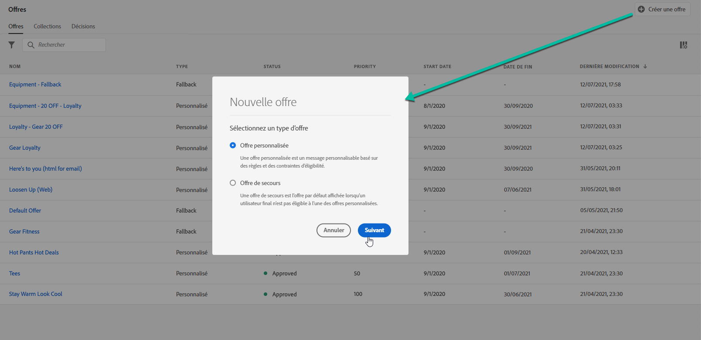
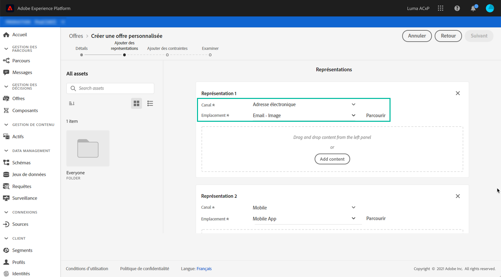
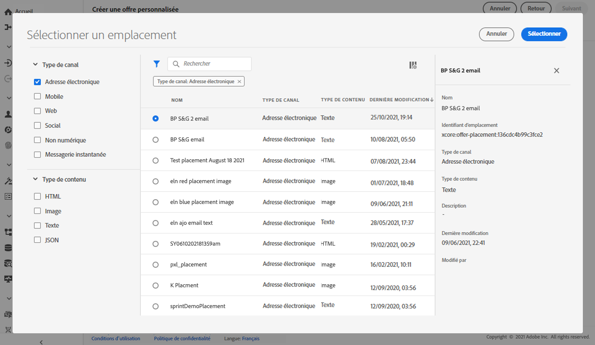
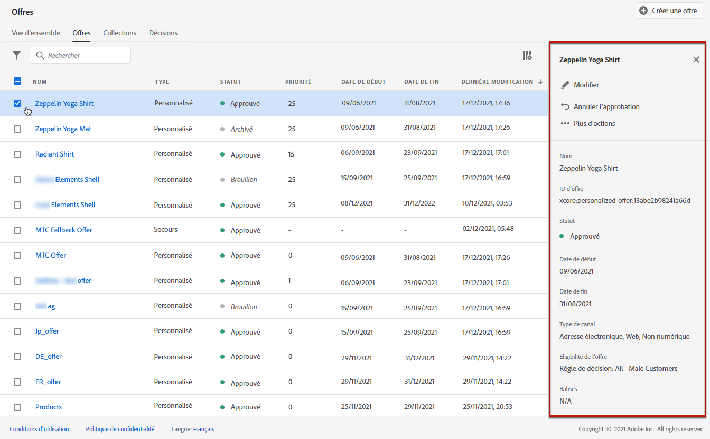
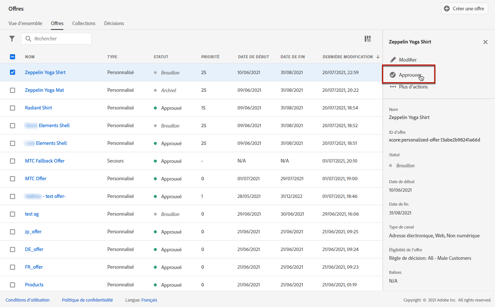
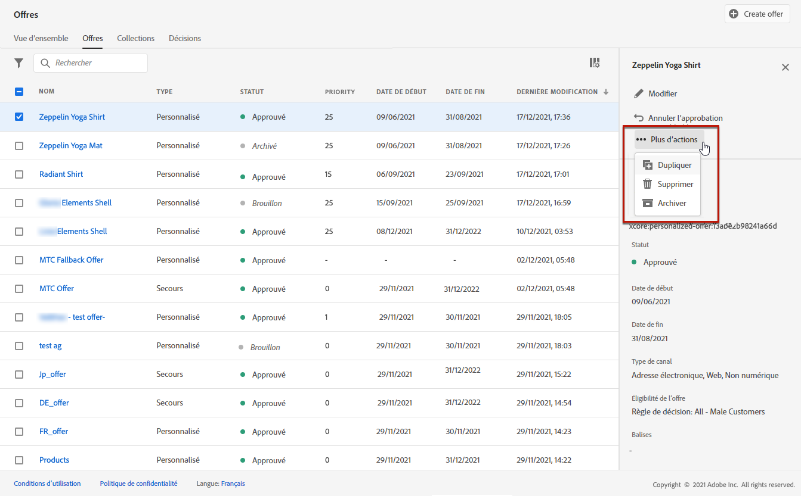
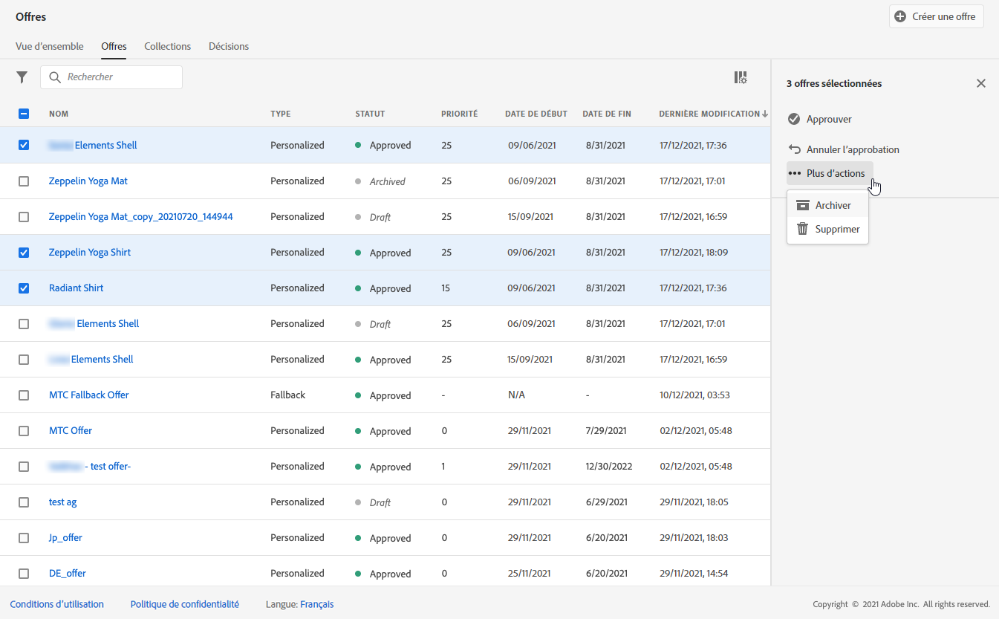
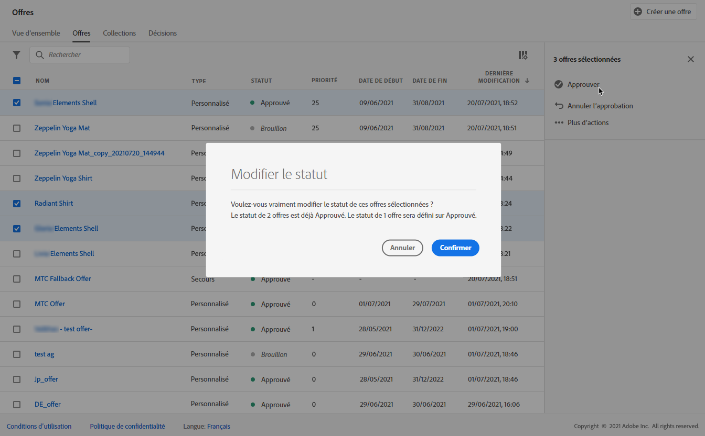
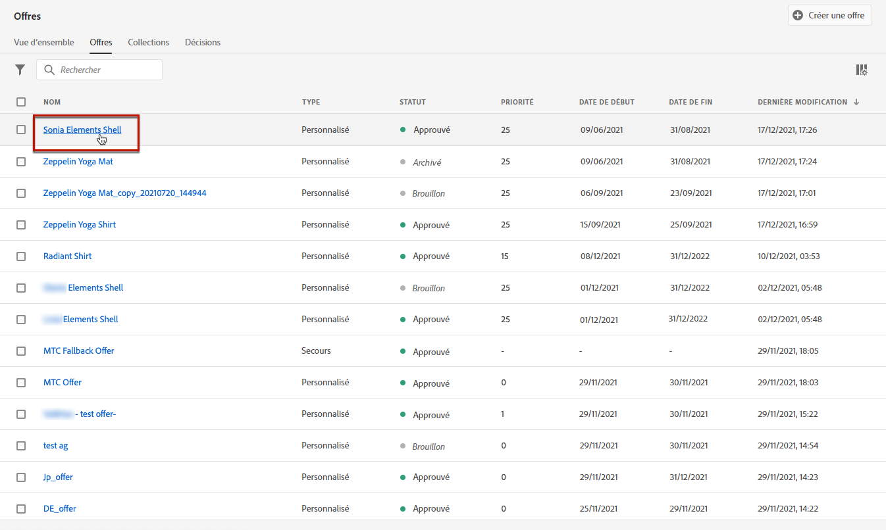
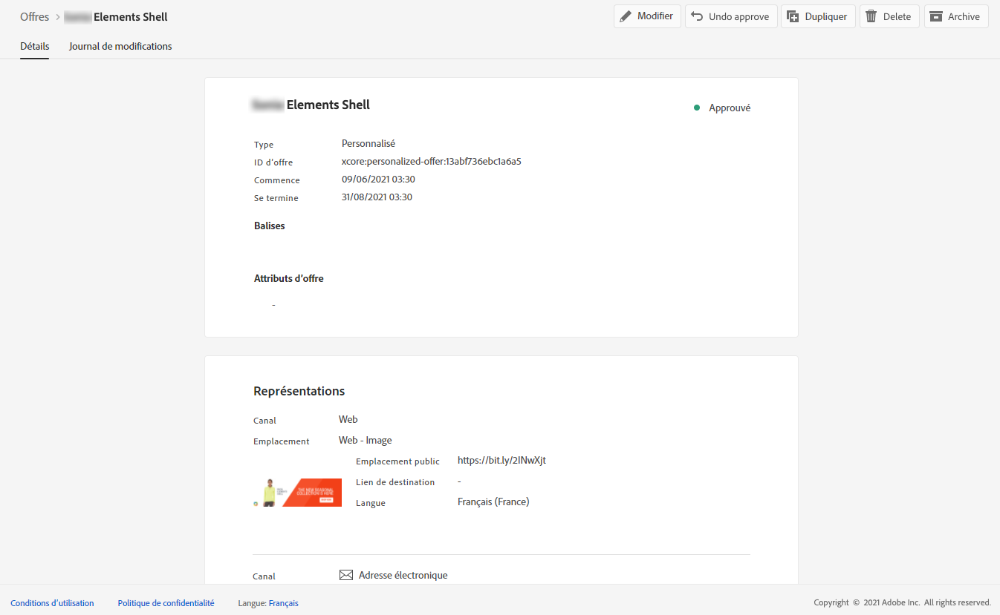

# Création d&#39;offres personnalisées {#creating-personalized-offers}

Avant de créer une offre, assurez-vous que vous avez créé les éléments suivants :

* Un **emplacement** dans lequel l&#39;offre sera affichée. Voir [Créer des emplacements](../offer-library/creating-placements.md)
* Une **règle de décision** qui définit la condition dans laquelle l&#39;offre sera présentée. Voir [Création de règles de décision](../offer-library/creating-decision-rules.md).
* Une ou plusieurs **balises** que vous souhaitez associer à l&#39;offre. Voir [Création de balises](../offer-library/creating-tags.md).

➡️ [Découvrez cette fonctionnalité en vidéo](#video)

La liste des offres personnalisées est accessible dans le menu **[!UICONTROL Offres]**.

## Création de l&#39;offre {#create-offer}

Pour créer une **offre**, procédez comme suit :

1. Cliquez sur **[!UICONTROL Créer une offre]**, puis sélectionnez **[!UICONTROL Offre personnalisée]**.

   

1. Indiquez le nom de l&#39;offre, ainsi que sa date et son heure de début et de fin. Vous pouvez également associer une ou plusieurs balise(s) existante(s) à l&#39;offre, ce qui vous permet de rechercher et d&#39;organiser plus facilement la bibliothèque des offres.

   

   >[!NOTE]
   >
   >La section **[!UICONTROL Attributs de l’offre]** vous permet d’associer des paires clé-valeur à l’offre à des fins de rapports et d’analyse.

## Configuration des représentations de l&#39;offre {#representations}

1. Ajoutez une ou plusieurs représentations pour votre offre à l&#39;aide du bouton **[!UICONTROL Ajouter une représentation]**.

   >[!NOTE]
   >
   >Une offre peut être affichée à différents endroits dans un message : dans une bannière supérieure avec une image, sous forme de texte dans un paragraphe, sous forme de bloc html, etc. Plus une offre a de représentations, plus il y a d&#39;occasions d&#39;utiliser l&#39;offre dans différents contextes d&#39;emplacement.

1. Pour chaque représentation, spécifiez le **[!UICONTROL Canal]** et l&#39;**[!UICONTROL Emplacement]** où l&#39;offre sera affichée.

   

   Le bouton **[!UICONTROL Parcourir]** permet de filtrer les emplacements disponibles, en fonction de leur canal et/ou de leur type de contenu.

   

1. Ajoutez le contenu à chaque représentation provenant de la bibliothèque de ressources Adobe Experience Cloud ou d&#39;un emplacement public externe.

   * Pour ajouter du contenu issu de la bibliothèque de ressources Adobe Experience Cloud, faites-le glisser du volet de gauche vers la zone de représentation, puis spécifiez l&#39;URL à associer au contenu dans le champ **[!UICONTROL Lien de destination]**.

      >[!NOTE]
      >
      >Il n&#39;est possible d&#39;effectuer un glisser-déposer du contenu qu&#39;à partir du Sélecteur de ressources dans le panneau de gauche. Notez que seul le contenu correspondant au type de contenu de l&#39;emplacement peut être utilisé.

      

   * Pour ajouter du contenu à partir d&#39;un emplacement public externe, cliquez sur le bouton **[!UICONTROL Ajouter du contenu]**, puis spécifiez le nom, l&#39;URL et le lien de destination du contenu à ajouter.

      Assurez-vous que le contenu que vous ajoutez correspond au type de contenu de l&#39;emplacement sélectionné.

      

   * Vous pouvez également insérer du contenu de type texte. Pour ce faire, cliquez sur le bouton **[!UICONTROL Ajouter du contenu]**, puis sélectionnez l&#39;option **[!UICONTROL Texte personnalisé]**. Dans le champ **[!UICONTROL Texte]**, saisissez le texte qui s&#39;affichera dans l&#39;offre.

      >[!NOTE]
      >
      >Cette option n&#39;est pas disponible pour les emplacements de type image.

      

## Ajout de règles d’éligibilité et de contraintes {#eligibility}

Les règles d&#39;éligibilité et les contraintes permettent de définir les conditions d&#39;affichage d&#39;une offre.

1. Configurez l&#39;**[!UICONTROL éligibilité des offres]**. Par défaut, l&#39;option de règle de décision **[!UICONTROL Tous les visiteurs]** est sélectionnée, ce qui signifie que tout profil peut se voir présenter l&#39;offre.

   Vous pouvez limiter la présentation de l&#39;offre aux membres d&#39;un ou de plusieurs segments d&#39;Adobe Experience Platform. Pour cela, activez l&#39;option **[!UICONTROL Visiteurs appartenant à un ou plusieurs segments]**, puis ajoutez un ou plusieurs segments dans le volet de gauche et combinez-les à l&#39;aide des opérateurs logiques **[!UICONTROL Et]** / **[!UICONTROL Ou]**.

   Pour plus d’informations sur l’utilisation des segments, consultez [cette page](../../segment/about-segments.md).

   

   Si vous souhaitez associer une règle de décision spécifique à l&#39;offre, sélectionnez **[!UICONTROL Par une règle de décision définie]**, puis faites glisser la règle de décision de votre choix depuis le volet de gauche vers la zone **[!UICONTROL Règle de décision]**. Pour plus d&#39;informations sur la façon de créer une règle de décision, reportez-vous à [cette section](../offer-library/creating-decision-rules.md).

   

   >[!CAUTION]
   >
   >Les offres basées sur un événement ne sont actuellement pas prises en charge dans [!DNL Journey Optimizer]. Si vous créez une règle de décision basée sur un [événement](https://experienceleague.adobe.com/docs/experience-platform/segmentation/ui/segment-builder.html?lang=fr#events){target=&quot;_blank&quot;}, vous ne pourrez pas l&#39;exploiter dans une offre.

1. Définissez la **[!UICONTROL Priorité]** de l&#39;offre par rapport à d&#39;autres si l&#39;utilisateur est éligible à plusieurs offres. Plus la priorité d&#39;une offre est élevée, plus elle sera comparée à celle d&#39;autres offres.

1. Spécifiez la **[!UICONTROL Limitation]** de l&#39;offre, soit le nombre total de fois où l&#39;offre sera présentée au total à tous les utilisateurs. Si le nombre de fois où l&#39;offre a été diffusée à tous les utilisateurs correspond à celui que vous avez indiqué dans ce champ, la diffusion de l&#39;offre s&#39;arrête.

   >[!NOTE]
   >
   >Le nombre de fois où une offre est proposée est calculé au moment de la préparation de l&#39;email. Par exemple, si vous préparez un email contenant un certain nombre d&#39;offres, ces chiffres sont pris en compte dans votre limitation maximale, et ce que l&#39;email soit envoyé ou non.
   >
   >Si une diffusion email est supprimée ou si la préparation est effectuée à nouveau avant d&#39;être envoyée, la valeur de limitation de l&#39;offre est automatiquement mise à jour.

   

   Dans l&#39;exemple ci-dessus :

   * La priorité de l&#39;offre est définie sur « 50 », ce qui signifie que l&#39;offre sera présentée avant les offres dont la priorité est comprise entre 1 et 49, et après celles dont la priorité est d&#39;au moins 51.
   * L&#39;offre sera prise en compte uniquement pour les utilisateurs qui correspondent à la règle de décision « Clients fidèles Gold ».
   * L&#39;offre ne sera présentée qu&#39;une seule fois par utilisateur.

## Examen de l&#39;offre {#review}

Une fois les règles d&#39;éligibilité et les contraintes définies, un résumé des propriétés de l&#39;offre s&#39;affiche.

1. Vérifiez que tout est correctement configuré.

1. Lorsque votre offre est prête à être présentée aux utilisateurs, cliquez sur **[!UICONTROL Terminer]**.

1. Sélectionnez **[!UICONTROL Enregistrer et approuver]**.

   

   Vous pouvez également enregistrer l&#39;offre en tant que version préliminaire pour la modifier et l&#39;approuver ultérieurement.

L&#39;offre s&#39;affiche dans la liste avec le statut **[!UICONTROL Approuvé]** ou **[!UICONTROL Version préliminaire]**, selon que vous l&#39;avez approuvée ou non à l&#39;étape précédente.

Elle est maintenant prête à être diffusée aux utilisateurs.

## Liste des offres {#offer-list}

Dans la liste des offres, vous pouvez sélectionner l&#39;offre pour afficher ses propriétés. Vous pouvez également la modifier, modifier son statut (**Version préliminaire**, **Approuvé**, **Archivé**), la dupliquer ou la supprimer.

Sélectionnez le bouton **[!UICONTROL Modifier]** pour revenir au mode d&#39;édition de l&#39;offre, où vous pouvez modifier ses [détails](#create-offer), ses [représentations](#representations), ainsi que les [règles d&#39;éligibilité et les contraintes](#eligibility).

Sélectionnez une offre validée et cliquez sur **[!UICONTROL Annuler l&#39;approbation]** pour redéfinir le statut de l&#39;offre sur **[!UICONTROL Version préliminaire]**.

Pour redéfinir le statut sur **[!UICONTROL Approuvé]**, sélectionnez le bouton correspondant qui s&#39;affiche maintenant.

Le bouton **[!UICONTROL Autres actions]** active les actions décrites ci-dessous.

* **[!UICONTROL Dupliquer]** : crée une offre avec les mêmes propriétés, représentations, règles d&#39;éligibilité et contraintes. Par défaut, la nouvelle offre a le statut **[!UICONTROL Version préliminaire]**.
* **[!UICONTROL Supprimer]** : supprime l&#39;offre de la liste.

   >[!CAUTION]
   >
   >L&#39;offre et son contenu ne seront plus accessibles. Cette action ne peut pas être annulée.
   >
   >Si l&#39;offre est utilisée dans une collection ou une décision, elle ne peut pas être supprimée. Vous devez d&#39;abord supprimer l&#39;offre de tous les objets.

* **[!UICONTROL Archiver]** : définit le statut de l&#39;offre sur **[!UICONTROL Archivé]**. L&#39;offre est toujours disponible dans la liste, mais vous ne pouvez pas redéfinir son statut sur **[!UICONTROL Version préliminaire]** ou **[!UICONTROL Approuvé]**. Vous pouvez uniquement la dupliquer ou la supprimer.

Vous pouvez également supprimer ou modifier le statut de plusieurs offres en même temps en cochant les cases correspondantes.

Si vous souhaitez modifier le statut de plusieurs offres dont les statuts sont différents, seuls les statuts correspondants seront modifiés.

Une fois une offre créée, vous pouvez cliquer sur son nom dans la liste.

Vous pouvez ainsi accéder à des informations détaillées sur cette offre. Sélectionnez l&#39;onglet **[!UICONTROL Log des modifications]** pour [surveiller toutes les modifications](../get-started/user-interface.md#monitoring-changes) qui ont été apportées à l&#39;offre.

## Tutoriel vidéo {#video}

>[!NOTE]
>
>Cette vidéo s&#39;applique au service applicatif d&#39;Offer Decisioning basé sur Adobe Experience Platform. Elle fournit toutefois des orientations générales pour l&#39;utilisation d&#39;Offer dans le contexte de Journey Optimizer.

>[!VIDEO](https://video.tv.adobe.com/v/329375?quality=12)
