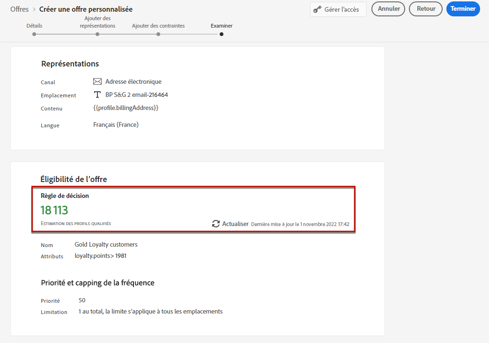

# Création d&#39;offres personnalisées {#create-personalized-offers}

Avant de créer une offre, assurez-vous que vous avez créé les éléments suivants :

* Un **emplacement** dans lequel l&#39;offre sera affichée. Voir [Créer des emplacements](../offer-library/creating-placements.md)
* Si vous souhaitez ajouter une condition d’éligibilité : une **règle de décision** qui définit la condition dans laquelle l’offre sera présentée. Voir [Création de règles de décision](../offer-library/creating-decision-rules.md).
* Un ou plusieurs **qualificateurs de collection** (précédemment appelés « balises ») que vous souhaitez peut-être associer à l’offre. Consultez la section [Créer des qualificateurs de collection](../offer-library/creating-tags.md).

➡️ [Découvrez cette fonctionnalité en vidéo.](#video)

La liste des offres personnalisées est accessible dans le menu **[!UICONTROL Offres]**.

## Création d’une offre {#create-offer}

>[!CONTEXTUALHELP]
>id="ajo_decisioning_offer_details"
>title="Détails de l’offre"
>abstract="Renseignez le nom de l’offre et ses dates de début et de fin. En dehors de ces dates, l’offre ne sera pas sélectionnée par le moteur de décision."

>[!CONTEXTUALHELP]
>id="od_offer_attributes"
>title="À propos des attributs de l&#39;offre"
>abstract="Les attributs de l&#39;offre vous permettent d&#39;associer des paires clé-valeur à l&#39;offre à des fins de reporting et d&#39;analyse."

>[!CONTEXTUALHELP]
>id="ajo_decisioning_offer_attributes"
>title="Attributs d’offre"
>abstract="Les attributs de l’offre vous permettent d’associer des paires clé-valeur à l’offre à des fins de reporting et d’analyse."

>[!CONTEXTUALHELP]
>id="ajo_decisioning_new_personalized"
>title="Offre personnalisée"
>abstract="Une offre personnalisée est un message personnalisable basé sur des contraintes et des règles d’éligibilité."

>[!CONTEXTUALHELP]
>id="ajo_decisioning_new_fallback"
>title="Offre de secours"
>abstract="Une offre de secours est l’offre par défaut affichée lorsqu’un utilisateur final ou une utilisatrice finale n’est pas éligible à l’une des offres personnalisées."

Pour créer une **offre**, procédez comme suit :

1. Cliquez sur **[!UICONTROL Créer une offre]**, puis sélectionnez **[!UICONTROL Offre personnalisée]**.

   

1. Indiquez le nom de l’offre, ainsi que sa date et son heure de début et de fin. En dehors de ces dates, l’offre ne sera pas sélectionnée par le moteur de décision.

   >[!NOTE]
   >
   >Lorsque vous sélectionnez des heures, votre fuseau horaire actuel est pris en compte.

   

   >[!CAUTION]
   >
   >La mise à jour des dates de début et de fin peut avoir un impact sur la limitation. [En savoir plus](add-constraints.md#capping-change-date)

1. Vous pouvez également associer un ou plusieurs **[!UICONTROL qualificateurs de collection]** à l’offre, ce qui vous permet de rechercher et d’organiser plus facilement la bibliothèque des offres. [En savoir plus](creating-tags.md).

1. La section **[!UICONTROL Attributs de l’offre]** vous permet d’associer des paires clé-valeur à l’offre à des fins de rapports et d’analyse.

1. Pour attribuer des libellés d’utilisation des données personnalisés ou de base à l’offre, sélectionnez **[!UICONTROL Gérer l’accès]**. [En savoir plus sur le contrôle d’accès au niveau de l’objet (OLAC)](../../administration/object-based-access.md)

   

1. Ajoutez des représentations pour définir l’emplacement d’affichage de votre offre dans le message. [En savoir plus](add-representations.md)

   

   >[!CAUTION]
   >
   >La taille d’une offre, y compris toutes ses représentations, ne peut pas dépasser 300 Ko.

1. Ajoutez des contraintes pour définir les conditions d’affichage de l’offre. [En savoir plus](add-constraints.md)

   >[!NOTE]
   >
   >Lorsque vous sélectionnez des audiences ou des règles de décision, vous pouvez afficher des informations sur les profils qualifiés estimés. Cliquez sur **[!UICONTROL Actualiser]** pour mettre à jour les données.
   >
   >Notez que les estimations de profil ne sont pas disponibles lorsque les paramètres de règle incluent des données qui ne figurent pas dans le profil, telles que des données contextuelles. Par exemple, une règle d’éligibilité qui exige que la météo actuelle soit de ≥80 degrés.

   

1. Examen et enregistrement de l’offre. [En savoir plus](#review)

## Examen de l’offre {#review}

Une fois les règles d&#39;éligibilité et les contraintes définies, un résumé des propriétés de l&#39;offre s&#39;affiche.

1. Vérifiez que tout est correctement configuré.

1. Vous pouvez afficher des informations sur les profils qualifiés estimés. Cliquez sur **[!UICONTROL Actualiser]** pour mettre à jour les données.

   

1. Lorsque votre offre est prête à être présentée aux utilisateurs, cliquez sur **[!UICONTROL Terminer]**.

1. Sélectionnez **[!UICONTROL Enregistrer et approuver]**.

   

   Vous pouvez également enregistrer l&#39;offre en tant que brouillon pour la modifier et l&#39;approuver ultérieurement.

L&#39;offre s&#39;affiche dans la liste avec le statut **[!UICONTROL Approuvé]** ou **[!UICONTROL Brouillon]**, selon que vous l&#39;avez approuvée ou non à l&#39;étape précédente.

Elle est maintenant prête à être diffusée aux utilisateurs.

## Gestion des offres {#offer-list}

Dans la liste des offres, vous pouvez sélectionner l&#39;offre pour afficher ses propriétés. Vous pouvez également la modifier, modifier son statut (**Brouillon**, **Approuvé**, **Archivé**), la dupliquer ou la supprimer.

Sélectionnez le bouton **[!UICONTROL Modifier]** pour revenir au mode d&#39;édition de l&#39;offre, où vous pouvez modifier ses [détails](#create-offer), ses [représentations](add-representations.md#representations), ainsi que les [règles d&#39;éligibilité et les contraintes](add-constraints.md#eligibility).

Sélectionnez une offre validée et cliquez sur **[!UICONTROL Annuler l&#39;approbation]** pour redéfinir le statut de l&#39;offre sur **[!UICONTROL Brouillon]**.

Pour redéfinir le statut sur **[!UICONTROL Approuvé]**, sélectionnez le bouton correspondant qui s&#39;affiche maintenant.

Le bouton **[!UICONTROL Autres actions]** active les actions décrites ci-dessous.

* **[!UICONTROL Dupliquer]** : crée une offre avec les mêmes propriétés, représentations, règles d&#39;éligibilité et contraintes. Par défaut, la nouvelle offre a le statut **[!UICONTROL Brouillon]**.

* **[!UICONTROL Supprimer]** : supprime l&#39;offre de la liste.

  >[!CAUTION]
  >
  >L&#39;offre et son contenu ne seront plus accessibles. Cette action ne peut pas être annulée.
  >
  >Si l&#39;offre est utilisée dans une collection ou une décision, elle ne peut pas être supprimée. Vous devez d&#39;abord supprimer l&#39;offre de tous les objets.

* **[!UICONTROL Archiver]** : définit le statut de l&#39;offre sur **[!UICONTROL Archivé]**. L&#39;offre est toujours disponible dans la liste, mais vous ne pouvez pas redéfinir son statut sur **[!UICONTROL Brouillon]** ou **[!UICONTROL Approuvé]**. Vous pouvez uniquement la dupliquer ou la supprimer.

Vous pouvez également supprimer ou modifier le statut de plusieurs offres en même temps en cochant les cases correspondantes.

Si vous souhaitez modifier le statut de plusieurs offres dont les statuts sont différents, seuls les statuts correspondants seront modifiés.

Une fois une offre créée, vous pouvez cliquer sur son nom dans la liste.

Vous pouvez ainsi accéder à des informations détaillées sur cette offre. Sélectionnez l&#39;onglet **[!UICONTROL Log des modifications]** pour [surveiller toutes les modifications](../get-started/user-interface.md#changes-logs) qui ont été apportées à l&#39;offre.

## Tutoriel vidéo {#video}

>[!VIDEO](https://video.tv.adobe.com/v/341347?captions=fre_fr&quality=12)
