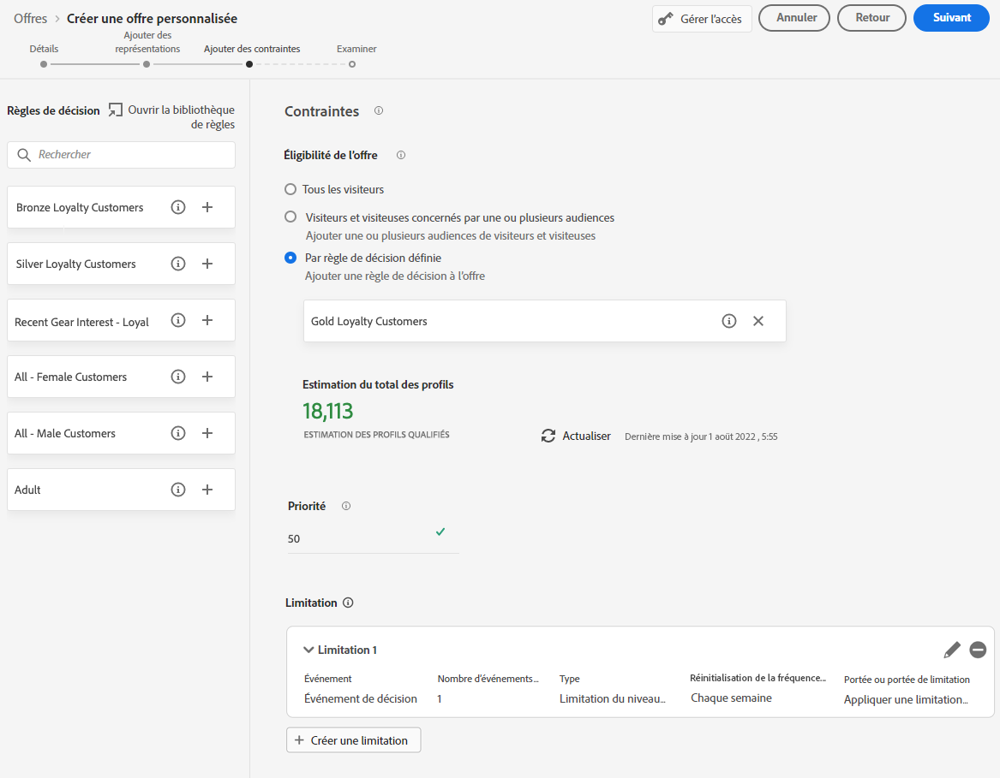

# Créer des offres personnalisées {#create-personalized-offers}

Avant de créer une offre, vérifiez que vous avez créé :

* A **placement** dans laquelle l’offre sera affichée. Voir [Créer des emplacements](../offer-library/creating-placements.md)
* Si vous souhaitez ajouter une condition d&#39;éligibilité : a **règle de décision** qui définit la condition dans laquelle l’offre sera présentée. Voir [Créer des règles de décision](../offer-library/creating-decision-rules.md).
* Un ou plusieurs **tags** que vous souhaitez peut-être associer à l’offre. Voir [Créer des balises](../offer-library/creating-tags.md).

➡️ [Découvrez cette fonctionnalité en vidéo](#video)

La liste des offres personnalisées est accessible dans le **[!UICONTROL Offers]** .

## Créer une offre {#create-offer}

>[!CONTEXTUALHELP]
>id="od_offer_attributes"
>title="À propos des attributs d’offre"
>abstract="Avec les attributs d’offre, vous pouvez associer des paires clé-valeur à l’offre à des fins de création de rapports et d’analyse."

>[!CONTEXTUALHELP]
>id="ajo_decisioning_offer_attributes"
>title="Attributs d’offre"
>abstract="Avec les attributs d’offre, vous pouvez associer des paires clé-valeur à l’offre à des fins de création de rapports et d’analyse."

Pour créer une **offre**, procédez comme suit :

1. Cliquez sur **[!UICONTROL Create offer]**, puis sélectionnez **[!UICONTROL Personalized offer]**.

   

1. Indiquez le nom de l’offre ainsi que sa date et son heure de début et de fin. En dehors de ces dates, l’offre ne sera pas sélectionnée par le moteur de prise de décision.

   

   >[!CAUTION]
   >
   >La mise à jour des dates de début et de fin peut avoir un impact sur la limitation. [En savoir plus](add-constraints.md#capping-change-date)

1. Vous pouvez également associer un ou plusieurs **[!UICONTROL tags]** à l’offre, ce qui vous permet de rechercher et d’organiser plus facilement la bibliothèque des offres. [En savoir plus](creating-tags.md).

1. Le **[!UICONTROL Offer attributes]** vous permet d’associer des paires clé-valeur à l’offre à des fins de création de rapports et d’analyse.

1. Pour attribuer des libellés d’utilisation des données personnalisés ou de base à l’offre, sélectionnez **[!UICONTROL Manage access]**. [En savoir plus sur le contrôle d’accès au niveau de l’objet (OLAC)](../../administration/object-based-access.md)

   

1. Ajoutez des représentations pour définir l’emplacement d’affichage de votre offre dans le message. [En savoir plus](add-representations.md)

   

1. Ajoutez des contraintes pour définir les conditions d&#39;affichage de l&#39;offre. [En savoir plus](add-constraints.md)

   >[!NOTE]
   >
   >Lorsque vous sélectionnez des segments ou des règles de décision, vous pouvez afficher des informations sur les profils qualifiés estimés. Cliquez sur **[!UICONTROL Refresh]** pour mettre à jour les données.
   >
   >Notez que les estimations de profil ne sont pas disponibles lorsque les paramètres de règle incluent des données qui ne figurent pas dans le profil, telles que des données contextuelles. Par exemple, une règle d’éligibilité qui exige que la météo actuelle soit de ≥80 degrés.

   

1. Vérifiez et enregistrez l’offre. [En savoir plus](#review)

## Vérifier l’offre {#review}

Une fois les règles d’éligibilité et les contraintes définies, un résumé des propriétés de l’offre s’affiche.

1. Assurez-vous que tout est correctement configuré.

1. Vous pouvez afficher des informations sur les profils qualifiés estimés. Cliquez sur **[!UICONTROL Refresh]** pour mettre à jour les données.

   

1. Lorsque votre offre est prête à être présentée aux utilisateurs, cliquez sur **[!UICONTROL Finish]**.

1. Sélectionner **[!UICONTROL Save and approve]**.

   

   Vous pouvez également enregistrer l’offre en tant que version préliminaire afin de la modifier et de l’approuver ultérieurement.

L’offre s’affiche dans la liste avec la variable **[!UICONTROL Approved]** ou **[!UICONTROL Draft]** selon que vous l’avez approuvée ou non à l’étape précédente.

Elle est maintenant prête à être diffusée aux utilisateurs.

## Gestion des offres {#offer-list}

Dans la liste des offres, vous pouvez sélectionner l&#39;offre pour afficher ses propriétés. Vous pouvez également la modifier, modifier son état (**Version préliminaire**, **Approuvé**, **Archivé**), dupliquez l’offre ou supprimez-la.

Sélectionnez la **[!UICONTROL Edit]** pour revenir au mode d&#39;édition de l&#39;offre, où vous pouvez modifier le [détails](#create-offer), [représentations](#representations), ainsi que de modifier la variable [règles d’éligibilité et contraintes](#eligibility).

Sélectionnez une offre validée et cliquez sur **[!UICONTROL Undo approve]** pour redéfinir l’état de l’offre sur **[!UICONTROL Draft]**.

Pour définir à nouveau l’état sur **[!UICONTROL Approved]**, sélectionnez le bouton correspondant qui s’affiche désormais.

Le **[!UICONTROL More actions]** active les actions décrites ci-dessous.

* **[!UICONTROL Duplicate]**: crée une offre avec les mêmes propriétés, représentations, règles d’éligibilité et contraintes. Par défaut, la nouvelle offre a la valeur **[!UICONTROL Draft]** statut.
* **[!UICONTROL Delete]**: supprime l’offre de la liste.

   >[!CAUTION]
   >
   >L&#39;offre et son contenu ne seront plus accessibles. Cette action ne peut pas être annulée.
   >
   >Si l’offre est utilisée dans une collection ou une décision, elle ne peut pas être supprimée. Vous devez d’abord supprimer l’offre de tous les objets.

* **[!UICONTROL Archive]**: définit l’état de l’offre sur **[!UICONTROL Archived]**. L’offre est toujours disponible dans la liste, mais vous ne pouvez pas redéfinir son état sur **[!UICONTROL Draft]** ou **[!UICONTROL Approved]**. Vous pouvez uniquement le dupliquer ou le supprimer.

Vous pouvez également supprimer ou modifier l’état de plusieurs offres en même temps en cochant les cases correspondantes.

Si vous souhaitez modifier l&#39;état de plusieurs offres dont les statuts sont différents, seuls les statuts correspondants seront modifiés.

Une fois une offre créée, vous pouvez cliquer sur son nom dans la liste.

Vous pouvez ainsi accéder à des informations détaillées sur cette offre. Sélectionnez la **[!UICONTROL Change log]** à [surveiller toutes les modifications ;](../get-started/user-interface.md#monitoring-changes) qui ont été apportées à l’offre.

## Tutoriel vidéo {#video}

>[!VIDEO](https://video.tv.adobe.com/v/329375?quality=12)
