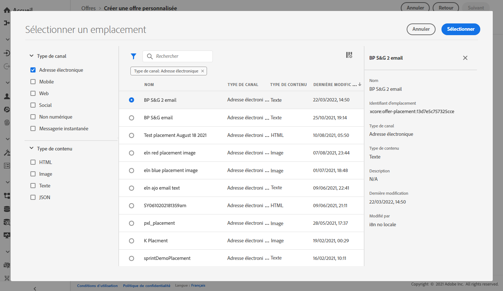

# Créer des offres personnalisées {#creating-personalized-offers}

>[!CONTEXTUALHELP]
>id="od_offer_constraints"
>title="A propos des contraintes d&#39;offre"
>abstract="Avec des contraintes, vous pouvez spécifier comment l’offre est hiérarchisée et présentée à l’utilisateur par rapport aux autres offres."
>additional-url="https://video.tv.adobe.com/v/329375" text="Regarder la vidéo de démonstration"

>[!CONTEXTUALHELP]
>id="od_offer_eligibility"
>title="A propos de l’éligibilité des offres"
>abstract="Dans cette section, vous pouvez utiliser des règles de décision pour déterminer quels utilisateurs sont admissibles à l’offre."
>additional-url="https://experienceleague.adobe.com/docs/offer-decisioning/using/managing-offers-in-the-offer-library/creating-decision-rules.html" text="Créer des règles de décision"
>additional-url="https://video.tv.adobe.com/v/329373" text="Regarder la vidéo de démonstration"

>[!CONTEXTUALHELP]
>id="od_offer_priority"
>title="A propos de la priorité des offres"
>abstract="Dans ce champ, vous pouvez définir les paramètres de priorité de l’offre. La priorité est un nombre utilisé pour classer les offres qui répondent à toutes les contraintes telles que l&#39;éligibilité, les dates et le plafonnement."
>additional-url="https://video.tv.adobe.com/v/329375" text="Regarder la vidéo de démonstration"

>[!CONTEXTUALHELP]
>id="od_offer_globalcap"
>title="A propos du plafonnement des offres"
>abstract="Dans ce champ, vous pouvez indiquer le nombre de fois où l’offre peut être présentée à tous les utilisateurs."
>additional-url="https://video.tv.adobe.com/v/329375" text="Regarder la vidéo de démonstration"

>[!CONTEXTUALHELP]
>id="od_offer_attributes"
>title="A propos des attributs d’offre"
>abstract="Avec les attributs d’offre, vous pouvez associer des paires clé-valeur à l’offre à des fins de rapports et d’analyse."
>additional-url="https://video.tv.adobe.com/v/329375" text="Regarder la vidéo de démonstration"

Avant de créer une offre, vérifiez que vous avez créé les éléments suivants :

* Emplacement **** dans lequel l&#39;offre sera affichée. Voir [Créer des emplacements](../offer-library/creating-placements.md).
* Une **règle de décision** qui définira la condition sous laquelle l&#39;offre sera présentée. Voir [Création de règles de décision](../offer-library/creating-decision-rules.md).
* Une ou plusieurs **balises** que vous souhaitez associer à l’offre. Voir [Création de balises](../offer-library/creating-tags.md).

 [Découvrez cette fonctionnalité dans la vidéo](#video)

La liste des offres personnalisées est accessible dans le menu **[!UICONTROL Offres]**.

## Créer l’offre {#create-offer}

Pour créer une **offre**, procédez comme suit :

1. Cliquez sur **[!UICONTROL Créer une offre]**, puis sélectionnez **[!UICONTROL offre personnalisée]**.

   

1. Indiquez le nom de l’offre, ainsi que son début et sa date et heure de fin. Vous pouvez également associer une ou plusieurs balises existantes à l’offre, ce qui vous permet de rechercher et d’organiser plus facilement la bibliothèque d’Offres.

   

   >[!NOTE]
   >
   >La section **[!UICONTROL Attributs d&#39;Offre]** vous permet d&#39;associer des paires clé-valeur à l&#39;offre à des fins de rapports et d&#39;analyse.

## Configurez les représentations de l&#39;offre {#representations}

1. Ajoutez une ou plusieurs représentations pour votre offre à l&#39;aide du bouton **[!UICONTROL Ajouter la représentation]**.

   >[!NOTE]
   >
   >Une offre peut être affichée à différents endroits dans un message : dans une bannière supérieure avec une image, sous forme de texte dans un paragraphe, sous forme de bloc html, etc. Plus une offre a de représentations, plus il y a d&#39;occasions d&#39;utiliser l&#39;offre dans différents contextes de placement.

1. Pour chaque représentation, spécifiez le **[!UICONTROL Canal]** et le **[!UICONTROL Placement]** où l&#39;offre sera affichée.

   

   Le bouton **[!UICONTROL Parcourir]** vous permet de filtrer les emplacements disponibles et de les filtrer en fonction de leur canal et/ou de leur type de contenu.

   

1. Ajoutez le contenu à chaque représentation provenant de la bibliothèque Adobe Experience Cloud Assets ou d’un emplacement public externe.

   * Pour ajouter du contenu de la bibliothèque Adobe Experience Cloud Assets, faites-le glisser depuis le volet de gauche vers la zone de représentation, puis spécifiez l’URL à associer au contenu dans le champ **[!UICONTROL Lien de destination]**.

      >[!NOTE]
      >
      >Le contenu peut uniquement être glissé-déposé à partir du Sélecteur de ressources dans le panneau de gauche. Seul le contenu correspondant au type de contenu de l’emplacement peut être utilisé.

      

   * Pour ajouter du contenu à partir d’un emplacement public externe, cliquez sur le bouton **[!UICONTROL Ajouter le contenu]**, puis spécifiez le nom, l’URL et le lien de destination du contenu à ajouter.

      Assurez-vous que le contenu que vous ajoutez correspond au type de contenu de l’emplacement sélectionné.

      

   * Vous pouvez également insérer du contenu de type texte. Pour ce faire, cliquez sur le bouton **[!UICONTROL Ajouter le contenu]**, puis sélectionnez l’option **[!UICONTROL Texte personnalisé]**. Dans le champ **[!UICONTROL Texte]**, tapez le texte qui s’affichera dans l’offre.

      >[!NOTE]
      >
      >Cette option n’est pas disponible pour les emplacements de type image.

      

## Règles d&#39;éligibilité et contraintes d&#39;Ajoute {#eligibility}

Les règles d&#39;éligibilité et les contraintes vous permettent de définir les conditions d’affichage d’une offre.

1. Configurez l&#39;**[!UICONTROL éligibilité des Offres]**. Par défaut, l&#39;option de règle de décision **[!UICONTROL Tous les visiteurs]** est sélectionnée, ce qui signifie que tout profil sera éligible pour être présenté à l&#39;offre.

   Vous pouvez limiter la présentation de l’offre aux membres d’un ou de plusieurs segments Adobe Experience Platform. Pour ce faire, activez l’option **[!UICONTROL Visiteurs qui tombent dans un ou plusieurs segments]**, puis ajoutez un ou plusieurs segments dans le volet de gauche et combinez-les à l’aide des opérateurs logiques **[!UICONTROL Et]** / **[!UICONTROL Ou]**.

   Pour plus d’informations sur la façon d’utiliser les segments, consultez la [documentation du service de segmentation](https://experienceleague.adobe.com/docs/experience-platform/segmentation/home.html).

   

   Si vous souhaitez associer une règle de décision spécifique à l&#39;offre, sélectionnez **[!UICONTROL Par règle de décision définie]**, puis faites glisser la règle de votre choix depuis le volet de gauche vers la zone **[!UICONTROL Règle de décision]**. Pour plus d&#39;informations sur la création d&#39;une règle de décision, consultez [cette section](../offer-library/creating-decision-rules.md).

   

1. Définissez la **[!UICONTROL priorité]** de l’offre par rapport aux autres si l’utilisateur est admissible pour plusieurs offres. La priorité la plus élevée d&#39;une offre sera, la priorité la plus élevée sera comparée à d&#39;autres offres

1. Spécifiez l’offre **[!UICONTROL Capping]**, ce qui signifie le nombre de fois où l’offre sera présentée au total pour tous les utilisateurs. Si l’offre a été remise à tous les utilisateurs le nombre de fois que vous avez indiqué dans ce champ, sa diffusion s’arrête.

   >[!NOTE]
   >
   >Le nombre de fois où une offre est proposée est calculé au moment de la préparation du courriel. Par exemple, si vous préparez un courrier électronique avec un certain nombre d’offres, ces chiffres sont pris en compte dans votre limite maximale, que le courrier électronique soit envoyé ou non.
   >
   >Si une diffusion de courrier électronique est supprimée ou si la préparation est effectuée à nouveau avant d’être envoyée, la valeur de plafonnement de l’offre est automatiquement mise à jour.

   

   Dans l’exemple ci-dessus :

   * La priorité de l&#39;offre est définie sur &quot;50&quot;, ce qui signifie que l&#39;offre sera présentée avant les offres dont la priorité est comprise entre 1 et 49, et après celles dont la priorité est d&#39;au moins 51.
   * L’offre sera prise en compte uniquement pour les utilisateurs qui correspondent à la règle de décision &quot;Clients de fidélité de l’or&quot;.
   * L’offre ne sera présentée qu’une seule fois par utilisateur.

## Examiner l&#39;offre {#review}

Une fois les règles d&#39;éligibilité et les contraintes définies, un résumé des propriétés de l’offre s’affiche. Si tout est configuré correctement et que votre offre est prête à être présentée aux utilisateurs, cliquez sur **[!UICONTROL Terminer]**, puis sélectionnez **[!UICONTROL Enregistrer et approuver]**.

Vous pouvez également enregistrer l’offre en tant que brouillon afin de la modifier et de l’approuver ultérieurement.

L’offre s’affiche dans la liste avec l’état **[!UICONTROL Live]** ou **[!UICONTROL Draft]**, selon que vous l’avez approuvé ou non à l’étape précédente.

Il est maintenant prêt à être livré aux utilisateurs. Vous pouvez la sélectionner pour afficher ses propriétés et la modifier ou la supprimer.

Une fois une offre créée, vous pouvez cliquer sur son nom dans la liste pour accéder à des informations détaillées, ainsi que surveiller toutes les modifications qui y ont été apportées à l&#39;aide de l&#39;onglet **[!UICONTROL Journal des modifications]** (voir [Surveillance des modifications apportées aux offres et décisions](../get-started/user-interface.md#monitoring-changes)).

## Vidéo didactique {#video}

>[!NOTE]
>
>Cette vidéo s’applique au service d’applications d’Offer decisioning créé sur Adobe Experience Platform. Toutefois, il fournit des orientations générales pour l&#39;utilisation de l&#39;Offre dans le contexte de Journey Optimizer.

>[!VIDEO](https://video.tv.adobe.com/v/329375?quality=12)
