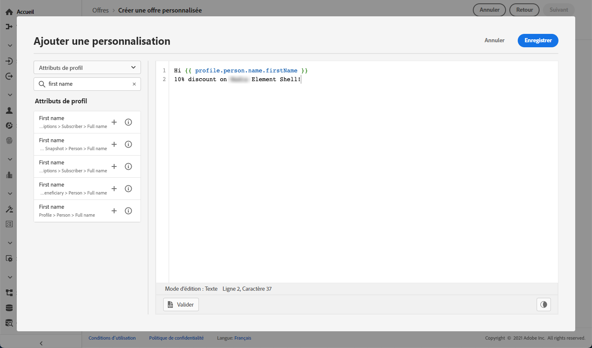

# Création d&#39;offres personnalisées {#create-personalized-offers}

Avant de créer une offre, assurez-vous que vous avez créé les éléments suivants :

* Un **emplacement** dans lequel l&#39;offre sera affichée. Voir [Créer des emplacements](../offer-library/creating-placements.md)
* Si vous souhaitez ajouter une condition d’éligibilité : une **règle de décision** qui définit la condition dans laquelle l’offre sera présentée. Voir [Création de règles de décision](../offer-library/creating-decision-rules.md).
* Une ou plusieurs **balises** que vous souhaitez associer à l’offre. Voir [Création de balises](../offer-library/creating-tags.md).

➡️ [Découvrez cette fonctionnalité en vidéo](#video)

La liste des offres personnalisées est accessible dans le menu **[!UICONTROL Offres]**.

## Création de l&#39;offre {#create-offer}

>[!CONTEXTUALHELP]
>id="od_offer_attributes"
>title="À propos des attributs de l&#39;offre"
>abstract="Les attributs de l&#39;offre vous permettent d&#39;associer des paires clé-valeur à l&#39;offre à des fins de reporting et d&#39;analyse."
>additional-url="https://video.tv.adobe.com/v/329375?captions=fre-fr" text="Regarder une vidéo de démonstration"

Pour créer une **offre**, procédez comme suit :

1. Cliquez sur **[!UICONTROL Créer une offre]**, puis sélectionnez **[!UICONTROL Offre personnalisée]**.

   

1. Indiquez le nom de l&#39;offre, ainsi que sa date et son heure de début et de fin. Vous pouvez également associer une ou plusieurs balise(s) existante(s) à l&#39;offre, ce qui vous permet de rechercher et d&#39;organiser plus facilement la bibliothèque des offres.

   

   >[!NOTE]
   >
   >La section **[!UICONTROL Attributs de l’offre]** vous permet d’associer des paires clé-valeur à l’offre à des fins de rapports et d’analyse.

## Configuration des représentations de l&#39;offre {#representations}

Une offre peut être affichée à différents endroits dans un message : dans une bannière supérieure avec une image, sous forme de texte dans un paragraphe, sous forme de bloc HTML, etc. Plus une offre a de représentations, plus il y a d&#39;occasions d&#39;utiliser l&#39;offre dans différents contextes d&#39;emplacement.

Pour ajouter une ou plusieurs représentations à votre offre et les configurer, procédez comme suit.

1. Pour la première représentation, commencez par sélectionner le **[!UICONTROL canal]** qui sera utilisé.

   

   >[!NOTE]
   >
   >Seuls les emplacements disponibles pour le canal sélectionné s&#39;affichent dans la liste déroulante **[!UICONTROL Emplacement]**.

1. Sélectionnez un emplacement dans la liste.

   Vous pouvez également utiliser le bouton en regard de la liste déroulante **[!UICONTROL Emplacement]** pour parcourir tous les emplacements.

   

   Vous pouvez toujours filtrer les emplacements selon leur canal et/ou type de contenu. Choisissez un emplacement et cliquez sur **[!UICONTROL Sélectionner]**.

   

1. Ajoutez du contenu à chaque représentation. Découvrez comment dans [cette section](#content).

1. Lorsque vous ajoutez du contenu tel qu&#39;une image ou une URL, vous pouvez spécifier un **[!UICONTROL Lien destination]** : les utilisateurs qui cliquent sur l&#39;offre sont redirigés vers la page correspondante.

   

1. Enfin, sélectionnez la langue de votre choix pour vous aider à identifier et gérer les éléments à afficher pour les utilisateurs.

1. Pour ajouter une autre représentation, utilisez le bouton **[!UICONTROL Ajouter une représentation]**, puis ajoutez autant de représentations que nécessaire.

   

1. Une fois que vous avez ajouté toutes vos représentations, sélectionnez **[!UICONTROL Suivant]**.

## Définition du contenu de vos représentations {#content}

Vous pouvez ajouter différents types de contenu à une représentation.

>[!NOTE]
>
>Notez que seul le contenu correspondant au type de contenu de l&#39;emplacement peut être utilisé.

### Ajout d’images {#images}

Si l&#39;emplacement sélectionné est de type image, vous pouvez ajouter du contenu provenant de la bibliothèque **Adobe Experience Cloud Asset**, un référentiel centralisé de ressources fourni par [!DNL Adobe Experience Manager Assets Essentials].

>[!NOTE]
>
> Pour utiliser [Adobe Experience Manager Assets Essentials](https://experienceleague.adobe.com/docs/experience-manager-assets-essentials/help/introduction.html?lang=fr){target=&quot;_blank&quot;}, vous devez déployer [!DNL Assets Essentials] pour votre organisation et vous assurer que les utilisateurs font partie des **utilisateurs consommateurs d&#39;Assets Essentials** ou/et des profils de produits **utilisateurs d&#39;Assets Essentials**. En savoir plus sur [cette page](https://experienceleague.adobe.com/docs/experience-manager-assets-essentials/help/deploy-administer.html?lang=fr){target=&quot;_blank&quot;}.

1. Choisissez l’option **[!UICONTROL Bibliothèque de ressources]**.

1. Sélectionnez **[!UICONTROL Parcourir]**.

   

1. Parcourez les ressources pour sélectionner l&#39;image de votre choix.

1. Cliquez sur **[!UICONTROL Sélectionner]**.

   

### Ajout d’URL {#urls}

Pour ajouter du contenu provenant d&#39;un emplacement public externe, sélectionnez **[!UICONTROL URL]**, puis saisissez l&#39;adresse URL du contenu à ajouter.

### Ajout de texte personnalisé {#custom-text}

Vous pouvez également insérer du contenu de type texte lors de la sélection d&#39;un emplacement compatible.

1. Sélectionnez l’option **[!UICONTROL Personnalisé]** et cliquez sur **[!UICONTROL Ajouter du contenu]**.

   

   >[!NOTE]
   >
   >Cette option n&#39;est pas disponible pour les emplacements de type image.

1. Saisissez le texte qui s’affichera dans l’offre.

   

   Vous pouvez personnaliser votre contenu à l’aide de l’éditeur d’expression. En savoir plus sur la [personnalisation](../../personalization/personalize.md#use-expression-editor).

   

   >[!NOTE]
   >
   >Seules les sources **[!UICONTROL Attributs de profil]**, **[!UICONTROL Abonnements aux segments]** et **[!UICONTROL Fonctions d’assistance]** sont disponibles pour la gestion des décisions.

## Ajout de règles d&#39;éligibilité et de contraintes {#eligibility}

>[!CONTEXTUALHELP]
>id="od_offer_constraints"
>title="À propos des contraintes d&#39;offre"
>abstract="Les contraintes vous permettent de spécifier le type de priorisation de l&#39;offre et la manière dont elle est présentée à l&#39;utilisateur en comparaison avec d&#39;autres offres."
>additional-url="https://video.tv.adobe.com/v/329375" text="Regarder une vidéo de démonstration"

>[!CONTEXTUALHELP]
>id="od_offer_eligibility"
>title="À propos de l&#39;éligibilité de l&#39;offre"
>abstract="Dans cette section, vous pouvez utiliser des règles de décision pour déterminer quels utilisateurs sont éligibles à l&#39;offre."
>additional-url="https://video.tv.adobe.com/v/329373?captions=fre-fr" text="Regarder une vidéo de démonstration"

>[!CONTEXTUALHELP]
>id="od_offer_priority"
>title="À propos de la priorité de l&#39;offre"
>abstract="Dans ce champ, vous pouvez spécifier les paramètres de priorité de l&#39;offre. La priorité est un nombre utilisé pour classer les offres répondant à toutes les contraintes comme l&#39;éligibilité, les dates et la limitation."
>additional-url="https://video.tv.adobe.com/v/329375" text="Regarder une vidéo de démonstration"

>[!CONTEXTUALHELP]
>id="od_offer_globalcap"
>title="À propos de la limitation de l&#39;offre"
>abstract="Dans ce champ, vous pouvez spécifier le nombre de fois où l&#39;offre peut être présentée à tous les utilisateurs."
>additional-url="https://video.tv.adobe.com/v/329375" text="Regarder une vidéo de démonstration"

Les règles d&#39;éligibilité et les contraintes permettent de définir les conditions d&#39;affichage d&#39;une offre.

1. Configurez l&#39;**[!UICONTROL éligibilité des offres]**.

   * Par défaut, l&#39;option de règle de décision **[!UICONTROL Tous les visiteurs]** est sélectionnée, ce qui signifie que tout profil peut se voir présenter l&#39;offre.

   * Vous pouvez limiter la présentation de l’offre aux membres d’un ou de plusieurs segments d’Adobe Experience Platform. Pour cela, activez l&#39;option **[!UICONTROL Visiteurs appartenant à un ou plusieurs segments]**, puis ajoutez un ou plusieurs segments dans le volet de gauche et combinez-les à l&#39;aide des opérateurs logiques **[!UICONTROL Et]** / **[!UICONTROL Ou]**.

      Pour plus d’informations sur l’utilisation des segments, consultez [cette page](../../segment/about-segments.md).

      

   * Si vous souhaitez associer une règle de décision spécifique à l&#39;offre, sélectionnez **[!UICONTROL Par une règle de décision définie]**, puis faites glisser la règle de décision de votre choix depuis le volet de gauche vers la zone **[!UICONTROL Règle de décision]**. Pour plus d&#39;informations sur la façon de créer une règle de décision, reportez-vous à [cette section](../offer-library/creating-decision-rules.md).

      

      >[!CAUTION]
      >
      >Les offres basées sur un événement ne sont actuellement pas prises en charge dans [!DNL Journey Optimizer]. Si vous créez une règle de décision basée sur un [événement](https://experienceleague.adobe.com/docs/experience-platform/segmentation/ui/segment-builder.html?lang=fr#events){target=&quot;_blank&quot;}, vous ne pourrez pas l&#39;exploiter dans une offre.
   Pour en savoir plus sur l’utilisation des segments par rapport aux règles de décision, consultez [cette section](../offer-activities/create-offer-activities.md#segments-vs-decision-rules).

1. Définissez la **[!UICONTROL Priorité]** de l&#39;offre par rapport à d&#39;autres si l&#39;utilisateur est éligible à plusieurs offres. Plus la priorité d&#39;une offre est élevée, plus elle sera comparée à celle d&#39;autres offres.

1. Spécifiez la **[!UICONTROL Limitation]** de l&#39;offre, soit le nombre total de fois où l&#39;offre sera présentée au total à tous les utilisateurs. Si le nombre de fois où l&#39;offre a été diffusée à tous les utilisateurs correspond à celui que vous avez indiqué dans ce champ, la diffusion de l&#39;offre s&#39;arrête.

   >[!NOTE]
   >
   >Le nombre de fois où une offre est proposée est calculé au moment de la préparation de l&#39;email. Par exemple, si vous préparez un email contenant un certain nombre d&#39;offres, ces chiffres sont pris en compte dans votre limitation maximale, et ce que l&#39;email soit envoyé ou non.
   >
   >Si une diffusion email est supprimée ou si la préparation est effectuée à nouveau avant d&#39;être envoyée, la valeur de limitation de l&#39;offre est automatiquement mise à jour.

   

   Dans l&#39;exemple ci-dessus :

   * La priorité de l&#39;offre est définie sur « 50 », ce qui signifie que l&#39;offre sera présentée avant les offres dont la priorité est comprise entre 1 et 49, et après celles dont la priorité est d&#39;au moins 51.
   * L&#39;offre sera prise en compte uniquement pour les utilisateurs qui correspondent à la règle de décision « Clients fidèles Gold ».
   * L&#39;offre ne sera présentée qu&#39;une seule fois par utilisateur.

## Examen de l&#39;offre {#review}

Une fois les règles d&#39;éligibilité et les contraintes définies, un résumé des propriétés de l&#39;offre s&#39;affiche.

1. Vérifiez que tout est correctement configuré.

1. Lorsque votre offre est prête à être présentée aux utilisateurs, cliquez sur **[!UICONTROL Terminer]**.

1. Sélectionnez **[!UICONTROL Enregistrer et approuver]**.

   

   Vous pouvez également enregistrer l&#39;offre en tant que brouillon pour la modifier et l&#39;approuver ultérieurement.

L&#39;offre s&#39;affiche dans la liste avec le statut **[!UICONTROL Approuvé]** ou **[!UICONTROL Brouillon]**, selon que vous l&#39;avez approuvée ou non à l&#39;étape précédente.

Elle est maintenant prête à être diffusée aux utilisateurs.

## Liste des offres {#offer-list}

Dans la liste des offres, vous pouvez sélectionner l&#39;offre pour afficher ses propriétés. Vous pouvez également la modifier, modifier son statut (**Brouillon**, **Approuvé**, **Archivé**), la dupliquer ou la supprimer.

Sélectionnez le bouton **[!UICONTROL Modifier]** pour revenir au mode d&#39;édition de l&#39;offre, où vous pouvez modifier ses [détails](#create-offer), ses [représentations](#representations), ainsi que les [règles d&#39;éligibilité et les contraintes](#eligibility).

Sélectionnez une offre validée et cliquez sur **[!UICONTROL Annuler l&#39;approbation]** pour redéfinir le statut de l&#39;offre sur **[!UICONTROL Brouillon]**.

Pour redéfinir le statut sur **[!UICONTROL Approuvé]**, sélectionnez le bouton correspondant qui s&#39;affiche maintenant.

Le bouton **[!UICONTROL Autres actions]** active les actions décrites ci-dessous.

* **[!UICONTROL Dupliquer]** : crée une offre avec les mêmes propriétés, représentations, règles d&#39;éligibilité et contraintes. Par défaut, la nouvelle offre a le statut **[!UICONTROL Brouillon]**.

* **[!UICONTROL Supprimer]** : supprime l&#39;offre de la liste.

   >[!CAUTION]
   >
   >L&#39;offre et son contenu ne seront plus accessibles. Cette action ne peut pas être annulée.
   >
   >Si l&#39;offre est utilisée dans une collection ou une décision, elle ne peut pas être supprimée. Vous devez d&#39;abord supprimer l&#39;offre de tous les objets.

* **[!UICONTROL Archiver]** : définit le statut de l&#39;offre sur **[!UICONTROL Archivé]**. L&#39;offre est toujours disponible dans la liste, mais vous ne pouvez pas redéfinir son statut sur **[!UICONTROL Brouillon]** ou **[!UICONTROL Approuvé]**. Vous pouvez uniquement la dupliquer ou la supprimer.

Vous pouvez également supprimer ou modifier le statut de plusieurs offres en même temps en cochant les cases correspondantes.

Si vous souhaitez modifier le statut de plusieurs offres dont les statuts sont différents, seuls les statuts correspondants seront modifiés.

Une fois une offre créée, vous pouvez cliquer sur son nom dans la liste.

Vous pouvez ainsi accéder à des informations détaillées sur cette offre. Sélectionnez l&#39;onglet **[!UICONTROL Log des modifications]** pour [surveiller toutes les modifications](../get-started/user-interface.md#monitoring-changes) qui ont été apportées à l&#39;offre.

## Tutoriel vidéo {#video}

>[!NOTE]
>
>Cette vidéo s’applique au service applicatif Offer Decisioning intégré à Adobe Experience Platform. Toutefois, elle fournit des orientations générales pour l&#39;utilisation de l&#39;Offre dans le contexte de Journey Optimizer.

>[!VIDEO](https://video.tv.adobe.com/v/329375?quality=12)
