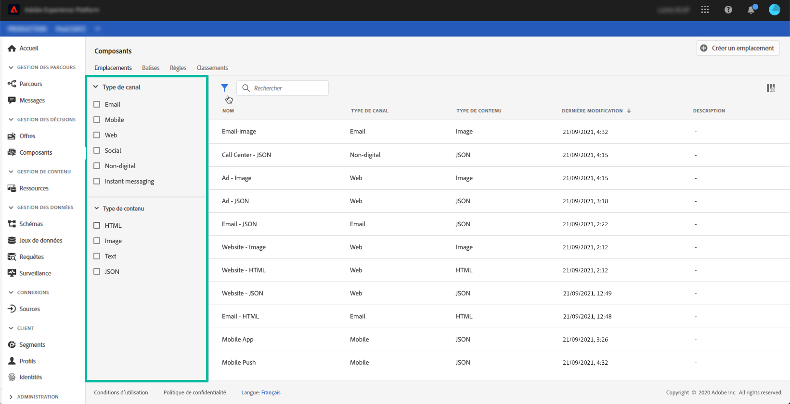
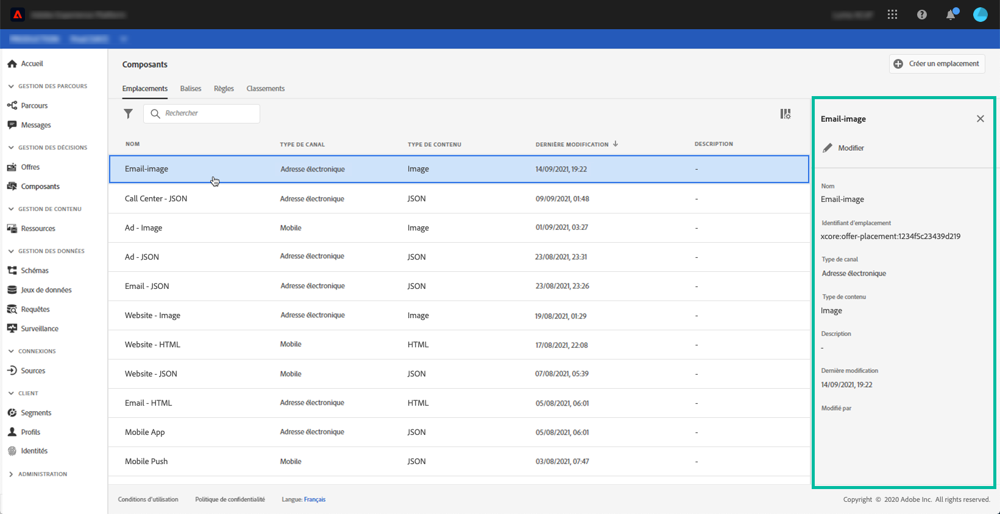

# Création de placements {#creating-placements}

Un emplacement permet de s’assurer que le contenu d’offre approprié s’affiche au bon endroit dans votre message. Lorsque vous ajoutez du contenu à une offre, vous êtes invité à sélectionner un placement dans lequel ce contenu peut être affiché.

 [Découvrez cette fonctionnalité en vidéo](#video)

Dans l’exemple ci-dessous, trois emplacements correspondent à différents types de contenu (image, texte, HTML).

La liste des emplacements est accessible dans le menu **[!UICONTROL Composants]**. Des filtres sont disponibles pour vous aider à récupérer des emplacements en fonction d’un canal ou d’un contenu spécifique.

Pour créer une emplacement, procédez comme suit :

1. Cliquez sur **[!UICONTROL Créer un emplacement]**.

   

1. Définissez les propriétés de l’emplacement :

   * **[!UICONTROL Nom]** : nom du serveur. Veillez à définir un nom significatif pour le récupérer plus facilement.
   * **[!UICONTROL Type de cana]** : canal pour lequel le placement sera utilisé.
   * **[!UICONTROL Type de contenu]** : type de contenu que le placement peut afficher : texte, HTML ou lien d’image.
   * **[!UICONTROL Description]** : description de l’emplacement (facultatif).

   

1. Cliquez sur **[!UICONTROL Enregistrer]** pour valider.

1. Une fois l’emplacement créé, il s’affiche dans la liste des emplacements. Vous pouvez la sélectionner pour afficher ses propriétés et la modifier.

   

## Tutoriel vidéo {#video}

>[!NOTE]
>
>Cette vidéo s’applique au service applicatif Offer Decisioning intégré à Adobe Experience Platform. Elle fournit toutefois des instructions générales sur l’utilisation d’Offer Decisioning dans le contexte de Journey Optimizer.

>[!VIDEO](https://video.tv.adobe.com/v/329372?quality=12)
