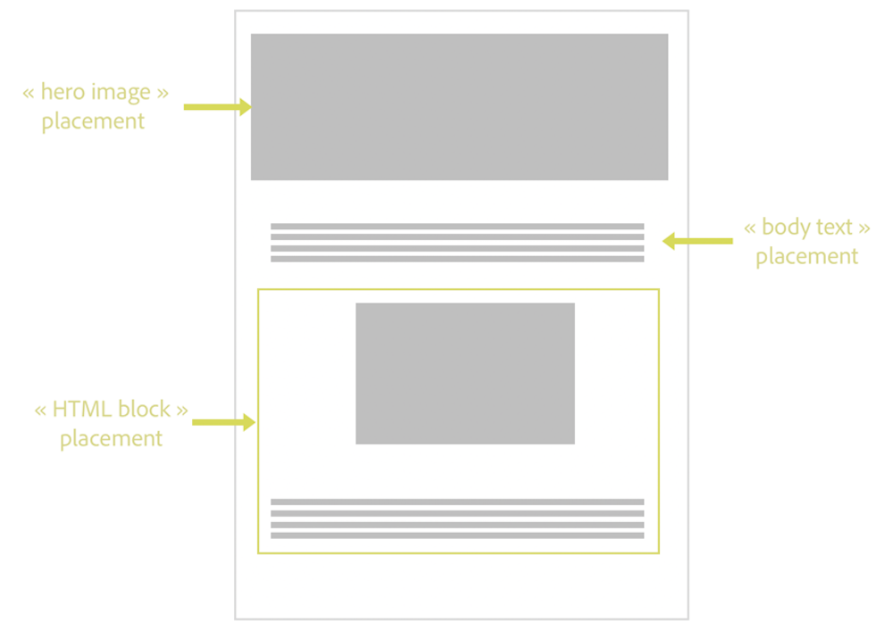
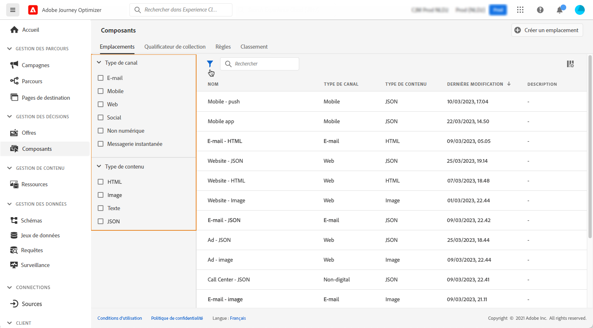
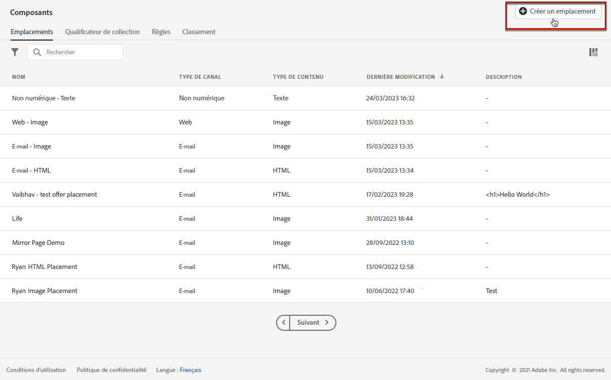
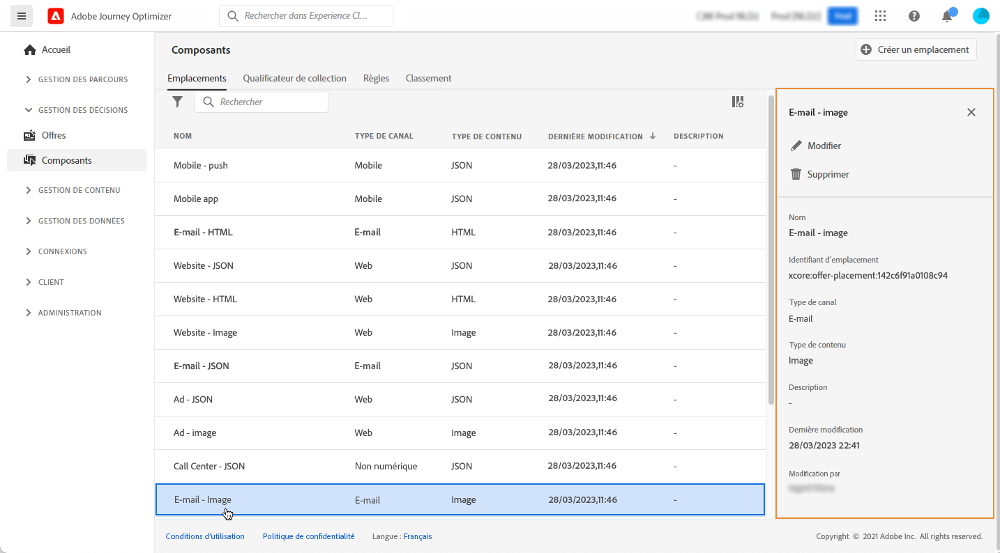

# Créer des emplacements {#create-placements}

>[!TIP]
>
>La prise de décision, la nouvelle fonctionnalité de prise de décision d’[!DNL Adobe Journey Optimizer], est désormais disponible via les canaux d’expérience basée sur du code et d’e-mail. [En savoir plus](../../experience-decisioning/gs-experience-decisioning.md)

>[!CONTEXTUALHELP]
>id="ajo_decisioning_placement"
>title="Emplacement"
>abstract="Un emplacement est un conteneur utilisé pour présenter des offres. Il permet de s’assurer que le contenu d’offre approprié s’affiche au bon endroit dans votre message. Les emplacements sont créés à partir du menu « Composants »."

>[!CONTEXTUALHELP]
>id="ajo_decisioning_placement_request"
>title="Paramètres de la requête"
>abstract="Activez l’option **[!UICONTROL Autoriser les doublons dans les emplacements]** pour que le système considère la même offre pour plusieurs emplacements. Utilisez le champ **[!UICONTROL Demander une offre]** pour ajuster le nombre d’offres renvoyées. Par exemple, si vous sélectionnez 2, les 2 meilleures offres s’afficheront pour la portée de décision sélectionnée."

>[!CONTEXTUALHELP]
>id="ajo_decisioning_placement_response"
>title="Format de réponse"
>abstract="Les options **[!UICONTROL Inclure le contenu]** et **[!UICONTROL Inclure les métadonnées]** vous permettent de spécifier si le contenu et les métadonnées de l’offre doivent être renvoyés dans la réponse de l’API. Vous pouvez inclure toutes les métadonnées ou seulement des champs spécifiques. Par défaut, la valeur du champ Inclure les métadonnées est définie sur « true »."

Un emplacement permet de s&#39;assurer que le contenu d&#39;offre approprié s&#39;affiche au bon endroit dans votre message. Lorsque vous ajoutez du contenu à une offre, vous êtes invité à sélectionner un emplacement dans lequel ce contenu peut être affiché.

➡️ [Découvrez comment créer des emplacements dans cette vidéo.](#video)

Dans l&#39;exemple ci-dessous, trois emplacements correspondent à différents types de contenu (image, texte, HTML).

La liste des emplacements est accessible dans le menu **[!UICONTROL Composants]**. Des filtres sont disponibles pour vous aider à récupérer des emplacements en fonction d&#39;un canal ou d&#39;un contenu spécifique.

Pour créer un emplacement, procédez comme suit :

1. Cliquez sur **[!UICONTROL Créer un emplacement]**.

   

1. Définissez les propriétés de l&#39;emplacement :

   * **[!UICONTROL Nom]** : nom de l&#39;emplacement. Veillez à définir un nom significatif pour le récupérer plus facilement.
   * **[!UICONTROL Type de canal]** : canal pour lequel l&#39;emplacement sera utilisé.
   * **[!UICONTROL Type de contenu]** : type de contenu que l&#39;emplacement peut afficher : texte, HTML, lien d&#39;image ou JSON.
   * **[!UICONTROL Description]** : description de l’emplacement (facultatif).

   

1. Les sections **[!UICONTROL Paramètres de requête]** et **[!UICONTROL Format de réponse]** offrent les paramètres supplémentaires suivants :

   * **[!UICONTROL Autoriser les doublons dans les emplacements]** : permet de déterminer si la même offre peut être proposée plusieurs fois à différents emplacements. Si cette option est activée, le système accepte de placer la même offre dans plusieurs emplacements. Par défaut, ce paramètre est défini sur « false ».

     Si cette option est définie sur « false » dans un emplacement d’une requête de prise de décision, tous les emplacements de la requête hériteront du paramètre « false ».

   * **[!UICONTROL Demande d’offre]** : par défaut, une offre de la portée de décision est renvoyée pour chaque profil. Cette option vous permet d’ajuster le nombre d’offres renvoyées. Par exemple, si vous sélectionnez 2, les 2 meilleures offres s’afficheront pour la portée de décision sélectionnée.

   * **[!UICONTROL Inclure le contenu]**/**[!UICONTROL Inclure les métadonnées]** : indiquez si le contenu et les métadonnées de l’offre doivent être renvoyés dans la réponse d’API. Vous pouvez inclure toutes les métadonnées ou seulement des champs spécifiques. Par défaut, la valeur du champ Inclure les métadonnées est définie sur « true ».

   Ces paramètres peuvent également être définis directement dans votre requête API si vous utilisez l’[API Decisioning](https://experienceleague.adobe.com/docs/journey-optimizer/using/offer-decisioning/api-reference/offer-delivery-api/decisioning-api.html?lang=fr). Toutefois, leur configuration dans l’interface utilisateur peut vous aider à gagner du temps, car vous n’aurez pas à les transmettre dans chaque requête API. Notez que si vous configurez les paramètres à la fois dans l’interface utilisateur et dans la requête API, les valeurs de la requête API prévalent sur celles de l’interface.

   >[!NOTE]
   >
   >Si vous utilisez l’[API Edge Decisioning](https://experienceleague.adobe.com/docs/journey-optimizer/using/offer-decisioning/api-reference/offer-delivery-api/edge-decisioning-api.html?lang=fr), vous ne pouvez pas définir ces paramètres dans votre requête. Vous devez les définir sur cet écran.
   >
   >Si vous utilisez l’[API Batch Decisioning](../api-reference/offer-delivery-api/batch-decisioning-api.md), vous pouvez définir ces paramètres sur cet écran ou dans votre requête API. Si les valeurs renseignées sur l’écran et dans la requête API ne correspondent pas, les valeurs de la requête sont utilisées.

1. Cliquez sur **[!UICONTROL Enregistrer]** pour confirmer.

1. Une fois l&#39;emplacement créé, il s&#39;affiche dans la liste des emplacements. Vous pouvez la sélectionner pour afficher ses propriétés et la modifier.

   

## Vidéo pratique{#video}

Découvrez comment créer des emplacements pour la gestion des décisions.

>[!VIDEO](https://video.tv.adobe.com/v/329372?quality=12)

