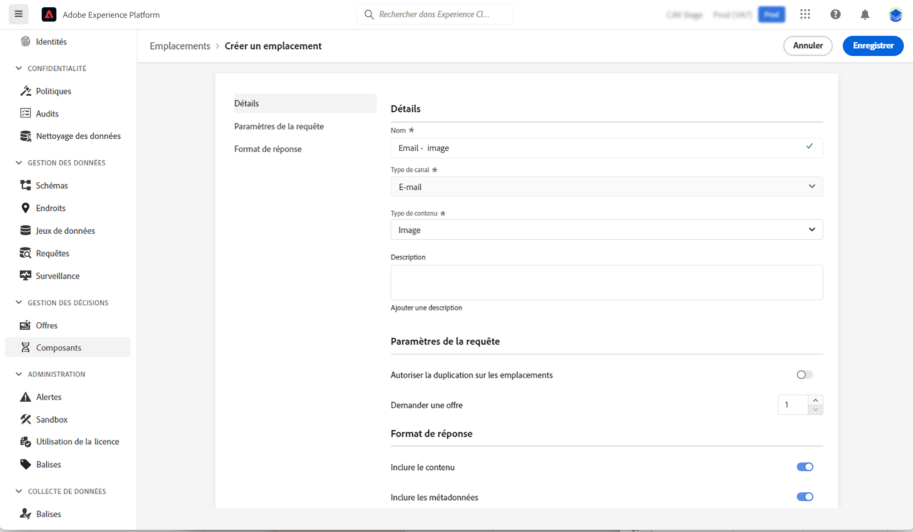

# Créer des emplacements {#create-placements}

>[!CONTEXTUALHELP]
>id="ajo_decisioning_placement"
>title="Emplacement"
>abstract="Un emplacement est un conteneur utilisé pour présenter des offres. Il permet de s’assurer que le contenu d’offre approprié s’affiche au bon endroit dans votre message. Les emplacements sont créés à partir du menu « Composants »."

Un emplacement permet de s&#39;assurer que le contenu d&#39;offre approprié s&#39;affiche au bon endroit dans votre message. Lorsque vous ajoutez du contenu à une offre, vous êtes invité à sélectionner un emplacement dans lequel ce contenu peut être affiché.

➡️ [Découvrez comment créer des emplacements dans cette vidéo](#video)

Dans l&#39;exemple ci-dessous, trois emplacements correspondent à différents types de contenu (image, texte, HTML).

La liste des emplacements est accessible dans le menu **[!UICONTROL Composants]**. Des filtres sont disponibles pour vous aider à récupérer des emplacements en fonction d&#39;un canal ou d&#39;un contenu spécifique.

Pour créer une emplacement, procédez comme suit :

1. Cliquez sur **[!UICONTROL Créer un emplacement]**.

   

1. Définissez les propriétés de l&#39;emplacement :

   * **[!UICONTROL Nom]** : nom de l&#39;emplacement. Veillez à définir un nom significatif pour le récupérer plus facilement.
   * **[!UICONTROL Type de canal]** : canal pour lequel l&#39;emplacement sera utilisé.
   * **[!UICONTROL Type de contenu]** : type de contenu que l&#39;emplacement peut afficher : texte, HTML, lien d&#39;image ou JSON.
   * **[!UICONTROL Description]** : description de l&#39;emplacement (facultatif).

   

1. Le **[!UICONTROL Paramètres de requête]** et **[!UICONTROL Format de réponse]** Les sections fournissent des paramètres supplémentaires :

   * **[!UICONTROL Autoriser les doublons entre emplacements]**: Permet de déterminer si une même offre peut être proposée plusieurs fois à différents emplacements. Si cette option est activée, le système considère la même offre pour plusieurs emplacements. Par défaut, le paramètre est défini sur false.

      Si cette option est définie sur false pour tout emplacement dans une requête de prise de décision, tous les emplacements de la requête hériteront du paramètre &quot;false&quot;.

   * **[!UICONTROL Demande d’offre]**: Par défaut, une offre de la portée de la décision est renvoyée pour chaque profil. Vous pouvez ajuster le nombre d’offres renvoyées à l’aide de cette option. Par exemple, si vous sélectionnez 2, les 2 meilleures offres s’afficheront pour la portée de décision sélectionnée.

   * **[!UICONTROL Inclure le contenu]** / **[!UICONTROL Inclure les métadonnées]**: spécifiez si le contenu et les métadonnées de l’offre doivent être renvoyés dans la réponse de l’API. Vous ne pouvez inclure que toutes les métadonnées ou des champs spécifiques. Par défaut, la valeur Inclure les métadonnées est définie sur true.
   Ces paramètres peuvent également être définis directement dans votre requête d’API si vous travaillez avec la variable [API de prise de décision](https://experienceleague.adobe.com/docs/journey-optimizer/using/offer-decisioning/api-reference/offer-delivery-api/decisioning-api.html). Toutefois, leur configuration dans l’interface utilisateur peut vous aider à gagner du temps, car vous n’aurez pas à les transmettre dans chaque requête d’API. Notez que si vous configurez les paramètres à la fois dans l’interface utilisateur et dans la requête API, les valeurs de la requête API prévaudront sur celles de l’interface.

   >[!NOTE]
   >
   >Si vous travaillez avec la variable [API de prise de décision Edge](https://experienceleague.adobe.com/docs/journey-optimizer/using/offer-decisioning/api-reference/offer-delivery-api/edge-decisioning-api.html?), vous ne pouvez pas définir ces paramètres dans votre requête. Vous devez les définir dans cet écran.
   >
   >Si vous travaillez avec la variable [API Batch Decisioning](../api-reference/offer-delivery-api/batch-decisioning-api.md), vous pouvez définir ces paramètres dans cet écran ou dans votre requête API. En cas de non-correspondance des valeurs de paramètre entre l’écran et la requête APi, les valeurs de requête sont utilisées.

1. Cliquez sur **[!UICONTROL Enregistrer]** pour confirmer.

1. Une fois l&#39;emplacement créé, il s&#39;affiche dans la liste des emplacements. Vous pouvez la sélectionner pour afficher ses propriétés et la modifier.

   

## Vidéo pratique{#video}

Découvrez comment créer des emplacements pour la gestion des décisions.

>[!VIDEO](https://video.tv.adobe.com/v/329372?quality=12)

