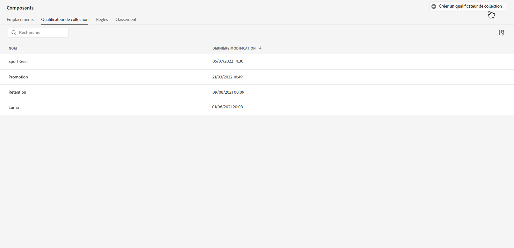
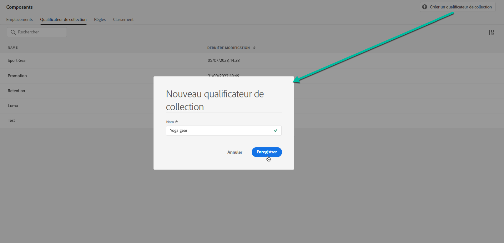
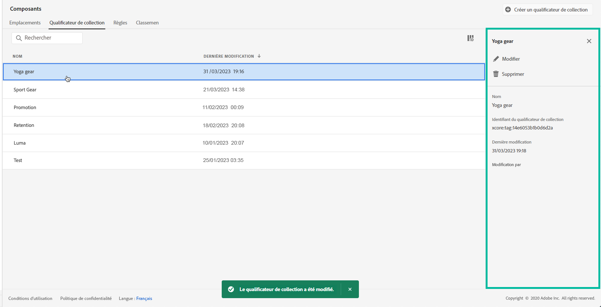

# Créer des qualificateurs de collection {#create-tags}

>[!TIP]
>
>La prise de décision, la nouvelle fonctionnalité de prise de décision d’[!DNL Adobe Journey Optimizer], est désormais disponible via les canaux d’expérience basée sur du code et d’e-mail. [En savoir plus](../../experience-decisioning/gs-experience-decisioning.md)

>[!CONTEXTUALHELP]
>id="ajo_decisioning_offer_tags"
>title="Qualificateurs de collection"
>abstract="Associez un ou plusieurs qualificateurs de collection à l’offre pour que votre bibliothèque des offres reste organisée et localisez plus facilement les offres. Les qualificateurs de collection sont créées à partir du menu « Composant »."

Ajoutez des qualificateurs de collection (précédemment appelés « balises ») à vos offres et mettez de l’ordre dans votre collection. Par exemple, vous pouvez libeller vos offres Black Friday à l’aide du qualificateur de collection « Black Friday ». Vous pouvez ensuite utiliser la fonctionnalité de recherche de la bibliothèque des offres pour localiser facilement toutes les offres associées à ce qualificateur de collection.

Les qualificateurs de collection peuvent également être utilisés pour regrouper les offres sous forme de collections d’offres. Voir [Créer des collections](../offer-library/creating-collections.md).

➡️ [Découvrez cette fonctionnalité en vidéo](#video)

La liste des qualificateurs de collection créés est accessible dans le menu **[!UICONTROL Composants]**.

Pour créer un qualificateur de collection, procédez comme suit :

1. Accédez à l’onglet **[!UICONTROL Qualificateurs de collection]**, puis cliquez sur **[!UICONTROL Créer un qualificateur de collection]**.

1. Indiquez le nom du qualificateur de collection, puis cliquez sur **[!UICONTROL Enregistrer]**.

   

1. Une fois le qualificateur de collection créé, il s’affiche dans la liste. Vous pouvez le sélectionner pour afficher ses propriétés et le modifier ou le supprimer.

   

## Vidéo pratique {#video}

>[!VIDEO](https://video.tv.adobe.com/v/341366?captions=fre_fr&quality=12)
