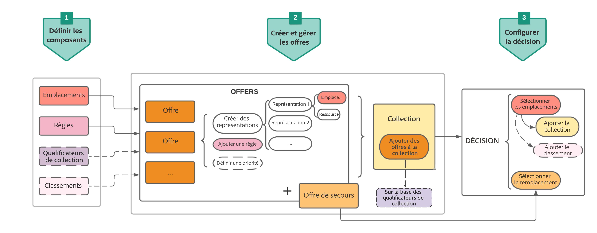

# Étapes clés de la création et de la gestion des offres {#key-steps-to-manage-offers}

>[!TIP]
>
>La prise de décision, la nouvelle fonctionnalité de prise de décision d’[!DNL Adobe Journey Optimizer], est désormais disponible via les canaux d’expérience basée sur du code et d’e-mail. [En savoir plus](../../experience-decisioning/gs-experience-decisioning.md)

Les principales étapes de création, de configuration et de gestion des offres, ainsi que de leur utilisation dans une décision, sont présentées ci-dessous.

Pour obtenir un exemple complet montrant comment configurer des offres, les utiliser dans une décision et exploiter cette décision dans un e-mail, consultez [cette page](../offers-e2e.md).

## Création de composants {#create-components}

Avant de commencer à créer des offres, vous devez définir plusieurs composants que vous utiliserez dans vos offres.

1. [Créez des emplacements](creating-placements.md) qui sont des conteneurs utilisés pour présenter vos offres. Vous pouvez, par exemple, créer un emplacement réservé aux offres au format d&#39;image uniquement, et situé en haut de vos messages.

1. [Créez des règles de décision](creating-decision-rules.md) qui spécifient les conditions dans lesquelles les offres sont présentées.

1. [Créez des qualificateurs de collection](creating-tags.md) (auparavant appelés « balises ») et associez-les aux offres pour un classement et une recherche faciles dans la bibliothèque.

1. Si vous souhaitez définir des règles qui déterminent quelle offre doit être présentée en premier pour un emplacement donné (plutôt que de prendre en compte les scores de priorité des offres), vous pouvez [créer une formule de classement](../ranking/create-ranking-formulas.md).

<!--
<table style="table-layout:fixed">
<tr style="border: 0;">
<td>

<a href="../offer-library/creating-placements.md">Create placements</a>

</td>
<td>

<a href="../offer-library/creating-decision-rules.md">Create decision rules</a>

<td>

<a href="../offer-library/creating-tags.md">Create collection qualifiers</a>

</td>
<td>

<a href="../ranking/create-ranking-formulas.md">Create ranking formulas</a>

</td>
</tr>
</table>
-->

## Création et gestion des offres {#create-and-manage-offers}

1. [Créez des offres](creating-personalized-offers.md) et configurez leur contenu et leurs propriétés.

1. [Créez des offres de secours](creating-fallback-offers.md), qui sont les dernières offres de recours à afficher si les clients ne sont éligibles à aucune des offres sélectionnées.

1. [Créez une collection](creating-collections.md) afin d&#39;inclure les offres personnalisées que vous avez créées et de les utiliser dans une décision.

<!--
<table style="table-layout:fixed">
<tr style="border: 0;">
<td>

<a href="../offer-library/creating-personalized-offers.md">Create offers</a>

</td>
<td>

<a href="../offer-library/creating-fallback-offers.md">Create fallback offers</a>

</td>
<td>

<a href="../offer-library/creating-collections.md">Create collections</a>

</td>
</tr>
</table>
-->

## Création et configuration des décisions {#create-and-configure-decisions}

1. [Créez une décision](../offer-activities/create-offer-activities.md) qui combine des emplacements avec des offres personnalisées et des offres de secours. Cette combinaison sera utilisée par le moteur de décision pour trouver la meilleure offre pour un profil spécifique.

1. [Configurez la décision](../offer-activities/create-offer-activities.md#add-decision-scopes). Pour ce faire, sélectionnez les emplacements, puis, pour chaque emplacement, sélectionnez une collection et une offre de secours.

1. Si nécessaire, vous pouvez [attribuer une formule de classement](../offer-activities/configure-offer-selection.md#assign-ranking-formula) ou [un classement AI](../offer-activities/configure-offer-selection.md#use-ranking-strategy) à un emplacement lors de la configuration de la décision.

<!--
<table style="table-layout:fixed">
<tr style="border: 0;">
<td>

<a href="../offer-activities/create-offer-activities.md">Create decisions</a>

</td>
<td>

<a href="../offer-activities/create-offer-activities.md#add-offers">Configure decisions</a>

</td>
<td>

<a href="../offer-activities/configure-offer-selection.md#assign-ranking-formula">Assign ranking</a>

</td>
</tr>
</table>
-->