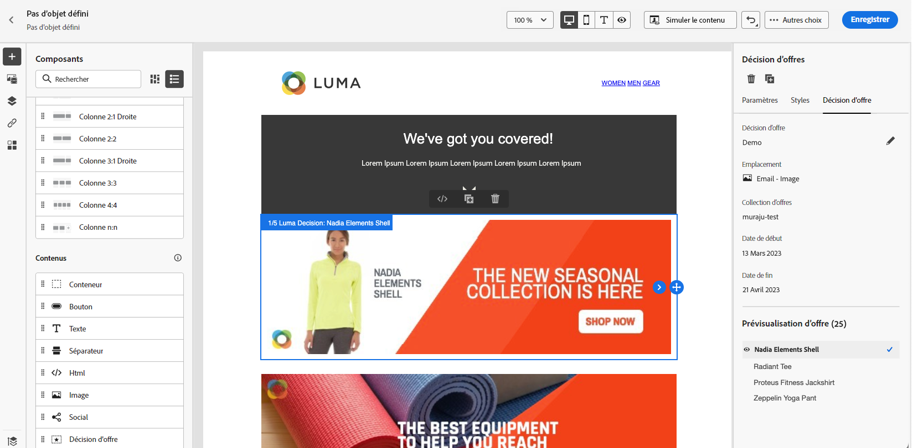

# Cas pratique : Configurer des offres personnalisées pour les utiliser dans un email {#configure-add-personalized-offers-email}

Cette section présente un exemple de bout en bout de la configuration des offres et de leur utilisation dans un email, en fonction d’une décision que vous avez précédemment créée.

## Principales étapes {#main-steps}

Les étapes clés de configuration des offres, de leur inclusion dans une décision et de l’utilisation de cette décision dans un email sont répertoriées ci-dessous :

1. Avant de créer des offres, [définir vos composants ;](#define-components)

   * Créer des emplacements
   * Créer des règles de décision
   * Créer des balises
   * Créer des classements (facultatif)

1. [Configurer les offres](#configure-offers)

   * Créer des offres
   * Pour chaque offre :

      * Créer des représentations et sélectionner un emplacement et une ressource pour chaque représentation
      * Ajouter une règle pour chaque offre
      * Définition d’une priorité pour chaque offre

1. [Créer une offre de secours](#create-fallback)

1. [Création d’une collection](#create-collection) pour inclure les offres personnalisées que vous avez créées

1. [Configurer la décision](#configure-decision)

   * Créer une décision
   * Sélectionner les emplacements que vous avez créés
   * Pour chaque emplacement, sélectionnez la collection .
   * Pour chaque emplacement, sélectionnez un classement (facultatif).
   * Sélectionner la version de secours

1. [Insérer la décision dans un email](#insert-decision-in-email)

   * Sélectionner un emplacement correspondant aux offres que vous souhaitez afficher
   * Sélectionnez la décision parmi les éléments compatibles avec l’emplacement sélectionné.
   * Prévisualiser vos offres

Le processus global de gestion des décisions pour utiliser les offres dans un email peut être décrit comme suit :

## Définition des composants {#define-components}

Avant de commencer à créer des offres, vous devez définir plusieurs composants que vous utiliserez dans vos offres.

Vous les trouverez sous le **[!UICONTROL Decision Management]** > **[!UICONTROL Components menu]**.

1. Commencez par créer **emplacements** pour vos offres.

   Vous utiliserez ces emplacements pour définir où l’offre résultante apparaîtra lors de la définition de votre décision d’offre.

   Dans cet exemple, créez trois emplacements avec le canal et les types de contenu suivants :

   * *Web - Image*
   * *Email - Image*
   * *Non numérique - Texte*

   

   Les étapes détaillées pour créer des emplacements sont décrites dans la section [cette section](../../using/offers/offer-library/creating-placements.md).

1. Créer **règles de décision**.

   Les règles de décision offrent la meilleure offre à un profil dans Adobe Experience Platform.

   Configurez deux règles simples en utilisant la variable **[!UICONTROL XDM Individual Profile > Person > Gender]** attribute:

   * *Clients féminins*
   * *Clients masculins*

   

   Les étapes détaillées pour créer des règles sont décrites dans la section [cette section](../../using/offers/offer-library/creating-decision-rules.md).

1. Vous pouvez également créer une **tag**.

   Vous pourrez ensuite l’associer à vos offres et utiliser cette balise pour regrouper vos offres dans une collection.

   Dans cet exemple, créez le *Yoga* balise .

   

   Les étapes détaillées pour créer des balises sont décrites dans la section [cette section](../../using/offers/offer-library/creating-tags.md).

1. Si vous souhaitez définir des règles qui déterminent la première offre à présenter pour un emplacement donné (plutôt que de prendre en compte les scores de priorité des offres), vous pouvez créer une **formule de classement**.

   Les étapes détaillées pour créer des formules de classement sont décrites dans la section [cette section](../../using/offers/ranking/create-ranking-formulas.md#create-ranking-formula).

   >[!NOTE]
   >
   >Dans cet exemple, nous n’utiliserons que les scores de priorité. En savoir plus sur [règles d’éligibilité et contraintes](../../using/offers/offer-library/creating-personalized-offers.md#eligibility).

## Configurer des offres {#configure-offers}

Vous pouvez maintenant créer et configurer vos offres. Dans cet exemple, vous allez créer quatre offres que vous souhaitez afficher en fonction de chaque profil spécifique.

1. Créez une offre. En savoir plus dans [cette section](../../using/offers/offer-library/creating-personalized-offers.md#create-offer).

1. Dans cette offre, créez trois représentations. Chaque représentation doit être une combinaison d’un emplacement que vous avez créé précédemment et d’une ressource :

   * Un correspondant au *Web - Image* placement
   * Un correspondant au *Email - Image* placement
   * Un correspondant au *Non numérique - Texte* placement

   >[!NOTE]
   >
   >Une offre peut être affichée à différents endroits dans un message afin de créer plus d’opportunités d’utilisation de l’offre dans différents contextes d’emplacement.

   En savoir plus sur les représentations dans [cette section](../../using/offers/offer-library/creating-personalized-offers.md#representations).

1. Sélectionnez une image appropriée pour les deux premiers emplacements. Entrez du texte personnalisé pour le *Non numérique - Texte* placement.

   

1. Dans le **[!UICONTROL Offer eligibility]** , sélectionnez **[!UICONTROL By defined decision rule]** et effectuez un glisser-déposer de la règle de votre choix.

   

1. Remplissez la variable **[!UICONTROL Priority]**. Dans cet exemple, ajoutez *25*.

1. Vérifiez votre offre, puis cliquez sur **[!UICONTROL Save and approve]**.

   

1. Dans cet exemple, créez trois offres supplémentaires avec les mêmes représentations, mais des ressources différentes. Attribuez-les à des règles et priorités différentes, telles que :

   * Première offre - Règle de décision : *Clients féminins*, Priorité : *25*
   * Deuxième offre - Règle de décision : *Clients féminins*, Priorité : *15*
   * Troisième offre - Règle de décision : *Clients masculins*, Priorité : *25*
   * Quatrième offre - Règle de décision : *Clients masculins*, Priorité : *15*

   

Les étapes détaillées pour créer et configurer des offres sont décrites dans la section [cette section](../../using/offers/offer-library/creating-personalized-offers.md).

## Créer une offre de secours {#create-fallback}

1. Créez une offre de secours.

1. Définissez les mêmes représentations que pour les offres, avec les ressources appropriées (elles doivent être différentes de celles utilisées dans vos offres).

   Chaque représentation doit être une combinaison d’un emplacement que vous avez créé précédemment et d’une ressource :

   * Un correspondant au *Web - Image* placement
   * Un correspondant au *Email - Image* placement
   * Un correspondant au *Non numérique - Texte* placement

   

1. Vérifiez votre offre de secours, puis cliquez sur **[!UICONTROL Save and approve]**.

Votre offre de secours est maintenant prête à être utilisée dans une décision.

Les étapes détaillées pour créer et configurer une offre de secours sont décrites dans la section [cette section](../../using/offers/offer-library/creating-fallback-offers.md).

## Création d’une collection {#create-collection}

Lors de la configuration de la décision, vous devez ajouter vos offres personnalisées dans le cadre d’une collection.

1. Pour accélérer le processus de décision, créez une collection dynamique.

1. Utilisez la variable *Yoga* pour sélectionner les quatre offres personnalisées que vous avez créées précédemment.

   

Les étapes détaillées pour créer une collection sont décrites dans la section [cette section](../../using/offers/offer-library/creating-collections.md).

## Configurer la décision {#configure-decision}

Vous devez maintenant créer une décision qui combinera des emplacements avec les offres personnalisées et l’offre de secours que vous venez de créer.

Cette combinaison sera utilisée par le moteur de prise de décision pour trouver la meilleure offre pour un profil spécifique : dans cet exemple, il sera basé sur la priorité et la règle de décision que vous avez assignées à chaque offre.

Pour créer et configurer une décision d’offre, procédez comme suit :

1. Créez une décision. En savoir plus dans [cette section](../../using/offers/offer-activities/create-offer-activities.md#create-activity).

1. Sélectionnez la *Web - Image*, *Email - Image* et *Non numérique - Texte* emplacements.

   

1. Pour chaque emplacement, ajoutez la collection que vous avez créée.

   

1. Si vous avez défini un classement lors de la [création de vos composants](#define-components), vous pouvez l’affecter à un emplacement dans la décision. Si plusieurs offres peuvent être présentées à cet emplacement, la décision utilisera cette formule pour calculer la première offre à diffuser.

   Les étapes détaillées pour attribuer une formule de classement à un emplacement sont décrites dans la section [cette section](../../using/offers/offer-activities/configure-offer-selection.md#assign-ranking-formula).

1. Sélectionnez l’offre de secours que vous avez créée. Il s’affichera comme une offre de secours disponible pour les trois emplacements sélectionnés.

   

1. Vérifiez votre décision, puis cliquez sur **[!UICONTROL Save and approve]**.

   

Votre décision est maintenant prête à être utilisée pour diffuser des offres optimisées et personnalisées.

Les étapes détaillées pour créer et configurer une décision sont décrites dans la section [cette section](../../using/offers/offer-activities/create-offer-activities.md).

## Insérer la décision dans un email {#insert-decision-in-email}

Maintenant que votre décision est en ligne, vous pouvez l’insérer dans un email. Pour ce faire, procédez comme décrit dans la section [cette page](../../using/email/add-offers-email.md).

