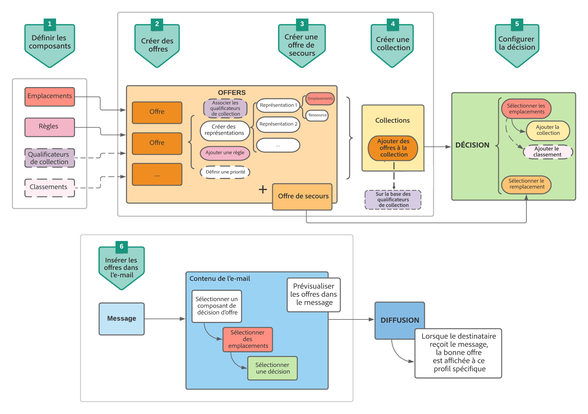

# Cas d&#39;utilisation : configuration des offres personnalisées pour les utiliser dans un e-mail {#configure-add-personalized-offers-email}

Cette section présente un exemple complet de la configuration des offres et de leur utilisation dans un e-mail, en fonction d&#39;une décision que vous avez précédemment créée.

## Principales étapes {#main-steps}

Les étapes clés de configuration des offres, de leur inclusion dans une décision et de l&#39;utilisation de cette décision dans un e-mail sont répertoriées ci-dessous :

1. Avant de créer des offres, [définissez vos composants](#define-components)

   * Création d’emplacements
   * Création de règles de décision
   * Création de balises
   * Création de classements (facultatif)

1. [Configuration des offres](#configure-offers)

   * Création d’offres
   * Pour chaque offre :

      * Création de représentations et sélection d’un emplacement et d’une ressource pour chaque représentation
      * Ajout d&#39;une règle pour chaque offre
      * Définition d&#39;une priorité pour chaque offre

1. [Création d&#39;une offre de secours](#create-fallback)

1. [Création d’une collection](#create-collection) incluant les offres personnalisées que vous avez créées

1. [Configuration de la décision](#configure-decision)

   * Création d&#39;une décision
   * Sélection des emplacements que vous avez créés
   * Pour chaque emplacement, sélection la collection
   * Pour chaque emplacement, sélection d’un classement (facultatif)
   * Sélection d&#39;une version de secours

1. [Insertion d&#39;une décision dans un e-mail](#insert-decision-in-email)

   * Sélection d’un emplacement correspondant aux offres que vous souhaitez afficher
   * Sélection de la décision parmi les éléments compatibles avec l&#39;emplacement sélectionné
   * Prévisualisation de vos offres

Le processus global de gestion des décisions pour utiliser les offres dans un e-mail peut être décrit comme suit :

## Définition des composants {#define-components}

Avant de commencer à créer des offres, vous devez définir plusieurs composants que vous utiliserez dans vos offres.

Vous les trouverez sous le menu **[!UICONTROL Gestion des décisions]** > **[!UICONTROL Composants]**.

1. Commencez par créer des **emplacements** pour vos offres.

   Vous utilisez ces emplacements pour définir où l&#39;offre générée apparaîtra lors de la définition de votre décision d&#39;offre.

   Dans cet exemple, créez trois emplacements avec le canal et les types de contenu suivants :

   * *Web - Image*
   * *E-mail - Image*
   * *Non numérique - Texte*

   

   Les étapes détaillées pour créer des emplacements sont présentées dans [cette section](../../using/offers/offer-library/creating-placements.md).

1. Créez des **règles de décision**.

   Les règles de décision offrent la meilleure offre à un profil dans Adobe Experience Platform.

   Configurez deux règles simples en utilisant l&#39;attribut **[!UICONTROL XDM Individual Profile > Person > Gender]** :

   * *Clientes*
   * *Clients*

   

   Les étapes détaillées pour créer des règles sont présentées dans [cette section](../../using/offers/offer-library/creating-decision-rules.md).

1. Vous pouvez également créer une **balise**.

   Vous pourrez ensuite l&#39;associer à vos offres et utiliser cette balise pour regrouper vos offres dans une collection.

   Dans cet exemple, créez la balise *Yoga*.

   

   Les étapes détaillées pour créer des balises sont présentées dans [cette section](../../using/offers/offer-library/creating-tags.md).

1. Si vous souhaitez définir des règles qui déterminent quelle offre doit être présentée en premier pour un emplacement donné (plutôt que de prendre en compte les scores de priorité des offres), vous pouvez créer une **formule de classement**.

   Les étapes détaillées pour créer des formules de classement sont présentées dans [cette section](../../using/offers/offer-library/create-ranking-formulas.md#create-ranking-formula).

   >[!NOTE]
   >
   >Dans cet exemple, nous n&#39;utiliserons que les scores de priorité. En savoir plus sur les [règles d&#39;éligibilité et les contraintes](../../using/offers/offer-library/creating-personalized-offers.md#eligibility).

## Configuration des offres {#configure-offers}

Vous pouvez maintenant créer et configurer vos offres. Dans cet exemple, vous allez créer quatre offres à afficher en fonction de chaque profil spécifique.

1. Créez une offre. En savoir plus dans [cette section](../../using/offers/offer-library/creating-personalized-offers.md#create-offer).

1. Dans cette offre, créez trois représentations. Chaque représentation doit être une combinaison d&#39;un emplacement que vous avez créé précédemment et d&#39;une ressource :

   * Une correspondant à l&#39;emplacement *Web - Image*
   * Une correspondant à l&#39;emplacement *E-mail - Image*
   * Une correspondant à l&#39;emplacement *Non numérique - Texte*

   >[!NOTE]
   >
   >Une offre peut être affichée à différents endroits dans un message afin de créer davantage de possibilités d&#39;utiliser l&#39;offre dans différents contextes d&#39;emplacement.

   Pour en savoir plus sur les représentations, consultez [cette section](../../using/offers/offer-library/creating-personalized-offers.md#representations).

1. Sélectionnez une image appropriée pour les deux premiers emplacements. Saisissez du texte personnalisé pour l&#39;emplacement *Non numérique - Texte*.

   

1. Dans la section **[!UICONTROL Éligibilité de l&#39;offre]**, sélectionnez **[!UICONTROL Par règle de décision définie]** et effectuez un glisser-déposer de la règle de votre choix.

   

1. Remplissez la **[!UICONTROL Priorité]**. Dans cet exemple, ajoutez *25*.

1. Vérifiez votre offre, puis cliquez sur **[!UICONTROL Enregistrer et approuver]**.

   

1. Dans cet exemple, créez trois offres supplémentaires avec les mêmes représentations, mais des ressources différentes. Attribuez-les à des règles et priorités différentes, par exemple :

   * Première offre - Règle de décision : *Clientes*, Priorité : *25*
   * Deuxième offre - Règle de décision : *Clientes*, Priorité : *15*
   * Troisième offre - Règle de décision : *Clients*, Priorité : *25*
   * Quatrième offre - Règle de décision : *Clients*, Priorité : *15*

   

Les étapes détaillées pour créer et configurer des offres sont présentées dans [cette section](../../using/offers/offer-library/creating-personalized-offers.md).

## Création d&#39;une offre de secours {#create-fallback}

1. Créez une offre de secours.

1. Définissez les mêmes représentations que pour les offres, avec les ressources appropriées (elles doivent être différentes de celles utilisées dans vos offres).

   Chaque représentation doit être une combinaison d&#39;un emplacement que vous avez créé précédemment et d&#39;une ressource :

   * Une correspondant à l&#39;emplacement *Web - Image*
   * Une correspondant à l&#39;emplacement *E-mail - Image*
   * Une correspondant à l&#39;emplacement *Non numérique - Texte*

   

1. Vérifiez votre offre de secours, puis cliquez sur **[!UICONTROL Enregistrer et approuver]**.

Votre offre de secours est maintenant prête à être utilisée dans une décision.

Les étapes détaillées pour créer et configurer une offre de secours sont présentées dans [cette section](../../using/offers/offer-library/creating-fallback-offers.md).

## Création d&#39;une collection {#create-collection}

Lors de la configuration de la décision, vous devez ajouter vos offres personnalisées dans le cadre d&#39;une collection.

1. Pour accélérer le processus de décision, créez une collection dynamique.

1. Utilisez la balise *Yoga* pour sélectionner les quatre offres personnalisées que vous avez créées précédemment.

   

Les étapes détaillées pour créer une collection sont présentées dans [cette section](../../using/offers/offer-library/creating-collections.md).

## Configuration de la décision {#configure-decision}

Vous devez maintenant créer une décision qui combinera des emplacements avec les offres personnalisées et l&#39;offre de secours que vous venez de créer.

Cette combinaison sera utilisée par le moteur Offer Decisioning pour trouver la meilleure offre pour un profil spécifique : dans cet exemple, elle sera basée sur la priorité et la règle de décision que vous avez affectées à chaque offre.

Pour créer et configurer une décision d&#39;offre, procédez comme suit :

1. Créez une décision. En savoir plus dans [cette section](../../using/offers/offer-activities/create-offer-activities.md#create-activity).

1. Sélectionnez les emplacements *Web - Image*, *E-mail - Image* et *Non numérique - Texte*.

   

1. Pour chaque emplacement, ajoutez la collection que vous avez créée.

   

1. Si vous avez défini un classement lors de la [création de vos composants](#define-components), vous pouvez l&#39;affecter à un emplacement dans la décision. Si plusieurs offres sont éligibles à la présentation dans cet emplacement, la décision utilisera cette formule pour calculer l&#39;offre à diffuser en premier.

   Les étapes détaillées pour attribuer une formule de classement à un emplacement sont présentées dans [cette section](../../using/offers/offer-activities/configure-offer-selection.md#assign-ranking-formula).

1. Sélectionnez l&#39;offre de secours que vous avez créée. Elle s&#39;affichera comme une offre de secours disponible pour les trois emplacements sélectionnés.

   

1. Vérifiez votre décision, puis cliquez sur **[!UICONTROL Enregistrer et approuver]**.

   

Votre décision est maintenant prête à être utilisée pour diffuser des offres optimisées et personnalisées.

Les étapes détaillées pour créer et configurer une décision sont présentées dans [cette section](../../using/offers/offer-activities/create-offer-activities.md).

## Insertion d&#39;une décision dans un e-mail {#insert-decision-in-email}

Maintenant que votre décision est active, vous pouvez l&#39;insérer dans un e-mail. Procédez comme suit :

1. Créez votre e-mail, puis ouvrez le [Concepteur d&#39;e-mail](../../using/design/design-emails.md) pour configurer son contenu.

1. Ajoutez un composant de structure à partir de la palette gauche.

1. Ajoutez un composant de contenu **[!UICONTROL Décision d&#39;offre]**. Découvrez comment utiliser les composants de contenu dans [cette section](../../using/design/content-components.md).

   

1. Sélectionnez-le. Dans la palette de droite, cliquez sur **[!UICONTROL Sélectionner la décision d&#39;offre]** pour ajouter une décision.

   

1. Sélectionnez l&#39;emplacement correspondant aux offres que vous souhaitez afficher dans la liste déroulante **[!UICONTROL Emplacements]**.

   Dans ce cas, parmi les emplacements que vous avez créés précédemment dans le cadre de cet exemple, seul l&#39;emplacement **E-mail - Image** est disponible car vous souhaitez utiliser la décision dans un e-mail. En savoir plus sur la [création d&#39;emplacements](../../using/offers/offer-library/creating-placements.md).

   

1. Les décisions correspondant à l&#39;emplacement **E-mail - Image** s&#39;affichent. Sélectionnez la décision à utiliser dans le composant de contenu, puis cliquez sur **[!UICONTROL Ajouter]**.

   

   >[!NOTE]
   >
   >Seules les décisions compatibles avec l&#39;emplacement sélectionné s&#39;affichent dans la liste.

Vous pouvez maintenant visualiser toutes les offres personnalisées et l&#39;offre de secours dans le Concepteur d&#39;e-mail.

Utilisez la section **[!UICONTROL Offres]** ou les flèches des composants de contenu (flèches droite et gauche) pour parcourir les données. Vous pouvez également afficher les différentes offres qui font partie de la décision avec un profil client. En savoir plus dans [cette section](../../using/design/deliver-personalized-offers.md#preview-offers-in-email).

Une fois vos modifications enregistrées et le message publié, vos offres sont prêtes à être affichées pour les profils pertinents lors de l&#39;envoi du message dans le cadre d&#39;un parcours.

>[!NOTE]
>
>Lorsque vous mettez à jour une offre, une offre de secours, une collection d’offres ou une décision d’offre qui est directement ou indirectement référencée dans un message [publié](../../using/messages/publish-manage-message.md), les mises à jour sont désormais automatiquement reflétées dans le message correspondant, sans quʼil soit nécessaire de le republier.

**Rubriques connexes :**

* Découvrez comment vérifier la prévisualisation du message dans [cette section](../../using/design/preview.md#preview-your-messages).

* Découvrez comment publier des messages dans [cette section](../../using/messages/publish-manage-message.md).

* Découvrez comment les messages sont déclenchés par un ou plusieurs parcours dans [cette section](../building-journeys/journey.md).

<!--
* Learn how to measure your offer's success and impact on your targeted audience with reports in [this section](../reports/journey-global-report.md).
-->

