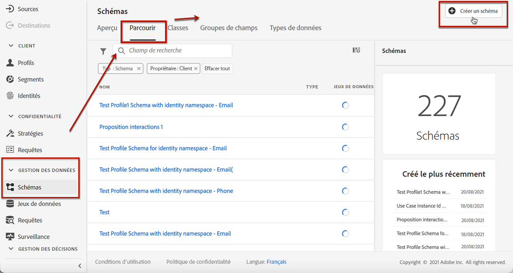
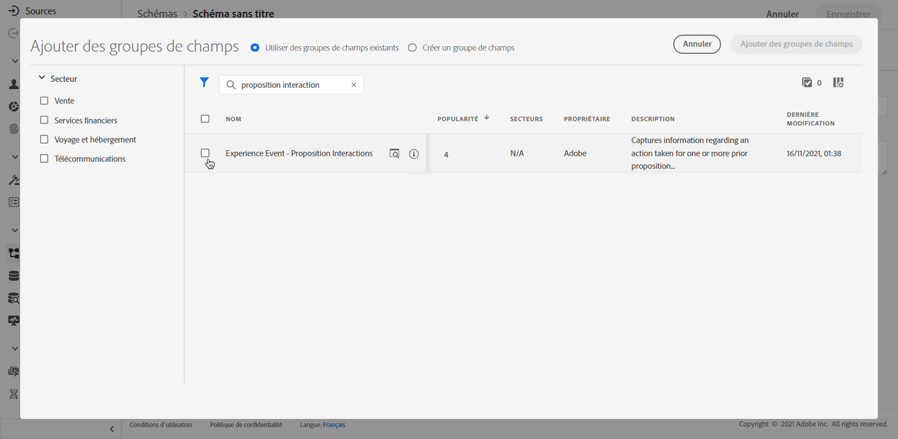
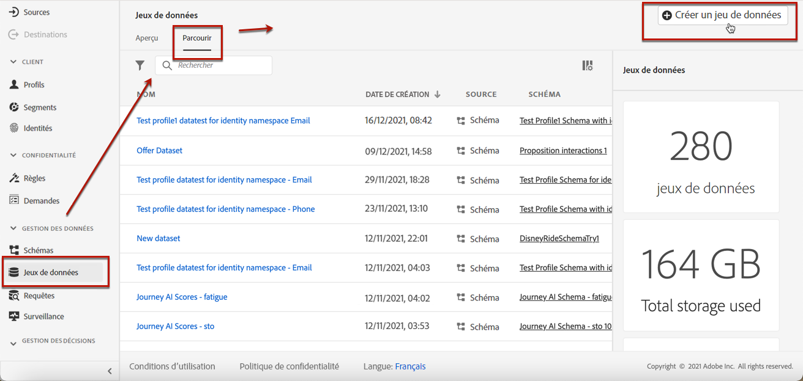
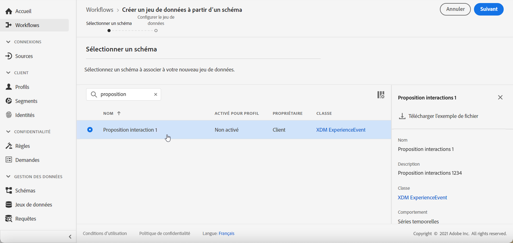

# Création d’un jeu de données pour collecter des événements {#create-dataset}

Avant de créer un modèle d’IA, vous devez créer un jeu de données dans lequel les événements de conversion seront collectés. Commencez par créer le schéma qui sera utilisé dans votre jeu de données :

1. Dans le menu **[!UICONTROL Data Management]**, sélectionnez **[!UICONTROL Schéma]**, accédez à l&#39;onglet **[!UICONTROL Parcourir]** et cliquez sur **[!UICONTROL Créer un schéma]**.

   

1. Sélectionnez **[!UICONTROL XDM ExperienceEvent]**.

   

   >[!NOTE]
   >
   >    Pour en savoir plus sur les schémas et les groupes de champs XDM, consultez la [documentation de présentation du système XDM](https://experienceleague.adobe.com/docs/experience-platform/xdm/home.html?lang=fr).

1. Dans le champ **[!UICONTROL Rechercher]**, saisissez « interaction de proposition » et sélectionnez le groupe de champs **[!UICONTROL Événement d&#39;expérience - Interactions de proposition]**.

   

   >[!CAUTION]
   >
   >    Le schéma qui sera utilisé dans votre jeu de données doit être associé au groupe de champs **[!UICONTROL Événement d&#39;expérience - Interactions de proposition]**. Sinon, vous ne pourrez pas l&#39;utiliser dans votre stratégie de classement.

1. Cliquez sur **[!UICONTROL Ajouter des groupes de champs]**.

   

   >[!NOTE]
   >Le groupe de champs était auparavant appelé « mixin ».

1. Saisissez un nom et enregistrez le schéma.<!--How do you edit the fields in this new schema? Examples?-->

>[!NOTE]
>
>    Pour en savoir plus sur la création de schémas, consultez la section [Principes de base de la composition des schémas](https://experienceleague.adobe.com/docs/experience-platform/xdm/schema/composition.html?lang=fr#understanding-schemas).

Vous êtes maintenant prêt à créer un jeu de données à l&#39;aide de ce schéma. Pour ce faire, procédez comme suit :

1. Dans le menu **[!UICONTROL Data Management]**, sélectionnez **[!UICONTROL Jeux de données]**, accédez à l&#39;onglet **[!UICONTROL Parcourir]** et cliquez sur **[!UICONTROL Créer un jeu de données]**.

   

1. Sélectionnez **[!UICONTROL Créer un jeu de données à partir d&#39;un schéma]**.

   

1. Sélectionnez le schéma que vous venez de créer dans la liste.

   

1. Cliquez sur **[!UICONTROL Suivant]**.

1. Attribuez un nom unique au jeu de données dans le champ **[!UICONTROL Nom]** et cliquez sur **[!UICONTROL Terminer]**.

   

Le jeu de données est maintenant prêt à être sélectionné pour collecter les données dʼévénement lors de la [création dʼune stratégie de classement](#create-ranking-strategy).
