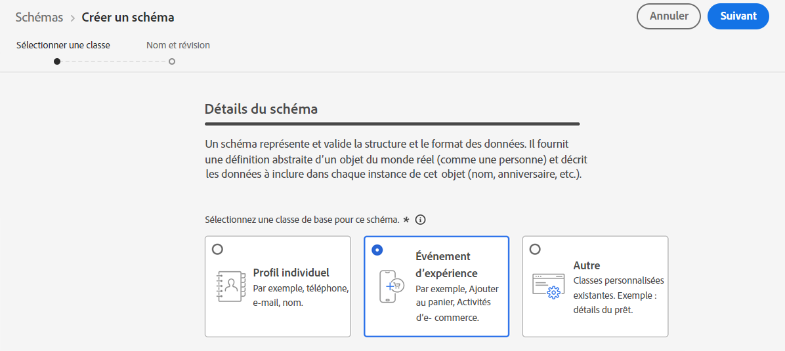
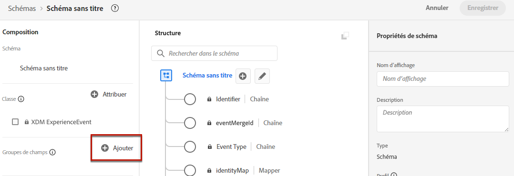
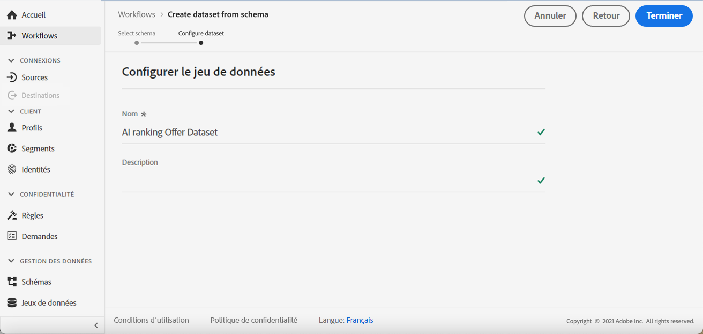

# Création d’un jeu de données pour la collecte d’événements {#create-dataset}

Avant de créer un modèle d’IA, vous devez créer un jeu de données dans lequel les événements de conversion seront collectés. Commencez par créer le schéma qui sera utilisé dans votre jeu de données :

1. Dans la **[!UICONTROL Data Management]** menu, sélectionnez **[!UICONTROL Schema]**, accédez au **[!UICONTROL Browse]** et cliquez sur **[!UICONTROL Create schema]**.

   

1. Choisir **[!UICONTROL XDM ExperienceEvent]**.

   

   >[!NOTE]
   >
   >En savoir plus sur les schémas XDM et les groupes de champs dans la section [Présentation de la documentation du système XDM](https://experienceleague.adobe.com/docs/experience-platform/xdm/home.html?lang=en){target=&quot;_blank&quot;}.

1. Dans la **[!UICONTROL Field groups]** , sélectionnez **[!UICONTROL Add]**.

   

1. Dans le **[!UICONTROL Search]** , saisissez &quot;interaction de proposition&quot; et sélectionnez l’option **[!UICONTROL Experience Event - Proposition Interactions]** groupe de champs.

   

   >[!CAUTION]
   >
   >Le schéma qui sera utilisé dans votre jeu de données doit comporter la variable **[!UICONTROL Experience Event - Proposition Interactions]** groupe de champs qui lui est associé. Sinon, vous ne pourrez pas l’utiliser dans votre stratégie de classement.

1. Cliquez sur **[!UICONTROL Add field groups]**.

   

   >[!NOTE]
   >Le groupe de champs était auparavant appelé mixin.

1. Saisissez un nom et enregistrez le schéma.

>[!NOTE]
>
>En savoir plus sur la création de schémas dans [Principes de base de la composition des schémas](https://experienceleague.adobe.com/docs/experience-platform/xdm/schema/composition.html?lang=en#understanding-schemas){target=&quot;_blank&quot;}.

Vous êtes maintenant prêt à créer un jeu de données à l’aide de ce schéma. Pour ce faire, procédez comme suit :

1. Dans la **[!UICONTROL Data Management]** menu, sélectionnez **[!UICONTROL Datasets]**, accédez au **[!UICONTROL Browse]** et cliquez sur **[!UICONTROL Create dataset]**.

   

1. Sélectionner **[!UICONTROL Create dataset from schema]**.

   

1. Sélectionnez le schéma que vous venez de créer dans la liste.

   

1. Cliquez sur **[!UICONTROL Next]**.

1. Attribuez un nom unique au jeu de données dans la variable **[!UICONTROL Name]** champ et clic **[!UICONTROL Finish]**.

   

Le jeu de données est maintenant prêt à être sélectionné pour collecter des données d’événement lors de la [création d’une stratégie de classement](#create-ranking-strategy).
