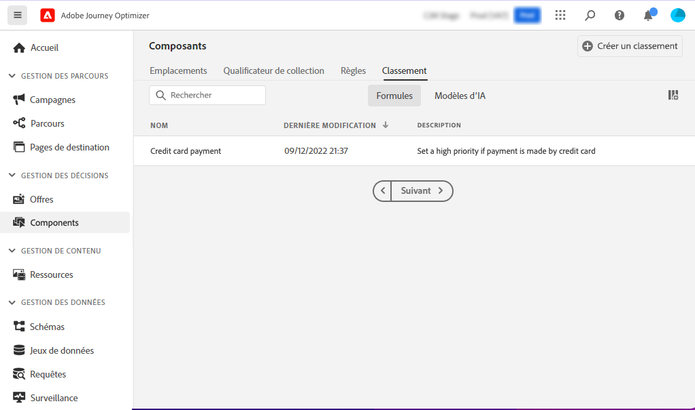
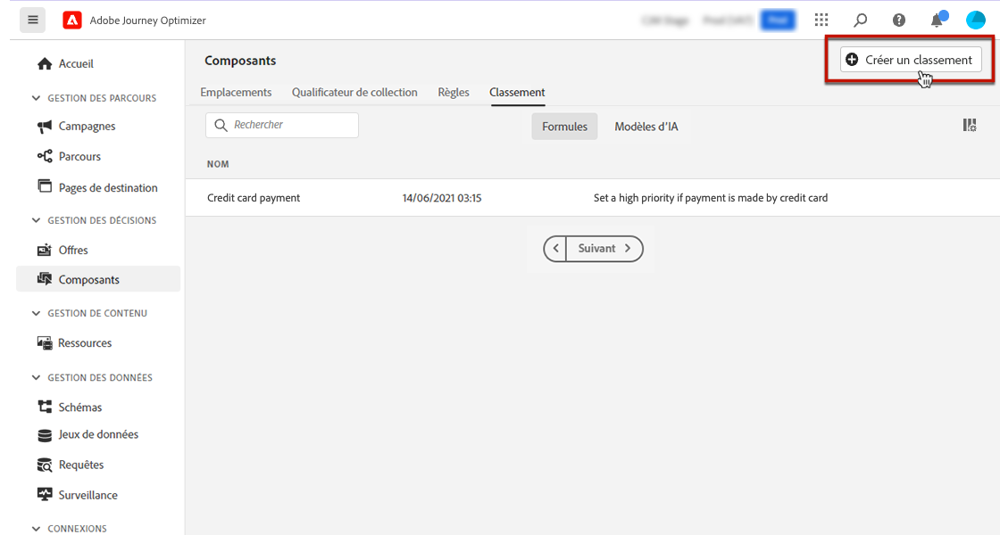
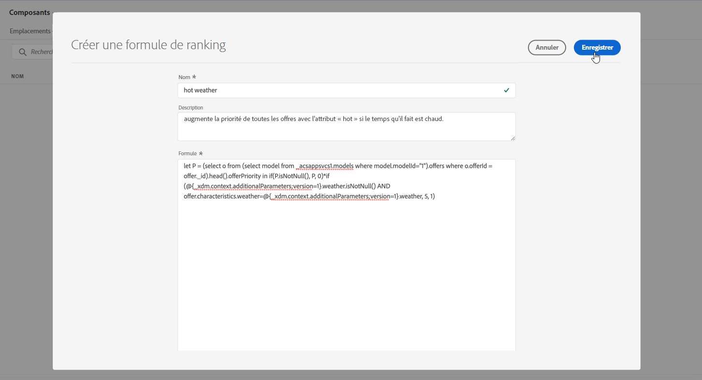
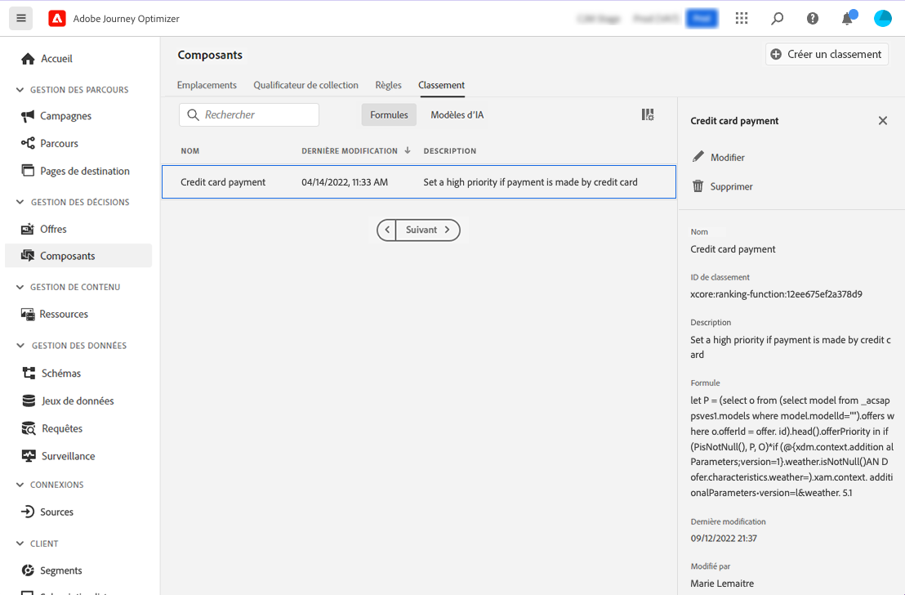
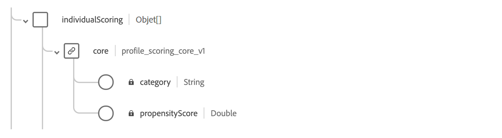

# Formules de classement {#create-ranking-formulas}

## À propos des formules de classement {#about-ranking-formulas}

Les **formules de classement** vous permettent de définir des règles déterminant quelle offre doit être présentée en premier pour un emplacement donné au lieu de prendre en compte les scores de priorité des offres.

Les formules de classement sont exprimées en **syntaxe PQL** et peuvent exploiter les attributs de profil, les données contextuelles et les attributs d&#39;offre. Pour plus d&#39;informations sur l&#39;utilisation de la syntaxe PQL, reportez-vous à la [documentation dédiée](https://experienceleague.adobe.com/docs/experience-platform/segmentation/pql/overview.html?lang=fr).

Après avoir créé une formule de classement, vous pouvez l’affecter à un emplacement dans une décision. Voir à ce propos la section [Configurer la sélection des offres dans les décisions](../offer-activities/configure-offer-selection.md).

## Création d&#39;une formule de classement {#create-ranking-formula}

Pour créer une formule de classement, procédez comme suit :

1. Accédez au menu **[!UICONTROL Composants]**, puis sélectionnez l’onglet **[!UICONTROL Classement]**. L’onglet **[!UICONTROL Formules]** est sélectionné par défaut. La liste des formules créées précédemment s’affiche.

   

1. Cliquez sur **[!UICONTROL Créer un classement]** pour créer une formule de classement.

   

1. Indiquez le nom, la description et la formule de la formule de classement.

   Dans cet exemple, nous voulons augmenter la priorité de toutes les offres contenant l&#39;attribut « chaud » en cas de météo avec températures chaudes. Pour ce faire, **contextData.weather=hot** a été transmis dans l’appel de prise de décisions. [Découvrez comment utiliser les données contextuelles](../context-data.md).

   

   >[!IMPORTANT]
   >
   >Lors de la création d’une formule de classement, la recherche dans une période précédente n’est pas prise en charge. Par exemple, si vous spécifiez un événement d’expérience qui s’est produit au cours du dernier mois en tant que composant de la formule. Toute tentative d’inclusion d’une période de recherche arrière lors de la création d’une formule déclenche une erreur lors de son enregistrement.

1. Cliquez sur **[!UICONTROL Enregistrer]**. Votre formule de classement est créée. Vous pouvez la sélectionner dans la liste pour obtenir des détails et la modifier ou la supprimer.

   Elle est maintenant prête à être utilisée dans une décision pour classer les offres éligibles à un emplacement (voir [Configurer la sélection des offres dans les décisions](../offer-activities/configure-offer-selection.md)).

   

## Exemples de formules de classement {#ranking-formula-examples}

Vous pouvez créer de nombreuses formules de classement différentes en fonction de vos besoins. Voici quelques exemples.

<!--
Boost by offer ID

Boost the priority of an offer with the offer ID *xcore:personalized-offer:13d213cd4cb328ec* by 5.

**Ranking formula:**

```
if( offer._id = "xcore:personalized-offer:13d213cd4cb328ec", offer.rank.priority + 5, offer.rank.priority)
```

Change the offer priority based on a certain profile attribute

Set the offer priority to 30 for offer *xcore:personalized-offer:13d213cd4cb328ec* if the user lives in the city of Bondi.

**Ranking formula:**

```
if( offer._id = "xcore:personalized-offer:13d213cd4cb328ec" and homeAddress.city.equals("Bondi", false), 30, offer.rank.priority)
```

Boost multiple offers by offer ID based on the presence of a profile's audience membership

Boost the priority of offers based on whether the user is a member of a priority audience, which is configured as an attribute in the offer.

**Ranking formula:**

```
if( segmentMembership.get("ups").get(offer.characteristics.get("prioritySegmentId")).status in (["realized","existing"]), offer.rank.priority + 10, offer.rank.priority)
```
-->

### Booster les offres avec un attribut d’offre spécifique basé sur l’attribut de profil

Si le profil réside dans la ville correspondant à l’offre, doublez la priorité de toutes les offres de cette ville.

**Formule de classement:**

```
if( offer.characteristics.get("city") = homeAddress.city, offer.rank.priority * 2, offer.rank.priority)
```

### Booster les offres pour lesquelles la date de fin est inférieure à 24 heures

**Formule de classement:**

```
if( offer.selectionConstraint.endDate occurs <= 24 hours after now, offer.rank.priority * 3, offer.rank.priority)
```

### Booster les offres en fonction de la propension des clients à acheter le produit proposé

Vous pouvez augmenter le score d’une offre en fonction d’un score de propension du client.

Dans cet exemple, le client d’instance est *_salesvelocity* et le schéma de profil contient une plage de scores stockés dans un tableau :



Ainsi, pour un profil tel que :

```
{"_salesvelocity": {"individualScoring": [
                    {"core": {
                            "category":"insurance",
                            "propensityScore": 96.9
                        }},
                    {"core": {
                            "category":"personalLoan",
                            "propensityScore": 45.3
                        }},
                    {"core": {
                            "category":"creditCard",
                            "propensityScore": 78.1
                        }}
                    ]}
}
```

### Booster les offres basées sur des données contextuelles {#context-data}

[!DNL Journey Optimizer] permet de booster certaines offres en fonction des données contextuelles transmises dans l’appel. Par exemple, si la valeur `contextData.weather=hot` est transmise, la priorité de toutes les offres avec la valeur `attribute=hot` doit être boostée. Des informations détaillées sur la manière de transmettre des données contextuelles à l’aide des API **Edge Decisioning** et **Decisioning** sont disponibles dans [cette section](../context-data.md).

Notez que lorsque vous utilisez l’API **Decisioning**, les données contextuelles sont ajoutées à l’élément de profil dans le corps de la requête, comme dans l’exemple ci-dessous.

```
"xdm:profiles": [
{
    "xdm:identityMap": {
        "crmid": [
            {
            "xdm:id": "CRMID1"
            }
        ]
    },
    "xdm:contextData": [
        {
            "@type":"_xdm.context.additionalParameters;version=1",
            "xdm:data":{
                "xdm:weather":"hot"
            }
        }
    ]
    
}],
```

Voici des exemples illustrant comment utiliser les données contextuelles dans les formules de classement pour booster la priorité des offres. Développez chaque section pour obtenir des détails sur la syntaxe de la formule de classement.

>[!NOTE]
>
>Dans les exemples de l’API Edge Decisioning, remplacez `<OrgID>` par votre ID de client d’organisation.

+++Augmentez la priorité de l’offre de 10 si le canal des données contextuelles correspond au canal de préférence du client ou de la cliente.

>[!BEGINTABS]

>[!TAB API Decisioning]

`if (@{_xdm.context.additionalParameters;version=1}.channel.isNotNull() and @{_xdm.context.additionalParameters;version=1}.channel.equals(_abcMobile.preferredChannel), offer.rank.priority + 10, offer.rank.priority)`

>[!TAB API Edge Decisioning]

`if (xEvent.<OrgID>.channel.isNotNull() and xEvent.<OrgID>.channel.equals(_abcMobile.preferredChannel), offer.rank.priority + 10, offer.rank.priority)`

>[!ENDTABS]

+++

+++Augmentez la priorité de toutes les offres avec « attribute=hot » si « contextData.weather=hot » est transmis dans l’appel.

>[!BEGINTABS]

>[!TAB API Decisioning]

`if (@{_xdm.context.additionalParameters;version=1}.weather.isNotNull() and offer.characteristics.get("weather")=@{_xdm.context.additionalParameters;version=1}.weather, offer.rank.priority + 5, offer.rank.priority)`

>[!TAB API Edge Decisioning]

`if (xEvent.<OrgID>.weather.isNotNull() and offer.characteristics.get("weather")=xEvent.<OrgID>.weather, offer.rank.priority + 5, offer.rank.priority)`

>[!ENDTABS]

+++

+++Amélioration de l’origine du contenu

>[!BEGINTABS]

>[!TAB API Decisioning]

`if (@{_xdm.context.additionalParameters;version=1}.contentorigin.isNotNull() and offer.characteristics.contentorigin=@{_xdm.context.additionalParameters;version=1}.contentorigin, offer.rank.priority * 100, offer.rank.priority)`

>[!TAB API Edge Decisioning]

`if (xEvent.<OrgID>.contentorigin.isNotNull() and offer.characteristics.contentorigin=xEvent.<OrgID>.contentorigin, offer.rank.priority * 100, offer.rank.priority)`

>[!ENDTABS]

+++

+++Amélioration de la météo

>[!BEGINTABS]

>[!TAB API Decisioning]

`if (@{_xdm.context.additionalParameters;version=1}.weather.isNotNull() and offer.characteristics.weather=@{_xdm.context.additionalParameters;version=1}.weather, offer.rank.priority * offer.characteristics.scoringBoost, offer.rank.priority)`

>[!TAB API Edge Decisioning]

`if (xEvent.<OrgID>.weather.isNotNull() and offer.characteristics.weather=xEvent.<OrgID>.weather, offer.rank.priority * offer.characteristics.scoringBoost, offer.rank.priority)`

>[!ENDTABS]

+++
