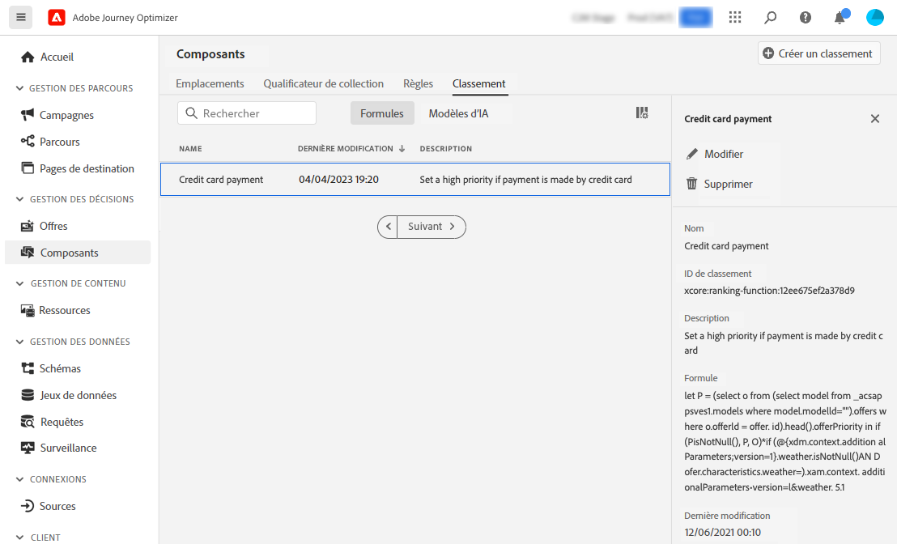

# Formules de classement {#create-ranking-formulas}

## A propos des formules de classement {#about-ranking-formulas}

**Formules de classement** vous permettent de définir des règles qui déterminent quelle offre doit être présentée en premier pour un emplacement donné, plutôt que de prendre en compte les scores de priorité des offres.

Les formules de classement sont exprimées dans **Syntaxe PQL** et peuvent exploiter les attributs de profil, les données contextuelles et les attributs d’offre. Pour plus d’informations sur l’utilisation de la syntaxe PQL, reportez-vous à la section [documentation dédiée](https://experienceleague.adobe.com/docs/experience-platform/segmentation/pql/overview.html).

Une fois qu’une formule de classement a été créée, vous pouvez l’affecter à un emplacement dans une décision. Voir à ce propos la section [Configuration de la sélection des offres dans les décisions](../offer-activities/configure-offer-selection.md).

## Créer une formule de classement {#create-ranking-formula}

Pour créer une formule de classement, procédez comme suit :

1. Accédez au **[!UICONTROL Components]** , puis sélectionnez **[!UICONTROL Rankings]** . La liste des classements précédemment créés s’affiche.

   

1. Cliquez sur **[!UICONTROL Create ranking]** pour créer une formule de classement.

   

1. Indiquez le nom, la description et la formule de la formule de classement.

   Dans cet exemple, nous voulons augmenter la priorité de toutes les offres avec l&#39;attribut &quot;hot&quot; si le temps réel est chaud. Pour ce faire, la variable **contextData.weather=hot** a été transmis dans l’appel de prise de décision.

   

1. Cliquez sur **[!UICONTROL Save]**. Votre formule de classement est créée. Vous pouvez la sélectionner dans la liste pour obtenir des détails et la modifier ou la supprimer.

   Il est maintenant prêt à être utilisé dans une décision pour classer les offres éligibles pour un emplacement (voir [Configuration de la sélection des offres dans les décisions](../offer-activities/configure-offer-selection.md)).

   

## Exemples de formules de classement {#ranking-formula-examples}

Vous pouvez créer de nombreuses formules de classement différentes en fonction de vos besoins. Voici quelques exemples.

<!--
Boost by offer ID

Boost the priority of an offer with the offer ID *xcore:personalized-offer:13d213cd4cb328ec* by 5.

**Ranking formula:**

```
if( offer._id = "xcore:personalized-offer:13d213cd4cb328ec", offer.rank.priority + 5, offer.rank.priority)
```

Change the offer priority based on a certain profile attribute

Set the offer priority to 30 for offer *xcore:personalized-offer:13d213cd4cb328ec* if the user lives in the city of Bondi.

**Ranking formula:**

```
if( offer._id = "xcore:personalized-offer:13d213cd4cb328ec" and homeAddress.city.equals("Bondi", false), 30, offer.rank.priority)
```

Boost multiple offers by offer ID based on the presence of a profile's segment membership

Boost the priority of offers based on whether the user is a member of a priority segment, which is configured as an attribute in the offer.

**Ranking formula:**

```
if( segmentMembership.get("ups").get(offer.characteristics.prioritySegmentId).status in (["realized","existing"]), offer.rank.priority + 10, offer.rank.priority)
```
-->

### Offres optimisées avec un attribut d’offre spécifique basé sur l’attribut de profil

Si le profil réside dans la ville correspondant à l’offre, double la priorité de toutes les offres de cette ville.

**Formule de classement :**

```
if( offer.characteristics.city = homeAddress.city, offer.rank.priority * 2, offer.rank.priority)
```

### Offres optimisées pour lesquelles la date de fin est inférieure à 24 heures

**Formule de classement :**

```
if( offer.selectionConstraint.endDate occurs <= 24 hours after now, offer.rank.priority * 3, offer.rank.priority)
```

### Offres optimisées avec un attribut d’offre spécifique basé sur les données contextuelles

Augmentez certaines offres en fonction des données contextuelles transmises dans l’appel de prise de décision. Par exemple, si la variable `contextData.weather=hot` est transmis dans l’appel de prise de décision, la priorité de toutes les offres avec `attribute=hot` doit être relancé.

**Formule de classement :**

```
if (@{_xdm.context.additionalParameters;version=1}.weather.isNotNull()
and offer.characteristics.weather=@{_xdm.context.additionalParameters;version=1}.weather, offer.rank.priority + 5, offer.rank.priority)
```

Notez que lorsque vous utilisez l’API de prise de décision, les données contextuelles sont ajoutées à l’élément de profil dans le corps de la requête, comme dans l’exemple ci-dessous.

**Extrait de code du corps de la requête :**

```
"xdm:profiles": [
{
    "xdm:identityMap": {
        "crmid": [
            {
            "xdm:id": "CRMID1"
            }
        ]
    },
    "xdm:contextData": [
        {
            "@type":"_xdm.context.additionalParameters;version=1",
            "xdm:data":{
                "xdm:weather":"hot"
            }
        }
    ]
 }],
```

### Offrir plus d’offres en fonction de la propension des clients à acheter le produit proposé

Vous pouvez augmenter le score d’une offre en fonction du score de propension d’un client.

Dans cet exemple, le client d’instance est *_salesvelocity* et le schéma de profil contient une plage de scores stockés dans un tableau :


Ainsi, pour un profil tel que :

```
{"_salesvelocity": {"individualScoring": [
                    {"core": {
                            "category":"insurance",
                            "propensityScore": 96.9
                        }},
                    {"core": {
                            "category":"personalLoan",
                            "propensityScore": 45.3
                        }},
                    {"core": {
                            "category":"creditCard",
                            "propensityScore": 78.1
                        }}
                    ]}
}
```

Les offres contiennent un attribut pour *propensionType* qui correspond à la catégorie des scores :


Votre formule de classement peut alors définir la priorité de chaque offre pour qu’elle soit égale aux clients. *propensionScore* pour cela *propensionType*. Si aucun score n’est trouvé, utilisez la priorité statique définie sur l’offre :

```
let score = (select _Individual_Scoring1 from _salesvelocity.individualScoring
             where _Individual_Scoring1.core.category.equals(offer.characteristics.propensityType, false)).head().core.propensityScore
in if(score.isNotNull(), score, offer.rank.priority)
```
