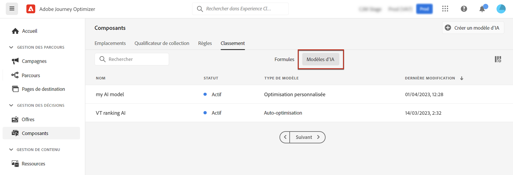
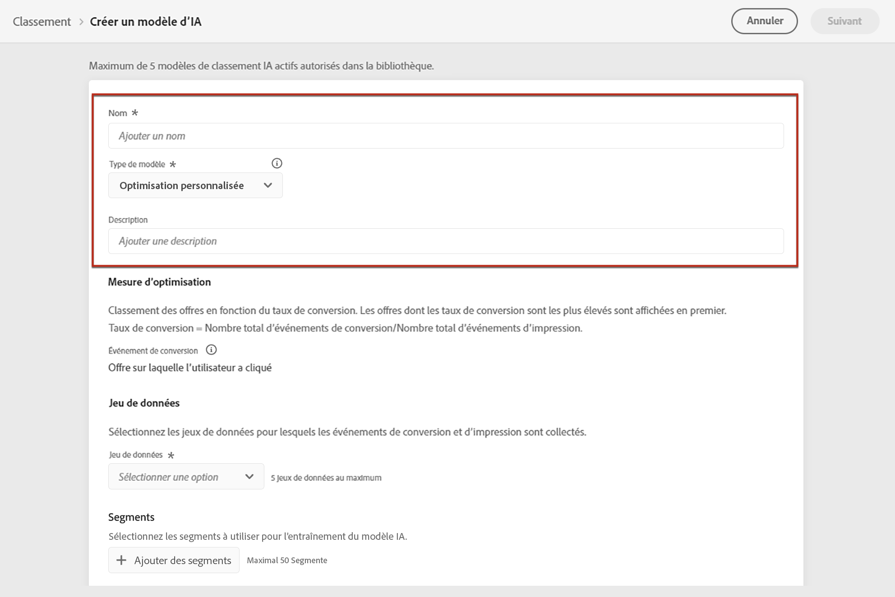
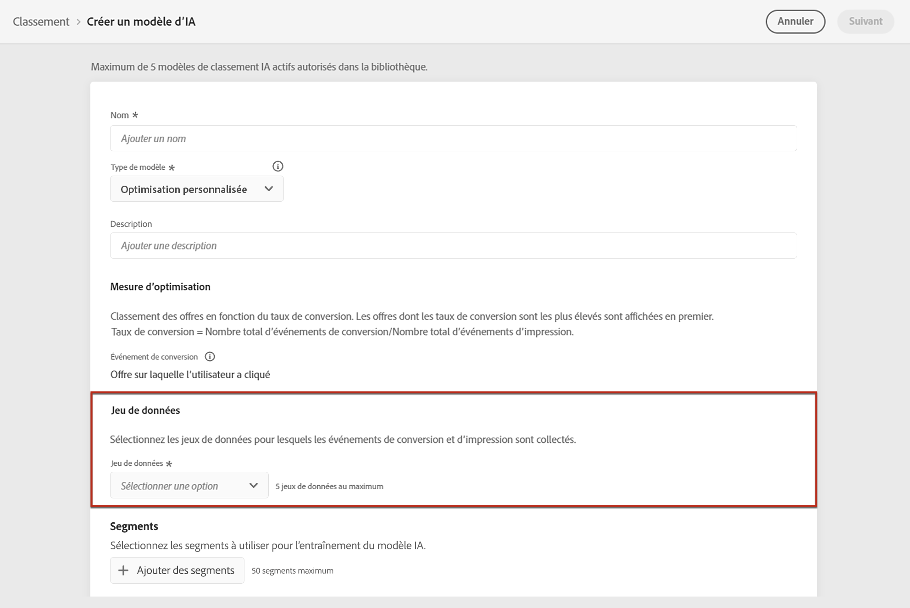
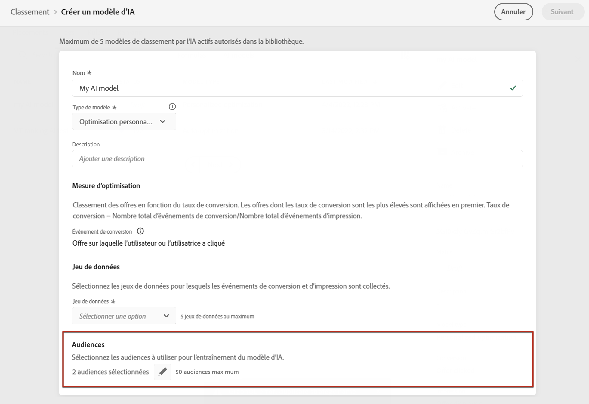
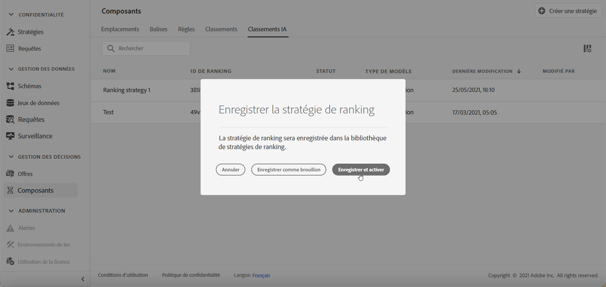

# Création de modèles d’IA {#ai-rankings}

>[!TIP]
>
>La prise de décision, la nouvelle fonctionnalité de prise de décision d’[!DNL Adobe Journey Optimizer], est désormais disponible via les canaux d’expérience basée sur du code et d’e-mail. [En savoir plus](../../experience-decisioning/gs-experience-decisioning.md)

[!DNL Journey Optimizer] permet de créer des **modèles &#39;’IA** pour classer les offres en fonction des objectifs de votre entreprise.

>[!CAUTION]
>
>Pour créer, modifier ou supprimer des modèles d&#39;IA, vous devez disposer de la permission **Gestion des stratégies de classement**. [En savoir plus](../../administration/high-low-permissions.md#manage-ranking-strategies)

## Créer un modèle d’IA {#create-ranking-strategy}

>[!CONTEXTUALHELP]
>id="ajo_decisioning_ai_model_metric"
>title="Mesure d’optimisation"
>abstract="Offres de classement de [!DNL Journey Optimizer] en fonction du **taux de conversion** (Taux de conversion = Nombre total d’événements de conversion/Nombre total d’événements d’impression). Le taux de conversion est calculé à l’aide de deux types de mesures : les **Événements d’impression** (offres affichées) et les **Événements de conversion** (offres qui génèrent des clics via e-mail ou web). Ces événements sont automatiquement capturés à l’aide du SDK web ou du SDK mobile fourni."

Pour créer un modèle d’IA, procédez comme suit :

1. Créez un jeu de données dans lequel les événements de conversion seront collectés. [Voici comment procéder.](../data-collection/create-dataset.md)

1. Dans le menu **[!UICONTROL Composants]**, accédez à l’onglet **[!UICONTROL Classement]**, puis sélectionnez **[!UICONTROL Modèles d’IA]**.

   

   Tous les modèles d’IA créés jusqu’à présent y sont répertoriés.

1. Cliquez sur le bouton **[!UICONTROL Créer un modèle d’IA]**.

1. Indiquez un nom unique et une description pour le modèle d’IA, puis sélectionnez le type de modèle d’IA à créer :

   * L’option **[!UICONTROL Optimisation automatique]** optimise les offres en fonction des performances des offres antérieures. [En savoir plus](auto-optimization-model.md)
   * L’**[!UICONTROL optimisation personnalisée]** optimise et personnalise les offres en fonction des audiences et des performances des offres. [En savoir plus](personalized-optimization-model.md)

   

   >[!NOTE]
   >
   >La section **[!UICONTROL Mesure d’optimisation]** fournit des informations sur l’événement de conversion utilisé par le modèle d’IA pour calculer le classement des offres.
   >
   >Offres de classement de [!DNL Journey Optimizer] en fonction du **taux de conversion** (Taux de conversion = Nombre total d’événements de conversion/Nombre total d’événements d’impression). Le taux de conversion est calculé à l’aide de deux types de mesures :
   >* Les **événements d’impression** (les offres qui sont affichées).
   >* Les **événements de conversion** (les offres qui génèrent des clics par e-mail ou sur le Web).
   >
   >Ces événements sont automatiquement capturés à l’aide du SDK Web ou du SDK Mobile fourni. Pour en savoir plus à ce sujet, consultez la [vue d’ensemble du SDK Web Adobe Experience Platform](https://experienceleague.adobe.com/fr/docs/experience-platform/collection/home).

1. Sélectionnez le ou les jeux de données dans lesquels les événements de conversion et d’impression sont collectés. Découvrez comment créer un jeu de données dans [cette section](../data-collection/create-dataset.md). <!--This dataset needs to be associated with a schema that must have the **[!UICONTROL Proposition Interactions]** field group (previously known as mixin) associated with it.-->

   

   >[!CAUTION]
   >
   >Seuls les jeux de données créés à partir de schémas associés au groupe de champs **[!UICONTROL Événement d’expérience - Interactions avec les propositions]** (précédemment appelé « mixin ») s’affichent dans la liste déroulante.

1. Si vous créez un modèle d’IA **[!UICONTROL Optimisation personnalisée]**, sélectionnez le ou les segments à utiliser pour entraîner le modèle d’IA.

   ➡️ [Découvrez cette fonctionnalité en vidéo](#video)

   

   >[!NOTE]
   >
   >Vous pouvez sélectionner jusqu’à 5 audiences.

1. Enregistrez et activez le modèle d’IA.

   

<!--
At this point, you must have:

* created the AI model,
* defined which type of event you want to capture - offer displayed (impression) and/or offer clicked (conversion),
* and in which dataset you want to collect the event data.
-->

Désormais, chaque fois quʼune offre est présentée et/ou qu’un utilisateur ou une utilisatrice clique dessus, vous souhaitez que lʼévénement correspondant soit automatiquement capturé par le groupe de champs **[!UICONTROL Événement dʼexpérience - Interactions avec les propositions]** à lʼaide du [SDK Web Adobe Experience Platform](https://experienceleague.adobe.com/docs/experience-platform/edge/web-sdk-faq.html?lang=fr#what-is-adobe-experience-platform-web-sdk%3F){target="_blank"} ou du SDK mobile.

Pour envoyer des types d’événement (offre affichée ou offre ayant fait l’objet d’un clic), vous devez définir la valeur correcte pour chaque type d’événement dans un événement d’expérience qui est envoyé dans Adobe Experience Platform. [Voici comment procéder](../data-collection/schema-requirement.md)

## Vidéo pratique {#video}

Découvrez comment créer un modèle d’optimisation personnalisé et comment l’appliquer à une décision.

>[!VIDEO](https://video.tv.adobe.com/v/3419954?quality=12)
