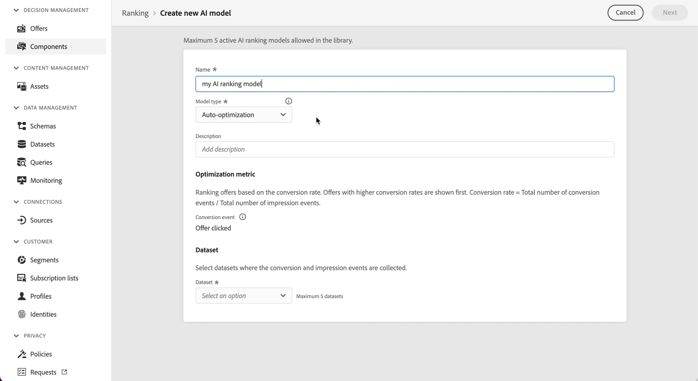

# Modèle d’optimisation personnalisé {#personalized-optimization-model}

>[!TIP]
>
>La prise de décision, la nouvelle fonctionnalité de prise de décision d’[!DNL Adobe Journey Optimizer], est désormais disponible via les canaux d’expérience basée sur du code et d’e-mail. [En savoir plus sur la prise de décision](../../experience-decisioning/gs-experience-decisioning.md)

En tirant parti des technologies de pointe en matière de machine learning et de deep learning supervisés, l’optimisation personnalisée permet à un utilisateur professionnel (marketeur) de définir des objectifs commerciaux et d’utiliser ses données client pour entraîner des modèles orientés métier afin de diffuser des offres personnalisées et d’optimiser les KPI.

Contrairement au classement non personnalisé qui s’optimise en fonction des performances globales de chaque offre, l’optimisation personnalisée apprend la relation entre les attributs d’un client individuel et les offres les plus susceptibles d’orienter l’indicateur de performance clé choisi pour ce client. Le résultat est une sélection d’offres adaptée à chaque profil plutôt qu’une seule meilleure offre proposée à tout le monde.

## Cas d’utilisation et avantages {#use-cases}

L’optimisation personnalisée est bien adaptée aux scénarios de prise de décision dans lesquels différents clients réagissent différemment aux offres disponibles et où le catalogue d’offres est significativement différencié et ne change pas souvent. Les cas d’utilisation courants incluent :

* **Sélection de la meilleure offre suivante** : choix de l’une des offres ou promotions concurrentes à présenter à chaque client en temps réel.
* **Personnalisation du contenu** : choix du contenu (par exemple, bannière, contenu créatif) ou du message de chaque client sur le web, les appareils mobiles, les e-mails et d’autres canaux.
* **Personnalisation tenant compte de l’audience** : intégration de l’appartenance à l’audience et de signaux contextuels afin que les recommandations reflètent qui est le client et le contexte de l’interaction.
* **Optimisation des recettes et des valeurs** : optimisation vers des résultats continus tels que les recettes ou la valeur de durée de vie du client, en plus des résultats binaires tels que les clics et les conversions.

Principaux avantages :

* Optimise les KPI commerciaux que vous sélectionnez en diffusant l’offre à laquelle chaque client est le plus susceptible de répondre, plutôt qu’une seule offre optimale au niveau mondial.
* S’adapte en permanence à mesure que de nouvelles données d’interaction arrivent, équilibrant l’exploration d’offres sous-testées par l’exploitation d’intervenants éprouvés.
* Prend en charge les mesures d’optimisation binaires et continues, avec des scores de classement qui peuvent être utilisés directement dans les expressions du créateur de formules du modèle d’IA.
* Réduit l’effort manuel des tests A/B et de la création de règles en apprenant automatiquement l’adéquation de l’offre au client.

## Exigences relatives aux jeux de données {#dataset}

Pour entraîner un modèle d’optimisation personnalisé, le jeu de données doit comporter au moins deux offres avec au moins 250 événements d’affichage (par exemple, des impressions) et un événement de succès (par exemple, un clic ou une conversion) au cours des 30 derniers jours.

Les offres comportant moins de 250 événements d’affichage et/ou aucun événement de succès au cours des 30 derniers jours peuvent toujours être incluses dans le trafic d’exploration. Elles pourront également être incluses dans le trafic de personnalisation, mais seront traitées comme équivalentes à l’offre prédite de pire score dans la prise de décision, jusqu’à ce qu’elles répondent aux événements d’affichage/de succès minimaux requis et que le modèle soit recyclé.

Jusqu’au premier entraînement d’un modèle d’optimisation personnalisé, les offres d’une stratégie de sélection utilisant un modèle d’optimisation personnalisé sont diffusées de manière aléatoire.

## Fonctionnement {#how}

Le modèle apprend les interactions de fonctionnalités complexes entre les offres, les informations des utilisateurs et utilisatrices, ainsi que les informations contextuelles afin de recommander des offres personnalisées aux utilisateurs et utilisatrices finaux/finales. Les fonctionnalités sont des entrées dans le modèle.

Il existe trois types de fonctionnalités :

| Types de fonctionnalités | Comment ajouter des fonctionnalités aux modèles |
|--------------|----------------------------|
| Objets de prise de décision (placementID, activityID, decisionScopeID) | Partie des événements d’expérience des commentaires sur la gestion des décisions envoyés à AEP |
| Audiences | Il est possible d’ajouter de 0 à 50 audiences en tant que fonctionnalités lors de la création du modèle d’IA dédiée au classement |
| Données contextuelles | Partie des événements d’expérience des commentaires sur la prise de décisions envoyés à AEP. Données contextuelles disponibles à ajouter au schéma : Détails du commerce, Détails du canal, Détails de l’application, Détails web, Détails de l’environnement, Détails de l’appareil, placeContext |

Le modèle comporte deux phases :

* Dans la phase d’**entraînement de modèle hors ligne**, un modèle est entraîné en apprenant et en mémorisant les interactions de fonctionnalités dans les données historiques.
* Dans la phase **inférence en ligne**, les offres candidates sont classées en fonction des scores en temps réel générés par le modèle. Contrairement aux techniques de filtrage collaboratif traditionnelles, avec lesquelles il est difficile d’inclure des fonctionnalités pour les utilisateurs et les offres, l’optimisation personnalisée est une méthode de recommandation basée sur le deep learning, qui permet d’inclure et d’apprendre des modèles d’interaction de fonctionnalités complexes et non linéaires.

Le modèle prend en charge l’optimisation des variables continues (telles que le chiffre d’affaires et la valeur de durée de vie du client) en plus des variables binaires (telles que les clics et les conversions). Les valeurs prévues pour une mesure binaire telle que les clics seront toujours comprises entre 0 et 1. Les valeurs prévues pour une mesure continue telle que la valeur de commande seront toujours un nombre supérieur ou égal à zéro. Les scores de classement sont normalisés afin de garantir un comportement cohérent sur les deux types de mesures lorsqu’ils sont utilisés dans des formules ou des comparaisons.

## Exemple {#illustrative-example}

### Réponse binaire (conversion) {#binary-response}

Envisagez un jeu de données simplifié d’interactions historiques entre les utilisateurs et les offres. Chaque ligne enregistre une offre qui a été affichée, deux signaux client — niveau de fidélité (élevé = 1) et si le client a ouvert un e-mail récent (oui = 1) — et si le client a converti (oui = 1).

Pour l’offre A, la conversion est plus probable lorsque les deux signaux sont d’accord (élevé ou faible). Pour l’offre B, la conversion est plus probable à l’ouverture de l’e-mail, quel que soit le niveau de fidélité. En fonction du modèle appris, le modèle peut prédire la meilleure offre pour chaque client en fonction de ses signaux.

*Figure 1 : dans la ligne de non-correspondance mise en surbrillance, l’offre A était affichée lorsque les signaux n’étaient pas d’accord et n’étaient pas convertis. En fonction du modèle appris, l’offre B serait la meilleure recommandation pour ce client la prochaine fois.*

C’est l’essence de l’approche : apprendre et mémoriser les interactions des caractéristiques historiques et les appliquer pour générer des prédictions personnalisées pour chaque client.

### Réponse continue (chiffre d’affaires) {#continuous-response}

La même idée s&#39;étend aux résultats continus. Au lieu de prédire si un client effectue une conversion, le modèle prédit une valeur continue (chiffre d’affaires attendu) pour chaque offre et segment client et classe les offres en fonction de cette valeur prédite.

*Figure 2 : chiffre d’affaires prévu pour deux offres sur quatre segments de clients. Pour les clients et clientes hautement fidèles qui ont ouvert l’e-mail, l’offre A est censée générer le plus de chiffre d’affaires ; pour les clients et clientes peu fidèles qui ont ouvert l’e-mail, l’offre B est le choix le plus important. Le modèle sélectionne l’offre avec la valeur prédite la plus élevée pour chaque segment plutôt que d’appliquer une règle à tous les clients.*

## Composants de modèle d’ensemble {#ensemble}

L’optimisation personnalisée est fournie sous la forme d’un modèle d’ensemble : plusieurs bras de modèle complémentaires s’exécutent ensemble, et une couche de supervision décide de la quantité de trafic réel que chaque bras reçoit. Cette conception permet au système de poursuivre deux objectifs à la fois : apprendre quelles offres sont les plus performantes (exploration) et servir les offres déjà connues pour être performantes (exploitation).

**Trouver le juste équilibre entre exploration et exploitation**

Chaque système de prise de décision est confronté à un compromis entre l&#39;exploration des offres sous-testées pour collecter des informations et l&#39;exploitation des offres éprouvées pour maximiser le retour immédiat. Le fait de réserver trop peu de trafic pour l’exploration ne permet pas de découvrir des offres à fort potentiel ; le fait de réserver trop de sacrifices augmente les offres déjà performantes. L&#39;ensemble gère cet équilibre automatiquement en maintenant un plancher d&#39;exploration minimal tout en déplaçant le trafic restant vers les bras personnalisés les plus performants au fil du temps.

L&#39;ensemble est composé de quatre armes de circulation :

### Aléatoire uniforme (bras d&#39;exploration) {#uniform-random}

Le bras aléatoire uniforme attribue des offres aux clients de manière aléatoire parmi les offres éligibles. Comme il ne favorise aucune offre, il produit des données impartiales sur la façon dont les clients réagissent dans l&#39;ensemble du catalogue - la matière première à partir de laquelle les bras personnalisés apprennent. Il s’agit du seul bras actif avant l’entraînement du premier modèle, puis il continue à contenir un plancher d’exploration minimal afin que le système continue à apprendre.

* À l’initialisation : 100 % du trafic.
* Après la première exécution réussie de l’apprentissage : un minimum de 5 à 20 % du trafic en fonction du nombre d’événements d’impression et de conversion observés par offre, jusqu’à un maximum de 85 %.

### Réseau neuronal (bras personnalisé) {#neural-network}

Le réseau de neurones est un bras personnalisé qui prédit la meilleure offre pour un client donné en fonction de ses attributs et des appartenances à l’audience. Il apprend les interactions complexes et non linéaires entre les offres, les fonctionnalités du client et le contexte et est bien adapté à la capture de modèles subtils sur de nombreuses fonctionnalités.

* À l’initialisation : 0 % du trafic.
* Après la première exécution d’entraînement réussie : un minimum de 5 % du trafic, jusqu’à un maximum de 85 %.

### Bandit contextuel (bras personnalisé) {#contextual-bandit}

Le bandit contextuel est un second bras personnalisé qui prédit également la meilleure offre pour chaque client en fonction de ses adhésions à l’audience, à l’aide d’une approche de bandit qui équilibre continuellement l’apprentissage et la performance au fur et à mesure qu’elle est diffusée. Le faire fonctionner avec le réseau neuronal permet à l&#39;ensemble de tirer parti des forces de deux méthodes personnalisées distinctes.

* À l’initialisation : 0 % du trafic.
* Après la première exécution d’entraînement réussie : un minimum de 5 % du trafic, jusqu’à un maximum de 85 %.

### Nouveau booster d&#39;offre (bras non personnalisé) {#new-offer-booster}

Le nouveau booster d’offre est un bandit d’échantillonnage de Thompson gagnant global (non personnalisé) qui émet des hypothèses optimistes sur les performances des nouvelles offres, c’est-à-dire celles qui comportent peu d’événements d’impression enregistrés au cours de la période de recherche en amont du modèle. Cela donne aux nouvelles offres prometteuses l’exposition précoce dont elles ont besoin pour faire leurs preuves, en comblant une lacune connue de démarrage à froid dans laquelle le modèle avait sinon du mal à diriger suffisamment de trafic vers des offres nouvelles ou hautement performantes mais éligibles de manière restrictive.

* À mesure que les données réelles d’impression et de conversion sont collectées, les performances estimées de chaque offre se rapprochent rapidement de leurs performances réelles sous-jacentes et l’impact des hypothèses optimistes chute à près de zéro.
* Lorsqu’aucune offre n’est relativement nouvelle (par exemple, lorsque toutes les offres ont un nombre d’impressions similaire ou ont toutes plus de 1 000 impressions), l’effet optimiste est proche de zéro et ce bras se comporte, en fait, comme un modèle gagnant-gagnant global non personnalisé.
* À l’initialisation : 0 % du trafic.
* Après la première exécution d’entraînement réussie : 5 % du trafic.

### La manière dont le trafic est réparti entre les bras {#traffic-allocation}

À l’initialisation, aucun modèle ne s’est encore entraîné, de sorte que 100 % du trafic va à la ligne de base aléatoire uniforme, le seul bras avec une distribution apprise à partir de laquelle effectuer un échantillonnage. Après la première exécution d&#39;entraînement réussie, chaque bras reçoit un plancher de trafic minimal (5 %), et le bandit de supervision alloue le trafic restant en fonction des performances observées. Au fur et à mesure que le modèle s&#39;entraîne à travers des rondes successives, le trafic converge vers les bras les plus performants avec une affectation maximale possible de 85% du trafic.

*Figure 3 : Une trajectoire possible de répartition du trafic entre les quatre bras d’ensemble à l’initialisation et entre les cycles d’entraînement successifs. À l&#39;initialisation, tout le trafic circule vers la ligne de base aléatoire. Après chaque exécution d’entraînement, le bandit d’échantillonnage de Thompson superviseur déplace l’allocation vers des bras plus performants, tout en maintenant un trafic minimum de 5 %. L’allocation réelle varie en fonction des performances observées du bras.*

## Principales hypothèses et limites du modèle {#key}

Afin de tirer pleinement parti de l’utilisation de l’optimisation personnalisée, il existe certaines hypothèses et limites clés à connaître.

* **Les offres sont suffisamment différentes pour que les utilisateurs aient des préférences différentes parmi les offres prises en compte**. Si les offres sont trop similaires, le modèle obtenu a moins d’impact, car les réponses semblent aléatoires.Par exemple, si une banque propose deux offres de cartes de crédit dont la seule différence est la couleur, la carte recommandée n’a pas d’importance. Cependant, si chaque carte comporte des conditions différentes, cela explique pourquoi certains clients en choisissent une et fournit suffisamment de différence entre les offres pour créer un modèle plus performant.
* **La composition du trafic utilisateur est stable**. Si la composition du trafic utilisateur change considérablement au cours de l’entraînement et de la prédiction du modèle, les performances de ce dernier peuvent se dégrader. Supposons, par exemple, que, lors de la phase d’entraînement du modèle, seules les données pour les utilisateurs et utilisatrices de l’audience A soient disponibles, mais que le modèle entraîné soit utilisé pour générer des prédictions pour les utilisateurs et utilisatrices de l’audience B, les performances du modèle pourraient alors être affectées.
* **Les performances des offres ne changent pas considérablement sur une courte période** lorsque ce modèle est mis à jour chaque semaine et que les modifications apportées aux performances sont répercutées lors des mises à jour du modèle. Par exemple, un produit était très populaire auparavant, mais un rapport public identifie le produit comme nocif pour notre santé, et ce produit devient impopulaire extrêmement rapidement. Dans ce scénario, le modèle peut continuer à prédire ce produit jusqu’à ce que le modèle se mette à jour avec les changements de comportement de l’utilisateur.

## Problème du démarrage à froid {#cold-start}

Les problèmes de démarrage à froid se produisent lorsqu’il n’y a pas suffisamment de données pour faire des recommandations. Pour l’optimisation personnalisée, il existe quatre types de problèmes de démarrage à froid.

* **Après avoir créé un nouveau modèle d’IA sans données historiques** les offres seront diffusées de manière aléatoire pendant une période afin de collecter les données requises, qui seront ensuite utilisées pour entraîner le premier modèle.
* **Une fois le premier modèle d’IA publié** une partie du trafic total est allouée à une exploration aléatoire uniforme, tandis que le reste est utilisé pour les recommandations de modèle. La distribution du trafic sur les composants de bandit d’exploration et d’exploitation est automatiquement ajustée en fonction de facteurs tels que le nombre d’offres et leurs seuils de performances.
* **Une fois que de nouvelles offres ont été ajoutées à la collection d’offres** sélectionnées dans la stratégie associée au modèle de classement par l’IA, ces offres deviennent des candidats éligibles à l’exploration par les deux bras de modèle de rappel aléatoire uniforme et nouveau (dans un délai de 60 minutes). Lors de la prochaine exécution de recyclage planifiée, les performances estimées de l’offre seront mises à jour dans le nouveau bras de modèle de rappel de l’offre et l’offre pourra être incluse dans les bras de modèle personnalisés si elle a atteint le seuil d’impression et de clic.
* **Une fois que de nouveaux profils sont ajoutés au jeu d’audiences existant** associés à la stratégie de sélection associée au modèle de classement par l’IA, ils héritent des attributs de personnalisation du jeu d’audiences lui-même. Par conséquent, ils commenceront à recevoir des offres personnalisées basées sur ces attributs dès le départ, sans problème de démarrage à froid.

## Nouvel entraînement {#re-training}

Les modèles seront entraînés de nouveau afin d’apprendre les dernières interactions de fonctionnalités et d’atténuer chaque semaine la dégradation des performances de ceux-ci.
