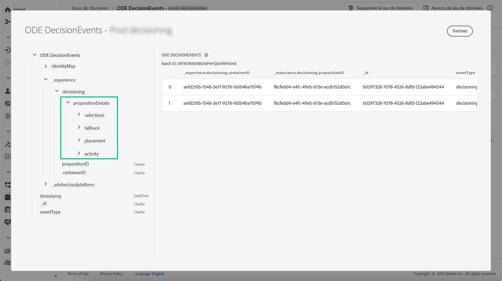
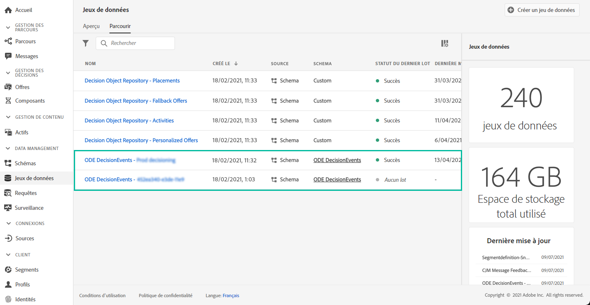

# Prise en main des événements de gestion des décisions {#monitor-offer-events}

>[!TIP]
>
>La prise de décision, la nouvelle fonctionnalité de prise de décision d’[!DNL Adobe Journey Optimizer], est désormais disponible via les canaux d’expérience basée sur du code et d’e-mail. [En savoir plus](../../experience-decisioning/gs-experience-decisioning.md)

Chaque fois que la gestion des décisions prend une décision pour un profil donné, les informations relatives à ces événements sont automatiquement envoyées à Adobe Experience Platform.

Cela vous permet d’obtenir des informations sur vos décisions, notamment pour savoir quelle offre a été présentée à un profil donné. Vous pouvez exporter ces données pour les analyser dans votre propre système de rapports ou utiliser le [service de requête](https://experienceleague.adobe.com/docs/experience-platform/query/home.html?lang=fr) Adobe Experience Platform en association avec d’autres outils à des fins d’analyse et de création de rapports améliorées.

## Informations clés disponibles dans les jeux de données {#key-information}

Chaque événement envoyé lorsqu’une décision est prise contient quatre points de données clés que vous pouvez exploiter à des fins d’analyse et de création de rapports :

* **[!UICONTROL Fallback]** : Nom et ID de l&#39;offre de secours, si aucune offre personnalisée n&#39;a été sélectionnée,
* **[!UICONTROL Emplacement]** : Nom, ID et canal du placement utilisé pour diffuser l&#39;offre,
* **[!UICONTROL Selections]** : Nom et ID de l&#39;offre sélectionnée pour le profil,
* **[!UICONTROL Activité]** : Nom et identifiant de la décision.

En outre, vous pouvez également utiliser les champs **[!UICONTROL identityMap]** et **[!UICONTROL Timestamp]** pour récupérer des informations sur le profil et le moment où l&#39;offre a été diffusée.

Pour plus d&#39;informations sur tous les champs XDM envoyés avec chaque décision, consultez [cette section](xdm-fields.md).

## Accéder aux jeux de données {#access-datasets}

Les jeux de données contenant des événements de gestion des décisions sont accessibles à partir du menu **[!UICONTROL Jeux de données]** d’Adobe Experience Platform. Un jeu de données est automatiquement créé lors de l&#39;approvisionnement de chacune de vos instances.

Ces jeux de données sont basés sur le schéma **[!UICONTROL ODE DecisionEvents]**, qui contient tous les champs XDM requis pour envoyer des informations de la gestion de décision à Adobe Experience Platform.

>[!NOTE]
>
>Notez que les jeux de données ODE DecisionEvents sont **des jeux de données ne concernant pas les profils**, ce qui signifie qu’ils ne peuvent pas être ingérés dans Experience Platform pour être utilisés par le profil client en temps réel.
