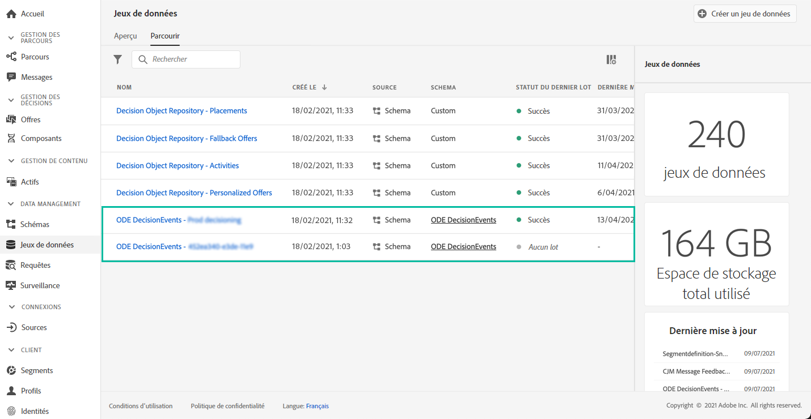

# Prise en main des événements Decision Management {#monitor-offer-events}

Chaque fois que la gestion de décision prend une décision pour un profil donné, les informations relatives à ces événements sont automatiquement envoyées à Adobe Experience Platform.

Vous pouvez ainsi exporter ces données pour les analyser dans votre propre système de rapports. Vous pouvez également utiliser [Query Service](https://experienceleague.adobe.com/docs/experience-platform/query/home.html?lang=fr) d&#39;Adobe Experience Platform en combinaison avec d&#39;autres outils pour améliorer l&#39;analyse et les rapports.

Les jeux de données contenant des événements de gestion de décision sont accessibles à partir du menu **[!UICONTROL Jeux de données]** d’Adobe Experience Platform. Un jeu de données est automatiquement créé lors de l&#39;approvisionnement de chacune de vos instances.

Ces jeux de données sont basés sur le schéma **[!UICONTROL ODE DecisionEvents]**, qui contient tous les champs XDM requis pour envoyer des informations de la gestion de décision à Adobe Experience Platform.

>[!NOTE]
>
>Notez que les jeux de données ODE DecisionEvents sont **des jeux de données ne concernant pas les profils**, ce qui signifie qu&#39;ils ne peuvent pas être ingérés dans Experience Platform pour être utilisés par le profil client en temps réel.

**Rubriques connexes :**

* [Informations clés sur les événements de gestion de décision](../reports/key-information.md)
* [Accès aux champs XDM des événements](../reports/xdm-fields.md)
