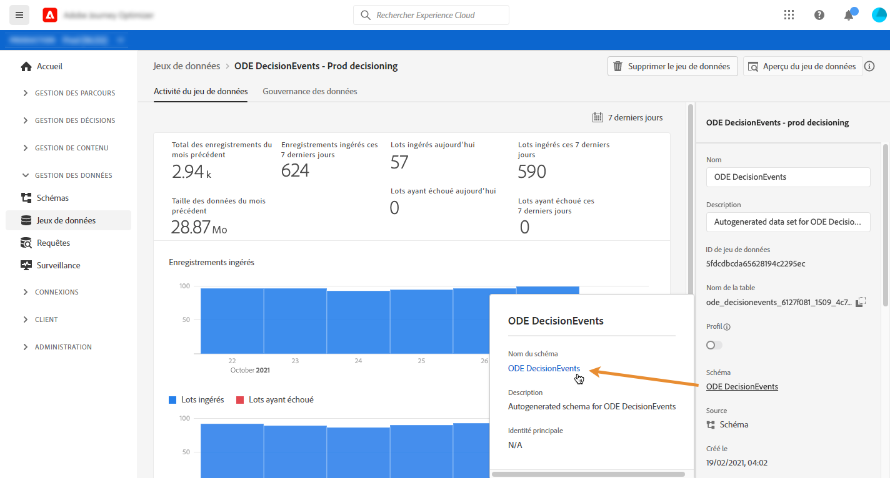
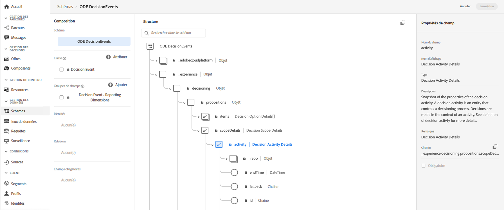

# Accès aux champs XDM des événements{#decisioningevents-xdm-schema}

Vous pouvez accéder au schéma XDM DecisioningEvents directement à partir d’un jeu de données contenant des événements Decision Management.

Le schéma contient tous les champs nécessaires pour envoyer des informations de Decision Management vers Adobe Experience Platform.

Pour obtenir plus d&#39;informations sur un champ spécifique, sélectionnez-le afin d&#39;afficher un volet d&#39;informations contenant les propriétés du champ.

Vous trouverez des informations détaillées sur la manière d&#39;utiliser les schémas et champs XDM dans la documentation du modèle de données d&#39;expérience :

* [Présentation du système XDM](https://experienceleague.adobe.com/docs/experience-platform/xdm/home.html?lang=fr)
* [Explorer les ressources XDM](https://experienceleague.adobe.com/docs/experience-platform/xdm/ui/explore.html?lang=fr)
