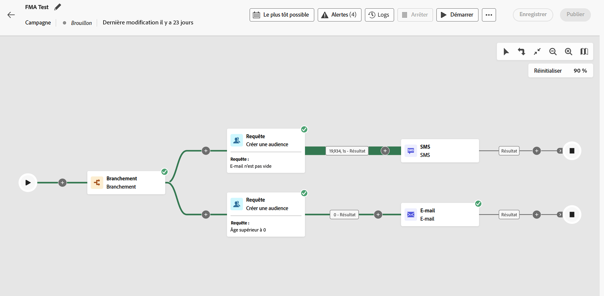

# Accéder à une campagne orchestrée et la gérer {#orchestrated-campaign-creation}

>[!CONTEXTUALHELP]
>id="ajo_targeting_workflow_list"
>title="Campagne orchestrée"
>abstract="Dans cet écran, vous pouvez accéder à la liste complète des campagnes orchestrées, vérifier leur statut actuel, les dates de dernière exécution et de prochaine exécution, et créer une campagne orchestrée."

>[!CONTEXTUALHELP]
>id="ajo_orchestration_campaign_action"
>title="Action"
>abstract="Cette section répertorie toutes les actions utilisées dans la campagne orchestrée."

+++ Table des matières

| Bienvenue dans les campagnes orchestrées | Lancer votre première campagne orchestrée | Interroger la base de données | Activités de campagnes orchestrées |
|---|---|---|---|
| [Prise en main des campagnes orchestrées](gs-orchestrated-campaigns.md)  Création et gestion de schémas et de jeux de données relationnels :  <ul><li>[Schéma manuel](manual-schema.md)</li><li>[Schéma de chargement de fichier](file-upload-schema.md)</li><li>[ Ingérer des données ](ingest-data.md)</li></ul>  <b>[Accéder aux campagnes orchestrées et les gérer](access-manage-orchestrated-campaigns.md)</b>  [Étapes clés pour créer une campagne orchestrée](gs-campaign-creation.md) | [Créer et planifier la campagne](create-orchestrated-campaign.md)  [Orchestrer les activités](orchestrate-activities.md)  [Démarrer et surveiller la campagne](start-monitor-campaigns.md)  [le reporting](reporting-campaigns.md) | [Utiliser le créateur de règles](orchestrated-rule-builder.md)  [Créer votre première requête](build-query.md)  [Modifier les expressions](edit-expressions.md)  [Reciblage](retarget.md) | [Prise en main des activités](activities/about-activities.md)  Activités: [Et-joindre](activities/and-join.md) - [Créer une audience](activities/build-audience.md) - [Modifier la dimension](activities/change-dimension.md) - [Activités de canal](activities/channels.md) - [Combine](activities/combine.md) - [Deduplication](activities/deduplication.md) - [Enrichissement](activities/enrichment.md) - [Fork](activities/fork.md) - [Reconciliation](activities/reconciliation.md) - [Enregistrer l’audience](activities/save-audience.md) - [Split](activities/split.md) - [Wait](activities/wait.md) |

{style="table-layout:fixed"}

+++

 

>[!BEGINSHADEBOX]

Le contenu de cette page n’est pas définitif et peut être modifié.

>[!ENDSHADEBOX]

## Accès aux campagnes orchestrées

Accédez au menu **[!UICONTROL Campagnes]** et sélectionnez l’onglet **[!UICONTROL Orchestration]** pour accéder à la liste complète des campagnes orchestrées.

{zoomable="yes"}{zoomable="yes"}

Chaque campagne orchestrée figurant dans la liste affiche des informations telles que le [statut](#status) actuel de la campagne, le canal et les balises associés ou la dernière fois qu’elle a été modifiée. Vous pouvez personnaliser les colonnes affichées en cliquant sur le bouton .

Une barre de recherche et des filtres sont également disponibles pour faciliter la recherche dans la liste. Vous pouvez, par exemple, filtrer les campagnes orchestrées afin de n’afficher que celles associées à un canal ou à une balise donnée, ou celles créées au cours d’une période spécifique.

L’image  dans l’inventaire des campagnes vous permet d’effectuer les différentes opérations présentées ci-dessous.

* **[!UICONTROL Afficher le rapport à toute heure]** / **[!UICONTROL Afficher le rapport des dernières 24 heures]** - Accédez aux rapports pour mesurer et visualiser l’impact et les performances de vos campagnes orchestrées. [En savoir plus sur le reporting des campagnes orchestrées](../orchestrated/reporting-campaigns.md)
* **[!UICONTROL Modifier les balises]** - Modifiez les balises associées à la campagne.
* **[!UICONTROL Dupliquer]** - Dans certains cas, vous devrez peut-être dupliquer une campagne orchestrée, par exemple pour exécuter une campagne qui a été arrêtée, ou pour modifier la fréquence d’exécution d’une campagne planifiée.
* **[!UICONTROL Supprimer]** - Supprimez la campagne. Cette action est disponible uniquement pour les campagnes **[!UICONTROL brouillon]**.
* **[!UICONTROL Archiver]** - Archivez la campagne. Toutes les campagnes archivées sont supprimées selon un nouveau planning progressif 30 jours après leur date de dernière modification. Cette action est disponible pour toutes les campagnes, à l’exception des campagnes **[!UICONTROL Brouillon]**.

## Que contient une campagne orchestrée ? {#gs-ms-campaign-inside}

La zone de travail de campagne orchestrée est une représentation de ce qui est censé se produire. Il décrit les différentes tâches à effectuer et la manière dont elles sont liées.

Chaque campagne orchestrée contient :

* des **Activités** : une activité est une tâche à effectuer. Les différentes activités disponibles sont représentées sur le diagramme par des icônes. Chaque activité possède des propriétés spécifiques et d’autres propriétés communes à toutes les activités.

  Dans un diagramme de campagne orchestré, une même activité peut générer plusieurs tâches, notamment en cas de boucle ou d&#39;actions récurrentes.

* **Transitions** : les transitions relient une activité source à une activité de destination et définissent leur ordre.

* **Tables de travail** : la table de travail contient toutes les informations véhiculées par la transition. Chaque campagne orchestrée utilise plusieurs tables de travail. Les données transmises dans ces tableaux peuvent être utilisées tout au long du cycle de vie de la campagne orchestrée.

## Statuts des campagnes {#status}

Les campagnes orchestrées peuvent avoir plusieurs statuts :

* **[!UICONTROL Brouillon]** : la campagne orchestrée a été créée. Il n’a pas encore été publié.
* **[!UICONTROL Publication]** : la campagne orchestrée est en cours de publication.
* **[!UICONTROL En direct]** : la campagne orchestrée a été publiée et est en cours d’exécution.
* **[!UICONTROL Planifié]** : l’exécution de la campagne orchestrée a été planifiée.
* **[!UICONTROL Terminé]** : l’exécution de la campagne orchestrée est terminée. Le statut Terminé est automatiquement attribué jusqu’à 3 jours après qu’une campagne a terminé l’envoi des messages sans erreur.
* **[!UICONTROL Fermé]** : ce statut s’affiche lorsqu’une campagne récurrente a été fermée. La campagne continue son exécution jusqu&#39;à ce que toutes ses activités soient terminées, mais plus aucun profil ne peut entrer dans la campagne.
* **[!UICONTROL Archivé]** : la campagne orchestrée a été archivée. Toutes les campagnes archivées sont supprimées selon un nouveau planning progressif 30 jours après la date de la dernière modification. Vous pouvez dupliquer une campagne archivée si nécessaire pour continuer à travailler dessus.
* **[!UICONTROL Arrêté]** : l&#39;exécution de la campagne orchestrée a été arrêtée. Pour redémarrer la campagne, vous devez la dupliquer.
