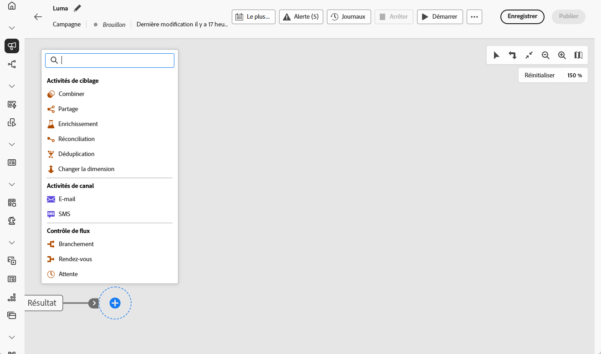
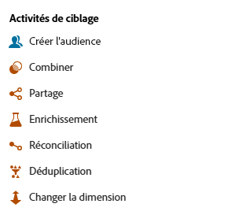
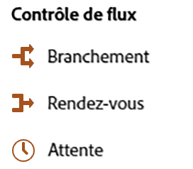

# À propos des activités de campagne orchestrée {#orchestrated-campaign-activities}

Les activités de campagnes orchestrées sont regroupées en trois catégories. Selon le contexte, les activités disponibles peuvent différer.

Toutes les activités sont présentées dans les sections ci-dessous :

* [Activités de ciblage](#targeting)
* [Activités de canal](#channel)
* [Activités de contrôle de flux](#flow-control)

{width="80%" align="left"}

>[!NOTE]
>
>* Selon votre modèle de licence, vos autorisations et votre implémentation, les activités disponibles peuvent varier.
>
>* Le nombre d’activités dans une campagne orchestrée est limité à 500.

## Activités de ciblage {#targeting}

Ces activités sont spécifiques au ciblage. Elles permettent de construire une ou plusieurs cibles en définissant une audience, puis en partageant ou en combinant ces audiences à l’aide des opérations d’intersection, d’union ou d’exclusion.

{width="40%" align="left"}

Les activités de ciblage disponibles sont les suivantes :

* [Créer une audience](build-audience.md) : définissez votre population cible. Vous pouvez sélectionner une audience existante ou utiliser le créateur de règles pour définir votre propre requête.
* [Changement de dimension](change-dimension.md) : changez la dimension de ciblage au fur et à mesure que vous créez votre campagne orchestrée.
* [Combiner](combine.md) : effectuez une segmentation sur votre population entrante. Vous pouvez utiliser une union, une intersection ou une exclusion.
* [Déduplication](deduplication.md) : supprimez les doublons dans le ou les résultats des activités entrantes.
* [Enrichissement](enrichment.md) : définissez des données supplémentaires à traiter dans votre campagne orchestrée. Avec cette activité, vous pouvez utiliser la transition entrante et configurer l’activité pour ajouter des données supplémentaires à la transition sortante.
* [Réconciliation](reconciliation.md) : définissez le lien entre les données de Journey Optimizer et les données d’une table de travail, par exemple les données chargées à partir d’un fichier externe.
* [Partage](split.md) : segmentez la population entrante en plusieurs sous-ensembles.

## Activités de canal {#channel}

Adobe Journey Optimizer vous permet d’automatiser et d’exécuter des campagnes marketing sur plusieurs canaux. Vous pouvez combiner des [activités de canal](channels.md) dans la zone de travail afin de créer une campagne orchestrée cross-canal pouvant déclencher des actions en fonction du comportement du client ou de la cliente.

Découvrez comment [créer une action de canal dans une campagne orchestrée](channels.md).

## Activités de contrôle de flux {#flow-control}

>[!CONTEXTUALHELP]
>id="ajo_orchestration_end"
>title="Activité de fin"
>abstract="L’activité **Fin** vous permet de marquer graphiquement la fin d’une campagne orchestrée. Cette activité n’a aucun impact fonctionnel et est donc facultative."

>[!CONTEXTUALHELP]
>id="ajo_orchestration_signal"
>title="Signal externe"
>abstract="signal externe"

Les activités ci-après sont spécifiques à l’organisation et à l’exécution des campagnes orchestrées. Leur principale tâche est de coordonner les autres activités.

{width="20%" align="left"}

Les activités de contrôle de flux disponibles sont les suivantes :

* [Rendez-vous](and-join.md) : synchronisez plusieurs branches d’exécution d’une campagne orchestrée.
* [Branchement](fork.md) : créez des transitions sortantes afin de lancer plusieurs activités en parallèle.
* [Attente](wait.md) : suspendez momentanément l’exécution d’une partie d’une campagne orchestrée.
  <!--* [Test](test.md): Enable transitions based on specified conditions.-->

>[!NOTE]
>L’activité **Fin** permet de marquer graphiquement la fin d’une campagne orchestrée. Cette activité n’a aucun impact fonctionnel et est donc facultative.
