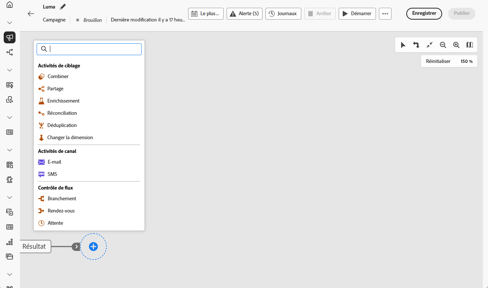
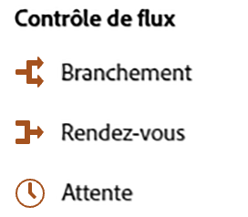

# À propos des activités de campagne orchestrée {#orchestrated-campaign-activities}

Les activités de campagnes orchestrées sont regroupées en trois catégories. Selon le contexte, les activités disponibles peuvent différer.

Toutes les activités sont présentées dans les sections ci-dessous :

* [Activités de ciblage](#targeting)
* [Activités de canal](#channel)
* [Activités de contrôle de flux](#flow-control)

{width="80%" align="left"}

>[!NOTE]
>
>Selon votre modèle de licence, vos autorisations et votre implémentation, les activités disponibles peuvent varier.

## Mécanismes de sécurisation et limitations {#activity-guardrails}

* **Limite des activités de canal** - Une campagne orchestrée prend en charge un maximum de 10 activités de canal au moment de la publication (e-mail, SMS, notification push ou courrier). Les activités de ciblage et de contrôle de flux ne sont pas prises en compte dans cette limite.

* **Limite des activités de la zone de travail** - Le nombre d’activités sur la zone de travail est limité à 500. Pour des raisons de maintenabilité et de performances, maintenez les workflows de moins de 100 activités en pratique.

Voir [Mécanismes de sécurisation et limitations](../guardrails.md) pour tous les mécanismes de sécurisation et limitations de Campaign orchestrés.

## Activités de ciblage {#targeting}

Ces activités sont spécifiques au ciblage. Elles permettent de construire une ou plusieurs cibles en définissant une audience, puis en partageant ou en combinant ces audiences à l’aide des opérations d’intersection, d’union ou d’exclusion.

{width="40%" align="left"}

Les activités de ciblage disponibles sont les suivantes :

* [Créer une audience](build-audience.md) : définissez votre population cible. Vous pouvez sélectionner une audience existante ou utiliser le créateur de règles pour définir votre propre requête.
* [Changement de dimension](change-dimension.md) : changez la dimension de ciblage au fur et à mesure que vous créez votre campagne orchestrée.
* [Combiner](combine.md) : effectuez une segmentation sur votre population entrante. Vous pouvez utiliser une union, une intersection ou une exclusion.
* [Déduplication](deduplication.md) : supprimez les doublons dans le ou les résultats des activités entrantes.
* [Enrichissement](enrichment.md) : définissez des données supplémentaires à traiter dans votre campagne orchestrée. Avec cette activité, vous pouvez utiliser la transition entrante et configurer l’activité pour ajouter des données supplémentaires à la transition sortante.
* [Réconciliation](reconciliation.md) : définissez le lien entre les données de Journey Optimizer et les données d’une table de travail, par exemple les données chargées à partir d’un fichier externe.
* [Partage](split.md) : segmentez la population entrante en plusieurs sous-ensembles.

## Activités de canal {#channel}

Adobe Journey Optimizer vous permet d’automatiser et d’exécuter des campagnes marketing sur plusieurs canaux. Vous pouvez combiner des [activités de canal](channels.md) dans la zone de travail afin de créer une campagne orchestrée cross-canal pouvant déclencher des actions en fonction du comportement du client ou de la cliente.

Découvrez comment [créer une action de canal dans une campagne orchestrée](channels.md).

## Activités de contrôle de flux {#flow-control}

>[!CONTEXTUALHELP]
>id="ajo_orchestration_end"
>title="Activité de fin"
>abstract="L’activité **Fin** permet de marquer la fin d’une branche sur la zone de travail. Vous pouvez éventuellement utiliser **Signal externe** pour démarrer une campagne orchestrée en aval et transmettre des paramètres une fois la branche terminée. [En savoir plus](../trigger-orchestrated-campaign.md#signal-end)"

>[!CONTEXTUALHELP]
>id="ajo_orchestration_signal"
>title="Signal externe"
>abstract="Sélectionnez la campagne orchestrée en aval à démarrer lorsque cette branche se termine et mappez les noms et les valeurs des paramètres à envoyer au signal. La campagne en aval doit être définie sur **Déclenché par un signal** et publiée avant que cette campagne n’atteigne l’activité Fin. [En savoir plus](../trigger-orchestrated-campaign.md#signal-end)"

Les activités ci-après sont spécifiques à l’organisation et à l’exécution des campagnes orchestrées. Leur principale tâche est de coordonner les autres activités.

{width="20%" align="left"}

Les activités de contrôle de flux disponibles sont les suivantes :

* [Rendez-vous](and-join.md) : synchronisez plusieurs branches d’exécution d’une campagne orchestrée.
* [Branchement](fork.md) : créez des transitions sortantes afin de lancer plusieurs activités en parallèle.
* [Attente](wait.md) : suspendez momentanément l’exécution d’une partie d’une campagne orchestrée.
  <!--* [Test](test.md): Enable transitions based on specified conditions.-->

* **[!UICONTROL Fin]** : marque la fin d’une branche sur la zone de travail. Vous pouvez éventuellement l’utiliser pour envoyer un signal à une autre campagne orchestrée qui démarre sur un signal. [En savoir plus](../trigger-orchestrated-campaign.md#signal-end)
