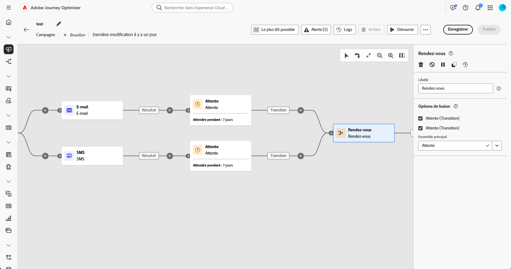
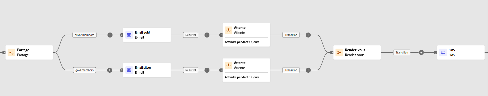

# Rendez-vous {#join}

>[!CONTEXTUALHELP]
>id="ajo_orchestration_and-join"
>title="Activité AND-join"
>abstract="L’activité **Rendez-vous** vous permet de synchroniser plusieurs branches d’exécution d’une campagne orchestrée. Elle est déclenchée une fois toutes les activités précédentes terminées. Vous pouvez ainsi vous assurer que certaines activités sont terminées avant de continuer à exécuter la campagne orchestrée."

L’activité **[!UICONTROL Rendez-vous]** est une activité de **[!UICONTROL contrôle de flux]**. Elle permet de synchroniser plusieurs branches d’exécution d’une campagne orchestrée.

L’activité Rendez-vous ne déclenche sa transition sortante qu’une fois toutes les transitions entrantes activées, c’est-à-dire quand toutes les activités précédentes sont terminées. Vous pouvez ainsi vous assurer que certaines activités sont terminées avant de continuer à exécuter la campagne orchestrée.

## Configurer l’activité Rendez-vous{#and-join-configuration}

>[!CONTEXTUALHELP]
>id="ajo_orchestration_and-join_merging"
>title="Options de fusion"
>abstract="Sélectionnez les activités auxquelles vous souhaitez adhérer. Dans l’**Ensemble principal**, choisissez la population de transition entrante à conserver."

Pour configurer l’activité **[!UICONTROL Rendez-vous]**, procédez comme suit :

1. Ajoutez plusieurs activités telles que des activités de canal, afin de former au moins deux branches d’exécution différentes.

1. Insérez une activité **[!UICONTROL Rendez-vous]** à l’une des branches.

1. Dans la section **[!UICONTROL Options de fusion]**, cochez les activités précédentes que vous souhaitez joindre.

1. Dans la liste déroulante **[!UICONTROL Ensemble principal]**, choisissez la population de transition entrante à conserver.

## Exemple{#and-join-example}

Cet exemple illustre deux branches de campagne coordonnées, chacune disposant d’une diffusion par e-mail, l’une ciblant les membres Gold et l’autre les membres Silver. Le **[!UICONTROL Rendez-vous]** s’active une fois les deux transitions entrantes déclenchées. Le SMS ne sera envoyé qu’une fois les deux diffusions par e-mail terminées, après un délai de 7 jours.

{zoomable="yes"}
