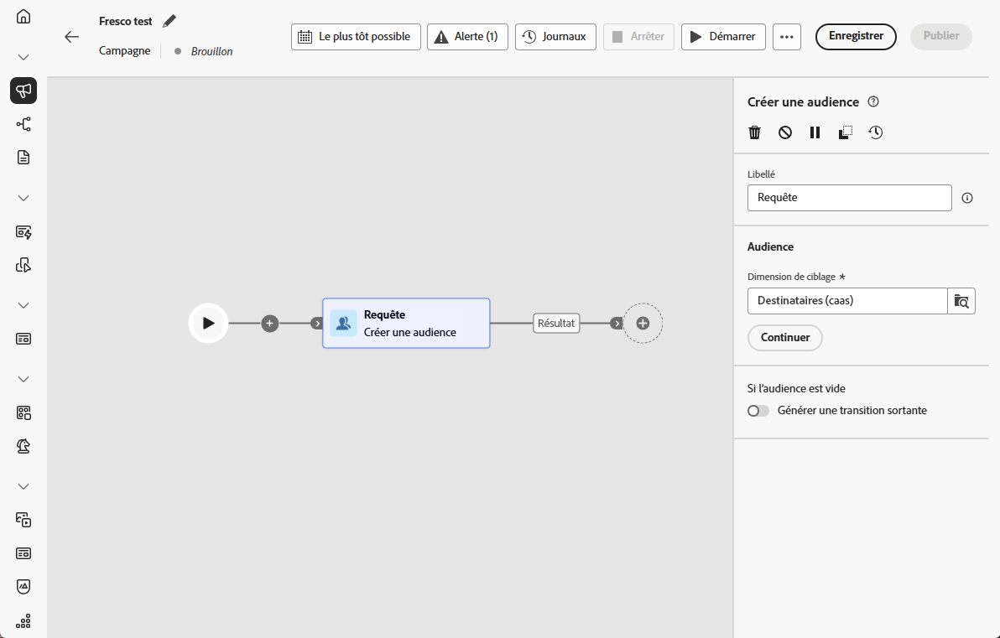
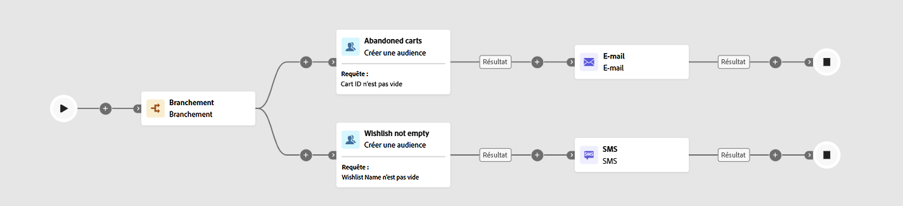

# Créer une audience {#build-audience}

>[!CONTEXTUALHELP]
>id="ajo_orchestration_build_audience"
>title="Activité Créer une audience"
>abstract="L’activité **Créer une audience** vous permet de définir l’audience qui va entrer dans la campagne orchestrée. Lors de l’envoi de messages dans le cadre d’une campagne orchestrée, l’audience du message n’est pas définie dans l’activité de canal, mais dans l’activité **Créer une audience**."

En tant que spécialiste marketing, vous pouvez créer des segments d’audience complexes par le biais d’une interface intuitive, ce qui vous permet de cibler les utilisateurs et les utilisatrices en fonction d’un large éventail de critères et de comportements, afin d’adapter plus efficacement vos campagnes.

Pour ce faire, utilisez l’activité de ciblage **[!UICONTROL Créer une audience]**. Cette activité définit l’audience qui entre dans la campagne orchestrée. Lors de l’envoi de messages dans le cadre d’une campagne orchestrée, l’audience est définie dans l’activité **[!UICONTROL Créer une audience]** et non dans la campagne orchestrée.

## Configurer l’activité Créer une audience {#build-audience-configuration}

>[!CONTEXTUALHELP]
>id="ajo_orchestration_build_audience_audienceselector"
>title="Audience"
>abstract="Sélectionnez votre audience de la même manière que vous utilisez une audience lors de la conception d’une nouvelle diffusion."

Pour configurer l’activité **[!UICONTROL Créer une audience]**, procédez comme suit :

1. Ajoutez une activité **[!UICONTROL Créer une audience]**.

   

1. Définissez un **[!UICONTROL libellé]**.

1. Configurez votre audience en suivant les étapes présentées dans les onglets ci-dessous.

1. Choisissez la **[!UICONTROL dimension de ciblage]**. La dimension de ciblage permet de définir la population ciblée par l’opération : personnes destinataires, personnes bénéficiaires d’un contrat, opérateurs et opératrices, personnes abonnées, etc. Par défaut, la cible est sélectionnée parmi les destinataires.

1. Cliquez sur **[!UICONTROL Continuer]**.

1. Utilisez le créateur de règles pour définir votre requête. [En savoir plus sur le créateur de règles dans cette section](../orchestrated-rule-builder.md)

1. Indiquez si une transition sortante doit être générée lorsque l’audience est vide.

## Exemples{#build-audience-examples}

Voici un exemple de campagne orchestrée comportant deux activités **[!UICONTROL Créer une audience]**. La première cible les profils qui ont des articles dans leur panier, avec une diffusion par e-mail. La seconde cible les profils qui ont une liste de souhaits, avec une diffusion par SMS.

