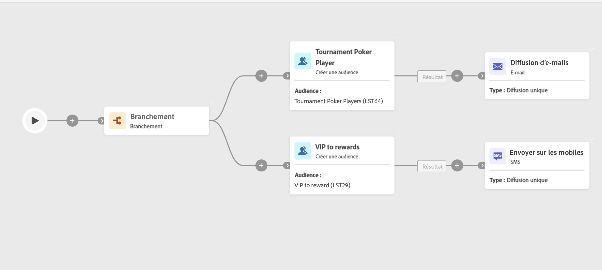

# Créer une audience {#build-audience}

>[!CONTEXTUALHELP]
>id="ajo_orchestration_build_audience"
>title="Activité Créer une audience"
>abstract="L’activité **Créer une audience** vous permet de définir l’audience qui va entrer dans la campagne orchestrée. Lors de l’envoi de messages dans le cadre d’une campagne orchestrée, l’audience du message n’est pas définie dans l’activité de canal, mais dans l’activité **Créer une audience**."

+++ Table des matières

| Bienvenue dans les campagnes orchestrées | Lancement de votre première campagne orchestrée | Interrogation de la base de données | Activités de campagnes orchestrées |
|---|---|---|---|
| [Prise en main des campagnes orchestrées](../gs-orchestrated-campaigns.md)  [Étapes de configuration](../configuration-steps.md)  [Étapes clés de la création de campagnes orchestrées](../gs-campaign-creation.md) | [Créer une campagne orchestrée](../create-orchestrated-campaign.md)  [Orchestrer des activités](../orchestrate-activities.md)  [Envoyer des messages avec des campagnes orchestrées](../send-messages.md)  [Démarrer et surveiller la campagne](../start-monitor-campaigns.md)  [Reporting](../reporting-campaigns.md) | [Utiliser la requête Modeler](../orchestrated-query-modeler.md)  [créer votre première requête](../build-query.md)  [modifier des expressions](../edit-expressions.md) | [Prise en main des activités](about-activities.md)  Activités: [Et-joindre](and-join.md) - [Créer une audience](build-audience.md) - [Modifier la dimension](change-dimension.md) - [Combiner](combine.md) - [Deduplication](/deduplication.md) - [Enrichissement](enrichment.md) - [Fork](fork.md) - [Reconciliation](reconciliation.md) - [Split](split.md) - [Wait](wait.md) |

{style="table-layout:fixed"}

+++

  

En tant que spécialiste marketing, vous pouvez facilement créer des requêtes complexes à l’aide d’une interface conviviale. Cela me permet de segmenter votre audience en fonction d’un large éventail de critères et de comportements, afin d’adapter plus efficacement vos campagnes.

Pour ce faire, utilisez l’activité de ciblage **Créer une audience**. Cette activité permet de définir l’audience qui va rejoindre la campagne orchestrée. Lors de l’envoi de messages dans le cadre d’une campagne orchestrée, l’audience du message n’est pas définie dans l’activité de canal, mais dans l’activité **Créer une audience**.

Pour définir la population de l’audience, vous pouvez :

* Sélectionnez une audience existante.
* Sélectionnez un filtre prédéfini.
* Créez une audience à l’aide du concepteur de requête en définissant et en combinant des critères de filtrage.

>[!NOTE]
>
>Les audiences chargées à partir d’un fichier ne peuvent pas être ciblées à l’aide d’une activité Créer une audience. Pour cela, vous devez utiliser une activité **Chargement de fichier** suivie d&#39;une activité **Réconciliation**.

## Configurer l’activité Créer une audience {#build-audience-configuration}

>[!CONTEXTUALHELP]
>id="ajo_orchestration_build_audience_audienceselector"
>title="Audience"
>abstract="Sélectionnez votre audience de la même manière que vous utilisez une audience lors de la conception d’une nouvelle diffusion."

Pour configurer l’activité **Créer une audience**, procédez comme suit :

1. Ajoutez une activité **Créer une audience**.
1. Définissez un libellé.
1. Définissez le type d’audience : **Créer votre audience** ou **Lecture d’audience**.
1. Configurez votre audience en suivant les étapes présentées dans les onglets ci-dessous.

Pour créer votre propre requête, procédez comme suit :

1. Sélectionnez **Créer la vôtre (requête)**.
1. Choisissez la **dimension de ciblage**. La dimension de ciblage permet de définir la population ciblée par l’opération : personnes destinataires, personnes bénéficiaires d’un contrat, opérateurs et opératrices, personnes abonnées, etc. Par défaut, la cible est sélectionnée parmi les destinataires.
1. Cliquez sur **Continuer**.
1. Utilisez le modéliseur de requête pour définir votre requête. [En savoir plus sur Query Modeler dans cette section](../orchestrated-query-modeler.md)

## Exemples{#build-audience-examples}

Voici un exemple de campagne orchestrée avec deux activités **Créer une audience**. La première cible l’audience des joueurs et joueuses de poker, suivie d’une diffusion e-mail. La seconde cible l’audience des clientes et clients VIP, suivie d’une diffusion SMS.

