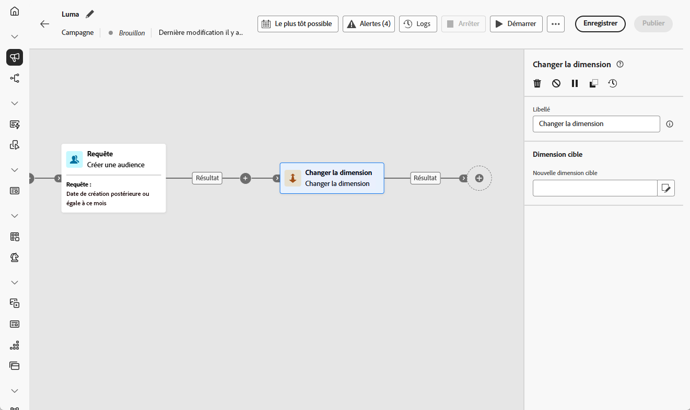
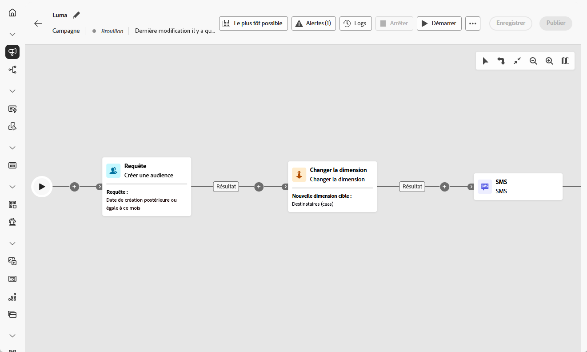

# Changement de dimension {#change-dimension}

>[!CONTEXTUALHELP]
>id="ajo_orchestration_dimension_complement"
>title="Générer un complément"
>abstract="Vous pouvez générer une transition sortante supplémentaire avec la population restante, qui a été exclue en tant que doublon. Pour ce faire, activez l’option **Générer un complément**."

>[!CONTEXTUALHELP]
>id="ajo_orchestration_change_dimension"
>title="Activité Changement de dimension"
>abstract="Cette activité vous permet de modifier la dimension de ciblage à mesure que vous créez une audience. Elle déplace l’axe en fonction du modèle de données et de la dimension d’entrée. Par exemple, vous pouvez passer de la dimension « contrats » à la dimension « clientèle »."

+++ Table des matières

| Bienvenue dans les campagnes orchestrées | Lancement de votre première campagne orchestrée | Interrogation de la base de données | Activités de campagnes orchestrées |
|---|---|---|---|
| [Prise en main des campagnes orchestrées](../gs-orchestrated-campaigns.md)  [Étapes de configuration](../configuration-steps.md)  [Étapes clés de la création de campagnes orchestrées](../gs-campaign-creation.md) | [Créer une campagne orchestrée](../create-orchestrated-campaign.md)  [Orchestrer des activités](../orchestrate-activities.md)  [Envoyer des messages avec des campagnes orchestrées](../send-messages.md)  [Démarrer et surveiller la campagne](../start-monitor-campaigns.md)  [Reporting](../reporting-campaigns.md) | [Utiliser la requête Modeler](../orchestrated-query-modeler.md)  [créer votre première requête](../build-query.md)  [modifier des expressions](../edit-expressions.md) | [Prise en main des activités](about-activities.md)  Activités: [Et-joindre](and-join.md) - [Créer une audience](build-audience.md) - [Modifier la dimension](change-dimension.md) - [Combiner](combine.md) - [Deduplication](/deduplication.md) - [Enrichissement](enrichment.md) - [Fork](fork.md) - [Reconciliation](reconciliation.md) - [Split](split.md) - [Wait](wait.md) |

{style="table-layout:fixed"}

+++

  

En tant que spécialiste marketing, vous pouvez basculer la dimension de ciblage d’une entité à une autre entité liée dans une campagne orchestrée et affiner le ciblage de votre audience en fonction de différents jeux de données, par exemple en passant du profilage des utilisateurs au ciblage de leurs actions ou réservations spécifiques.

Pour ce faire, utilisez l’activité de ciblage **Modifier la dimension**. Cette activité permet de modifier la dimension de ciblage au fur et à mesure que vous créez votre campagne orchestrée. Il déplace l’axe en fonction du modèle de données et de la dimension d’entrée.

Par exemple, vous pouvez basculer la dimension de ciblage d’une campagne orchestrée de « Profil » vers « Contrats » afin d’envoyer des messages au propriétaire du contrat ciblé.

<!--
>[!IMPORTANT]
>
>Please note that the **[!UICONTROL Change Dimension]** and **[!UICONTROL Change Data source]** activities should not be added in one row. If you need to use both activities consecutively, make sure you include an **[!UICONTROL Enrichement]** activity in between them. This ensures proper execution and prevents potential conflicts or errors.-->

## Configurer l’activité Changement de dimension {#configure}

Pour configurer l’activité **Changement de dimension**, procédez comme suit :

1. Ajoutez une activité **Modifier la dimension** à votre campagne orchestrée.

   

1. Définissez la **Nouvelle dimension cible**. Lors du changement de dimension, tous les enregistrements sont conservés.

1. Exécutez la campagne orchestrée pour afficher le résultat. Comparez les données dans les tables avant et après l’activité de changement de dimension, et comparez la structure des tables de la campagne orchestrée.

## Exemple {#example}

Dans cet exemple, nous souhaitons envoyer une diffusion SMS à tous les profils ayant effectué un achat. Pour ce faire, nous utilisons d’abord une activité **[!UICONTROL Créer une audience]** liée à une dimension de ciblage « Achat » personnalisée pour cibler tous les achats qui se sont produits.

Nous utilisons ensuite une activité **[!UICONTROL Modifier la dimension]** pour basculer la dimension de ciblage de la campagne orchestrée sur « Destinataires ». Cela nous permet de cibler les personnes destinataires qui correspondent à la requête.

