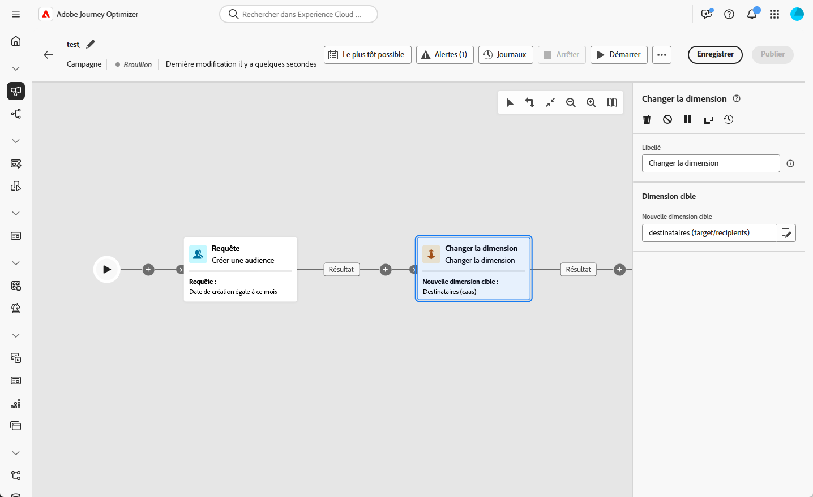
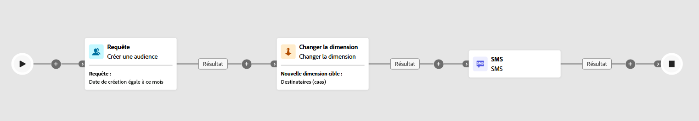

# Changement de dimension {#change-dimension}

>[!CONTEXTUALHELP]
>id="ajo_orchestration_dimension_complement"
>title="Générer un complément"
>abstract="Vous pouvez générer une transition sortante supplémentaire avec la population restante, qui a été exclue en tant que doublon. Pour ce faire, activez l’option **Générer un complément**."

>[!CONTEXTUALHELP]
>id="ajo_orchestration_change_dimension"
>title="Activité Changement de dimension"
>abstract="Cette activité vous permet de modifier la dimension de ciblage à mesure que vous créez une audience. Elle déplace l’axe en fonction du modèle de données et de la dimension d’entrée. Par exemple, vous pouvez passer de la dimension « contrats » à la dimension « clientèle »."

+++ Table des matières

| Bienvenue dans les campagnes orchestrées | Lancer votre première campagne orchestrée | Interroger la base de données | Activités de campagnes orchestrées |
|---|---|---|---|
| [Prise en main des campagnes orchestrées](../gs-orchestrated-campaigns.md)  Création et gestion de schémas et de jeux de données relationnels :  <ul><li>[Prise en main des schémas et des jeux de données](../gs-schemas.md)</li><li>[Schéma manuel](../manual-schema.md)</li><li>[Schéma de chargement de fichier](../file-upload-schema.md)</li><li>[ Ingérer des données ](../ingest-data.md)</li></ul>[Accéder aux campagnes orchestrées et les gérer](../access-manage-orchestrated-campaigns.md) | [Étapes clés de création d’une campagne orchestrée](../gs-campaign-creation.md)  [Créer et planifier la campagne](../create-orchestrated-campaign.md)  [Orchestrer les activités](../orchestrate-activities.md)  [Lancer et surveiller la campagne](../start-monitor-campaigns.md)  [Reporting](../reporting-campaigns.md) | [Utiliser le créateur de règles](../orchestrated-rule-builder.md)  [Créer votre première requête](../build-query.md)  [Modifier les expressions](../edit-expressions.md)  [Reciblage](../retarget.md) | [Commencer avec les activités](about-activities.md)  Activités : [Rendez-vous](and-join.md) - [Créer une audience](build-audience.md) - <b>[Changement de dimension](change-dimension.md)</b> - [Activités de canal](channels.md) - [Combiner](combine.md) - [Déduplication](deduplication.md) - [Enrichissement](enrichment.md) - [Branchement](fork.md) - [Réconciliation](reconciliation.md) - [Enregistrer l’audience](save-audience.md) - [Partage](split.md) - [Attente](wait.md) |

{style="table-layout:fixed"}

+++

 

>[!BEGINSHADEBOX]

 

Le contenu de cette page n’est pas définitif et peut être modifié.

>[!ENDSHADEBOX]

En tant que responsable marketing, vous pouvez améliorer le ciblage des audiences en passant d’une entité de données à une entité associée au sein d’une campagne orchestrée. Vous pouvez ainsi aller au-delà des profils d’utilisation et vous concentrer sur des comportements spécifiques, tels que les achats, les réservations ou d’autres interactions.

Pour ce faire, utilisez l’activité **[!UICONTROL Changement de dimension]**. Elle permet d’ajuster la dimension de ciblage au cours de la campagne orchestrée.

<!--
>[!IMPORTANT]
>
>Please note that the **[!UICONTROL Change Dimension]** and **[!UICONTROL Change Data source]** activities should not be added in one row. If you need to use both activities consecutively, make sure you include an **[!UICONTROL Enrichement]** activity in between them. This ensures proper execution and prevents potential conflicts or errors.-->

## Configurer l’activité Changement de dimension {#configure}

Pour configurer l’activité **[!UICONTROL Changement de dimension]**, procédez comme suit :

1. Ajoutez une activité **[!UICONTROL Changement de dimension]** à votre campagne orchestrée.

   

1. Définissez la **[!UICONTROL Nouvelle dimension cible]**. Lors du changement de dimension, tous les enregistrements sont conservés.

## Exemple {#example}

Ce cas d’utilisation se concentre sur l’envoi d’un SMS aux profils qui ont créé une liste de souhaits au cours du dernier mois.

Commencez par une activité **[!UICONTROL Créer une audience]**, en utilisant la dimension de ciblage **[!UICONTROL Liste de souhaits]** pour identifier toutes les listes de souhaits pertinentes.

Ajoutez ensuite une activité **[!UICONTROL Changement de dimension]** pour basculer la dimension de ciblage de **[!UICONTROL Liste de souhaits]** à **[!UICONTROL Destinataire].** Cette étape permet de s’assurer que la campagne orchestrée cible les bons profils associés à ces listes de souhaits, ce qui permet d’envoyer le SMS aux profils prévus.

