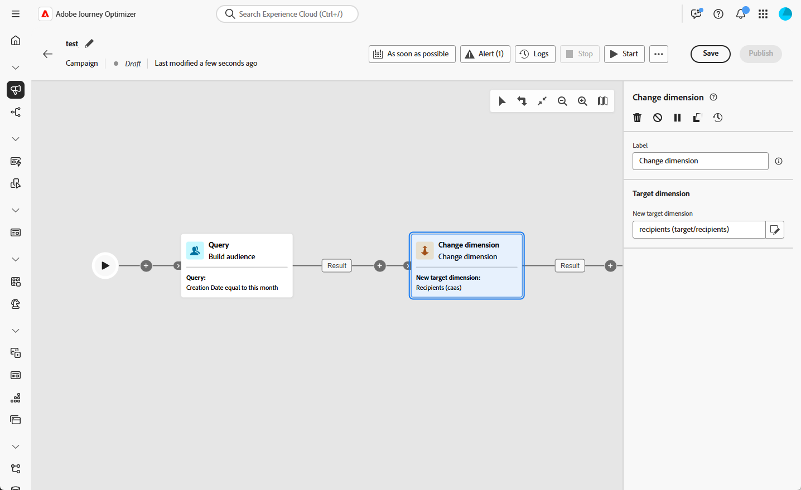
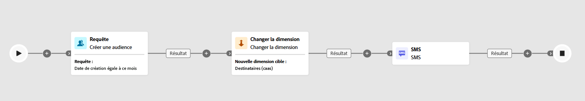

# Changement de dimension {#change-dimension}

>[!BEGINSHADEBOX]

**Sur cette page :** découvrez comment utiliser l’activité Changement de dimension pour déplacer la dimension de ciblage dans une campagne orchestrée, par exemple en passant de listes de souhaits aux destinataires qui leur sont associés.

>[!ENDSHADEBOX]

>[!CONTEXTUALHELP]
>id="ajo_orchestration_dimension_complement"
>title="Générer un complément"
>abstract="Vous pouvez générer une transition sortante supplémentaire avec la population restante, qui a été exclue en tant que doublon. Pour ce faire, activez l’option **Générer un complément**."

>[!CONTEXTUALHELP]
>id="ajo_orchestration_change_dimension"
>title="Activité Changement de dimension"
>abstract="Cette activité vous permet de modifier la dimension de ciblage à mesure que vous créez une audience. Elle déplace l’axe en fonction du modèle de données et de la dimension d’entrée. Par exemple, vous pouvez passer de la dimension « contrats » à la dimension « clientèle »."

En tant que responsable marketing, vous pouvez améliorer le ciblage des audiences en passant d’une entité de données à une entité associée au sein d’une campagne orchestrée. Vous pouvez ainsi aller au-delà des profils d’utilisation et vous concentrer sur des comportements spécifiques, tels que les achats, les réservations ou d’autres interactions.

Pour ce faire, utilisez l’activité **[!UICONTROL Changement de dimension]**. Elle permet d’ajuster la dimension du ciblage au cours de la campagne orchestrée.

<!--
>[!IMPORTANT]
>
>Please note that the **[!UICONTROL Change Dimension]** and **[!UICONTROL Change Data source]** activities should not be added in one row. If you need to use both activities consecutively, make sure you include an **[!UICONTROL Enrichement]** activity in between them. This ensures proper execution and prevents potential conflicts or errors.
-->

## Configurer l’activité Changement de dimension {#configure}

Pour configurer l’activité **[!UICONTROL Changement de dimension]**, procédez comme suit :

1. Ajoutez une activité **[!UICONTROL Changement de dimension]** à votre campagne orchestrée.

   

1. Définissez la **[!UICONTROL Nouvelle dimension cible]**. L’étape Modifier la dimension utilise une jointure externe : tous les enregistrements de la population d’entrée sont transmis, y compris ceux sans entrée correspondante dans la nouvelle dimension.

   >[!IMPORTANT]
   >
   >Les enregistrements sans profil correspondant dans la nouvelle dimension de ciblage sont **exclus silencieusement au moment de la diffusion du message**. Cette exclusion n’est actuellement pas reflétée dans les journaux d’exclusion. Pour identifier rapidement les enregistrements non correspondants, utilisez l’option **Prévisualiser les résultats** sur la transition après l’étape Modifier la dimension et vérifiez que les nombres d’enregistrements correspondent à vos attentes avant de continuer.

## Exemple {#example}

Ce cas d’utilisation se concentre sur l’envoi d’un SMS aux profils qui ont créé une liste de souhaits au cours du dernier mois.

Commencez par une activité **[!UICONTROL Créer une audience]**, en utilisant la dimension de ciblage **[!UICONTROL Liste de souhaits]** pour identifier toutes les listes de souhaits pertinentes.

Ajoutez ensuite une activité **[!UICONTROL Modifier la dimension]** pour basculer la dimension de ciblage de **[!UICONTROL Liste de souhaits]** à **[!UICONTROL Destinataire].** Cette étape permet de s’assurer que la campagne orchestrée cible les profils corrects associés à ces listes de souhaits, ce qui permet d’envoyer le SMS aux profils prévus.

