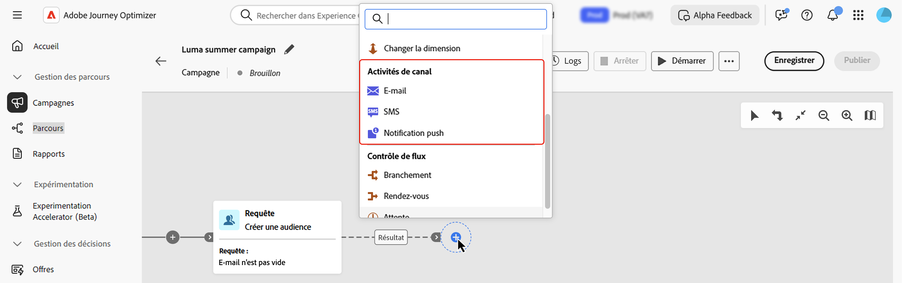
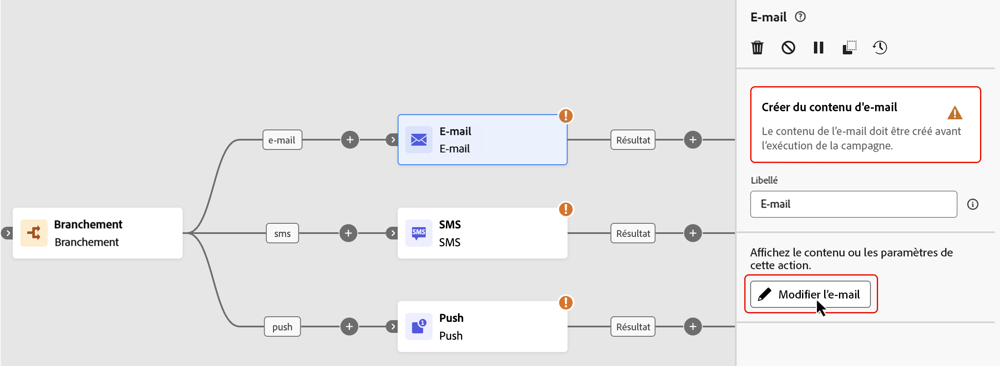
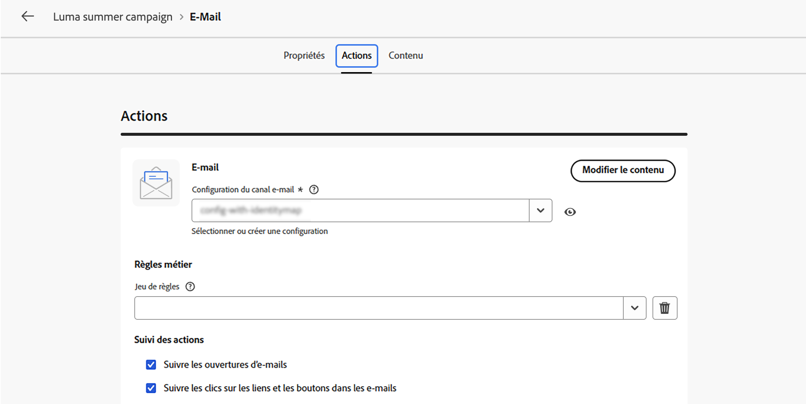
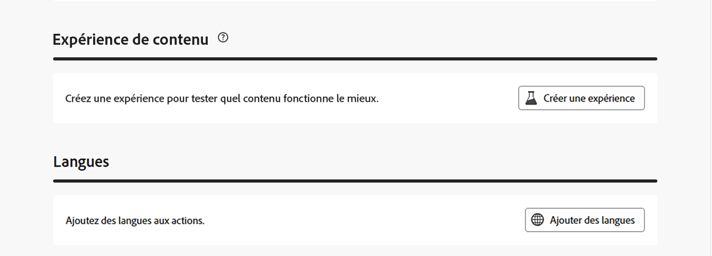
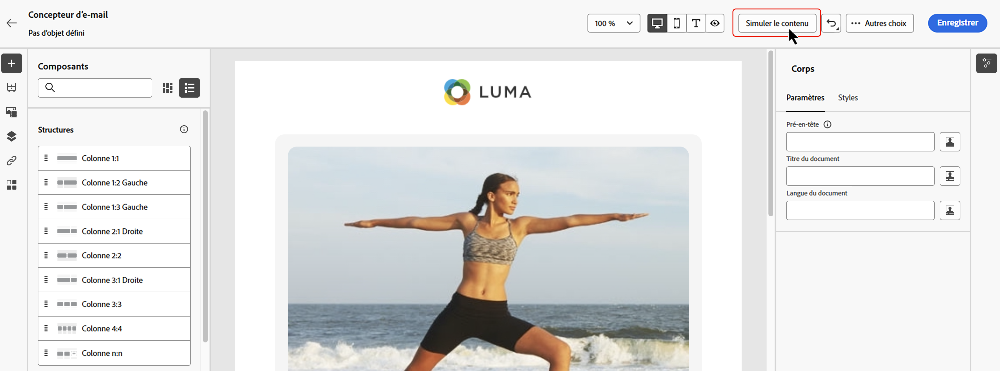
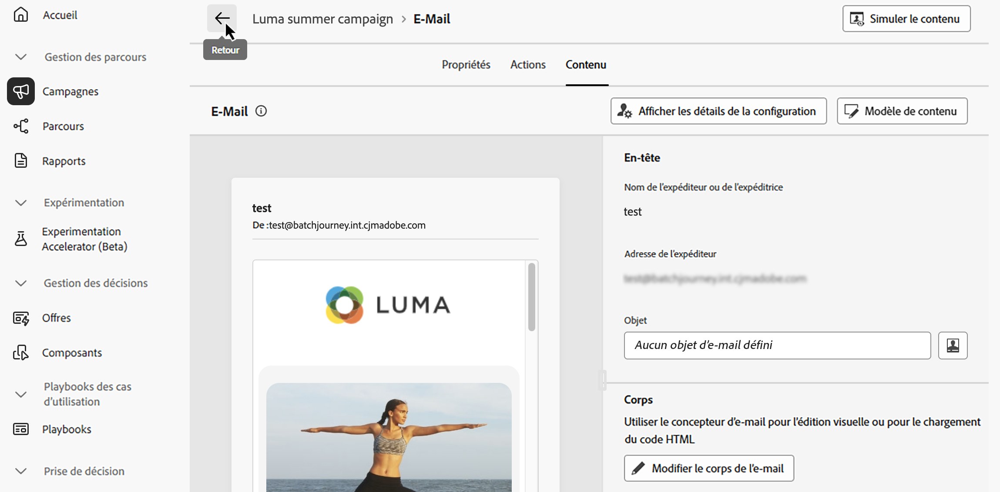
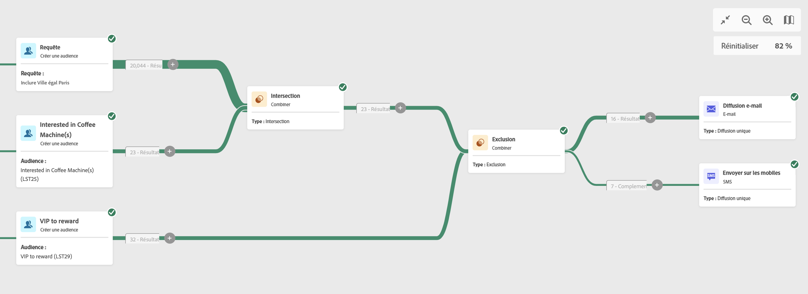
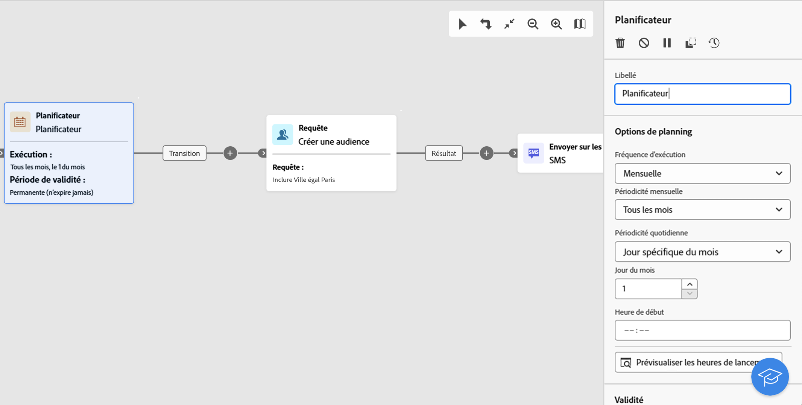

# Activités de canal {#channel}

>[!CONTEXTUALHELP]
>id="ajo_orchestration_email"
>title="Activité e-mail"
>abstract="L’activité E-mail permet d’envoyer des e-mails dans votre campagne orchestrée, pour des messages ponctuels et récurrents. Elle permet d’automatiser le processus d’envoi d’e-mails à une cible calculée dans la même campagne orchestrée. Vous pouvez combiner des activités de canal dans une zone de travail de campagne à plusieurs étapes, afin de créer des campagnes cross-canal pouvant déclencher des actions en fonction du comportement de la clientèle et des données."

>[!CONTEXTUALHELP]
>id="ajo_orchestration_sms"
>title="Activité SMS"
>abstract="L’activité SMS permet d’envoyer des SMS au sein de votre campagne orchestrée pour des messages ponctuels et récurrents. Elle permet d’automatiser le processus d’envoi de SMS à une cible calculée dans la même campagne orchestrée. Vous pouvez combiner des activités de canal dans la zone de travail de campagne à plusieurs étapes, afin de créer des campagnes cross-canal pouvant déclencher des actions en fonction du comportement de la clientèle et des données."

>[!CONTEXTUALHELP]
>id="ajo_orchestration_push"
>title="Activité Notification push"
>abstract="L’activité Push permet d’envoyer des notifications push dans le cadre de votre campagne orchestrée. Il permet la diffusion de campagnes orchestrées uniques et récurrentes, automatisant l’envoi de notifications push à une cible prédéfinie dans la même campagne orchestrée. Vous pouvez combiner des activités de canal dans la zone de travail de campagne, afin de créer des campagnes cross-canal pouvant déclencher des actions en fonction du comportement de la clientèle et des données."

<!--
UNUSED IDs in BJ

>[!CONTEXTUALHELP]
>id="ajo_orchestration_push_ios"
>title="Push iOS activity"
>abstract="The Push iOS activity lets you send iOS Push notifications as part of your Orchestrated campaign. It enables the delivery of both one-time and recurring Orchestrated campaigns, automating the sending of iOS Push notifications to a predefined target within the same workflow. You can combine channel activities into the campaign canvas to create cross-channel campaigns that can trigger actions based on customer behavior and data."

>[!CONTEXTUALHELP]
>id="ajo_orchestration_push_android"
>title="Push Android activity"
>abstract="The Push Android activity lets you send Android Push notifications as part of your Orchestrated campaign. It enables the delivery of both one-time and recurring messages, automating the sending of Android Push notifications to a predefined target within the same Orchestrated campaign. You can combine channel activities into the Orchestrated campaign canvas to create cross-channel campaigns that can trigger actions based on customer behavior and data."

-->

>[!CONTEXTUALHELP]
>id="ajo_orchestration_directmail"
>title="Activité Courrier"
>abstract="L’activité Courrier facilite l’envoi de courrier depuis votre campagne orchestrée pour les messages ponctuels et récurrents. Elle permet d’automatiser le processus de génération du fichier d’extraction requis par les fournisseurs de services postaux. Vous pouvez combiner des activités de canal dans la zone de travail de campagne orchestrée afin de créer des campagnes cross-canal pouvant déclencher des actions en fonction du comportement de la clientèle et des données."

[!DNL Adobe Journey Optimizer] vous permet d’automatiser et d’exécuter des campagnes marketing sur plusieurs canaux (e-mail, SMS, notifications push et courrier). Vous pouvez combiner ces activités de canal dans la zone de travail de campagne afin de créer des campagnes orchestrées cross-canal. Ces campagnes peuvent déclencher des actions en fonction du comportement et des données des clients.

Par exemple :

* Envoyez une série de bienvenue par e-mail, SMS, notification push et courrier.
* Diffusez un e-mail de suivi après l’achat.
* Envoyez des vœux d’anniversaire personnalisés par SMS.

Grâce aux activités de canal, vous pouvez créer des campagnes personnalisées et complètes qui impliquent la clientèle sur plusieurs points de contact et génèrent des conversions.

>[!CAUTION]
>
>Seuls les canaux SMS, Push, E-mail et Courrier sont pris en charge dans les campagnes orchestrées.

## Ajouter une activité de canal et définir ses propriétés {#add}

>[!PREREQUISITES]
>
>Avant d’ajouter une activité de canal, définissez l’audience cible à l’aide d’une activité [Créer une audience](build-audience.md) ou [Lecture d’audience](read-audience.md).

1. Ajoutez une activité de canal dans la zone de travail. Les activités de canal disponibles sont **[!UICONTROL E-mail]**, **[!UICONTROL SMS]**, **[!UICONTROL Push]** et **[!UICONTROL Publipostage direct]**.

   

1. Sélectionnez l’activité et cliquez sur **[!UICONTROL Modifier l’e-mail]**, **[!UICONTROL Modifier le SMS]**, **[!UICONTROL Modifier la notification push]** ou **[!UICONTROL Modifier le publipostage direct]** selon le canal choisi.

   

1. Dans l’onglet **[!UICONTROL Propriétés]**, saisissez une description, puis passez à l’onglet **[!UICONTROL Actions]** pour configurer l’activité.

## Configurer la configuration et les paramètres du canal {#configuration}

Utilisez l’onglet **[!UICONTROL Actions]** afin de sélectionner une configuration de canal pour votre message et configurer des paramètres supplémentaires, tels que le suivi, l’expérience de contenu ou le contenu multilingue.

1. **Sélectionner une configuration de canal**

   Celle-ci est définie par une [équipe d’administration système](../../start/path/administrator.md). Elle contient tous les paramètres techniques relatifs à l’envoi du message, tels que les paramètres d’en-tête, le sous-domaine, les applications mobiles, etc. [Découvrir comment configurer les canaux](../../configuration/channel-surfaces.md)

   

1. **Appliquer des règles de limitation**

   Dans la liste déroulante **[!UICONTROL Jeu de règles]**, sélectionnez un jeu de règles de canal pour appliquer des règles de limitation à la campagne. L’utilisation des jeux de règles de canal vous permet de définir un capping de fréquence par type de communication afin d’éviter d’envoyer trop de messages similaires aux clientes et aux clients. [Découvrez comment utiliser des ensembles de règles](../../conflict-prioritization/rule-sets.md).

1. **Créer une expérience de contenu**

   La section **[!UICONTROL Expérience de contenu]** permet de définir plusieurs traitements de diffusion afin de mesurer celui qui fonctionne le mieux pour votre audience cible. Cliquez sur le bouton **[!UICONTROL Créer une expérience]**, puis suivez les étapes détaillées dans cette section : [Créer une expérience de contenu](../../content-management/content-experiment.md).

1. **Ajouter du contenu multilingue**

   Utilisez la section **[!UICONTROL Langues]** pour créer du contenu dans plusieurs langues au sein de votre campagne. Pour ce faire, cliquez sur le bouton **[!UICONTROL Ajouter des langues]** et sélectionnez l’option **[!UICONTROL Paramètres de langue]** souhaitée. Vous trouverez des informations détaillées sur la configuration et l’utilisation des fonctionnalités multilingues dans cette section : [Commencer avec le contenu multilingue](../../content-management/multilingual-gs.md).

   

Des paramètres supplémentaires sont disponibles en fonction du canal de communication sélectionné. Pour plus d’informations, développez les sections ci-dessous.

+++**Suivi de l’engagement** (e-mails et SMS).

Utilisez la section **[!UICONTROL Suivi des actions]** pour suivre la réaction des personnes destinataires à vos diffusions e-mail ou SMS. Les résultats du suivi sont accessibles dans le rapport de la campagne, une fois celle-ci exécutée. [En savoir plus sur les rapports de campagne](../../reports/campaign-global-report-cja.md)

+++

+++**Activer le mode de diffusion rapide** (notifications push).

Le mode de diffusion rapide est un module complémentaire [!DNL Journey Optimizer] qui permet d’envoyer très rapidement des messages push en grandes quantités dans le cadre de campagnes. La diffusion rapide est utilisée lorsque le retard de diffusion des messages est critique pour l&#39;entreprise. Par exemple, vous souhaitez envoyer une alerte push urgente sur les téléphones mobiles, telle que des nouvelles importantes aux utilisateurs qui ont installé votre application de canal d&#39;actualités. Découvrez comment activer le mode de diffusion rapide pour les notifications push [sur cette page](../../push/create-push.md#rapid-delivery).

Pour plus d&#39;informations sur les performances en mode de diffusion rapide, consultez la description du produit [Adobe Journey Optimizer](https://helpx.adobe.com/fr/legal/product-descriptions/adobe-journey-optimizer.html){target="_blank"}.

+++

Une fois votre activité de canal configurée, sélectionnez l’onglet **[!UICONTROL Contenu]** pour définir son contenu.

## Définir le contenu {#content}

### Création du contenu du message

Passez à l’onglet **[!UICONTROL Contenu]** pour créer votre message. Les étapes du processus varient en fonction du canal sélectionné. Découvrez les étapes détaillées pour créer le contenu de votre message dans les pages suivantes.

<table style="table-layout:fixed"><tr style="border: 0; text-align: center;" >
<td> <a href="../../email/create-email.md"><strong>Créer un e-mail</strong></a></td>
<td> <a href="../../sms/create-sms.md"><strong>Créer un SMS</strong></a></td>
<td><a href="../../push/create-push.md"><strong>Créer une notification push</strong></a></td><td><a href="../../direct-mail/create-direct-mail.md"><strong>Créer un courrier</strong></a></td>
</tr></table>

### Ajouter une personnalisation

Le fonctionnement de Personalization dans les campagnes orchestrées est similaire à celui d’autres campagnes ou parcours [!DNL Journey Optimizer], avec quelques différences importantes spécifiques à la zone de travail orchestrée.

Lorsque vous accédez à l’éditeur de personnalisation depuis une campagne orchestrée, deux dossiers principaux contiennent des attributs disponibles pour la personnalisation, décrits ci-dessous.

* **[!UICONTROL Attributs de profil]**

  Ce dossier inclut toutes les données liées aux profils provenant d’[!DNL Adobe Experience Platform]. Il s’agit d’attributs standard tels que le nom, l’adresse e-mail, l’emplacement ou toute autre caractéristique capturée dans le profil de l’utilisateur ou de l’utilisatrice.

* **[!UICONTROL Attributs de cible]** (spécifiques aux campagnes orchestrées)

  Ce dossier est propre aux campagnes orchestrées. Il contient des attributs calculés directement dans la zone de travail de la campagne. Il contient deux sous-dossiers :

   * **`<Targeting dimension>`** (par exemple, « Destinataires », « Achats ») : contient tous les attributs liés à la dimension ciblée par la campagne.

   * **`Enrichment`** : inclut les données ajoutées via des activités **[!UICONTROL Enrichissement]** dans la zone de travail. Cela permet de personnaliser les messages en fonction de jeux de données externes ou de logiques supplémentaires intégrées lors de l’orchestration. [Découvrez comment utiliser une activité d’enrichissement](../activities/enrichment.md)

Pour une présentation détaillée de l’utilisation de l’éditeur de personnalisation, reportez-vous à la section [Prise en main de la personnalisation](../../personalization/personalize.md).

### Vérifier et tester le contenu

Une fois votre contenu créé, utilisez le bouton **[!UICONTROL Simuler le contenu]** pour prévisualiser et tester votre contenu avec des profils de test ou des exemples de données d’entrée chargés à partir d’un fichier CSV/JSON ou ajoutés manuellement. [En savoir plus](../../content-management/preview-test.md)

## Confirmer l’envoi du message

Par défaut, pour les campagnes orchestrées non récurrentes, la diffusion des messages est suspendue jusqu&#39;à ce que vous approuviez explicitement l&#39;envoi. Après avoir publié la campagne, confirmez la demande d’envoi à partir du volet des propriétés de l’activité de canal.

La confirmation d’envoi peut être désactivée avant de publier la campagne orchestrée. Pour ce faire, sélectionnez l’activité de canal dans la zone de travail pour afficher ses propriétés, puis activez **[!UICONTROL Envoyer sans confirmation]**.

## Définir le contrôle du débit {#rate-control}

[!DNL Journey Optimizer] vous permet d’activer le contrôle des taux pour les actions sortantes dans les campagnes orchestrées.

Cette fonctionnalité est particulièrement utile pour éviter la surcharge sur les systèmes en aval, tels que les pages de destination ou les plateformes d’assistance clientèle. Par exemple, vous pouvez définir une limite de débit de 165 messages par seconde pour garantir une diffusion régulière sans surcharger les systèmes en aval.

Pour définir le contrôle du débit, procédez comme suit :

1. Sélectionnez une activité de canal sortant dans la zone de travail et cliquez sur **[!UICONTROL Modifier l’e-mail]**, **[!UICONTROL Modifier le SMS]** ou **[!UICONTROL Modifier la notification push]** selon le canal choisi.

   

1. Accédez à l’onglet **[!UICONTROL Planifier]** et activez l’option **[!UICONTROL Ralentir la diffusion]** dans la section **[!UICONTROL Paramètres de diffusion]**.

   

1. Spécifiez le **[!UICONTROL Taux de diffusion]** par seconde souhaité.

   * Taux de diffusion minimum pris en charge : 1 par seconde.
   * Taux de diffusion maximal pris en charge : 2 000 par seconde lorsque l’option « Limiter la diffusion » est activée.

>[!IMPORTANT]
>
>Lors de la définition d’un taux de diffusion, la durée maximale d’exécution d’une audience de campagne est de 12 heures. Si le taux de diffusion est défini sur une valeur qui ne permet pas d’envoyer le message à toute l’audience dans le délai de 12 heures, les profils restants seront exclus de la campagne. Le nombre de ces profils exclus apparaît dans le rapport de campagne.

## Étapes suivantes {#next}

Lorsque le contenu du message est prêt, revenez à votre campagne orchestrée à l’aide de la flèche **[!UICONTROL Retour]**. Vous pouvez ensuite terminer l’orchestration des activités dans la zone de travail et publier la campagne pour commencer à envoyer des messages. [Découvrez comment démarrer et surveiller des campagnes orchestrées](../start-monitor-campaigns.md)

<!--
## Examples {#cross-channel-workflow-sample}

Here is a cross-channel Orchestrated campaign example with a segmentation and two deliveries. The Orchestrated campaign targets all customers who live in Paris and who are interested in coffee machines. Among this population, an email is sent to the regular customers and an SMS is sent to the VIP clients.

<!--
description, which use case you can perform (common other activities that you can link before of after the activity)

how to add and configure the activity

example of a configured activity within a workflow
The Email delivery activity allows you to configure the sending an email in a workflow. 

-->

<!--You can also create a recurring Orchestrated campaign to send a personalized SMS every first day of the month at 8 PM to all customers living in Paris.

-->

<!-- Scheduled emails available?

This can be a single send email and sent just once, or it can be a recurring email.
* Single send emails are standard emails, sent once.
* Recurring emails allow you to send the same email multiple times to different targets over a defined period. You can aggregate the deliveries per period in order to get reports that correspond to your needs.

When linked to a scheduler, you can define recurring emails.
Email recipients are defined upstream of the activity in the same workflow, via an Audience targeting activity.

-->

<!--The message preparation is triggered according to the workflow execution parameters. From the message dashboard, you can select whether to request or not a manual confirmation to send the message (required by default). You can start the workflow manually or place a scheduler activity in the workflow to automate execution.-->

