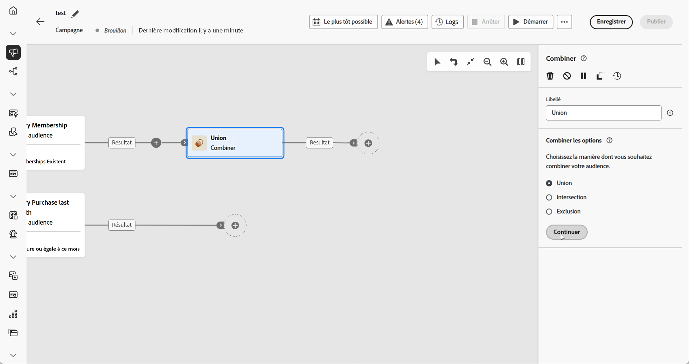
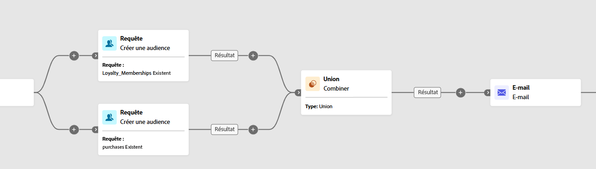
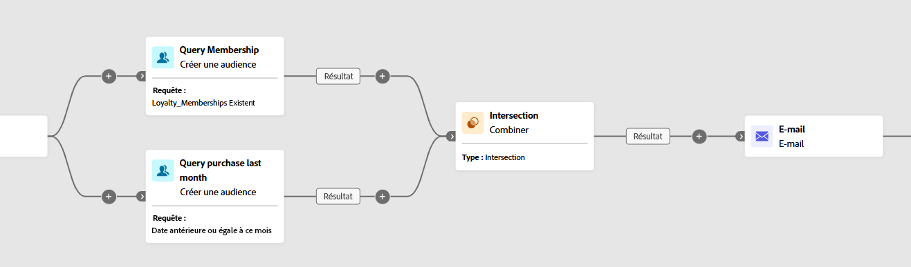
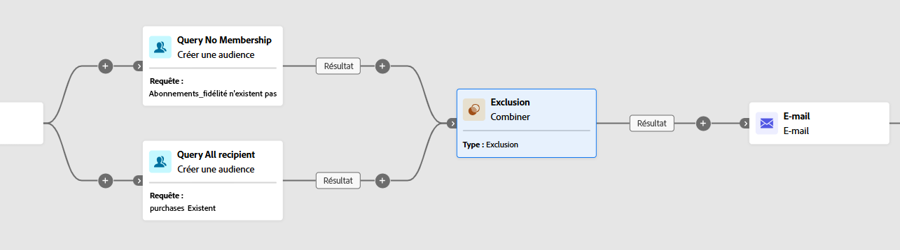

# Combiner {#combine}

>[!CONTEXTUALHELP]
>id="ajo_orchestration_combine"
>title="Activité Combiner"
>abstract="L’activité **Combiner** permet d’effectuer une segmentation sur votre population entrante. Il est ainsi possible de regrouper plusieurs populations, d’en exclure une partie ou de ne conserver que les données communes entre plusieurs cibles."

+++ Table des matières

| Bienvenue dans les campagnes orchestrées | Lancer votre première campagne orchestrée | Interroger la base de données | Activités de campagnes orchestrées |
|---|---|---|---|
| [Prise en main des campagnes orchestrées](../gs-orchestrated-campaigns.md)  [Étapes de configuration](../configuration-steps.md)  [Étapes clés de la création de campagnes orchestrées](../gs-campaign-creation.md) | [Créer une campagne orchestrée](../create-orchestrated-campaign.md)  [Orchestrer les activités](../orchestrate-activities.md)   [Démarrer et surveiller la campagne](../start-monitor-campaigns.md)  [le reporting](../reporting-campaigns.md) | [Utiliser la requête Modeler](../orchestrated-rule-builder.md)  [créer votre première requête](../build-query.md)  [modifier des expressions](../edit-expressions.md) | [Prise en main des activités](about-activities.md)  Activités: [Et-joindre](and-join.md) - [Créer une audience](build-audience.md) - [Modifier la dimension](change-dimension.md) - [Activités de canal](channels.md) - **[Combine](combine.md)** - [Deduplication](deduplication.md) - [Enrichissement](enrichment.md) - [Fork](fork.md) - [Reconciliation](reconciliation.md) - [Split](split.md) - [Wait](wait.md) |

{style="table-layout:fixed"}

+++

 

L’activité **[!UICONTROL Combiner]** est un type d’activité **[!UICONTROL Ciblage]** qui permet de segmenter efficacement la population entrante. Il permet de fusionner plusieurs populations, d’exclure des segments spécifiques ou de ne conserver que les données partagées entre plusieurs cibles.

Les options de segmentation suivantes sont disponibles :

* **[!UICONTROL Union]** : fusionne les résultats de plusieurs activités en une seule cible unifiée.

* **[!UICONTROL Intersection]** : ne conserve que les éléments communs à toutes les populations entrantes.

* **[!UICONTROL Exclusion]** : supprime des éléments d’une population selon des critères spécifiés.

## Configurer l’activité Combiner {#combine-configuration}

>[!CONTEXTUALHELP]
>id="ajo_orchestration_intersection_merging_options"
>title="Options de fusion des intersections"
>abstract="L’intersection permet de ne conserver que les éléments communs aux différentes populations entrantes dans l’activité. Dans la section Ensembles à joindre, cochez les activités précédentes à joindre."

>[!CONTEXTUALHELP]
>id="ajo_orchestration_exclusion_merging_options"
>title="Options de fusion des exclusions"
>abstract="L’exclusion permet d’exclure des éléments d’une population selon certains critères. Dans la section Ensembles à joindre, cochez les activités précédentes à joindre."

>[!CONTEXTUALHELP]
>id="ajo_orchestration_combine_options"
>title="Sélectionner le type de segmentation"
>abstract="Sélectionnez comment combiner des audiences. L’**Union** permet de regrouper le résultat de plusieurs activités dans une cible unique. L’**Intersection** permet de ne conserver que les éléments communs aux différentes populations entrantes dans l’activité. L’**Exclusion** permet d’exclure des éléments d’une population selon certains critères. "

Pour commencer à configurer l’activité **[!UICONTROL Combiner]**, procédez comme suit :

1. Ajoutez plusieurs activités, comme **[!UICONTROL Créer une audience]**, pour former au moins deux branches d’exécution différentes.
1. Ajoutez une activité **[!UICONTROL Combiner]** à l’une des branches précédentes.
1. Sélectionnez le type de segmentation : [union](#union), [intersection](#intersection) ou [exclusion](#exclusion).
1. Cliquez sur **[!UICONTROL Continuer]**.
1. Dans la section **[!UICONTROL Ensembles à joindre]**, cochez les activités précédentes à joindre.

## Union {#combine-union}

>[!CONTEXTUALHELP]
>id="ajo_orchestration_combine_reconciliation"
>title="Options de réconciliation"
>abstract="Sélectionnez le **type de réconciliation** pour définir comment gérer les doublons. Par défaut, l’option **Clés** est activée, ce qui signifie que l’activité ne conserve qu’un élément lorsque des éléments provenant de différentes transitions entrantes ont la même clé. Utilisez l’option **Une sélection de colonnes** pour définir la liste des colonnes sur lesquelles est appliquée la réconciliation des données."

Dans l&#39;activité **[!UICONTROL Combiner]**, vous pouvez paramétrer une **[!UICONTROL Union]** en sélectionnant un **[!UICONTROL Type de réconciliation]** afin de déterminer comment les enregistrements en double sont gérés :

* **[!UICONTROL Clés uniquement]** (par défaut) : conserve un seul enregistrement lorsque plusieurs transitions entrantes partagent la même clé. Cette option n’est applicable que lorsque les populations entrantes sont homogènes.

* **[!UICONTROL Une sélection de colonnes]** : permet de spécifier quelles colonnes sont utilisées pour la réconciliation des données. Sélectionnez **[!UICONTROL Ajouter un attribut]**.

Dans l’exemple suivant, une activité **[!UICONTROL Combiner]** est utilisée avec une **[!UICONTROL Union]** pour fusionner les résultats de deux requêtes, **Membres du programme de fidélité** et **Acheteurs**, en une seule audience plus grande qui inclut tous les profils des deux segments.

## Intersection {#combine-intersection}

>[!CONTEXTUALHELP]
>id="ajo_orchestration_intersection_reconciliation_options"
>title="Options de réconciliation des interactions"
>abstract="Sélectionnez le **type de réconciliation** pour définir comment gérer les doublons. Par défaut, l’option **Clés** est activée, ce qui signifie que l’activité ne conserve qu’un élément lorsque des éléments provenant de différentes transitions entrantes ont la même clé. Utilisez l’option **Une sélection de colonnes** pour définir la liste des colonnes sur lesquelles est appliquée la réconciliation des données."

Dans l’activité **[!UICONTROL Combiner]**, vous pouvez configurer une **[!UICONTROL intersection]**. Pour cela, suivez les étapes supplémentaires ci-dessous :

1. Sélectionnez le **[!UICONTROL Type de réconciliation]** pour définir la manière dont les duplicatas sont traités :

   * **[!UICONTROL Clés uniquement]** (par défaut) : conserve un seul enregistrement lorsque plusieurs transitions entrantes partagent la même clé. Cette option n’est applicable que lorsque les populations entrantes sont homogènes.

   * **[!UICONTROL Une sélection de colonnes]** : permet de spécifier quelles colonnes sont utilisées pour la réconciliation des données. Sélectionnez **[!UICONTROL Ajouter un attribut]**.

1. Activez l’option **[!UICONTROL Générer le complémentaire]** si vous souhaitez traiter la population restante. Le complémentaire contient l’union de tous les résultats de l’activité entrante, à l’exclusion de l’intersection. Une transition sortante supplémentaire est ajoutée à l’activité.

L’exemple suivant illustre l’utilisation de l’**[!UICONTROL Intersection]** entre deux activités de requête. Il est utilisé pour identifier les profils qui sont des **membres du programme de fidélité** et qui ont effectué un achat au cours du dernier mois.

## Exclusion {#combine-exclusion}

>[!CONTEXTUALHELP]
>id="ajo_orchestration_exclusion_options"
>title="Règles d’exclusion"
>abstract="Le cas échéant, vous pouvez manipuler les tableaux entrants. En effet, pour exclure une cible d’une autre dimension, cette cible doit être replacée dans la même dimension de ciblage que la cible principale. Pour ce faire, cliquez sur Ajouter une règle dans la section Règles d’exclusion et indiquez les conditions de changement de dimension. La réconciliation des données s’effectue au moyen d’un attribut ou d’une jointure."

>[!CONTEXTUALHELP]
>id="ajo_orchestration_combine_sets"
>title="Sélectionner des ensembles à combiner"
>abstract="Dans la section **Ensembles à joindre**, sélectionnez **Ensemble principal** parmi les transitions entrantes. C’est l’ensemble à partir duquel des éléments sont exclus. Les autres ensembles correspondent aux éléments devant être exclus de l’ensemble principal."

>[!CONTEXTUALHELP]
>id="ajo_orchestration_combine_exclusion"
>title="Règles d’exclusion"
>abstract="Le cas échéant, vous pouvez manipuler les tableaux entrants. En effet, pour exclure une cible d’une autre dimension, cette cible doit être replacée dans la même dimension de ciblage que la cible principale. Pour ce faire, cliquez sur Ajouter une règle dans la section Règles d’exclusion et indiquez les conditions de changement de dimension. La réconciliation des données s’effectue au moyen d’un attribut ou d’une jointure."

>[!CONTEXTUALHELP]
>id="ajo_orchestration_combine_complement"
>title="Combiner la génération de complément"
>abstract="Activez l’option Générer un complément pour traiter la population restante dans une transition supplémentaire."

Dans l’activité **[!UICONTROL Combiner]**, vous pouvez configurer une **[!UICONTROL exclusion]**. Pour cela, suivez les étapes supplémentaires ci-dessous :

1. Dans la section **[!UICONTROL Ensembles à joindre]**, choisissez l&#39;ensemble de Principal **&#x200B;**, qui représente la population principale. Les enregistrements trouvés dans les autres ensembles sont exclus de cet ensemble principal.

1. Si nécessaire, vous pouvez ajuster les tableaux entrants pour aligner les cibles de différentes dimensions. Pour exclure une cible d&#39;une autre dimension, elle doit d&#39;abord être amenée dans la même dimension de ciblage que la population principale. Pour ce faire, cliquez sur **[!UICONTROL Ajouter une règle]** et définissez les conditions de modification de la dimension. La réconciliation est ensuite effectuée à l’aide d’un attribut ou d’une jointure.

1. Activez l’option **[!UICONTROL Générer le complémentaire]** si vous souhaitez traiter la population restante. Le complémentaire contient l’union de tous les résultats de l’activité entrante, à l’exclusion de l’intersection. Une transition sortante supplémentaire est ajoutée à l’activité.

L’exemple **[!UICONTROL Exclusion]** suivant montre deux requêtes configurées pour filtrer les profils qui ont acheté un produit. Les profils qui n’ont pas d’abonnement de fidélité sont ensuite exclus du premier ensemble.

