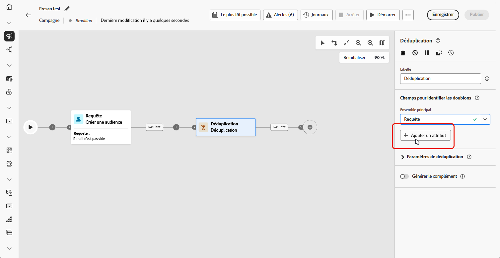
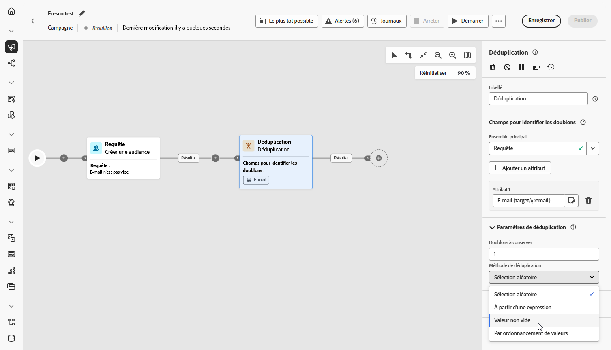
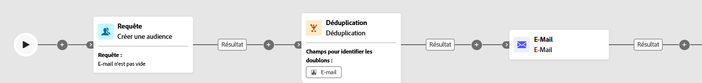

# Déduplication {#deduplication}

>[!CONTEXTUALHELP]
>id="ajo_orchestration_deduplication_fields"
>title="Champs pour identifier les doublons"
>abstract="Dans la section **Champs pour identifier des doublons**, cliquez sur le bouton **Ajouter un attribut** pour indiquer les champs pour lesquels des valeurs identiques permettent d’identifier les doublons, par exemple : adresse e-mail, prénom, nom, etc. L’ordre des champs vous permet de spécifier ceux à traiter en premier."

>[!CONTEXTUALHELP]
>id="ajo_orchestration_deduplication"
>title="Activité Déduplication"
>abstract="L’activité **Déduplication** permet de supprimer les doublons dans le ou les résultats des activités entrantes. Elle est principalement utilisée à la suite des activités de ciblage et avant les activités permettant l’utilisation des données ciblées."

>[!CONTEXTUALHELP]
>id="ajo_orchestration_deduplication_complement"
>title="Générer un complément"
>abstract="Vous pouvez générer une transition sortante supplémentaire avec la population restante, qui a été exclue en tant que doublon. Pour ce faire, activez l’option **Générer un complément**."

>[!CONTEXTUALHELP]
>id="ajo_orchestration_deduplication_settings"
>title="Paramètres de déduplication"
>abstract="Pour supprimer des doublons dans les données entrantes, définissez la méthode de déduplication dans les champs ci-dessous. Par défaut, un seul enregistrement est conservé. Vous devez également sélectionner le mode de déduplication en fonction d’une expression ou d’un attribut. Par défaut, l’enregistrement à conserver en dehors des doublons est sélectionné de manière aléatoire."

+++ Table des matières

| Bienvenue dans les campagnes orchestrées | Lancer votre première campagne orchestrée | Interroger la base de données | Activités de campagnes orchestrées |
|---|---|---|---|
| [Prise en main des campagnes orchestrées](../gs-orchestrated-campaigns.md)  [Étapes de configuration](../configuration-steps.md)  [Étapes clés de la création de campagnes orchestrées](../gs-campaign-creation.md) | [Créer une campagne orchestrée](../create-orchestrated-campaign.md)  [Orchestrer les activités](../orchestrate-activities.md)  [Démarrer et surveiller la campagne](../start-monitor-campaigns.md)  [le reporting](../reporting-campaigns.md) | [Utiliser la requête Modeler](../orchestrated-rule-builder.md)  [créer votre première requête](../build-query.md)  [modifier des expressions](../edit-expressions.md) | [Prise en main des activités](about-activities.md)  Activités: [Et-joindre](and-join.md) - [Créer une audience](build-audience.md) - [Modifier la dimension](change-dimension.md) - [Activités de canal](channels.md) - [Combine](combine.md) - [Deduplication](deduplication.md) - [Enrichissement](enrichment.md) - [Fork](fork.md) - [Reconciliation](reconciliation.md) - [Split](split.md) - [Wait](wait.md) |

{style="table-layout:fixed"}

+++

 

L’activité **[!UICONTROL Déduplication]** est une activité de **[!UICONTROL ciblage]**. Cette activité permet de supprimer les doublons dans le ou les résultats des activités entrantes, par exemple les profils dupliqués dans la liste des profils destinataires. L’activité **[!UICONTROL Déduplication]** est généralement utilisée à la suite des activités de ciblage et avant les activités permettant d’utiliser les données ciblées.

## Configurer l’activité Déduplication{#deduplication-configuration}

Pour configurer l’activité **[!UICONTROL Déduplication]**, procédez comme suit :

1. Ajoutez une activité **[!UICONTROL Déduplication]** à votre campagne orchestrée.

1. Dans la section **[!UICONTROL Champs pour identifier des doublons]**, cliquez sur le bouton **[!UICONTROL Ajouter un attribut]** pour indiquer les champs pour lesquels des valeurs identiques permettent d’identifier les doublons, par exemple : adresse e-mail, prénom, nom, etc. L’ordre des champs vous permet de spécifier ceux à traiter en premier.

   

1. Dans la section **[!UICONTROL Paramètres de déduplication]**, choisissez le nombre d’enregistrements uniques à conserver à l’aide du champ Doublons à conserver. La valeur par défaut est 1, ce qui conserve un enregistrement par groupe en double. Définissez-le sur 0 pour conserver tous les doublons.

   Par exemple, si les enregistrements A et B sont des doublons de Y et que l&#39;enregistrement C est un doublon de Z :

   * **Si la valeur du champ est 1** : Seuls les enregistrements Y et Z sont conservés.
   * **Si la valeur du champ est 0** : tous les enregistrements (A, B, C, Y, Z) sont conservés.
   * **Si la valeur du champ est 2** : C et Z sont conservés, plus deux valeurs de A, B et Y, de manière aléatoire ou en fonction de votre méthode de déduplication.

1. Choisissez une **[!UICONTROL Méthode de déduplication]**, elle définit la manière dont le système décide des enregistrements à conserver à partir de chaque groupe de doublons :

   * **[!UICONTROL Sélection aléatoire]** : sélectionne au hasard l’enregistrement à conserver parmi les doublons.
   * **[!UICONTROL En utilisant une expression]** : conserve les enregistrements dont la valeur est la plus élevée ou la plus faible en fonction d’une expression que vous définissez.
   * **[!UICONTROL Valeurs non vides]** : conserve les enregistrements où le champ sélectionné n’est pas vide, par exemple ne conserve que les profils ayant un numéro de téléphone.
   * **[!UICONTROL En suivant une liste de valeurs]** : permet de prioriser des valeurs spécifiques pour un ou plusieurs champs, par exemple donner la priorité aux enregistrements dont le champ « Pays » est défini sur la France. Cliquez sur **[!UICONTROL Attribut]** pour choisir un champ ou créer une expression personnalisée. Utilisez le bouton **[!UICONTROL Ajouter]** pour saisir les valeurs préférées dans l&#39;ordre de priorité.

   

1. Cochez l’option **[!UICONTROL Générer le complément]** si vous souhaitez exploiter la population restante. Le complément est constitué de tous les doublons. Une transition supplémentaire sera alors ajoutée à l’activité.

## Exemple{#deduplication-example}

Dans l’exemple suivant, une activité **[!UICONTROL Déduplication]** est utilisée pour supprimer les enregistrements en double de l’audience cible avant d’envoyer une diffusion. L’audience est d’abord filtrée pour inclure uniquement les profils dont le champ E-mail n’est pas vide. Ensuite, l’activité **[!UICONTROL Déduplication]** utilise l’adresse e-mail pour identifier et exclure les doublons.

