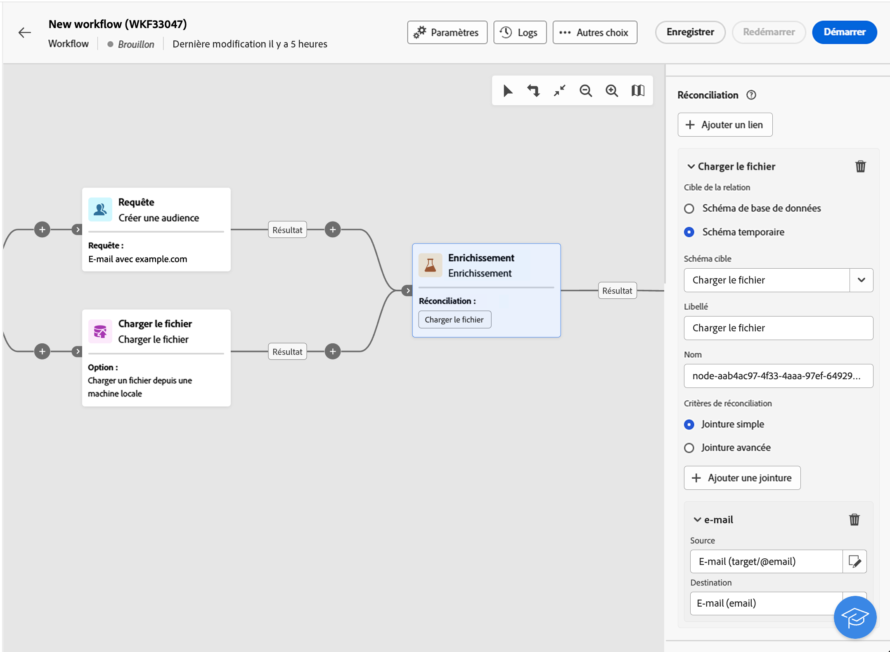
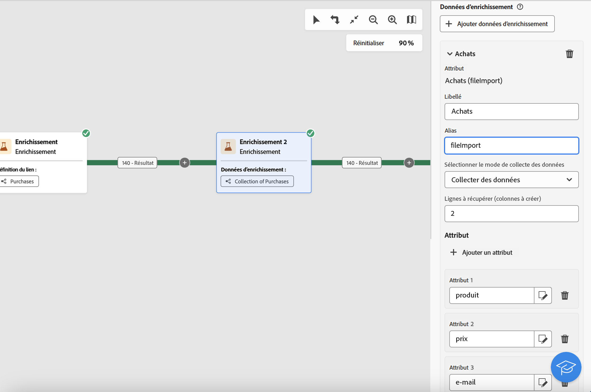

# Enrichissement {#enrichment}

>[!CONTEXTUALHELP]
>id="ajo_orchestration_enrichment"
>title="Activité Enrichissement"
>abstract="L’activité **Enrichissement** permet d’enrichir les données ciblées avec des informations supplémentaires provenant de la base de données. Elle est généralement utilisée dans une campagne après des activités de segmentation."

L’activité **[!UICONTROL Enrichissement]** est une activité de **[!UICONTROL Ciblage]** qui permet d’enrichir les données de votre audience avec des attributs supplémentaires.

Vous pouvez exploiter ces informations pour segmenter votre audience plus précisément, en fonction des comportements, des préférences ou des besoins, et pour concevoir des messages personnalisés qui s’adaptent mieux à chaque profil.

## Ajouter une activité Enrichissement {#enrichment-configuration}

>[!CONTEXTUALHELP]
>id="ajo_targetdata_personalization_enrichmentdata"
>title="Données d’enrichissement"
>abstract="Sélectionnez les données à utiliser pour enrichir votre campagne orchestrée. Vous pouvez sélectionner deux types de données d’enrichissement : un seul attribut d’enrichissement de la dimension cible ou un lien de collection, qui est un lien avec une cardinalité 1-N entre les tableaux."

>[!CONTEXTUALHELP]
>id="ajo_orchestration_enrichment_data"
>title="Activité Enrichissement"
>abstract="Une fois que les données d’enrichissement ont été ajoutées à la campagne orchestrée, vous pouvez les utiliser dans les activités ajoutées après l’activité Enrichissement pour segmenter les clientes et clients en groupes distincts en fonction de leurs comportements, préférences et besoins. Vous pouvez également vous en servir pour créer des messages et des campagnes marketing personnalisés qui résonneront davantage auprès de votre audience cible."

Pour configurer l’activité **Enrichissement**, procédez comme suit :

1. Ajoutez une activité **Enrichissement**.

1. Cliquez sur **Ajouter des données d’enrichissement** et sélectionnez l’attribut à utiliser pour enrichir les données.

   Vous pouvez sélectionner deux types de données d’enrichissement : un attribut d’enrichissement unique de la dimension cible, ou un lien de collection. Chacun de ces types est détaillé dans les exemples ci-dessous :

   * [Attribut d’enrichissement unique](#single-attribute)
   * [Lien de collection](#collection-link)

   

## Exemples {#example}

### Attribut d’enrichissement unique {#single-attribute}

Dans cet exemple, vous enrichissez l’audience avec un seul attribut, tel que la date de naissance, à partir de la dimension de ciblage actuelle.

Pour ce faire :

1. Cliquez sur **[!UICONTROL Ajouter des données d’enrichissement]**.

1. Sélectionnez un champ simple, tel que **[!UICONTROL Date de naissance]**, dans la dimension actuelle.

   

1. Cliquez sur **[!UICONTROL Confirmer]**.

### Lien de collection {#collection-link}

Ce cas d’utilisation enrichit votre audience avec des données provenant d’une table liée. Par exemple, vous souhaitez récupérer les trois derniers achats de moins de 100 $.

Pour ce faire, configurez l’enrichissement comme suit :

* **Attribut d’enrichissement** : **[!UICONTROL Prix]**

* **Nombre d’enregistrements à récupérer** : 3

* **Filtrer** : incluez uniquement les achats dont le **[!UICONTROL prix]** est inférieur à 100 $.

#### Ajouter l’attribut {#add-attribute}

Sélectionnez tout d’abord le lien de collection contenant les données à enrichir.

1. Cliquez sur **[!UICONTROL Ajouter des données d’enrichissement]**.

1. Dans le tableau **[!UICONTROL Achats]**, sélectionnez le champ **[!UICONTROL Prix]**.

   

#### Définir les paramètres de la collecte{#collection-settings}

Ensuite, configurez la manière dont les données doivent être collectées et le nombre d’entrées à inclure.

1. Dans le menu déroulant **[!UICONTROL Sélectionner la manière de collecter les données]**, choisissez **[!UICONTROL Collecter les données]**.

   

1. Dans le champ **[!UICONTROL Lignes à récupérer (Colonnes à créer)]**, saisissez `3`.

1. Pour effectuer une agrégation (par exemple, un montant d’achat moyen), sélectionnez **[!UICONTROL Données agrégées]**, puis choisissez **[!UICONTROL Moyenne]** dans le menu déroulant **[!UICONTROL Fonction d’agrégat]**.

   

1. Utilisez les champs **[!UICONTROL Libellé]** et **[!UICONTROL Alias]** pour faciliter l’identification des attributs enrichis dans les activités suivantes.

#### Définir des filtres{#collection-filters}

Enfin, appliquez des filtres pour vous assurer que seuls les enregistrements pertinents sont inclus :

1. Cliquez sur **[!UICONTROL Créer des filtres]**.

1. Ajoutez les deux conditions suivantes :

   * **[!UICONTROL Prix]** existe (pour exclure les valeurs nulles)

   * **[!UICONTROL Prix]** est inférieur à 100

   

1. Cliquez sur **[!UICONTROL Confirmer]**.

<!--
#### Define the sorting{#collection-sorting}

We now need to apply sorting in order to retrieve the three **latest** purchases.

1. Activate the **Enable sorting** option.
1. Click inside the **Attribute** field.
1. Select the **Order date** field.
1. Click **Confirm**. 
1. Select **Descending** from the **Sort** drop-down.

## Data reconciliation {#reconciliation}

>[!CONTEXTUALHELP]
>id="ajo_orchestration_enrichment_reconciliation"
>title="Reconciliation"
>abstract="The **Enrichment** activity can be used to reconcile data from the Journey Optimizer schema with data from another schema, or with data coming from a temporary schema such as data uploaded using a Load file activity. This type of link defines a reconciliation towards a unique record. Journey Optimizer creates a link to a target table by adding a foreign key in it for storing a reference to the unique record."

The **Enrichment** activity can be used to reconcile data from the the Campaign database schema with data from another schema, or with data coming from a temporary schema such as data uploaded using a Load file activity. This type of link defines a reconciliation towards a unique record. Journey Optimizer creates a link to a target table by adding a foreign key in it for storing a reference to the unique record.

For example, you can use this option to reconcile a profile's country, specified in an uploaded file, with one of the countries available in the dedicated table of the Campaign database. 

Follow the steps to configure an **Enrichment** activity with a reconciliation link: 

1. Click the **Add link** button in the **Reconciliation** section.
1. Identify the data you want to create a reconciliation link with.

    * To create a reconciliation link with data from the Campaign database, select **Database schema** and choose the schema where the target is stored. 
    * To create a reconciliation link with data coming from the input transition, select **Temporary schema** and choose the Orchestrated campaign transition where the target data is stored. 

1. The **Label** and **Name** fields are automatically populated based on the selected target schema. You can change their values if necessary.

1. In the **Reconciliation criteria** section, specify how you want to reconcile data from the source and destination tables:

    * **Simple join**: Reconcile a specific field from the source table with another field in the destination table. To do this, click the **Add join** button and specify the **Source** and **Destination** fields to use for the reconciliation.

        >[!NOTE]
        >
        >You can use one or more **Simple join** criteria, in which case they must all be verified so that the data can be linked together.

    * **Advanced join**: Use the rule builder to configure the reconciliation criteria. To do this, click the **Create condition** button then define your reconciliation criteria by building your own rule using AND and OR operations.

The example below shows an Orchestrated campaign configured to create a link between Journey Optimizer profiles table and a temporary table generated a **Load file** activity. In this example, the **Enrichment** activity reconciliates both tables using the email address as reconciliation criteria.

### Enrichment with linked data {#link-example}

The example below shows an Orchestrated campaign configured to create a link between two transitions. The first transitions targets profile data using a **Query** activity, while the second transition includes purchase data stored into a file loaded through a Load file activity.

* The first **Enrichment** activity links the primary set (data from the **Query** activity) with the schema from the **Load file** activity. This allows us to match each profile targeted by the query with the corresponding purchase data.

    

* A second **Enrichment** activity is added in order to enrich data from the Orchestrated campaign table with the purchase data coming from the **Load file** activity. This allows us to use those data in further activities, for example, to personalize messages sent to the customers with information on their purchase.

    

## Create links between tables {#create-links}

>[!CONTEXTUALHELP]
>id="ajo_orchestration_enrichment_simplejoin"
>title="Link definition"
>abstract="Create a link between the working table data and Adobe Journey Optimizer. For example, if you load data from a file which contains the account number, country and email of recipients, you have to create a link towards the country table in order to update this information in their profiles."

The **[!UICONTROL Link definition]** section allows you to create a link between the working table data and Adobe Journey Optimizer. For example, if you load data from a file which contains the account number, country and email of recipients, you have to create a link towards the country table in order to update this information in their profiles.

There are several types of links available:

* **[!UICONTROL 1 cardinality simple link]**: Each record from the primary set can be associated with one and only one record from the linked data.
* **[!UICONTROL 0 or 1 cardinality simple link]**: Each record from the primary set can be associated with 0 or 1 record from the linked data, but not more than one.
* **[!UICONTROL N cardinality collection link]**: Each record from the primary set can be associated with 0, 1 or more (N) records from the linked data.

To create a link, follow these steps:

1. In the **[!UICONTROL Link definition]** section, click the **[!UICONTROL Add link]** button.

    

1. In the **Relation type** drop-down list, choose the type of link you want to create.

1. Identify the target you want to link the primary set to:

    * To link an existing table in the database, choose **[!UICONTROL Database schema]** and select the desired table from the **[!UICONTROL Target schema]** field.
    * To link with data from the input transition, choose **Temporary schema** and select the transition whose data you want to use.

1. Define the reconciliation criteria to match data from the primary set with the linked schema. There are two types of joins available:

    * **Simple join**: Select a specific attribute to match data from the two schemas. Click **Add join** and select the **Source** and **Destination** attributes to use as reconciliation criteria. 
    * **Advanced join**: Create a join using advanced conditions. Click **Add join** and click the **Create condition** button to open the rule builder.

A workflow example using links is available in the [Examples](#link-example) section.

## Add offers {#add-offers}

>[!CONTEXTUALHELP]
>id="ajo_orchestration_enrichment_offer_proposition"
>title="Offer proposition"
>abstract="The Enrichment activity allows you to add offers for each profile."

The **[!UICONTROL Enrichment]** activity allows you to add offers for each profile.

To do so, follow the steps to configure an **[!UICONTROL Enrichment]** activity with an offer: 

1. In the **[!UICONTROL Enrichment]** activity, at the **[!UICONTROL Offer proposition]** section, click on the **[!UICONTROL Add offer]** button

    

1. You have two choices for the offer selection :

    * **[!UICONTROL Search for the best offer in category]** : check this option and specify the offer engine call parameters (offer space, category or theme(s), contact date, number of offers to keep). The engine will calculate the best offer(s) to add according to these parameters. We recommend completing either the Category or the Theme field, rather than both at the same time.

        

    * **[!UICONTROL A predefined offer]** : check this option and specify an offer space, a specific offer, and a contact date to directly configure the offer that you would like to add, without calling the offer engine.

        

1. After selecting your offer, click on **[!UICONTROL Confirm]** button.

You can now use the offer in the delivery activity.

### Using the offers from Enrichment activity

Within an Orchestrated campaign, if you want to use the offers you get from an enrichment activity in your delivery, follow the steps below:

1. Open the delivery activity and go in the content edition. Click on **[!UICONTROL Offers settings]** button and select in the drop-down list the **[!UICONTROL Offers space]** corresponding to your offer. 
If you want to to view only offers from the enrichment activity, set the number of **[!UICONTROL Propositions]** to 0, and save the modifications.

     

1. In the Email Designer, when adding a personalization with offers, click on the **[!UICONTROL Propositions]** icon, it will display the offer(s) you get from the **[!UICONTROL Enrichment]** activity. Open the offer you want to choose by clicking on it.

     

    Go in **[!UICONTROL Rendering functions]** and choose **[!UICONTROL HTML rendering]** or **[!UICONTROL Text rendering]** according to your needs.

     

>[!NOTE]
>
>If you choose to have more than one offer in the **[!UICONTROL Enrichment]** activity at the **[!UICONTROL Number of offers to keep]** option, all the offers are displayed when clicking on the **[!UICONTROL Propositions]** icon.

-->