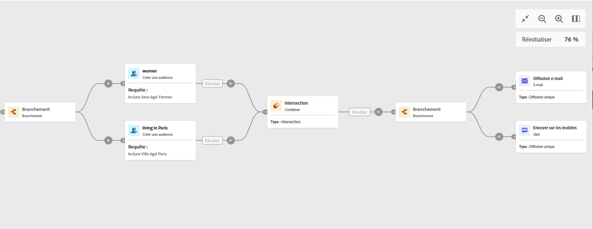

# Branchement {#fork}

>[!CONTEXTUALHELP]
>id="ajo_orchestration_fork"
>title="Activité Branchement"
>abstract="L’activité **Branchement** permet de créer des transitions sortantes afin de lancer plusieurs activités en parallèle."

>[!CONTEXTUALHELP]
>id="ajo_orchestration_fork_transitions"
>title="Transitions de l’activité Branchement"
>abstract="Par défaut, deux transitions sont créées avec une activité **Branchement**. Cliquez sur le bouton **Ajouter une transition** pour définir une transition sortante supplémentaire, puis renseignez son libellé."

+++ Table des matières

| Bienvenue dans les campagnes orchestrées | Lancement de votre première campagne orchestrée | Interrogation de la base de données | Activités de campagnes orchestrées |
|---|---|---|---|
| [Prise en main des campagnes orchestrées](gs-orchestrated-campaigns.md)  [Étapes de configuration](configuration-steps.md)  [Étapes clés de la création de campagnes orchestrées](gs-campaign-creation.md) | [Créer une campagne orchestrée](create-orchestrated-campaign.md)  [Orchestrer des activités](orchestrate-activities.md)  [Envoyer des messages avec des campagnes orchestrées](send-messages.md)  [Démarrer et surveiller la campagne](start-monitor-campaigns.md)  [Reporting](reporting-campaigns.md) | [Utiliser la requête Modeler](orchestrated-query-modeler.md)  [créer votre première requête](build-query.md)  [modifier des expressions](edit-expressions.md) | [Prise en main des activités](activities/about-activities.md)  Activités: [Et-joindre](activities/and-join.md) - [Créer une audience](activities/build-audience.md) - [Modifier la dimension](activities/change-dimension.md) - [Combiner](activities/combine.md) - [Deduplication](activities/deduplication.md) - [Enrichissement](activities/enrichment.md) - [Fork](activities/fork.md) - [Reconciliation](activities/reconciliation.md) - [Split](activities/split.md) - [Wait](activities/wait.md) |

{style="table-layout:fixed"}

+++

  

L’activité **Branchement** est une activité de **contrôle de flux**. Elle permet de créer des transitions sortantes afin de démarrer plusieurs activités en parallèle.

## Configurer l’activité Branchement{#fork-configuration}

Pour configurer l’activité **Branchement**, procédez comme suit :

1. Ajoutez une activité **Branchement** à votre campagne orchestrée.
1. Cliquez sur **Ajouter une transition** pour ajouter une nouvelle transition sortante. Par défaut, deux transitions sont définies.
1. Ajoutez un libellé à chacune de vos transitions.

## Exemple{#fork-example}

Dans l’exemple suivant, nous utilisons deux activités **Branchement** :

* Une avant les deux requêtes, pour les exécuter en même temps.
* Une après l’intersection, pour envoyer simultanément un e-mail et un SMS à la population ciblée.

