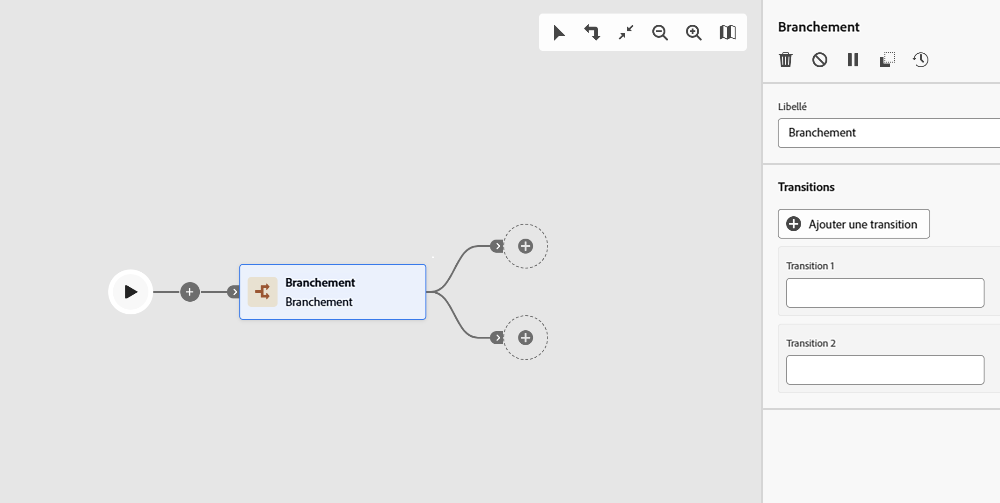

# Branchement {#fork}

>[!CONTEXTUALHELP]
>id="ajo_orchestration_fork"
>title="Activité Branchement"
>abstract="L’activité **Branchement** permet de créer des transitions sortantes afin de lancer plusieurs activités en parallèle."

>[!CONTEXTUALHELP]
>id="ajo_orchestration_fork_transitions"
>title="Transitions de l’activité Branchement"
>abstract="Par défaut, deux transitions sont créées avec une activité **Branchement**. Cliquez sur le bouton **Ajouter une transition** pour définir une transition sortante supplémentaire, puis renseignez son libellé."

L’activité **[!UICONTROL Branchement]** est un composant **[!UICONTROL Contrôle de flux]** qui permet de créer plusieurs transitions sortantes et d’exécuter plusieurs activités en parallèle.

## Configurer l’activité Branchement{#fork-configuration}

Pour configurer l’activité **[!UICONTROL Branchement]**, procédez comme suit :

1. Ajoutez une activité **[!UICONTROL Branchement]** à votre campagne orchestrée.

1. Définissez un **[!UICONTROL libellé]**.

1. Ajoutez un libellé à chaque transition sortante. Par défaut, deux transitions sont fournies.

1. Pour supprimer une transition, cliquez sur l’icône .

1. Si nécessaire, cliquez sur **[!UICONTROL Ajouter une transition]** pour ajouter une transition sortante supplémentaire.
