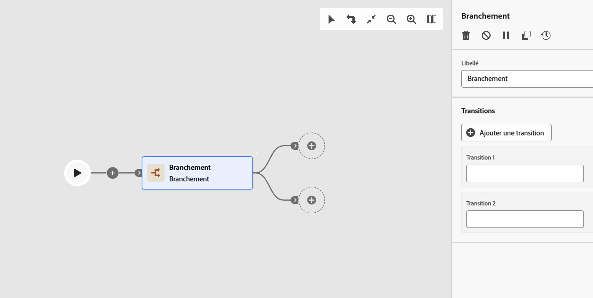

# Branchement {#fork}

>[!CONTEXTUALHELP]
>id="ajo_orchestration_fork"
>title="Activité Branchement"
>abstract="L’activité **Branchement** permet de créer des transitions sortantes afin de lancer plusieurs activités en parallèle."

>[!CONTEXTUALHELP]
>id="ajo_orchestration_fork_transitions"
>title="Transitions de l’activité Branchement"
>abstract="Par défaut, deux transitions sont créées avec une activité **Branchement**. Cliquez sur le bouton **Ajouter une transition** pour définir une transition sortante supplémentaire, puis renseignez son libellé."

L’activité **[!UICONTROL Branchement]** est un composant **[!UICONTROL Contrôle de flux]** qui permet de créer plusieurs transitions sortantes et d’exécuter plusieurs activités en parallèle.

## Configurer l’activité Branchement{#fork-configuration}

Pour configurer l’activité **[!UICONTROL Branchement]**, procédez comme suit :

1. Ajoutez une activité **[!UICONTROL Branchement]** à votre campagne orchestrée.

1. Définissez un **[!UICONTROL libellé]**.

1. Ajoutez un libellé à chaque transition sortante. Par défaut, deux transitions sont fournies.

1. Pour supprimer une transition, cliquez sur l’icône .

1. Si nécessaire, cliquez sur **[!UICONTROL Ajouter une transition]** pour ajouter une transition sortante supplémentaire.

## Exemples {#fork-examples}

Voici une utilisation type de l’activité **[!UICONTROL Branchement]** : cibler la même audience avec deux canaux e-mail différents (un marketing et un transactionnel) pour comparer le comportement de diffusion.

Une fois qu’une activité **[!UICONTROL Créer une audience]** sélectionne la population cible, un **[!UICONTROL Branchement]** crée deux branches parallèles :

* **Branche 1** se connecte à une activité de canal e-mail marketing. Les messages suivent les règles métier standard et sont envoyés uniquement aux profils inscrits.
* La **Branche 2** se connecte à une activité de canal e-mail transactionnel . Les messages contournent les règles métier et sont envoyés à tous les profils, quel que soit le statut d’opt-in.

Ce modèle est utile pour comprendre comment les paramètres de catégorie de canal affectent le comportement de la diffusion et pour envoyer différents types de messages à la même audience au cours d’une seule exécution de campagne.
