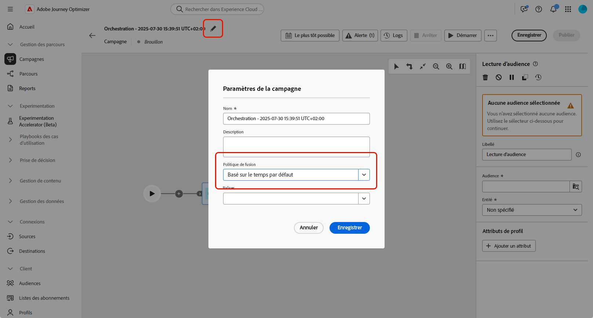
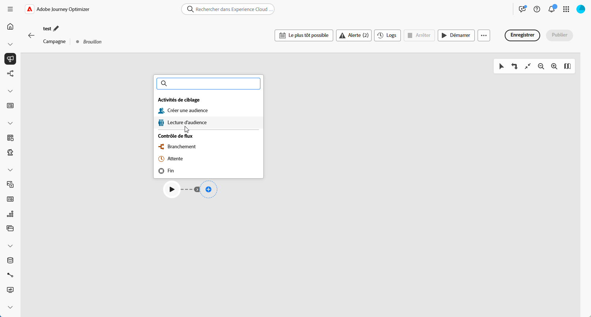
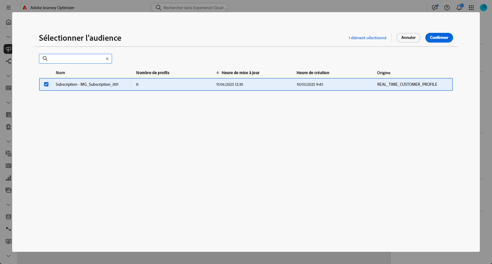
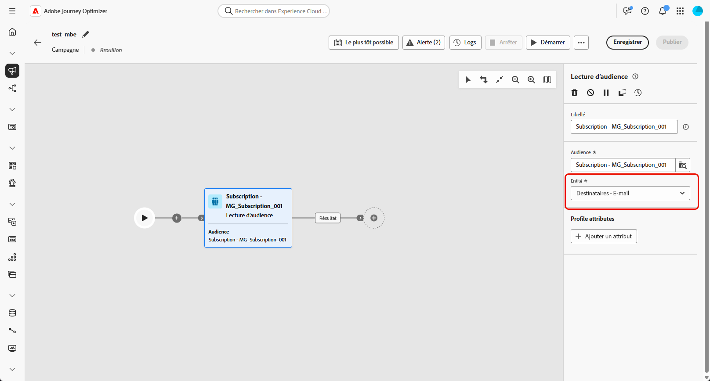
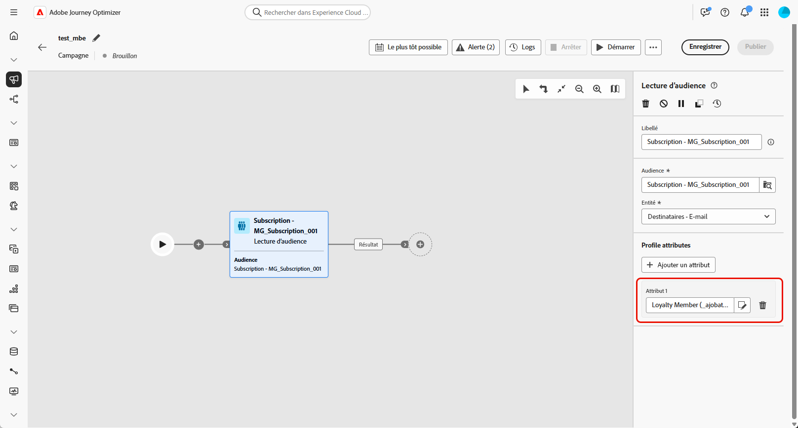
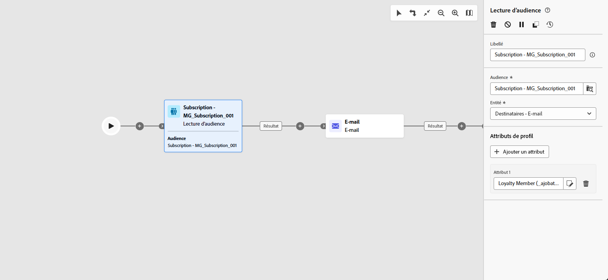

# Lecture d’audience {#read-audience}

>[!CONTEXTUALHELP]
>id="ajo_orchestration_read_audience"
>title="Activité Créer une audience"
>abstract="L’activité **Lecture d’audience** permet de sélectionner l’audience qui va entrer dans la campagne orchestrée. Il peut s’agir d’une audience Adobe Experience Platform existante ou d’une audience extraite d’un fichier CSV. Lors de l’envoi de messages dans le cadre d’une campagne orchestrée, l’audience du message n’est pas définie dans l’activité de canal, mais dans une activité **Lecture d’audience** ou **Créer une audience**."

L’activité **[!UICONTROL Lecture d’audience]** permet de récupérer une audience existante - préalablement enregistrée ou importée - et de la réutiliser dans une campagne orchestrée. Cette activité est particulièrement utile pour cibler un ensemble prédéfini de profils sans avoir à exécuter un nouveau processus de segmentation.

Une fois l’audience chargée, vous pouvez éventuellement l’affiner en sélectionnant un champ d’identité unique et en enrichissant l’audience avec des attributs de profil supplémentaires à des fins de ciblage, de personnalisation ou de création de rapports.

## Cache Lecture d’audience {#cache}

Lors du test d’une campagne orchestrée, l’activité **[!UICONTROL Lecture d’audience]** est généralement assez longue à récupérer les données, ce qui peut allonger les exécutions de test. Pour accélérer le processus, un cache **[!UICONTROL Lecture d’audience]** est disponible.

Le cache stocke l’audience avec les attributs sélectionnés pendant **deux heures maximum**. Pendant ce temps, toute exécution de test ultérieure peut utiliser les résultats mis en cache, ce qui évite d’avoir à récupérer à nouveau les données. Une fois la **période de deux heures** passée, les données doivent être récupérées à nouveau.

Le cache est enregistré pour chaque campagne orchestrée, et non pour l’audience elle-même. Si la même audience est utilisée dans une activité **[!UICONTROL Lecture d’audience]** au sein d’une autre campagne orchestrée, le système devra toujours récupérer les données une nouvelle fois.

Dans les cas suivants, le cache n’est pas conservé :

* Lorsque l’activité **[!UICONTROL Lecture d’audience]** est mise à jour avec de nouveaux attributs, le cache est actualisé avec les nouvelles données d’attributs. Par conséquent, la première exécution de test après la mise à jour prendra plus de temps, car les données doivent être récupérées à nouveau.

* Lorsque la campagne orchestrée est publiée, les dernières données sont récupérées lors de l’exécution de la campagne orchestrée active.

## Configurer l’activité Lecture d’audience {#read-audience-configuration}

Pour configurer l’activité **[!UICONTROL Lecture d’audience]**, procédez comme suit :

1. Avant d’ajouter votre activité **[!UICONTROL Lecture d’audience]**, veillez à sélectionner une **[!UICONTROL politique de fusion]** dans vos paramètres de campagne.

   

1. Ajoutez une activité **[!UICONTROL Lecture d’audience]** à votre campagne orchestrée.

   

1. Saisissez un **[!UICONTROL libellé]** pour votre activité. Ce libellé servira de nom à votre audience.

1. Cliquez sur  pour sélectionner l’audience que vous souhaitez cibler pour votre campagne orchestrée.

   

1. Choisissez une **[!UICONTROL Entité]** dans votre dimension de ciblage de campagne. Ce paramètre définit l’entité cible et l’attribut utilisé pour réconcilier l’audience avec la dimension cible.

   ➡️ [Suivez les étapes présentées sur cette page pour créer votre dimension de ciblage de campagne](../target-dimension.md)

   

1. Sélectionnez **[!UICONTROL Ajouter un attribut]** pour enrichir votre audience sélectionnée avec des données supplémentaires. Cette étape vous permet d’ajouter des attributs de profil à l’audience, ce qui entraîne une liste de destinataires enrichie de ces attributs.

1. Sélectionnez les **[!UICONTROL Attributs]** à ajouter à votre audience. Le sélecteur d’attributs affiche les champs du **Schéma de profil d’union** :

   * pour les audiences CSV, cela inclut les attributs **Profil** et les attributs personnalisés au niveau de l’audience. Ces attributs se trouvent sous le chemin de schéma suivant :

     `<audienceid> > _ajobatchjourneystage > audienceEnrichment > CustomerAudienceUpload > <audienceid>`

   * Pour les audiences AEP standard, seuls les attributs **Profil** sont disponibles, car ils ne comportent pas de champs intégrés spécifiques à l’audience.

   >[!NOTE]
   >
   > Bien que certains attributs puissent apparaître dans le sélecteur, leur disponibilité au moment de l’exécution dépend de la réconciliation et de la fusion réussies des données d’audience avec le profil **Adobe Experience Platform**.

   

Une fois créée, l’audience est disponible en lecture seule et ne peut plus être modifiée. Elle ne peut être utilisée qu’une fois le processus de création terminé.

## Exemple

Dans l’exemple ci-dessous, l’activité **[!UICONTROL Lecture d’audience]** permet de récupérer une audience créée et enregistrée précédemment pour les profils s’étant abonnés à la newsletter. L’audience est ensuite enrichie de l’attribut **Abonnement de fidélité** pour permettre le ciblage des utilisateurs et des utilisatrices qui sont des membres inscrits au programme de fidélité.

