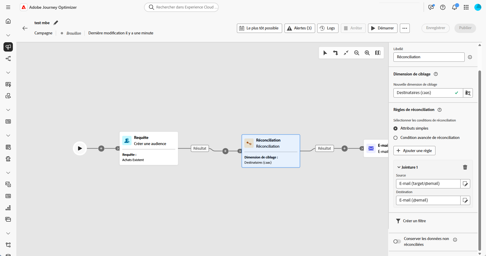
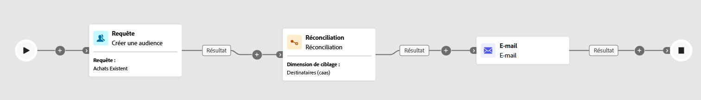

# Réconciliation {#reconciliation}

>[!CONTEXTUALHELP]
>id="ajo_orchestration_reconciliation"
>title="Activité Réconciliation"
>abstract="L’activité **Réconciliation** est une activité de **Ciblage** vous permettant de définir le lien entre Adobe Journey Optimizer et les données dans une table de travail."

>[!CONTEXTUALHELP]
>id="ajo_orchestration_reconciliation_field"
>title="Champ de sélection de la réconciliation"
>abstract="Champ de sélection de la réconciliation"

>[!CONTEXTUALHELP]
>id="ajo_orchestration_reconciliation_condition"
>title="Condition de création de réconciliation"
>abstract="Condition de création de réconciliation"

>[!CONTEXTUALHELP]
>id="ajo_orchestration_reconciliation_complement"
>title="Complément de génération de réconciliation"
>abstract="Complément de génération de réconciliation"

L’activité **[!UICONTROL Réconciliation]** est une activité de **[!UICONTROL Ciblage]** vous permettant de définir le lien entre les données dans Adobe Journey Optimizer et les données dans une table de travail, par exemple les données chargées à partir d’un fichier externe.

L’activité **[!UICONTROL Enrichissement]** permet d’ajouter des données supplémentaires à votre campagne orchestrée, par exemple en combinant des données provenant de plusieurs sources ou en les liant à une ressource temporaire. En revanche, l’activité **[!UICONTROL Réconciliation]** permet de mettre en correspondance des données non identifiées ou externes avec des ressources existantes dans la base de données.

La **[!UICONTROL Réconciliation]** nécessite que les enregistrements associés existent déjà dans le système. Par exemple, si vous importez un fichier d’achat répertoriant les produits, les dates et heures et les informations des clientes et clients, les produits et les clientes et clients doivent déjà être présents dans la base de données pour établir la correspondance.

## Configurer l’activité Réconciliation {#reconciliation-configuration}

>[!CONTEXTUALHELP]
>id="ajo_orchestration_reconciliation_targeting"
>title="Dimension de ciblage"
>abstract="Sélectionnez la nouvelle dimension de ciblage. Une dimension vous permet de définir la population ciblée : destinataires, personnes abonnées à l’application, opérateurs et opératrices, personnes eabonnés, etc. Par défaut, la dimension de ciblage actuelle est sélectionnée."

>[!CONTEXTUALHELP]
>id="ajo_orchestration_reconciliation_rules"
>title="Règles de réconciliation"
>abstract="Sélectionnez les règles de réconciliation à utiliser pour la déduplication. Pour utiliser des attributs, sélectionnez l’option **Attributs simples** et choisissez les champs source et de destination. Pour créer votre propre condition de réconciliation à l’aide du créateur de règles, sélectionnez l’option **Conditions avancées de réconciliation**."

>[!CONTEXTUALHELP]
>id="ajo_orchestration_reconciliation_targeting_selection"
>title="Sélectionner la dimension de ciblage"
>abstract="Sélectionnez la dimension de ciblage de vos données entrantes avec lesquelles vous souhaitez effectuer la réconciliation."
>additional-url="https://experienceleague.adobe.com/docs/campaign-web/v8/audiences/gs-audiences-recipients.html?lang=fr#targeting-dimensions" text="Dimensions de ciblage"

>[!CONTEXTUALHELP]
>id="ajo_orchestration_keep_unreconciled_data"
>title="Conserver les données non réconciliées"
>abstract="Par défaut, les données non réconciliées sont conservées dans la transition sortante et disponibles dans la table de travail pour une utilisation ultérieure. Pour supprimer les données non réconciliées, désactivez l’option **Conserver les données non réconciliées**."

>[!CONTEXTUALHELP]
>id="ajo_orchestration_reconciliation_attribute"
>title="Attribut de réconciliation"
>abstract="Sélectionnez l’attribut à utiliser pour réconcilier les données, puis cliquez sur Confirmer."

Pour configurer l’activité **[!UICONTROL Réconciliation]**, procédez comme suit :

1. Ajoutez une activité **[!UICONTROL Réconciliation]** à la zone de travail.

1. Choisissez une nouvelle dimension de ciblage pour définir les personnes à cibler, telles que les personnes destinataires ou abonnées.

1. Définissez le ou les champs à utiliser pour faire correspondre vos données entrantes avec des profils existants.

1. Pour faire correspondre les données à l’aide de champs de base, sélectionnez **[!UICONTROL Attributs simples]**.

1. Définissez les champs correspondants :

   * **[!UICONTROL Source]** : répertorie les champs de données entrants.

   * **[!UICONTROL Destination]** : fait référence aux champs de la dimension de ciblage sélectionnée.

   Une correspondance se produit lorsque les deux valeurs sont égales. Par exemple, une correspondance par **[!UICONTROL E-mail]** pour identifier les profils.

   

1. Pour ajouter d’autres règles correspondantes, cliquez sur **[!UICONTROL Ajouter une règle]**. Toutes les conditions doivent être remplies pour qu’une correspondance soit trouvée.

1. Pour les conditions plus complexes, choisissez **[!UICONTROL Conditions avancées de réconciliation]**. Utilisez le [créateur de règles](../orchestrated-rule-builder.md) pour définir une logique personnalisée.

1. Pour filtrer les données à réconcilier, cliquez sur **[!UICONTROL Créer un filtre]** et définissez votre condition dans le créateur de règles.

1. Par défaut, les enregistrements qui n’ont pas été mis en correspondance sont conservés dans la transition sortante et stockés dans la table de travail. Pour les supprimer, activez l’option **[!UICONTROL Conserver les données non réconciliées]**.

## Exemple {#example-reconciliation}

Cet exemple utilise l’activité **[!UICONTROL Réconciliation]** dans Adobe Journey Optimizer pour s’assurer que les e-mails sont envoyés uniquement aux clientes et clients reconnus. Les données sont transmises par le biais d’une activité **[!UICONTROL Lecture d’audience]** qui cible les utilisatrices et utilisateurs avec des commandes précédentes. L’activité **[!UICONTROL Réconciliation]** met ensuite en correspondance ces données entrantes avec des profils existants dans la base de données à l’aide du champ d’e-mail.

