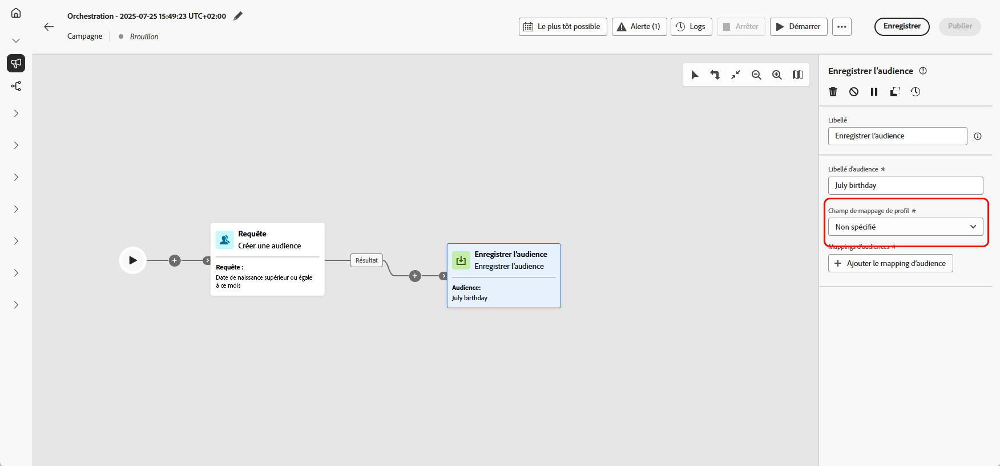

# Enregistrer l’audience {#save-audience}

>[!CONTEXTUALHELP]
>id="ajo_orchestration_save_audience"
>title="Activité Enregistrer l’audience"
>abstract="L’activité **Enregistrer l’audience** est une activité de **Ciblage** qui permet de mettre à jour une audience existante ou d’en créer une nouvelle à partir de la population générée précédemment dans la campagne orchestrée. Une fois créées, ces audiences sont ajoutées à la liste des audiences de l’application. Vous pouvez y accéder à partir du menu **Audiences**."

L’activité **[!UICONTROL Enregistrer l’audience]** est une activité de **[!UICONTROL Ciblage]** utilisée pour créer une nouvelle audience ou mettre à jour une audience existante à partir de la population générée précédemment dans la campagne orchestrée. Une fois créées, ces audiences sont ajoutées à la liste des audiences de l’application. Vous pouvez y accéder à partir du menu **[!UICONTROL Audiences]**.

Elle est généralement utilisée pour capturer des segments d’audience créés dans le même workflow de campagne, ce qui permet de les réutiliser dans de futures campagnes. En règle générale, elle est connectée à d’autres activités de ciblage, telles que **[!UICONTROL Créer une audience]** ou **[!UICONTROL Combiner]**, pour enregistrer la population ciblée finale.
Notez qu’avec l’activité **[!UICONTROL Enregistrer l’audience]** vous ne pouvez pas mettre à jour une audience existante. Vous pouvez uniquement créer une nouvelle audience ou remplacer une audience existante par une nouvelle définition.

## Configurer l’activité Enregistrer l’audience {#save-audience-configuration}

Pour configurer l’activité **[!UICONTROL Enregistrer l’audience]**, procédez comme suit :

1. Ajoutez une activité **[!UICONTROL Enregistrer l’audience]** à votre campagne orchestrée.

1. Saisissez un **[!UICONTROL libellé d’audience]** qui identifiera l’audience enregistrée.

   >[!NOTE]
   >
   >Le **[!UICONTROL libellé]** d’audience doit être unique dans l’ensemble des campagnes. Vous ne pouvez pas réutiliser un libellé d’audience déjà utilisé dans l’activité **[!UICONTROL Enregistrer l’audience]** d’une autre campagne.

1. Choisissez un **[!UICONTROL champ de mappage de profil]** à partir de votre dimension de ciblage de campagne. Ce mappage définit la manière dont les profils de l’**audience enregistrée** sont liés à la dimension cible de la campagne lors de l’exécution.

   Seuls les mappages compatibles avec la dimension cible actuelle - c’est-à-dire celle provenant de la transition entrante - seront disponibles dans la liste déroulante afin de garantir une réconciliation correcte entre l’audience et le contexte de la campagne.

   ➡️ [Suivez les étapes présentées sur cette page pour créer votre dimension de ciblage de campagne](../target-dimension.md)

   

1. Cliquez sur **[!UICONTROL Ajouter des mappages d’audience]** pour inclure des données supplémentaires provenant d’attributs de la **[!UICONTROL dimension cible]** ou d’**[!UICONTROL attributs de profil]** enrichis.

   Vous pouvez ainsi associer plus d’informations à l’activité **[!UICONTROL Audience enregistrée]** au-delà du mappage de profil principal, ce qui améliore le ciblage et les options de personnalisation.

   

1. Finalisez votre configuration en enregistrant et en publiant la campagne orchestrée. Cette opération génère et stocke votre audience.

1. Publiez la campagne pour l’audience à créer ou à remplacer, car l’activité **[!UICONTROL Enregistrer l’audience]** ne s’exécute pas lorsque la campagne est en **[!UICONTROL mode Brouillon]**.

Le contenu de l’audience enregistrée est ensuite disponible dans la vue détaillée de l’audience, accessible depuis le menu **[!UICONTROL Audiences]**, ou sélectionnable lors du ciblage d’une audience, par exemple avec une activité **[!UICONTROL Lecture d’audience]**.

## Exemple {#save-audience-example}

L’exemple suivant montre comment créer une audience simple à l’aide du ciblage. Une requête identifie tous les destinataires et toutes les destinatrices qui ont réservé un voyage au cours des 30 derniers jours en filtrant cette population dans votre campagne orchestrée. En choisissant **Destinataires - CRMID** comme **dimension de ciblage**, l’audience cible chaque événement de réservation individuel plutôt que le ou la destinataire dans son ensemble. L’activité **[!UICONTROL Enregistrer l’audience]** capture ensuite ces profils afin de créer une audience réutilisable des acheteurs et acheteuses récents.

