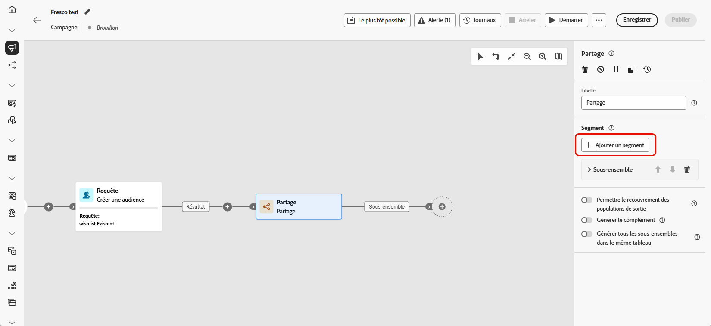
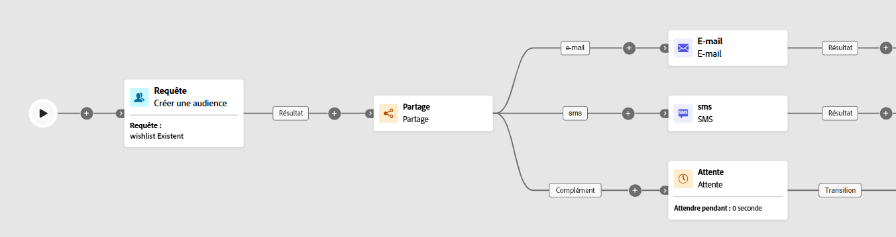

# Partage {#split}

>[!CONTEXTUALHELP]
>id="ajo_orchestration_split"
>title="Activité Partage"
>abstract="L’activité **Partage** permet de segmenter les populations entrantes en plusieurs sous-ensembles selon différents critères de sélection, tels que les règles de filtrage ou la taille de la population."

L’activité **[!UICONTROL Partage]** est une activité de **[!UICONTROL ciblage]** qui segmente la population entrante en plusieurs sous-ensembles selon des critères de sélection définis, tels que les règles de filtrage ou la taille de la population.

## Configurer l’activité Partage {#split-configuration}

>[!CONTEXTUALHELP]
>id="ajo_orchestration_split_segments"
>title="Segments de l’activité de partage"
>abstract="Ajoutez autant de sous-ensembles que vous le souhaitez pour segmenter la population entrante.  Lorsque l’activité **Partage** est exécutée, la population est segmentée entre les différents sous-ensembles dans l’ordre dans lequel ils sont ajoutés à l’activité. Avant de démarrer votre campagne orchestrée, assurez-vous d’avoir trié les sous-ensembles dans l’ordre qui vous convient à l’aide des boutons fléchés."

>[!CONTEXTUALHELP]
>id="ajo_orchestration_split_filter"
>title="Filtre de l’activité Partage"
>abstract="Pour appliquer une condition de filtrage au sous-ensemble, cliquez sur **[!UICONTROL Créer un filtre]** et configurez la règle de filtrage souhaitée à l’aide du créateur de règles. Par exemple, incluez les profils de la population entrante dont l’adresse e-mail existe dans la base de données."

>[!CONTEXTUALHELP]
>id="ajo_orchestration_split_limit"
>title="Limite de l’activité Partage"
>abstract="Pour limiter le nombre de profils sélectionnés par le sous-ensemble, activez la fonction **[!UICONTROL Activer la limite]** et indiquez le nombre ou les pourcentages de la population à inclure."

>[!CONTEXTUALHELP]
>id="ajo_orchestration_split_sorting"
>title="Tri de l’activité Partage"
>abstract="Lorsque vous définissez une limite de population pour un sous-ensemble, vous pouvez classer les profils sélectionnés en fonction d’un attribut de profil spécifique, dans un ordre croissant ou décroissant. Pour ce faire, activez l’option **Activer le tri**. Par exemple, vous pouvez restreindre un sous-ensemble afin de n’inclure que les 50 premiers profils qui ont le montant d’achat le plus élevé."

>[!CONTEXTUALHELP]
>id="ajo_orchestration_split_complement"
>title="Générer un complément pour l’activité Partage"
>abstract="Une fois que vous avez paramétré tous les sous-ensembles, vous pouvez sélectionner la population restante qui ne correspond à aucun des sous-ensembles et les inclure dans une transition sortante supplémentaire. Pour ce faire, activez l’option **Générer un complément**."

>[!CONTEXTUALHELP]
>id="ajo_orchestration_split_generatesubsets"
>title="Générer tous les sous-ensembles dans le même tableau"
>abstract="Activez cette option pour regrouper tous les sous-ensembles dans une seule transition sortante."

>[!CONTEXTUALHELP]
>id="ajo_orchestration_split_emptytransition"
>title="Ignorer la transition vide"
>abstract="Activez l’option **[!UICONTROL Ignorer la transition vide]** pour désactiver la transition sortante pour ce sous-ensemble si la population entrante est vide."

>[!CONTEXTUALHELP]
>id="ajo_orchestration_split_enable_overlapping"
>title="Permettre le chevauchement des populations de sortie"
>abstract=" L’option **[!UICONTROL Permettre le chevauchement des populations de sortie]** permet de gérer les populations qui appartiennent à plusieurs sous-ensembles. Lorsque la case n’est pas cochée, l’activité de partage fait en sorte qu’une personne destinataire ne puisse pas apparaître dans plusieurs transitions de sortie, même si elle répond aux critères de plusieurs sous-ensembles. Elles apparaissent ainsi dans la cible du premier onglet avec les critères correspondants. Lorsque la case est activée, les destinataires se trouvent dans plusieurs sous-ensembles s’ils ou elles répondent à leurs critères de filtre."

Pour configurer l’activité **[!UICONTROL Partage]**, procédez comme suit :

1. Ajoutez une activité **[!UICONTROL Partager]** à votre campagne orchestrée.

1. Le volet de configuration des activités s’ouvre avec un sous-ensemble par défaut. Cliquez sur le bouton **[!UICONTROL Ajouter un segment]** pour ajouter autant de sous-ensembles que vous le souhaitez pour segmenter la population entrante.

   

   >[!IMPORTANT]
   >
   >L’activité **Partage** traite les sous-ensembles dans l’ordre dans lequel ils sont ajoutés. Par exemple, si le premier sous-ensemble capture 70 % de la population, le suivant applique ses critères aux 30 % restants.
   >
   >Avant d’exécuter votre campagne orchestrée, assurez-vous que les sous-ensembles sont ordonnés comme prévu. Utilisez les boutons fléchés pour ajuster leur position.

1. Une fois les sous-ensembles ajoutés, l’activité propose autant de transitions sortante que de sous-ensembles : Nous vous recommandons vivement de modifier le libellé de chaque sous-ensemble afin de les identifier facilement dans la zone de travail de la campagne orchestrée.

1. Configurez les filtres pour chaque sous-ensemble :

   1. Cliquez sur un sous-ensemble pour en ouvrir les paramètres.

   1. Cliquez sur **[!UICONTROL Créer un filtre]** pour définir des règles de filtrage à l’aide du créateur de règles, par exemple, pour sélectionner des profils avec une adresse e-mail valide.

      

   1. Pour limiter le nombre de profils sélectionnés, activez **[!UICONTROL Activer la limite]** et spécifiez un nombre ou un pourcentage.

   1. Pour ignorer une transition lorsque le sous-ensemble est vide, activez **[!UICONTROL Ignorer la transition vide].**

1. Pour inclure des profils qui ne correspondent à aucun sous-ensemble, activez **[!UICONTROL Générer le complément]**. Cela crée une transition sortante supplémentaire pour la population restante.

   >[!NOTE]
   >
   >Activez **[!UICONTROL Générer tous les sous-ensembles dans la même table]** pour regrouper tous les sous-ensembles dans une seule transition sortante.

1. Utilisez **[!UICONTROL Activer le chevauchement des populations de sortie]** pour autoriser les profils à apparaître dans plusieurs sous-ensembles :

   * **Si cette option n’est pas cochée** chaque profil est affecté à un seul sous-ensemble, le premier dont il correspond aux critères, même s’il correspond à d’autres sous-ensembles.

   * **Si cette option est cochée** les profils peuvent être inclus dans plusieurs sous-ensembles s’ils répondent aux critères de chacun d’eux.

L’activité est désormais configurée. Lors de l’exécution de la campagne orchestrée, la population sera segmentée dans les différents sous-ensembles, dans l’ordre dans lequel ils ont été ajoutés à l’activité.

## Exemple{#split-example}

Dans l’exemple suivant, l’activité **[!UICONTROL Partage]** sert à segmenter une audience en sous-ensembles distincts en fonction du canal de communication que nous voulons utiliser :

* **Sous-ensemble 1 « E-mail »** : inclut les profils qui ont fourni un numéro de téléphone.

* **Sous-ensemble 2 « SMS »** : cible les profils dont le numéro de téléphone mobile est stocké dans la base de données.

* **Transition de complément** : capture les profils restants qui ne répondent aux critères d’aucun des sous-ensembles.

