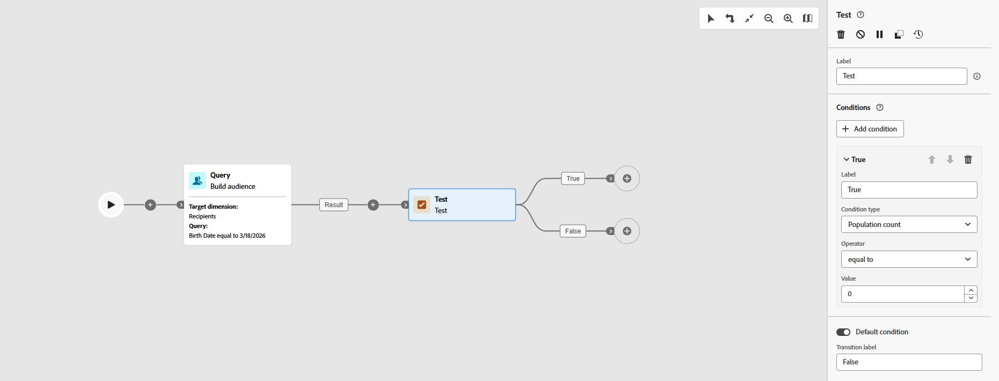

# Test {#test}

>[!CONTEXTUALHELP]
>id="ajo_orchestration_test"
>title="Activité Test"
>abstract="L’activité **Test** est une activité de **contrôle de flux**. Elle permet d’activer des transitions en fonction de conditions spécifiées."

>[!CONTEXTUALHELP]
>id="ajo_orchestration_test_conditions"
>title="Conditions"
>abstract="L’activité **Test** peut avoir plusieurs transitions sortantes. Lors de l’exécution d’une campagne orchestrée, chaque condition est testée de manière séquentielle jusqu’à ce que l’une d’elles soit remplie. Si aucune des conditions n’est remplie, la campagne orchestrée se poursuit selon le chemin de la **[!UICONTROL Condition par défaut]**. Si aucune condition par défaut n’est activée, la campagne orchestrée s’arrête à ce stade."

L’activité **[!UICONTROL Test]** est une activité de **[!UICONTROL contrôle de flux]**. Utilisez-la pour créer une branche dans votre flux de campagne en activant différentes transitions en fonction des conditions que vous définissez. Chaque condition peut évaluer les données de la transition entrante et vous pouvez choisir la transition qui s’exécute en premier par l’ordre dans lequel les conditions sont évaluées.

## Configurer l’activité Test {#test-configuration}

Pour configurer l&#39;activité **[!UICONTROL Test]** :

1. Déposez une activité **[!UICONTROL Test]** dans la zone de travail de votre campagne orchestrée.

1. Par défaut, l’activité ne propose qu’un seul test booléen : lorsque la condition « Vrai » est remplie, cette transition est activée ; dans le cas contraire, la transition « Faux » (par défaut) est activée.

   

1. Définissez la condition d&#39;une transition en renseignant les champs suivants :

   * **Libellé** : nom de la transition afin que vous puissiez l’identifier sur la zone de travail.

   * **Type de condition** : les données à évaluer, par défaut, le nombre de populations.  Les variables (provenant de variables globales ou d’un signal de déclenchement) sont également répertoriées ici et peuvent être sélectionnées pour baser une condition sur une valeur de variable. [Découvrez comment utiliser des variables dans des campagnes orchestrées](../variables-orchestrated-campaigns.md)

   * **Opérateur** : comparaison à appliquer, par exemple égal à, supérieur à, inférieur à. La liste des opérateurs dépend du type de données du type de condition.

   * **Value** : valeur par rapport à laquelle comparer le type de condition.

   

1. Pour créer une branche sur plus de deux résultats, cliquez sur **[!UICONTROL Ajouter une condition]** et définissez un libellé et une condition pour chaque transition supplémentaire.

1. Au moment de l’exécution, la campagne évalue les conditions dans l’ordre et suit la première qui correspond. Lorsqu’aucune condition ne correspond, l’exécution suit **[!UICONTROL Condition par défaut]** si elle est définie ; dans le cas contraire, la campagne s’arrête à l’activité **[!UICONTROL Test]**.

## Exemple {#example}

Dans cet exemple, différentes transitions sont activées en fonction du nombre de profils ciblés par une activité **[!UICONTROL Créer une audience]**. Les conditions sont évaluées dans l’ordre ; la dernière transition est la valeur par défaut et est utilisée lorsqu’aucune condition précédente ne correspond.

* Si plus de 10 000 profils sont ciblés, un e-mail est envoyé.
* Par défaut (aucune condition ne correspond) : lorsque le nombre est inférieur ou égal à 10 000, la population est redirigée vers une transition « ne pas contacter ».

