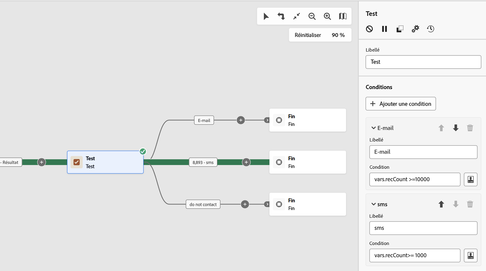

# Test {#test}

>[!CONTEXTUALHELP]
>id="ajo_orchestration_test"
>title="Activité Test"
>abstract="L’activité **Test** est une activité de **contrôle de flux**. Il permet d’activer des transitions en fonction de conditions spécifiées."

>[!CONTEXTUALHELP]
>id="ajo_orchestration_test_conditions"
>title="Conditions"
>abstract="L’activité **Test** peut avoir plusieurs transitions sortantes. Lors de l’exécution d’une campagne orchestrée, chaque condition est testée de manière séquentielle jusqu’à ce que l’une d’elles soit remplie. Si aucune des conditions n’est remplie, la campagne orchestrée continue sur le chemin de la **[!UICONTROL condition par défaut]**. Si aucune condition par défaut n’est activée, la campagne orchestrée s’arrête à ce stade."

+++ Table des matières

| Bienvenue dans les campagnes orchestrées | Lancement de votre première campagne orchestrée | Interroger la base de données | Activités de campagnes orchestrées |
|---|---|---|---|
| [Prise en main des campagnes orchestrées](../gs-orchestrated-campaigns.md)  Création et gestion de schémas et de jeux de données relationnels :  <ul><li>[Prise en main des schémas et des jeux de données](../gs-schemas.md)</li><li>[Schéma manuel](../manual-schema.md)</li><li>[Schéma de chargement de fichier](../file-upload-schema.md)</li><li>[ Ingérer des données ](../ingest-data.md)</li></ul>[Accéder aux campagnes orchestrées et les gérer](../access-manage-orchestrated-campaigns.md) | [Étapes clés de création d’une campagne orchestrée](../gs-campaign-creation.md)  [Créez et planifiez la campagne](../create-orchestrated-campaign.md)  [Orchestrez les activités](../orchestrate-activities.md)  [Lancez et surveillez la campagne](../start-monitor-campaigns.md)  [Créez des rapports](../reporting-campaigns.md) | [Utiliser le créateur de règles](../orchestrated-rule-builder.md)  [Créer votre première requête](../build-query.md)  [Modifier les expressions](../edit-expressions.md)  [Reciblage](../retarget.md) | [Commencer avec les activités](about-activities.md)  Activités : [Rendez-vous](and-join.md) - [Créer une audience](build-audience.md) - [Changement de dimension](change-dimension.md) - [Activités de canal](channels.md) - [Combiner](combine.md) - [Déduplication](deduplication.md) - [Enrichissement](enrichment.md) - [Branchement](fork.md) - [Réconciliation](reconciliation.md) - [Enregistrer l’audience](save-audience.md) - [Partage](split.md) - [Attente](wait.md) |

{style="table-layout:fixed"}

+++

 

>[!BEGINSHADEBOX]

 

Le contenu de cette page n’est pas définitif et peut être modifié.

>[!ENDSHADEBOX]

L’activité **[!UICONTROL Test]** est une activité de **[!UICONTROL contrôle de flux]**. Il permet d’activer des transitions en fonction de conditions spécifiées.

## Configurer l’activité Test {#test-configuration}

Pour configurer l’activité **[!UICONTROL Test]**, procédez comme suit :

1. Ajoutez une activité **[!UICONTROL Test]** à votre campagne orchestrée.

1. Par défaut, l’activité **[!UICONTROL Test]** présente un test booléen simple. Si la condition définie dans la transition « True » est remplie, cette transition sera activée. Sinon, une transition « False » par défaut sera activée.

1. Pour configurer la condition associée à une transition, cliquez sur l’icône **[!UICONTROL Ouvrir la boîte de dialogue de personnalisation]**. Utilisez l’éditeur d’expression pour définir les règles d’activation de cette transition. Vous pouvez également utiliser des variables d’événement, des conditions et des fonctions de date/heure.

   De plus, vous pouvez modifier le champ **[!UICONTROL Libellé]** pour personnaliser le nom de la transition sur la zone de travail de la campagne orchestrée.

   

1. Vous pouvez ajouter plusieurs transitions de sortie à une activité **[!UICONTROL Test]**. Pour ce faire, cliquez sur le bouton **[!UICONTROL Ajouter une condition]** et configurez le libellé et la condition associée pour chaque transition.
v
1. Lors de l’exécution d’une campagne orchestrée, chaque condition est testée de manière séquentielle jusqu’à ce que l’une d’elles soit remplie. Si aucune des conditions n’est remplie, les campagnes orchestrées continuent sur le chemin de la **[!UICONTROL condition par défaut]**. Si aucune condition par défaut n’est activée, les workflows s’arrêtent à ce stade.

## Exemple {#example}

Dans cet exemple, différentes transitions sont activées en fonction du nombre de profils ciblés par une activité **[!UICONTROL Créer une audience]** :

* Si plus de 10 000 profils sont ciblés, un e-mail est envoyé.
* Pour 1 000 à 10 000 profils, un SMS est envoyé.
* Si les profils ciblés sont inférieurs à 1 000, ils sont dirigés vers une transition « Ne pas contacter ».

Pour ce faire, la variable d’événement `vars.recCount` a été utilisée dans les conditions « E-mail » et « SMS » pour comptabiliser le nombre de profils ciblés et activer la transition appropriée.

