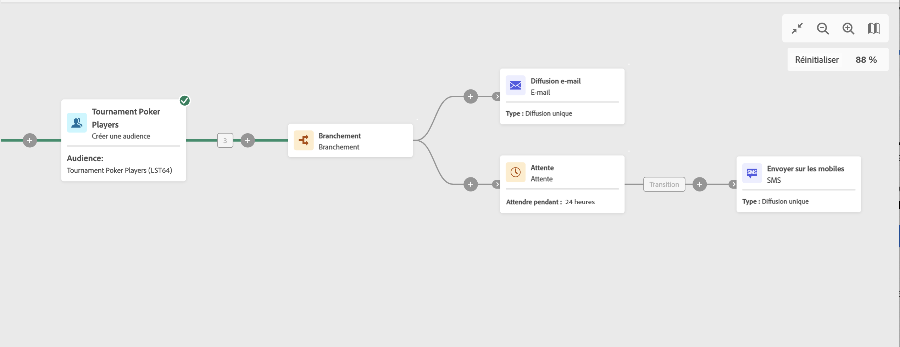

# Attente {#wait}

>[!CONTEXTUALHELP]
>id="ajo_orchestration_wait"
>title="Activité Attente"
>abstract="L’activité **Attente** est utilisée pour retarder la transition d’une activité à une autre."

+++ Table des matières

| Bienvenue dans les campagnes orchestrées | Lancement de votre première campagne orchestrée | Interrogation de la base de données | Activités de campagnes orchestrées |
|---|---|---|---|
| [Prise en main des campagnes orchestrées](../gs-orchestrated-campaigns.md)  [Étapes de configuration](../configuration-steps.md)  [Étapes clés de la création de campagnes orchestrées](../gs-campaign-creation.md) | [Créer une campagne orchestrée](../create-orchestrated-campaign.md)  [Orchestrer des activités](../orchestrate-activities.md)  [Envoyer des messages avec des campagnes orchestrées](../send-messages.md)  [Démarrer et surveiller la campagne](../start-monitor-campaigns.md)  [Reporting](../reporting-campaigns.md) | [Utiliser la requête Modeler](../orchestrated-query-modeler.md)  [créer votre première requête](../build-query.md)  [modifier des expressions](../edit-expressions.md) | [Prise en main des activités](about-activities.md)  Activités: [Et-joindre](and-join.md) - [Créer une audience](build-audience.md) - [Modifier la dimension](change-dimension.md) - [Combiner](combine.md) - [Deduplication](deduplication.md) - [Enrichissement](enrichment.md) - [Fork](fork.md) - [Reconciliation](reconciliation.md) - [Split](split.md) - [Wait](wait.md) |

{style="table-layout:fixed"}

+++

 

L’activité d’**attente** est une activité de **contrôle de flux**. Elle est utilisée pour permettre qu’un certain temps s’écoule entre l’exécution de deux activités. Par exemple, elle permet d’attendre plusieurs jours après une activité de diffusion e-mail puis d’analyser les ouvertures et les clics générés pendant ce laps de temps avant d’appliquer d’autres traitements (e-mail de rappel, création d’audience, etc.).

## Configuration{#wait-configuration}

Pour configurer l’activité d’**attente**, procédez comme suit :

1. Ajoutez une activité **Attente** dans votre campagne orchestrée.

1. Spécifiez la **durée** de l’attente entre les transitions entrante et sortante.

1. Sélectionnez l’unité de temps dans le champ **Périodes** : secondes, minutes, heures, jours.

## Exemple{#wait-example}

L’exemple suivant illustre l’activité **Attente** dans un cas typique. Un e-mail d’invitation à un événement est envoyé. 24 heures après son envoi, une diffusion SMS est envoyée à la même population.

