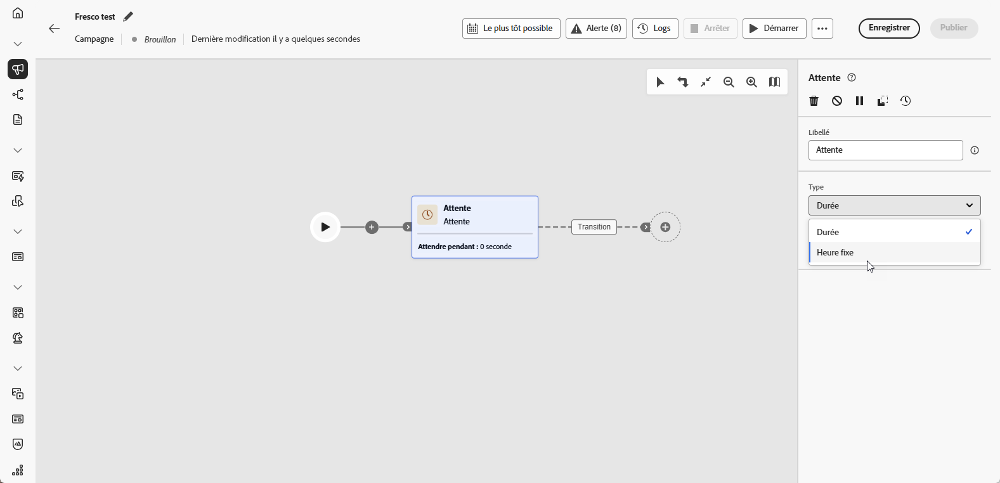
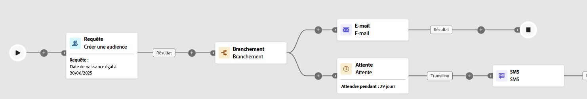

# Attente {#wait}

>[!CONTEXTUALHELP]
>id="ajo_orchestration_wait"
>title="Activité Attente"
>abstract="L’activité **Attente** est utilisée pour retarder la transition d’une activité à une autre."

+++ Table des matières

| Bienvenue dans les campagnes orchestrées | Lancement de votre première campagne orchestrée | Interroger la base de données | Activités de campagnes orchestrées |
|---|---|---|---|
| [Prise en main des campagnes orchestrées](../gs-orchestrated-campaigns.md)  Création et gestion de schémas et de jeux de données relationnels :  <ul><li>[Prise en main des schémas et des jeux de données](../gs-schemas.md)</li><li>[Schéma manuel](../manual-schema.md)</li><li>[Schéma de chargement de fichier](../file-upload-schema.md)</li><li>[ Ingérer des données ](../ingest-data.md)</li></ul>[Accéder aux campagnes orchestrées et les gérer](../access-manage-orchestrated-campaigns.md) | [Étapes clés de création d’une campagne orchestrée](../gs-campaign-creation.md)  [Créez et planifiez la campagne](../create-orchestrated-campaign.md)  [Orchestrez les activités](../orchestrate-activities.md)  [Lancez et surveillez la campagne](../start-monitor-campaigns.md)  [Créez des rapports](../reporting-campaigns.md) | [Utiliser le créateur de règles](../orchestrated-rule-builder.md)  [Créer votre première requête](../build-query.md)  [Modifier les expressions](../edit-expressions.md)  [Reciblage](../retarget.md) | [Commencer avec les activités](about-activities.md)  Activités : [Rendez-vous](and-join.md) - [Créer une audience](build-audience.md) - [Changement de dimension](change-dimension.md) - [Activités de canal](channels.md) - [Combiner](combine.md) - [Déduplication](deduplication.md) - [Enrichissement](enrichment.md) - [Branchement](fork.md) - [Réconciliation](reconciliation.md) - [Enregistrer l’audience](save-audience.md) - [Partage](split.md) - <b>[Attente](wait.md)</b> |

{style="table-layout:fixed"}

+++

 

>[!BEGINSHADEBOX]

 

Le contenu de cette page n’est pas définitif et peut être modifié.

>[!ENDSHADEBOX]

L’activité **[!UICONTROL Attente]** est un composant **[!UICONTROL Contrôle de flux]** utilisé pour introduire un délai entre deux activités d’une campagne orchestrée. Elle permet de vous assurer que vos activités de suivi arrivent à un meilleur moment et sont plus pertinentes pour l’interaction client.

Par exemple, vous pouvez attendre quelques jours après une diffusion e-mail pour suivre les ouvertures et les clics avant d’envoyer un message de relance.

## Configuration{#wait-configuration}

Pour configurer l’activité d’**[!UICONTROL attente]**, procédez comme suit :

1. Ajoutez une activité **[!UICONTROL Attente]** dans votre campagne orchestrée.

1. Sélectionnez le type d’attente qui répond le mieux à vos besoins.

   * **[!UICONTROL Durée]** : indiquez un délai en secondes, minutes, heures ou jours avant de passer à l’activité suivante.

   * **[!UICONTROL Heure fixe]** : définissez une date et une heure spécifiques auxquelles l’activité suivante doit commencer.

   

## Exemple{#wait-example}

L’exemple suivant illustre l’activité **[!UICONTROL Attente]** dans un cas type.  Un e-mail avec un code de promotion est envoyé aux profils dont c’est l’anniversaire. Au bout de 29 jours, un SMS est envoyé au même groupe pour leur rappeler que leur code de promotion d’anniversaire va expirer.

