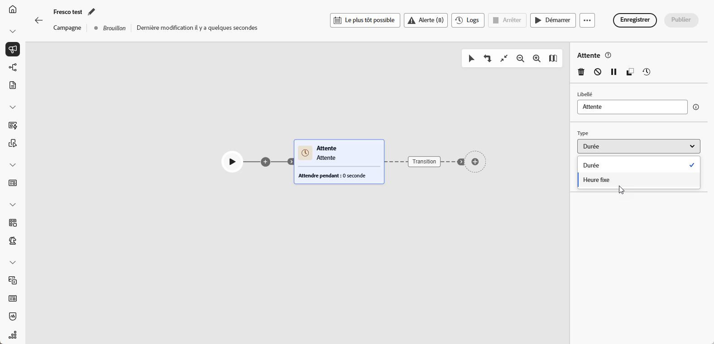

# Attente {#wait}

>[!CONTEXTUALHELP]
>id="ajo_orchestration_wait"
>title="Activité Attente"
>abstract="L’activité **Attente** est utilisée pour retarder la transition d’une activité à une autre."

L’activité **[!UICONTROL Attente]** est un composant de **[!UICONTROL Contrôle du flux]** utilisé pour introduire un délai entre deux activités dans une campagne orchestrée. Elle permet de vous assurer que vos activités de suivi arrivent à un meilleur moment et sont plus pertinentes pour l’engagement client.

Par exemple, vous pouvez attendre quelques jours après une diffusion e-mail pour suivre les ouvertures et les clics avant d’envoyer un message de relance.

## Configuration{#wait-configuration}

>[!IMPORTANT]
>
>Les données des tables temporaires ne persistent pas au-delà de **5 jours**. Lorsque vous utilisez des attentes **[!UICONTROL Durée]** ou **[!UICONTROL Durée fixe]**, assurez-vous que le temps écoulé jusqu’à ce que l’activité suivante se termine dans cette limite afin que les données intermédiaires restent disponibles.

Pour configurer l’activité d’**[!UICONTROL attente]**, procédez comme suit :

1. Ajoutez une activité **[!UICONTROL Attente]** dans votre campagne orchestrée.

1. Sélectionnez le type d’attente qui répond le mieux à vos besoins.

   * **[!UICONTROL Durée]** : indiquez un délai en secondes, minutes, heures ou jours avant de passer à l’activité suivante.

   * **[!UICONTROL Heure fixe]** : définissez une date et une heure spécifiques auxquelles l’activité suivante doit commencer.

   

## Exemple{#wait-example}

L’exemple suivant illustre l’activité **[!UICONTROL Attente]** dans un cas type.  Un e-mail avec un code de promotion est envoyé aux profils dont c’est l’anniversaire. Après 2 jours, un SMS est envoyé au même groupe pour leur rappeler que leur code de promotion d’anniversaire va expirer.

