# Créer votre première règle {#build-query}

+++ Table des matières

| Bienvenue dans les campagnes orchestrées | Lancer votre première campagne orchestrée | Interroger la base de données | Activités de campagnes orchestrées |
|---|---|---|---|
| [Prise en main des campagnes orchestrées](gs-orchestrated-campaigns.md)  [Étapes de configuration](configuration-steps.md)  [Accédez aux campagnes orchestrées et gérez-les](access-manage-orchestrated-campaigns.md) | [Étapes clés de création de campagne orchestrée](gs-campaign-creation.md)  [Créez et planifiez la campagne](create-orchestrated-campaign.md)  [Orchestrez les activités](orchestrate-activities.md)  [Lancez et surveillez la campagne](start-monitor-campaigns.md)  [Reporting](reporting-campaigns.md) | [Utiliser le créateur de règles](orchestrated-rule-builder.md)  <b>[Créer votre première requête](build-query.md)</b>  [Modifier les expressions](edit-expressions.md)  [Reciblage](retarget.md) | [Prise en main des activités](activities/about-activities.md)  Activités: [Et-joindre](activities/and-join.md) - [Créer une audience](activities/build-audience.md) - [Modifier la dimension](activities/change-dimension.md) - [Activités de canal](activities/channels.md) - [Combine](activities/combine.md) - [Deduplication](activities/deduplication.md) - [Enrichissement](activities/enrichment.md) - [Fork](activities/fork.md) - [Reconciliation](activities/reconciliation.md) - [Enregistrer l’audience](activities/save-audience.md) - [Split](activities/split.md) - [Wait](activities/wait.md) |

{style="table-layout:fixed"}

+++

 

Les étapes principales pour créer des règles pour vos campagnes orchestrées sont les suivantes :

1. **Ajouter des conditions** - Créez des conditions personnalisées pour filtrer votre requête en créant votre propre condition avec des attributs de la base de données et des expressions avancées.
1. **Combiner des conditions** - Organisez les conditions dans la zone de travail à l’aide de groupes et d’opérateurs logiques.
1. **Vérifier et valider la règle** - Vérifiez les données résultantes de votre règle avant de l’enregistrer.

## Ajoutez une condition {#conditions}

Pour ajouter des conditions à votre requête, procédez comme suit :

1. Accédez au créateur de règles à partir d’une activité **[!UICONTROL Créer une audience]**.

1. Cliquez sur le bouton **Ajouter une condition** pour créer une première condition pour votre requête.

   Vous pouvez également lancer votre requête à l’aide d’un filtre prédéfini. Pour ce faire, cliquez sur le bouton **[!UICONTROL Sélectionner ou enregistrer le filtre]** et choisissez **[!UICONTROL Sélectionner un filtre prédéfini]**.

   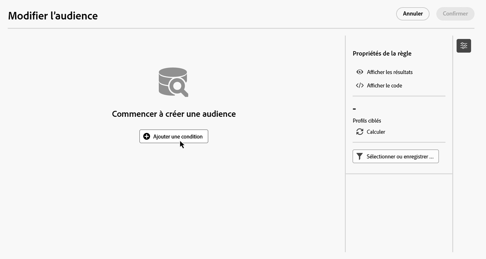

1. Identifiez l’attribut de la base de données à utiliser comme critère pour votre condition. L’icône « i » en regard d’un attribut fournit des informations sur la table où il est stocké et sur son type de données.

   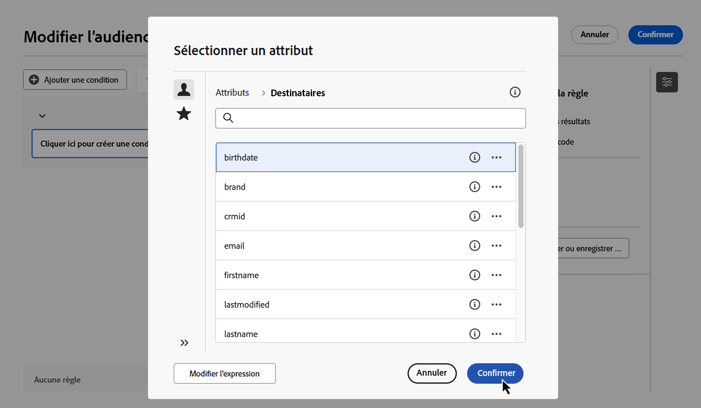

   >[!NOTE]
   >
   >Le bouton **Modifier l&#39;expression** permet d&#39;utiliser l&#39;éditeur d&#39;expressions pour définir manuellement une expression à l&#39;aide des champs de la base de données et des fonctions d&#39;assistance. [Découvrez comment modifier des expressions](../orchestrated/edit-expressions.md)

1. Cliquez sur le bouton  en regard d’un attribut pour accéder à ces options supplémentaires :

+++ Répartition des valeurs

   Analysez la distribution des valeurs pour un attribut donné dans le tableau. Cette fonctionnalité est particulièrement utile pour comprendre les valeurs disponibles, leur nombre et leur pourcentage. Cela permet également d’éviter des problèmes, par exemple en matière de majuscules ou d’orthographe, lors de la création de requêtes ou d’expressions.

   Pour les attributs comportant un grand nombre de valeurs, l’outil affiche uniquement les vingt premières valeurs. Une notification **[!UICONTROL Chargement partiel]** s’affiche pour vous informer de cette limite. Vous pouvez appliquer des filtres avancés pour affiner les résultats affichés et mettre l’accent sur des valeurs ou des sous-ensembles de données spécifiques.

   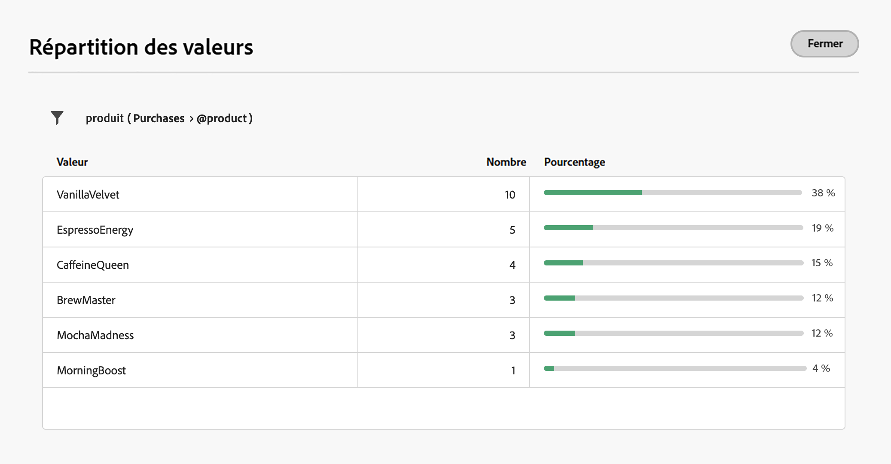

+++

+++ Ajout aux favoris

   L’ajout d’attributs à votre menu de favoris permet d’accéder rapidement aux attributs les plus fréquemment utilisés. Vous pouvez ajouter jusqu’à 20 attributs aux favoris. Les attributs favoris et récents sont associés à chaque utilisateur et utilisatrice au sein d’une organisation, ce qui garantit l’accessibilité sur différents ordinateurs et offre une expérience fluide sur tous les appareils.

   Pour accéder aux attributs mis en favoris, utilisez le menu **[!UICONTROL Favoris et récents]**. Les attributs favoris apparaissent en premier, suivis des attributs récemment utilisés, ce qui facilite la localisation des attributs requis. Pour supprimer un attribut des favoris, sélectionnez à nouveau l’icône en forme d’étoile.

   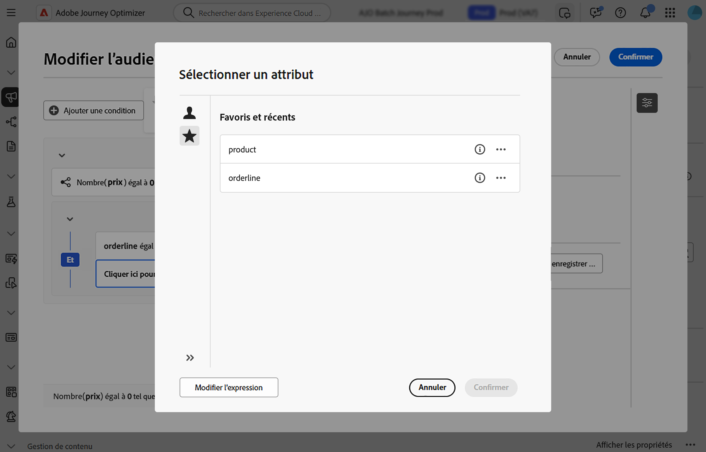

+++

1. Cliquez sur **[!UICONTROL Confirmer]** pour ajouter l’attribut sélectionné à votre condition.

1. Un volet de propriétés s’affiche, dans lequel vous pouvez configurer la valeur souhaitée pour l’attribut.

   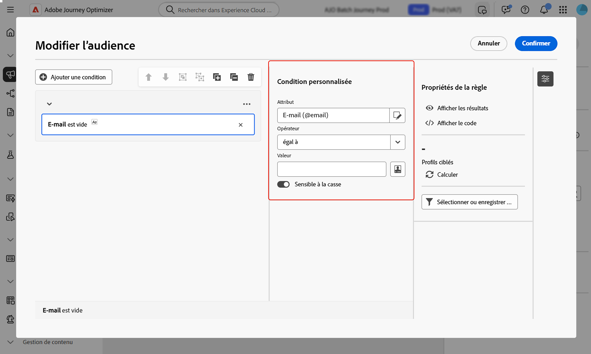

1. Sélectionnez l’opérateur **[!UICONTROL Operator]** à appliquer dans la liste déroulante. Différents opérateurs sont disponibles. Les opérateurs disponibles dans la liste déroulante dépendent du type de données de l’attribut.

   +++Liste des opérateurs disponibles

   | Opérateur | Rôle | Exemple |
   |---|---|---|
   | Égal à | Obtenir un résultat rigoureusement identique à ce qui est entré dans la seconde colonne Valeur. | Nom (@lastName) égal à « Jones ». Ici ne seront renvoyées que les personnes destinataires dont le nom est « Jones ». |
   | Différent de | Obtenir un résultat différent de la valeur renseignée. | Langue (@language) différente de « Anglais ». |
   | Supérieur à | Obtenir un résultat supérieur à la valeur indiquée. | Age (@age) supérieur à 50 renvoie toutes les valeurs supérieures à « 50 », donc « 51 », « 52 », etc. |
   | Inférieur à | Obtenir un résultat inférieur à la valeur indiquée. | Date de création (@created) plus tôt que « DaysAgo(100) » renvoie toutes les personnes destinataires créées il y a moins de 100 jours. |
   | Supérieur ou égal à | Obtenir un résultat rigoureusement égal ou supérieur à la valeur renseignée. | Age (@age) supérieur ou égal à « 30 » renvoie toutes les personnes destinataires dont l’âge est de 30 ans ou plus. |
   | Inférieur ou égal à | Obtenir un résultat rigoureusement égal ou inférieur à la valeur renseignée. | Âge (@age) inférieur ou égal à « 60 », afin de retrouver les personnes destinataires dont l’âge est de 60 ans et moins. |
   | Compris dans | Obtenir les résultats compris dans les valeurs indiquées. Ces valeurs doivent être séparées par une virgule. | Date de naissance (@birthDate) est compris dans « 12/10/1979,12/10/1984 ». Les personnes destinataires nées entre ces dates sont alors renvoyées. |
   | Pas dans | Le principe est le même qu’avec l’opérateur Est compris dans. Ici, les personnes destinataires sont exclues en fonction des valeurs saisies. | La date de naissance (@birthDate) n’est pas incluse dans 12/10/1979,12/10/1984. Les personnes destinataires nées entre ces dates ne seront pas renvoyées. |
   | Est vide | Renvoie les résultats correspondant à une valeur vide dans la seconde colonne Valeur. | Mobile (@mobilePhone) est vide afin de retrouver toutes les personnes destinataires ne disposant pas d’un numéro de téléphone mobile. |
   | N’est pas vide | Le principe est contraire à l’opérateur Est vide. Il n’est pas nécessaire de saisir de données dans la seconde colonne Valeur. | E-mail (@email) n’est pas vide. |
   | Commence par | Renvoie des résultats commençant par la valeur indiquée. | N° de compte (@account) commence par « 32010 ». |
   | Ne commence pas par | Renvoie les résultats qui ne commencent pas par la valeur renseignée. | N° de compte (@account) ne commence pas par « 20 ». |
   | Contient | Renvoies les résultats comportant au moins la valeur renseignée. | Domaine d’e-mail (@domain) contient « mail ». Ici, tous les noms de domaine comportant la valeur « mail », comme « gmail.com », seront renvoyés en résultat. |
   | Ne contient pas | Ne pas obtenir de résultats contenant au moins la valeur renseignée. | Domaine d’e-mail (@domain) ne contient pas « vo ». Les noms de domaine contenant « vo », tels que « voila.fr », n’apparaîtront pas dans les résultats. |
   | Comme | Quasiment identique à l’opérateur « Contient ». Il permet d’insérer un caractère générique « % » dans la valeur. | Nom (@lastName) comme « Jon%s ». Le caractère générique agit comme un « joker » pour trouver des noms tels que « Jones ». |
   | Pas comme | Quasiment identique à l’opérateur « Contient ». Il permet d’insérer un caractère générique « % » dans la valeur. | Nom (@lastName) pas comme « Smi%h ». Les personnes destinataires dont le nom est « Smith » ne seront pas renvoyées. |

+++

1. Dans le champ **Valeur**, définissez la valeur attendue. Vous pouvez également utiliser l’éditeur d’expression pour définir manuellement une expression à l’aide de champs de la base de données et de fonctions d’assistance. Pour ce faire, cliquez sur l’icône . [Découvrez comment modifier des expressions](../orchestrated/edit-expressions.md)

   Pour les attributs de type date, des valeurs prédéfinies sont disponibles à l’aide de l’option **[!UICONTROL Préréglages]**.

   +++Voir exemple

   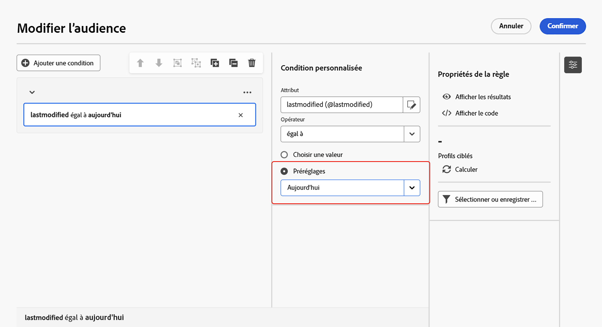

+++

### Conditions personnalisées sur les tables liées (liens 1-1 et 1-N){#links}

Les conditions personnalisées vous permettent d’interroger des tables liées à la table actuellement utilisée par votre règle. Cela inclut les tables avec un lien de cardinalité 1-1 ou les tables de collection (lien 1-N).

Pour un **lien 1-1**, accédez à la table liée, sélectionnez l’attribut souhaité et définissez la valeur attendue.

Vous pouvez également sélectionner directement un lien de table dans le sélecteur de **Valeur** et confirmer. Dans ce cas, les valeurs disponibles pour la table sélectionnée doivent être sélectionnées à l’aide d’un sélecteur dédié, comme illustré dans l’exemple ci-dessous.

+++Exemple de requête

Ici, la requête cible les marques dont le libellé est « running ».

1. Naviguez dans la table **Marque** et sélectionnez l’attribut **Libellé**.

   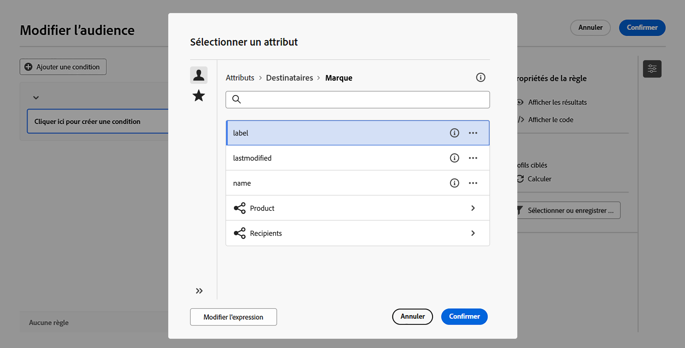

1. Définissez la valeur attendue de l’attribut.

   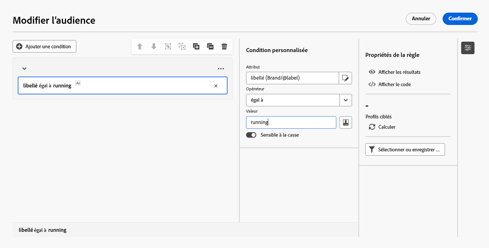

Voici un exemple de requête dans laquelle un lien de table a été directement sélectionné. Les valeurs disponibles pour cette table doivent être sélectionnées avec un sélecteur dédié.

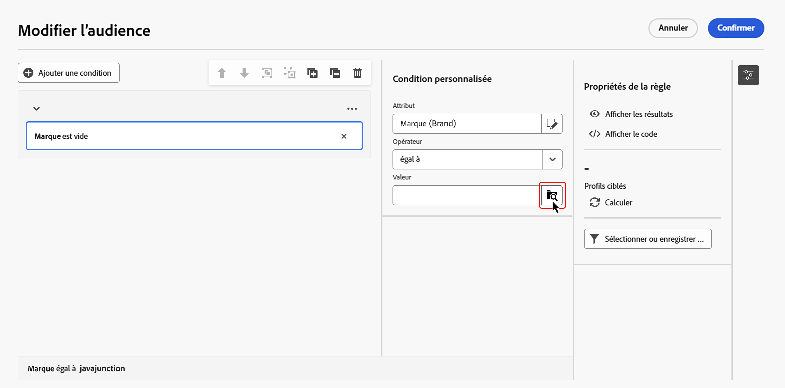

+++

Pour un **lien 1-N**, vous pouvez définir des sous-conditions afin d’affiner votre requête, comme illustré dans l’exemple ci-dessous.

+++Exemple de requête

Ici, la requête cible les destinataires qui ont effectué des achats liés au produit Brewmaster, pour plus de 100 $.

1. Sélectionnez le tableau **Achats** et confirmez.

1. Cliquez sur **[!UICONTROL Ajouter une condition]** pour définir les sous-conditions à appliquer à la table sélectionnée.

   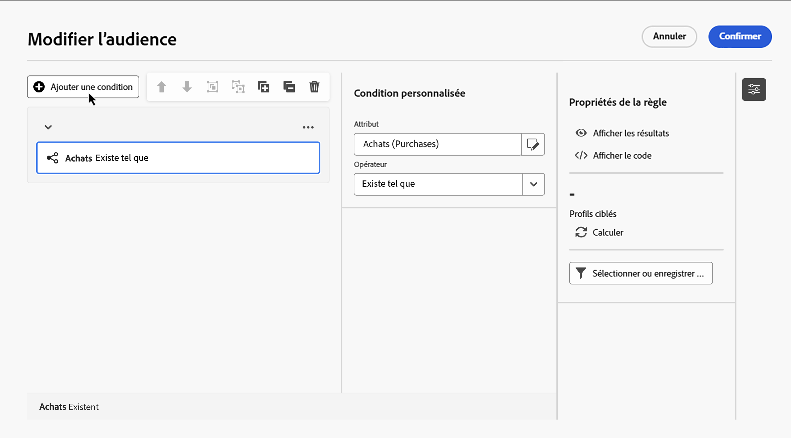

1. Ajoutez des sous-conditions en fonction de vos besoins.

   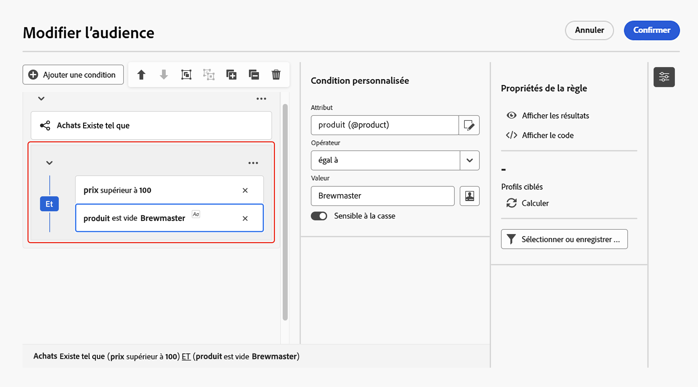

+++

### Conditions personnalisées avec données agrégées {#aggregate}

Les conditions personnalisées vous permettent d’effectuer des opérations d’agrégat. Pour cela, vous devez sélectionner directement un attribut dans un tableau de collection :

1. Naviguez dans le tableau de collection souhaité et sélectionnez l’attribut sur lequel vous souhaitez effectuer une opération d’agrégat.

1. Dans le volet des propriétés, activez l’option **Données agrégées** et sélectionnez la fonction d’agrégat souhaitée.

   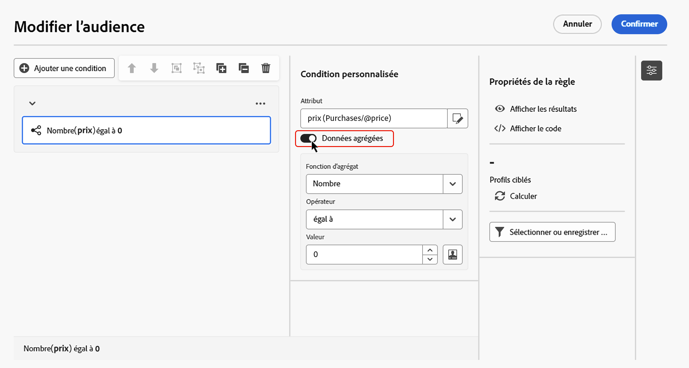

## Combinaison de conditions à l’aide d’opérateurs {#operators}

Chaque fois que vous ajoutez une nouvelle condition dans votre règle, elle est automatiquement liée à la condition existante par un opérateur **AND**. Cela signifie que les résultats des deux conditions sont combinés.

Pour modifier l’opérateur ou l’opératrice entre des conditions, cliquez dessus et sélectionnez l’opérateur ou l’opératrice de votre choix.

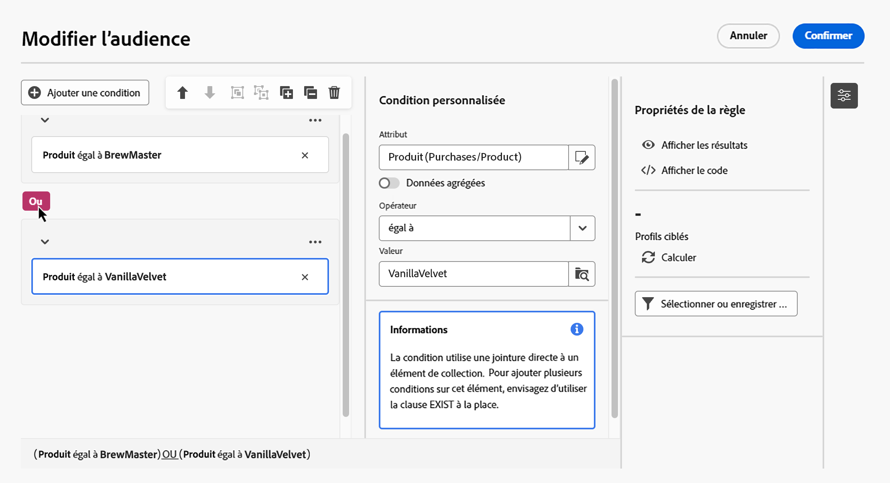

Les opérateurs disponibles sont les suivants :

* **ET (Intersection)** : combine les résultats correspondant à tous les composants de filtrage dans les transitions sortantes.
* **OU (Union)** : inclut des résultats correspondant à au moins un des composants de filtrage dans les transitions sortantes.
* **EXCEPT (Exclusion)** : exclut les résultats correspondant à tous les composants de filtrage de la transition sortante.

## Manipulation de conditions {#manipulate}

La barre d’outils de la zone de travail du créateur de règles fournit des options permettant de manipuler facilement les conditions de votre règle :

| Icône de la barre d’outils | Description |
|--- |--- |
|  | Déplacez le composant d’une ligne vers le haut. |
|  | Déplacez le composant vers le bas d’une ligne. |
|  | Placez deux composants dans un groupe. |
|  | Séparez les composants d’un seul groupe. |
|  | Développez tous les groupes. |
|  | Réduire tous les groupes. |
|  | Supprimez tous les groupes et composants. |

Selon vos besoins, vous devrez peut-être créer des groupes intermédiaires de composants en regroupant les composants dans un même groupe et en les liant entre eux.

* Pour regrouper deux conditions existantes, sélectionnez l’une des deux conditions et cliquez sur le bouton  ou  pour la regrouper avec la condition ci-dessus ou ci-dessous.

* Pour regrouper une condition existante avec une nouvelle, sélectionnez la condition, cliquez sur le bouton  et sélectionnez **[!UICONTROL Ajouter un groupe]**. Sélectionnez le nouvel attribut à ajouter au groupe, puis confirmez.

  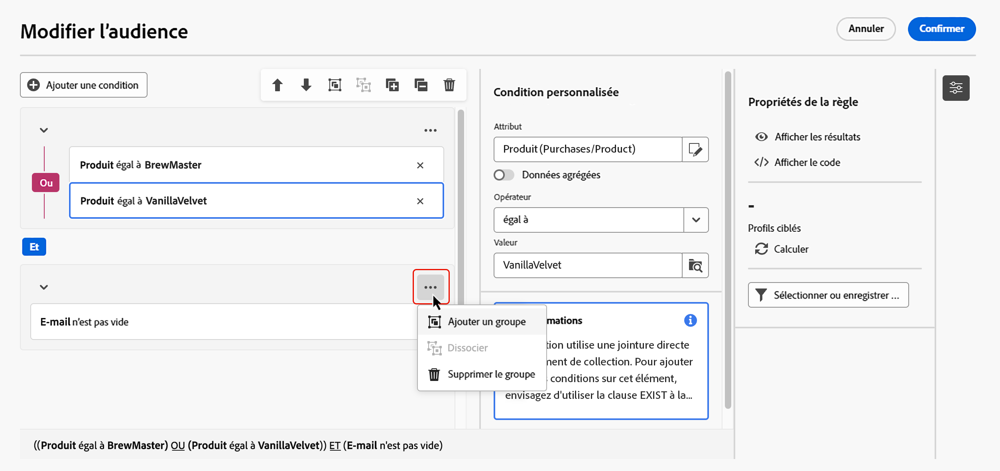

Dans l’exemple ci-dessous, nous avons créé un groupe intermédiaire pour cibler les clients qui ont acheté le produit BrewMaster ou VanillaVelvet.

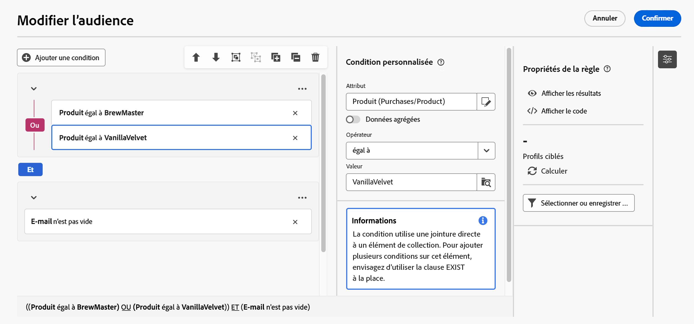

## Vérifier et valider votre requête

Une fois votre requête créée dans la zone de travail, vous pouvez la vérifier à l’aide du volet **Propriétés de la règle**. Les opérations disponibles sont les suivantes :

* **Afficher les résultats** : affiche les données issues de votre requête.
* **Affichage du code** : affiche une version basée sur le code de la requête en SQL.
* **Calculer** : met à jour et affiche le nombre d’enregistrements ciblés par votre règle.
* **Sélectionner ou enregistrer un filtre** : choisissez un filtre prédéfini existant à utiliser dans la zone de travail ou enregistrez votre requête en tant que filtre prédéfini pour une réutilisation ultérieure.

 

    >[!IMPORTANT]
    >
    >Sélectionnez un filtre prédéfini dans le volet Propriétés de la règle pour remplacer la règle créée dans la zone de travail par le filtre sélectionné.

Lorsque votre règle est prête, cliquez sur le bouton **[!UICONTROL Confirmer]** dans le fichier pour l’enregistrer.
