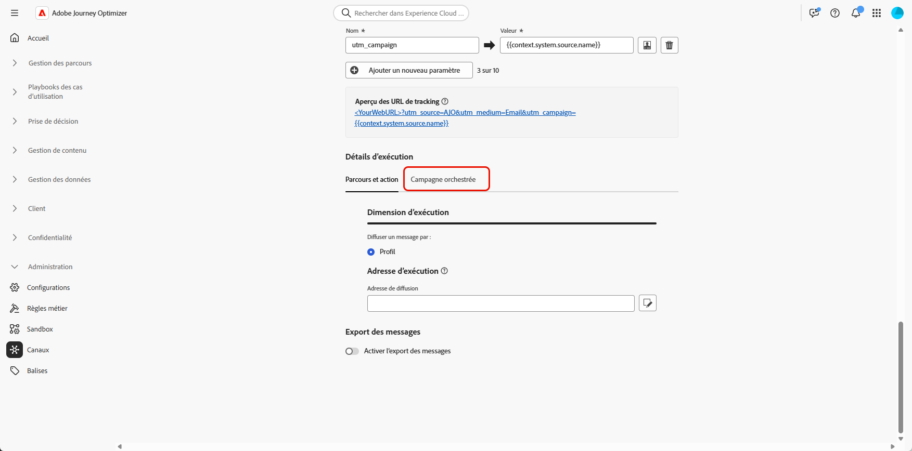
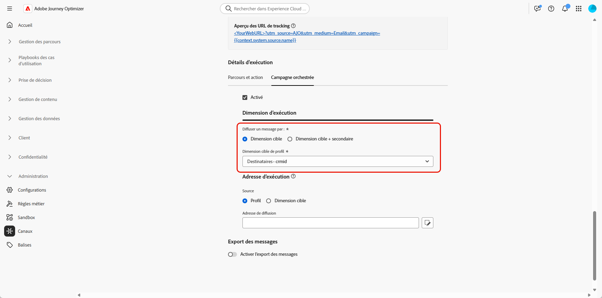

# Configurer votre configuration des canaux {#channel-configuration}

Après avoir configuré la [dimension cible](target-dimension.md), vous devez définir la **[!UICONTROL configuration des canaux]** ainsi que les **[!UICONTROL détails d’exécution]** correspondants. Vous pouvez ainsi définir :

* **Le niveau de diffusion des messages** : par exemple, l’envoi d’un message par destinataire, comme un e-mail unique par personne.

* **L’adresse d’exécution** : le champ de contact spécifique à utiliser pour l’envoi, comme une adresse e-mail ou un numéro de téléphone.

Pour configurer la configuration de canal :

1. Commencez par créer et configurer la **[!UICONTROL configuration de canal]**.

   Il est également possible de mettre à jour une **[!UICONTROL configuration de canal]** existante.

   ➡️[Suivez les étapes décrites dans cette page](../email/surface-personalization.md)

1. Dans la section **[!UICONTROL Détails d’exécution]** de la **[!UICONTROL configuration de canal]**, accédez à l’onglet **[!UICONTROL Campagnes orchestrées]**.

   

1. Cliquez sur **[!UICONTROL Activé]** pour le rendre compatible avec les campagnes orchestrées.

1. Choisissez votre méthode de diffusion :

   * **[!UICONTROL Dimension cible]** : envoi à l’entité principale, par ex. destinataire.

   * **[!UICONTROL Dimension cible + dimension secondaire]** : envoi en utilisant l’entité principale et l’entité secondaire, par ex. destinataire + contrat.

1. Dans la liste déroulante, sélectionnez votre [dimension cible précédemment créée](#targeting-dimension).

   

1. Si vous avez sélectionné **[!UICONTROL Dimension cible + dimension secondaire]** comme méthode de diffusion, choisissez une **[!UICONTROL Dimension secondaire]** pour définir le contexte de diffusion des messages.

1. Dans la section **[!UICONTROL Adresse d’exécution]**, choisissez quelle **[!UICONTROL source]** doit être utilisée pour récupérer l’adresse de diffusion, comme l’adresse e-mail ou le numéro de téléphone.

   * **[!UICONTROL Profil]** : sélectionnez cette option si l’adresse de diffusion, par exemple l’adresse e-mail, est stockée directement dans le profil client principal.

     Utile lors de l’envoi de messages au client ou à la cliente principal(e), et non à une entité associée spécifique.

   * **[!UICONTROL Dimension cible]** : choisissez cette option si l’adresse de diffusion est stockée dans l’entité principale, par exemple un destinataire.

     Utile lorsque chaque destinataire possède sa propre adresse de diffusion, comme une adresse e-mail ou un numéro de téléphone différent.

   * **[!UICONTROL Dimension secondaire]** : lorsque vous utilisez **[!UICONTROL Dimension cible + dimension secondaire]** comme méthode de diffusion, sélectionnez la **[!UICONTROL dimension secondaire]** correspondante déjà configurée.

     Par exemple, si la dimension secondaire représente une réservation ou un abonnement, l’adresse d’exécution, telle qu’une adresse e-mail, peut être récupérée à partir de ce niveau. Cela s’avère utile lorsque les profils utilisent des coordonnées différentes lors de la réservation ou de l’abonnement à un service.

1. Dans le champ **[!UICONTROL Adresse de diffusion]**, cliquez sur  pour choisir le champ spécifique à utiliser pour votre diffusion de messages.

   

1. Une fois la configuration effectuée, cliquez sur **[!UICONTROL Envoyer]**.

Votre canal est maintenant prêt à être utilisé avec les **campagnes orchestrées**, et les messages seront diffusés en fonction de la dimension cible sélectionnée.

## Paramètres de tracking des URL {#url-tracking}

Lors de la configuration de votre canal, vous pouvez définir des paramètres de tracking d’URL afin de surveiller les performances de vos campagnes par e-mail en ajoutant des métadonnées à vos liens trackés, à des fins d’analyse et de création de rapports.

Pour cela, les attributs contextuels spécifiques aux campagnes orchestrées sont disponibles selon la syntaxe `{{context.system.source.*}}` :

* **`context.system.source.id`** : identifiant de campagne orchestrée
* **`context.system.source.name`** : nom de la campagne orchestrée
* **`context.system.source.versionId`** : ID de version de campagne orchestrée
* **`context.system.source.actionId`** : identifiant du nœud d’action de canal
* **`context.system.source.actionName`** : nom du nœud d’action de canal
* **`context.system.source.channel`** : type de canal (e-mail, SMS, notification push)
* **`context.system.IdentityNamespace`** : espace de noms d’identité utilisé

Par exemple :

```
www.YourLandingURL.com?utm_source=AJO&utm_campaign={{context.system.source.id}}&utm_content={{context.system.source.actionName}}
```

En savoir plus sur les paramètres de tracking d’URL dans [cette section](../email/url-tracking.md).
