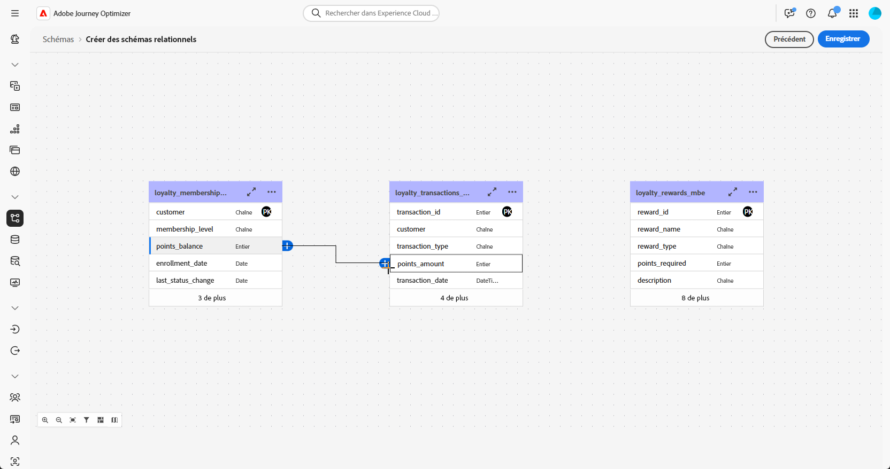
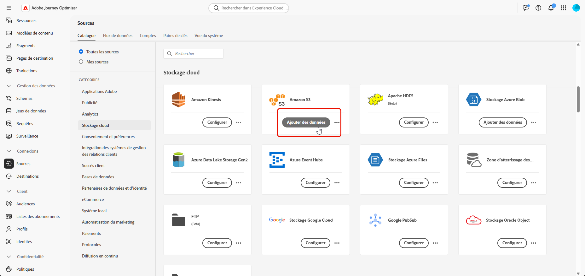
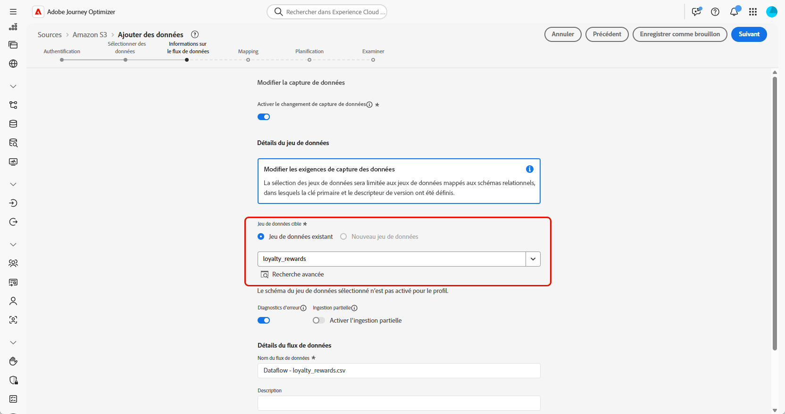

# Étapes de configuration {#configuration-steps}

+++ Table des matières

| Bienvenue dans les campagnes orchestrées | Lancer votre première campagne orchestrée | Interroger la base de données | Activités de campagnes orchestrées |
|---|---|---|---|
| [Prise en main des campagnes orchestrées](gs-orchestrated-campaigns.md)<br/><br/><b>[Étapes de configuration](configuration-steps.md)</b><br/><br/>[Accédez aux campagnes orchestrées et gérez-les](access-manage-orchestrated-campaigns.md)<br/><br/>[Étapes clés pour créer une campagne orchestrée](gs-campaign-creation.md) | [Créer et planifier la campagne](create-orchestrated-campaign.md)<br/><br/>[Orchestrer les activités](orchestrate-activities.md)<br/><br/>[Démarrer et surveiller la campagne](start-monitor-campaigns.md)<br/><br/>[le reporting](reporting-campaigns.md) | [Utiliser le créateur de règles](orchestrated-rule-builder.md)<br/><br/>[Créer votre première requête](build-query.md)<br/><br/>[Modifier les expressions](edit-expressions.md)<br/><br/>[Reciblage](retarget.md) | [Prise en main des activités](activities/about-activities.md)<br/><br/>Activités:<br/>[Et-joindre](activities/and-join.md) - [Créer une audience](activities/build-audience.md) - [Modifier la dimension](activities/change-dimension.md) - [Activités de canal](activities/channels.md) - [Combine](activities/combine.md) - [Deduplication](activities/deduplication.md) - [Enrichissement](activities/enrichment.md) - [Fork](activities/fork.md) - [Reconciliation](activities/reconciliation.md) - [Enregistrer l’audience](activities/save-audience.md) - [Split](activities/split.md) - [Wait](activities/wait.md) |

{style="table-layout:fixed"}

+++

</br>

>[!BEGINSHADEBOX]

Documentation en cours

>[!ENDSHADEBOX]

Ce guide vous guide tout au long du processus de création d’un schéma relationnel, de configuration d’un jeu de données pour des campagnes orchestrées, d’ingestion de données via une source S3 et d’interrogation des données ingérées dans la plateforme AP.

Dans cet exemple, la configuration comprend l’intégration de deux entités clés, **Transactions de fidélité** et **Récompenses de fidélité**, et leur liaison à des entités de base existantes **Destinataires** et **Marques**.


1. [Charger le fichier DDL](#upload-ddl)

   Définissez le modèle de données relationnel pour les campagnes orchestrées, y compris les entités **Transactions de fidélité** et **Récompenses de fidélité**, ainsi que les clés et attributs de version requis.

1. [Sélectionner des entités](#entities)

   Établissez des relations significatives entre les tables de votre schéma afin de créer un modèle de données cohérent et interconnecté.

1. [Schéma du lien](#link-schema)

   Liez l’entité **Transactions de fidélité** à **Destinataires** et **Récompenses de fidélité** à **Marques**, afin de créer un modèle de données connecté prenant en charge les parcours client personnalisés.

1. [Ingérer des données](#ingest)

   Insérez des données dans Adobe Experience Platform à partir de sources prises en charge telles que SFTP, l’espace de stockage dans le cloud ou des bases de données.

## Charger un fichier DDL {#upload-ddl}

Cette section fournit des instructions détaillées sur la création d’un schéma relationnel dans Adobe Experience Platform en chargeant un fichier DDL (Data Definition Language). L’utilisation d’un fichier DDL vous permet de définir à l’avance la structure de votre modèle de données, y compris les tables, les attributs, les clés et les relations.

1. Connectez-vous à la plateforme AP.

1. Accédez à **Gestion des données** > **Schéma**.

1. Cliquez sur **Créer un schéma**.

1. Vous êtes invité à choisir entre deux types de schéma :

   * **Standard**
   * **Relationnel**, utilisé spécifiquement pour les campagnes orchestrées

   

1. Sélectionnez **Télécharger le fichier DDL** pour définir un diagramme de relation d’entité et créer des schémas.

   La structure du tableau doit contenir :
   * Au moins une clé primaire
   * Identifiant de version, tel qu’un champ de `lastmodified` de type `datetime` ou `number`.

1. Faites glisser et déposez votre fichier DDL, puis cliquez sur **[!UICONTROL Suivant]**.

1. Saisissez votre **[!UICONTROL nom du schéma]**.

1. Configurez chaque schéma et ses colonnes en veillant à ce qu’une clé primaire soit spécifiée.

   Un attribut, tel que `lastmodified`, doit être désigné comme descripteur de version. Cet attribut, généralement de type `datetime`, `long` ou `int`, est essentiel pour que les processus d’ingestion garantissent que le jeu de données est mis à jour avec la dernière version des données.

   

1. Cliquez sur **[!UICONTROL Terminé]** une fois l’opération terminée.

Vous pouvez maintenant vérifier les définitions de table et de champ dans la zone de travail. [En savoir plus dans la section ci-dessous](#entities)

## Sélection des entités {#entities}

Pour définir des connexions logiques entre les tables de votre schéma, procédez comme suit.

1. Accédez à la vue Zone de travail de votre modèle de données et sélectionnez les deux tables à lier

1. Cliquez sur le bouton  en regard de la jointure Source, puis faites glisser la flèche vers la jointure cible pour établir la connexion.

   

1. Remplissez le formulaire donné pour définir le lien et cliquez sur **Appliquer** une fois configuré.

   

   **Cardinalité** :

   * **1-N** : à une occurrence du tableau source peuvent correspondre plusieurs occurrences du tableau cible, mais à une occurrence du tableau cible peut correspondre au plus une occurrence du tableau source.

   * **N-1** : à une occurrence du tableau cible peuvent correspondre plusieurs occurrences du tableau source, mais à une occurrence du tableau source peut correspondre au plus une occurrence du tableau cible.

   * **1-1** : à une occurrence du tableau source peut correspondre au plus une occurrence du tableau cible.

1. Tous les liens définis dans votre modèle de données sont représentés par des flèches dans la vue Zone de travail. Cliquez sur une flèche entre deux tableaux pour afficher les détails, apporter des modifications ou supprimer le lien selon les besoins.

   

1. Utilisez la barre d’outils pour personnaliser et ajuster la zone de travail.

   

   * **Zoom avant** : agrandissez la zone de travail pour afficher plus clairement les détails de votre modèle de données.

   * **Zoom arrière** : réduisez la taille de la zone de travail pour obtenir une vue plus large de votre modèle de données.

   * **Ajuster la vue** : ajustez le zoom pour qu’il s’adapte à tous les schémas dans la zone visible.

   * **Filtre** : choisissez le schéma à afficher dans la zone de travail.

   * **Forcer la disposition automatique** : organiser automatiquement les schémas pour une meilleure organisation.

   * **Afficher la carte** : basculez sur une superposition minimale pour parcourir plus facilement les dispositions de schémas volumineuses ou complexes.

1. Cliquez sur **Enregistrer** une fois l’opération terminée. Cette action crée les schémas et les jeux de données associés et permet au jeu de données d’être utilisé dans des campagnes orchestrées.

1. Cliquez sur **[!UICONTROL Ouvrir les tâches]** pour surveiller la progression de la tâche de création. Ce processus peut prendre quelques minutes, selon le nombre de tables définies dans le fichier DDL.

   

## Schéma du lien {#link-schema}

Établissez une relation entre le schéma **transactions de fidélité** et le schéma **Destinataires** pour associer chaque transaction à l’enregistrement client correct.

1. Accédez à **[!UICONTROL Schémas]** et ouvrez vos **transactions de fidélité** créées précédemment.

1. Cliquez sur **[!UICONTROL Ajouter une relation]** dans le champ Client **[!UICONTROL Propriétés du champ]**.

   

1. Sélectionnez **[!UICONTROL Plusieurs-à-un]** comme relation **[!UICONTROL Type]**.

1. Lien vers le schéma **Destinataires** existant.

   

1. Saisissez un **[!UICONTROL Nom de la relation à partir du schéma actuel]** et un **[!UICONTROL Nom de la relation à partir du schéma de référence]**.

1. Cliquez sur **[!UICONTROL Appliquer]** pour enregistrer vos modifications.

Continuez en créant une relation entre le schéma **récompenses de fidélité** et le schéma **Marques** pour associer chaque entrée de récompense à la marque appropriée.


## Ingestion de données {#ingest}

>[!IMPORTANT]
>
>Chaque jeu de données de Adobe Experience Platform ne prend en charge qu’un seul flux de données actif à la fois. Pour obtenir des instructions de configuration détaillées sur le changement de source de données, consultez cette [section](#cdc-ingestion).

Adobe Experience Platform permet d’ingérer des données à partir de sources externes tout en vous offrant la possibilité de structurer, d’étiqueter et d’améliorer les données entrantes à l’aide des services d’Experience Platform. Vous pouvez ingérer des données provenant de diverses sources telles que les applications Adobe, les stockages dans le cloud, des bases de données, etc.

1. Dans le menu **[!UICONTROL Connexions]**, accédez au menu **[!UICONTROL Sources]**.

1. Sélectionnez la catégorie **[!UICONTROL Espace de stockage]** puis Amazon S3 et cliquez sur **[!UICONTROL Ajouter des données]**.

   

1. Connectez votre compte S3 :

   * Avec un compte existant

   * Avec un nouveau compte

   [En savoir plus dans la documentation d’Adobe Experience Platform](https://experienceleague.adobe.com/en/docs/experience-platform/destinations/catalog/cloud-storage/amazon-s3#connect)

   

1. Choisissez votre dossier **[!UICONTROL Format des données]**, **[!UICONTROL Délimiteur]** et **[!UICONTROL Type de compression]**.

1. Parcourez la source S3 connectée jusqu’à localiser les deux dossiers créés précédemment, à savoir **récompenses de fidélité** et **transactions de fidélité**.

1. Sélectionnez le dossier contenant vos données.

   La sélection d’un dossier garantit que tous les fichiers actuels et futurs avec la même structure sont automatiquement traités. Toutefois, la sélection d’un seul fichier nécessite de charger manuellement chaque nouvel incrément de données.

   

1. Choisissez votre dossier **[!UICONTROL Format des données]**, **[!UICONTROL Délimiteur]** et **[!UICONTROL Type de compression]**. Vérifiez l’exactitude de vos données d’exemple, puis cliquez sur **[!UICONTROL Suivant]**.

   

1. Cochez **[!UICONTROL Activer la capture de données Modifier]** pour effectuer une sélection parmi les jeux de données mappés aux schémas relationnels et pour lesquels une clé primaire et un descripteur de version sont définis.

1. Sélectionnez le [jeu de données créé précédemment](#entities) et cliquez sur **[!UICONTROL Suivant]**.

   

1. Dans la fenêtre **[!UICONTROL Mappage]**, vérifiez que chaque attribut de fichier source est correctement mappé avec les champs correspondants dans le schéma cible.

   Cliquez sur **[!UICONTROL Suivant]** une fois l’opération terminée.

   

1. Configurez le flux de données **[!UICONTROL Planifier]** en fonction de la fréquence souhaitée.

1. Cliquez sur **[!UICONTROL Terminer]** pour créer le flux de données. Il s’exécute automatiquement selon le planning défini.

1. Dans le menu **[!UICONTROL Connexions]**, sélectionnez **[!UICONTROL Sources]** et accédez à l’onglet **[!UICONTROL Flux de données]** pour suivre l’exécution du flux, passer en revue les enregistrements ingérés et résoudre les erreurs.

   

<!--### Setting Up Change data capture ingestion {#cdc-ingestion}

If you need to change the data source, you must delete the existing dataflow and create a new one pointing to the same dataset with the new source.

When using Change Data Capture (CDC), it is essential that the source and dataset remain in sync to ensure accurate incremental updates. Follow the steps below:

1. **Schema Requirements**
   - Your schema must include:
     - A **primary key** (e.g., `transaction_id`)
     - A **versioning field** (e.g., `lastmodified` or an incrementing `version_id`)
   - Enable the dataset for **Orchestrated Campaigns** if needed.

2. **CDC Dataflow Setup**
   - During dataflow creation, after choosing your source and files:
     - **Enable the CDC option**
     - Select your CDC-ready dataset
     - Confirm field mappings (especially version field)

3. **Keep Source and Target in Sync**
   - The source system must consistently update the version field so the platform can detect changes accurately.

Once set up, the platform will automatically ingest **only changed or new records** each time the flow runs.
-->
<!--manual
## Create a relational schema manual


1. Log in to the AP Platform.
1. Navigate to the **Schema Management** section.
1. Click on **Create Schema**.

1. You will be prompted to select between two schema types:
    * **Standard**
    * **Relational** (used specifically for AGO campaigns)

1. Click on **Create Manual**.
1. Provide a **Schema Name** (e.g., `test_demo_ck001`).
1. Choose **Schema Type**:
    - **Record Type** (required for AGO campaigns)
    - **Time Series** (not applicable here)
1. Click **Finish** to proceed to the schema design canvas.

## Select entities and fields to import

1. In the canvas, add attributes (fields) to your schema.
1. Add a **Primary Key** (mandatory).
1. Add a **Version Descriptor** attribute (for CDC support):
    - This must be of type **DateTime** or **Numeric** (Integer, Long, Short, Byte).
    - Common example: `last_modified`

> **Why?** The **Primary Key** uniquely identifies each record, and the **Version Descriptor** tracks changes, supporting CDC (Change Data Capture) and data mirroring.

1. Mark the appropriate fields as **Primary Key** and **Version Descriptor**.
1. Click **Save**.

---


## 5. Creating a Dataset

1. Navigate to **Datasets**.
1. Click on **Create Dataset**.
1. Select the schema you just created.
1. Assign a **Dataset Name** (same as schema is fine).
1. Optionally, add tags (e.g., `AGO_campaigns`).
6. Ensure the checkbox **"Relational Schema"** is checked.
7. Click **Finish**.

> **Note:** Only one dataset can be created per relational schema.


## 6. Enabling the Dataset

1. Click **Enable** for the dataset.
1. Wait a few moments for the status to show **Enabled**.

> **Why?** Without enabling, the dataset cannot be used in orchestrated campaigns or ingest data.

## 7. Creating a Data Source (S3)

1. Navigate to **Sources**.
1. Click **Create Source**.
1. Choose the source type (e.g., **S3 Bucket**).
1. Provide connection details:
    - Bucket Path (optionally include subfolder path)
1. Save the source.

## 8. Preparing and Uploading Data

1. Prepare your CSV file with:
    - Column headers matching your schema attributes
    - `last_modified` column
    - `change_type` column (`U`/`DU` for upsert, `D` for delete)

> **Important:** `change_type` is required but does not need to be defined in the schema.

1. Save the file as `.csv`.

1. Upload the file to the specified folder in your S3 bucket.


## 9. Ingesting Data from S3

1. Go to **Sources** and find your S3 source.
1. Click **Add Data**.
1. Select the uploaded file.
1. Specify the file format as **CSV** and any compression type if applicable.
1. Review the data preview (ensure `change_type`, `last_modified`, and primary key are visible).
1. Click **Next**.

### Enable Change Data Capture (CDC)

- Check **Enable Change Data Capture**.
- Select the dataset enabled for AGO campaigns.

### Field Mapping

- Fields are auto-mapped (note that `change_type` is not mapped and that's expected).
- Click **Next**.

### Scheduling

- Schedule ingestion frequency (minute, hour, day, week).
- Set start time (immediate or future).
- Click **Finish** to create the data flow.

## 10. Monitoring Data Flow

1. Navigate back to **Sources > Data Flows**.
1. Wait 4–5 minutes for the first run (initial overhead).
1. Monitor:
    - Status (Started, Completed)
    - Number of records ingested
    - Errors (if any)

> **Tip:** Ingested data first lands in the **Data Lake**.

## 11. Data Replication to Data Store

The **Data Store** is updated:

- Every **15 minutes**, or

- If **Data Lake size exceeds 5MB**

This is a background replication process.


## 12. Querying the Dataset

1. Navigate to **Query Services**.
1. Click **Create Query**.
1. Example query:

   ```sql
   SELECT * FROM test_demo_ck001;
   ```

1. Run the query.

> **Note:** If ingestion is incomplete, query will return an error. Check data flow status.

-->