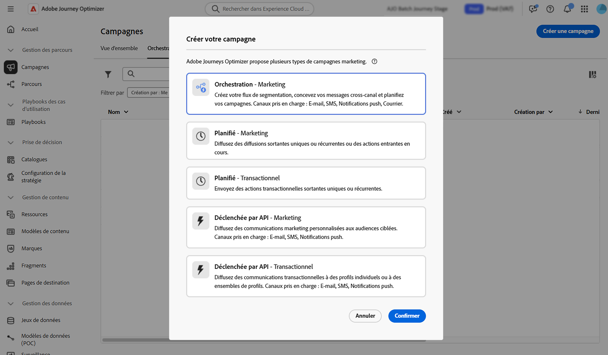

# Créer et planifier une campagne orchestrée {#create-first-campaign}

Créez une campagne orchestrée dans [!DNL Adobe Journey Optimizer] et configurez son planning d’exécution pour contrôler le moment de son lancement et sa fréquence d’exécution. Vous pouvez lancer la campagne immédiatement, à une date et une heure spécifiques ou de manière récurrente à l’aide des options de planification flexibles telles que des fréquences quotidiennes, hebdomadaires ou mensuelles.

## Créer la campagne {#create}

>[!CONTEXTUALHELP]
>id="ajo_campaign_creation_workflow"
>title="Liste des campagnes orchestrées"
>abstract="L’onglet **Orchestration** répertorie toutes les campagnes orchestrées. Cliquez sur le nom d’une campagne orchestrée pour la modifier. Utilisez le bouton **Créer une campagne orchestrée** pour ajouter une nouvelle campagne orchestrée."

Pour créer une campagne orchestrée, procédez comme suit :

1. Accédez au menu **[!UICONTROL Campagnes]** et sélectionnez l’onglet **[!UICONTROL Orchestration]**.

1. Cliquez sur le bouton **[!UICONTROL Créer une campagne]** et sélectionnez le type de campagne **[!UICONTROL Orchestration - Marketing]**.

   

1. Définissez les propriétés de la campagne. Pour ce faire, cliquez sur le bouton  en regard du nom de la campagne.

   

   1. Saisissez un **[!UICONTROL Nom]** et un **[!UICONTROL Description]** pour la campagne.

   1. Sélectionnez une **[!UICONTROL politique de fusion]** pour votre campagne.

      Dans [!DNL Adobe Experience Platform], chaque audience est liée à une politique de fusion spécifique, qui définit la manière dont les informations de profil sont combinées pour former un profil fusionné. Lorsque vous sélectionnez une politique de fusion dans l’activité Lecture d’audience , seules les audiences basées sur cette même politique de fusion sont disponibles. Par défaut, le système utilise la politique de fusion par défaut, mais vous pouvez la modifier si nécessaire. Pour plus d’informations sur les politiques de fusion, consultez la documentation de [Adobe Experience Platform](https://experienceleague.adobe.com/fr/docs/experience-platform/profile/merge-policies/overview){target="_blank"}.

   1. Utilisez le champ **[!UICONTROL Balises]** pour affecter des balises unifiées Adobe Experience Platform à votre campagne. Vous pouvez ainsi facilement les classer et améliorer la recherche à partir de la liste Campagnes orchestrées . [Découvrez comment utiliser les balises](../start/search-filter-categorize.md#tags).

   1. Cliquez sur **[!UICONTROL Enregistrer]**.

## Planifier la campagne {#schedule}

>[!CONTEXTUALHELP]
>id="ajo_orchestration_scheduler"
>title="Planificateur"
>abstract="En tant que responsable de campagne, vous pouvez planifier des campagnes pour les lancer automatiquement à des heures spécifiques, ce qui permet d’obtenir un minutage précis et des données de ciblage exactes pour les communications marketing."

>[!CONTEXTUALHELP]
>id="ajo_orchestration_schedule_validity"
>title="Validité du planificateur"
>abstract="Vous pouvez définir une période de validité pour le planificateur. Elle peut être permanente (par défaut) ou valide jusqu’à une date spécifique."

>[!CONTEXTUALHELP]
>id="ajo_orchestration_schedule_options"
>title="Options du planificateur"
>abstract="Définissez la fréquence du planificateur. Il peut être exécuté à un moment précis, ou encore une ou plusieurs fois par jour, semaine ou mois."

Par défaut, les campagnes orchestrées démarrent lorsqu’elles sont activées manuellement et se terminent lorsque leurs activités associées ont été exécutées. Si vous préférez retarder l’exécution ou exécuter la campagne de manière récurrente, vous pouvez définir un planning pour la campagne.

Tenez compte des bonnes pratiques suivantes lors de la planification de campagnes orchestrées afin de garantir des performances optimales et un comportement attendu :

* Ne planifiez pas l’exécution d’une campagne orchestrée à une fréquence supérieure à toutes les 15 minutes, car cela peut nuire aux performances générales du système et créer des blocs dans la base de données.
* Si vous souhaitez envoyer un message ponctuel dans votre campagne orchestrée, vous pouvez le définir pour qu’il s’exécute **Une fois**.
* Si vous souhaitez envoyer un message récurrent dans votre campagne orchestrée, vous devez utiliser une option **Planification** et définir la fréquence d’exécution. L’activité de diffusion récurrente ne permet pas de définir de planning.

Pour configurer le planning de la campagne, procédez comme suit :

1. Ouvrez la campagne et cliquez sur le bouton **[!UICONTROL Dès que possible]**.

   

1. Sélectionnez la fréquence d’exécution de la campagne, puis configurez les options disponibles. Les paramètres varient en fonction de la fréquence sélectionnée :

   +++Une fois

   Exécutez la campagne une seule fois à une date et une heure spécifiées.

   * **[!UICONTROL Date]** : sélectionnez la date à laquelle la campagne doit être exécutée.
   * **[!UICONTROL Heure]** : sélectionnez l’heure spécifique à laquelle la campagne doit être exécutée.

   +++

   +++Tous les jours

   Exécutez la campagne tous les jours ou certains jours.

   * **[!UICONTROL Récurrence quotidienne]** : sélectionnez la fréquence d’exécution de la campagne :
      * **[!UICONTROL Tous les jours]** : exécute la campagne tous les jours de la semaine, y compris les week-ends.
      * **[!UICONTROL En semaine]** : exécute la campagne uniquement du lundi au vendredi.
      * **[!UICONTROL Sur une période spécifique]** : exécute la campagne quotidiennement au cours d’une période définie (par exemple, du 1er au 15 juillet). La campagne ne s’exécutera pas en dehors de cette période.
      * **[!UICONTROL Jours sélectionnés de la semaine]** : exécute la campagne uniquement certains jours de la semaine (par exemple, lundi, mercredi, vendredi).

   * **[!UICONTROL Heure de début]** : définissez l’heure à laquelle la campagne doit être exécutée chaque jour.

   +++

   +++Plusieurs fois par jour

   Exécutez la campagne plusieurs fois au cours de la même journée. Vous pouvez choisir des heures spécifiques ou définir une fréquence périodique.

   * **[!UICONTROL Heures sélectionnées]** : sélectionnez les heures spécifiques auxquelles la campagne doit être exécutée et configurez sa récurrence quotidienne (à exécuter tous les jours de la semaine ou certains jours).
   * **[!UICONTROL Périodique]** : choisissez d’exécuter la campagne toutes les X minutes ou toutes les X heures. Vous pouvez également définir la période de la journée pendant laquelle les exécutions sont autorisées.

   +++

   +++Toutes les semaines

   Exécutez la campagne une fois par semaine, avec des options pour des jours spécifiques.

   * **[!UICONTROL Fréquence]** : choisissez la fréquence d’exécution de la campagne (par exemple, toutes les semaines, toutes les 2 semaines).
   * **[!UICONTROL Date de début]** : sélectionnez la date à laquelle la récurrence doit commencer.
   * **[!UICONTROL Récurrence quotidienne]** : sélectionnez les jours de la semaine où l’exécution doit avoir lieu (par exemple, tous les lundis et jeudis).
   * **[!UICONTROL Heure de début]** : définissez l’heure à laquelle la campagne doit être exécutée les jours sélectionnés.

   +++

   +++Tous les mois

   Exécutez la campagne sur une base mensuelle, avec des options pour des jours spécifiques.

   * **[!UICONTROL Récurrence mensuelle]** : indiquez si la campagne est exécutée tous les mois ou uniquement pendant des mois spécifiques.
   * **[!UICONTROL Récurrence quotidienne]** :
      * **[!UICONTROL Tous les jours]** : exécute la campagne tous les jours du mois, y compris les week-ends.
      * **[!UICONTROL Dernier jour du mois]** : exécute la campagne uniquement le dernier jour calendaire de chaque mois (par exemple, le 31 janvier et les 28 ou 29 février).
      * **[!UICONTROL Jour spécifique du mois (par exemple, le 15)]** : exécute la campagne un jour spécifié (par exemple, le 15 de chaque mois).
      * **[!UICONTROL Premier/dernier ou énième jour de la semaine]** (par exemple, premier lundi) : exécute la campagne un jour de la semaine spécifié (par exemple, le 15 de chaque semaine).
      * **[!UICONTROL Jours sélectionnés de la semaine]** : exécute la campagne un jour spécifié.

   * **[!UICONTROL Heure de début]** : définissez l’heure d’exécution de la campagne.

   +++

1. Utilisez le paramètre **[!UICONTROL Période de validité]** pour définir des dates de début et de fin spécifiques et limiter ainsi l’exécution de la campagne à une période limitée.

1. Pour les plannings récurrents, cliquez sur le bouton **[!UICONTROL Prévisualiser les heures de lancement]** pour prévisualiser les dates et heures exactes d’exécution à venir en fonction de la configuration actuelle. Cela permet de valider le planning avant l’activation et de s’assurer que la campagne s’exécutera comme prévu.

>[!NOTE]
>
>Lors de la planification de campagnes dans [!DNL Adobe Journey Optimizer], assurez-vous que la date/l’heure de début correspond à la première diffusion souhaitée. Pour les campagnes récurrentes, si l’heure planifiée initiale est déjà dépassée, les campagnes sont reportées au prochain créneau horaire disponible en fonction de leurs règles de périodicité.

Dans l’exemple suivant, l’activité est configurée de sorte que la campagne orchestrée s’exécute deux fois par jour à 9 h et à 12 h, tous les jours de la semaine du 1er octobre 2025 au 1er janvier 2026.

{width="50%" align="left"}

## Étapes suivantes {#next}

Une fois les paramètres et le planning de votre campagne configurés, vous pouvez commencer à orchestrer les différentes tâches qu’elle effectuera. [Découvrez comment orchestrer des activités de campagne](../orchestrated/orchestrate-activities.md).
